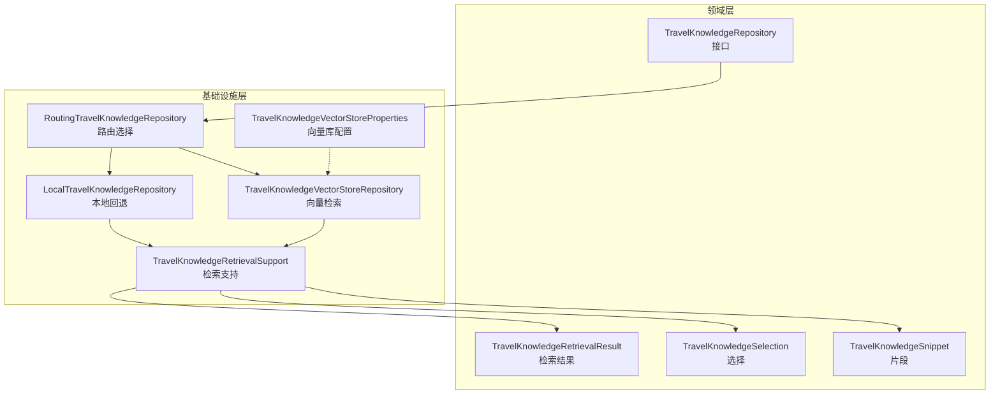
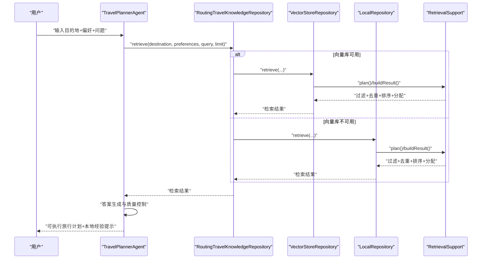
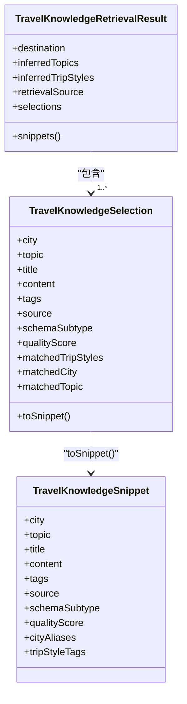
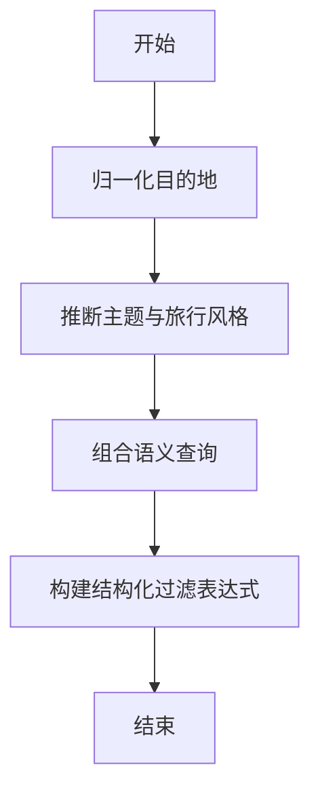
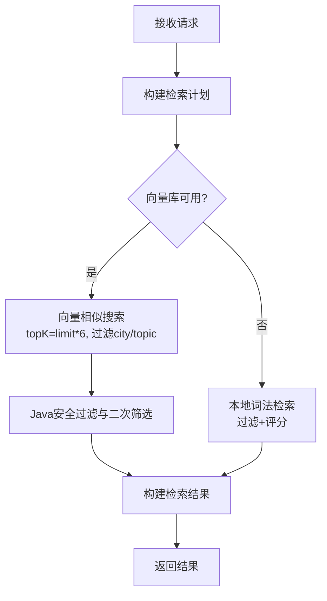
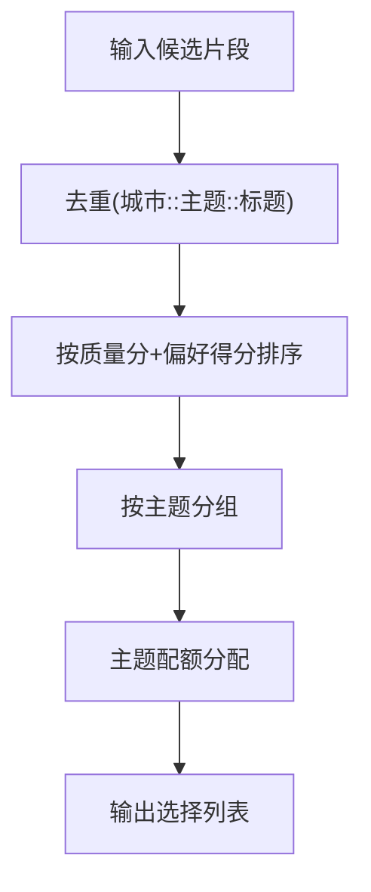
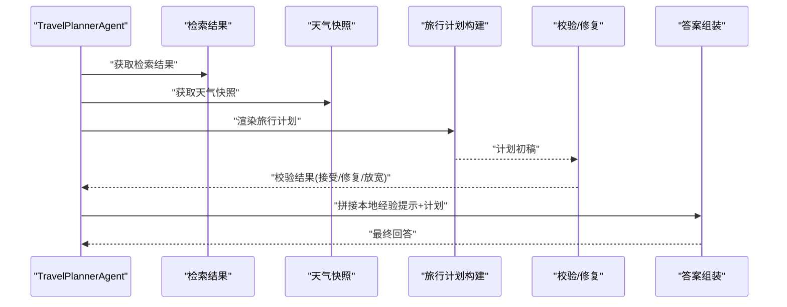
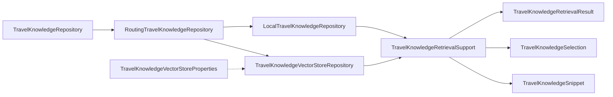

# RAG实现细节

<cite>
**本文引用的文件**
- [TravelKnowledgeRetrievalResult.java](file://travel-agent-domain/src/main/java/com/travalagent/domain/model/valobj/TravelKnowledgeRetrievalResult.java)
- [TravelKnowledgeSelection.java](file://travel-agent-domain/src/main/java/com/travalagent/domain/model/valobj/TravelKnowledgeSelection.java)
- [TravelKnowledgeSnippet.java](file://travel-agent-domain/src/main/java/com/travalagent/domain/model/valobj/TravelKnowledgeSnippet.java)
- [TravelKnowledgeRepository.java](file://travel-agent-domain/src/main/java/com/travalagent/domain/repository/TravelKnowledgeRepository.java)
- [TravelKnowledgeRetrievalSupport.java](file://travel-agent-infrastructure/src/main/java/com/travalagent/infrastructure/repository/TravelKnowledgeRetrievalSupport.java)
- [TravelKnowledgeVectorStoreRepository.java](file://travel-agent-infrastructure/src/main/java/com/travalagent/infrastructure/repository/TravelKnowledgeVectorStoreRepository.java)
- [LocalTravelKnowledgeRepository.java](file://travel-agent-infrastructure/src/main/java/com/travalagent/infrastructure/repository/LocalTravelKnowledgeRepository.java)
- [RoutingTravelKnowledgeRepository.java](file://travel-agent-infrastructure/src/main/java/com/travalagent/infrastructure/repository/RoutingTravelKnowledgeRepository.java)
- [TravelKnowledgeVectorStoreProperties.java](file://travel-agent-infrastructure/src/main/java/com/travalagent/infrastructure/config/TravelKnowledgeVectorStoreProperties.java)
- [TravelPlannerAgent.java](file://travel-agent-infrastructure/src/main/java/com/travalagent/infrastructure/gateway/llm/TravelPlannerAgent.java)
- [knowledge-rag.md](file://docs/knowledge-rag.md)
- [TravelKnowledgeVectorStoreRepositoryTest.java](file://travel-agent-infrastructure/src/test/java/com/travalagent/infrastructure/repository/TravelKnowledgeVectorStoreRepositoryTest.java)
</cite>

## 目录
1. [简介](#简介)
2. [项目结构](#项目结构)
3. [核心组件](#核心组件)
4. [架构总览](#架构总览)
5. [详细组件分析](#详细组件分析)
6. [依赖关系分析](#依赖关系分析)
7. [性能考虑](#性能考虑)
8. [故障排查指南](#故障排查指南)
9. [结论](#结论)
10. [附录](#附录)

## 简介
本文件系统性梳理旅行知识库的检索增强生成（RAG）实现，覆盖从查询理解、上下文检索、相关性排序到答案生成的完整流程。重点解析数据结构设计（TravelKnowledgeRetrievalResult、TravelKnowledgeSelection），说明查询处理机制（意图识别、实体提取）、检索优化策略（语义相似度、过滤与边界处理、结果聚合），以及答案生成的质量控制方法，并提供实际调用示例与性能优化建议。

## 项目结构
RAG相关代码主要分布在领域层与基础设施层：
- 领域层定义值对象与仓库接口，统一检索结果与片段的结构化表达。
- 基础设施层实现具体检索逻辑，包含向量存储检索与本地回退两种路径，并通过路由仓库统一对外暴露。

**图表来源**
- [TravelKnowledgeRetrievalResult.java:1-42](file://travel-agent-domain/src/main/java/com/travalagent/domain/model/valobj/TravelKnowledgeRetrievalResult.java#L1-L42)
- [TravelKnowledgeSelection.java:1-56](file://travel-agent-domain/src/main/java/com/travalagent/domain/model/valobj/TravelKnowledgeSelection.java#L1-L56)
- [TravelKnowledgeSnippet.java:1-48](file://travel-agent-domain/src/main/java/com/travalagent/domain/model/valobj/TravelKnowledgeSnippet.java#L1-L48)
- [TravelKnowledgeRepository.java:1-15](file://travel-agent-domain/src/main/java/com/travalagent/domain/repository/TravelKnowledgeRepository.java#L1-L15)
- [TravelKnowledgeRetrievalSupport.java:1-666](file://travel-agent-infrastructure/src/main/java/com/travalagent/infrastructure/repository/TravelKnowledgeRetrievalSupport.java#L1-L666)
- [TravelKnowledgeVectorStoreRepository.java:1-232](file://travel-agent-infrastructure/src/main/java/com/travalagent/infrastructure/repository/TravelKnowledgeVectorStoreRepository.java#L1-L232)
- [LocalTravelKnowledgeRepository.java:1-224](file://travel-agent-infrastructure/src/main/java/com/travalagent/infrastructure/repository/LocalTravelKnowledgeRepository.java#L1-L224)
- [RoutingTravelKnowledgeRepository.java:1-38](file://travel-agent-infrastructure/src/main/java/com/travalagent/infrastructure/repository/RoutingTravelKnowledgeRepository.java#L1-L38)
- [TravelKnowledgeVectorStoreProperties.java:1-54](file://travel-agent-infrastructure/src/main/java/com/travalagent/infrastructure/config/TravelKnowledgeVectorStoreProperties.java#L1-L54)

**章节来源**
- [knowledge-rag.md:67-137](file://docs/knowledge-rag.md#L67-L137)

## 核心组件
- 数据结构
  - TravelKnowledgeSnippet：最小知识单元，包含城市、主题、标题、内容、标签、来源等字段，用于向量化与排序。
  - TravelKnowledgeSelection：面向最终选择的上下文条目，扩展了匹配的主题、城市、质量分、旅行风格等信息。
  - TravelKnowledgeRetrievalResult：检索结果容器，封装目标地、推断主题、旅行风格、检索来源与选择列表。
- 仓库接口与实现
  - TravelKnowledgeRepository：统一检索入口，返回检索结果或片段列表。
  - RoutingTravelKnowledgeRepository：根据可用性在向量检索与本地回退之间路由。
  - TravelKnowledgeVectorStoreRepository：基于向量库的语义检索与过滤。
  - LocalTravelKnowledgeRepository：基于本地JSON数据的词法检索与评分。
- 检索支持工具
  - TravelKnowledgeRetrievalSupport：查询规划、意图识别、主题分配、去重与排序、过滤表达式构建等。

**章节来源**
- [TravelKnowledgeRetrievalResult.java:5-41](file://travel-agent-domain/src/main/java/com/travalagent/domain/model/valobj/TravelKnowledgeRetrievalResult.java#L5-L41)
- [TravelKnowledgeSelection.java:5-55](file://travel-agent-domain/src/main/java/com/travalagent/domain/model/valobj/TravelKnowledgeSelection.java#L5-L55)
- [TravelKnowledgeSnippet.java:5-47](file://travel-agent-domain/src/main/java/com/travalagent/domain/model/valobj/TravelKnowledgeSnippet.java#L5-L47)
- [TravelKnowledgeRepository.java:8-15](file://travel-agent-domain/src/main/java/com/travalagent/domain/repository/TravelKnowledgeRepository.java#L8-L15)
- [RoutingTravelKnowledgeRepository.java:13-37](file://travel-agent-infrastructure/src/main/java/com/travalagent/infrastructure/repository/RoutingTravelKnowledgeRepository.java#L13-L37)
- [TravelKnowledgeVectorStoreRepository.java:30-99](file://travel-agent-infrastructure/src/main/java/com/travalagent/infrastructure/repository/TravelKnowledgeVectorStoreRepository.java#L30-L99)
- [LocalTravelKnowledgeRepository.java:23-68](file://travel-agent-infrastructure/src/main/java/com/travalagent/infrastructure/repository/LocalTravelKnowledgeRepository.java#L23-L68)
- [TravelKnowledgeRetrievalSupport.java:79-86](file://travel-agent-infrastructure/src/main/java/com/travalagent/infrastructure/repository/TravelKnowledgeRetrievalSupport.java#L79-L86)

## 架构总览
RAG工作流分为“查询理解—上下文检索—相关性排序—答案生成”四个阶段，贯穿于旅行计划生成Agent中。

**图表来源**
- [TravelPlannerAgent.java:199-217](file://travel-agent-infrastructure/src/main/java/com/travalagent/infrastructure/gateway/llm/TravelPlannerAgent.java#L199-L217)
- [RoutingTravelKnowledgeRepository.java:26-36](file://travel-agent-infrastructure/src/main/java/com/travalagent/infrastructure/repository/RoutingTravelKnowledgeRepository.java#L26-L36)
- [TravelKnowledgeVectorStoreRepository.java:68-99](file://travel-agent-infrastructure/src/main/java/com/travalagent/infrastructure/repository/TravelKnowledgeVectorStoreRepository.java#L68-L99)
- [LocalTravelKnowledgeRepository.java:50-68](file://travel-agent-infrastructure/src/main/java/com/travalagent/infrastructure/repository/LocalTravelKnowledgeRepository.java#L50-L68)
- [TravelKnowledgeRetrievalSupport.java:187-232](file://travel-agent-infrastructure/src/main/java/com/travalagent/infrastructure/repository/TravelKnowledgeRetrievalSupport.java#L187-L232)

## 详细组件分析

### 数据结构设计：检索结果与选择
- TravelKnowledgeRetrievalResult
  - 字段：目标地、推断主题、旅行风格、检索来源、选择列表。
  - 行为：构造器复制不可变列表；提供空结果工厂方法；将选择转换为片段以便上层使用。
- TravelKnowledgeSelection
  - 字段：城市、主题、标题、内容、标签、来源、子类型、质量分、匹配旅行风格、匹配城市、匹配主题。
  - 行为：构造器与兼容构造；toSnippet用于从选择生成片段。
- TravelKnowledgeSnippet
  - 字段：城市、主题、标题、内容、标签、来源、子类型、质量分、城市别名、旅行风格标签。
  - 行为：构造器与兼容构造；用于向量化与排序的基础单元。

**图表来源**
- [TravelKnowledgeRetrievalResult.java:5-41](file://travel-agent-domain/src/main/java/com/travalagent/domain/model/valobj/TravelKnowledgeRetrievalResult.java#L5-L41)
- [TravelKnowledgeSelection.java:5-55](file://travel-agent-domain/src/main/java/com/travalagent/domain/model/valobj/TravelKnowledgeSelection.java#L5-L55)
- [TravelKnowledgeSnippet.java:5-47](file://travel-agent-domain/src/main/java/com/travalagent/domain/model/valobj/TravelKnowledgeSnippet.java#L5-L47)

**章节来源**
- [TravelKnowledgeRetrievalResult.java:5-41](file://travel-agent-domain/src/main/java/com/travalagent/domain/model/valobj/TravelKnowledgeRetrievalResult.java#L5-L41)
- [TravelKnowledgeSelection.java:5-55](file://travel-agent-domain/src/main/java/com/travalagent/domain/model/valobj/TravelKnowledgeSelection.java#L5-L55)
- [TravelKnowledgeSnippet.java:5-47](file://travel-agent-domain/src/main/java/com/travalagent/domain/model/valobj/TravelKnowledgeSnippet.java#L5-L47)

### 查询处理机制：意图识别与实体提取
- 查询规划（RetrievalPlan）
  - 归一化目的地、推断主题与旅行风格、组合语义查询文本、构建结构化过滤表达式。
- 主题与旅行风格推断
  - 基于关键词集合与偏好文本进行匹配，默认主题为“scenic”、“food”。
- 目的地与主题过滤
  - 支持城市别名比较与主题白名单过滤，确保检索边界清晰。

**图表来源**
- [TravelKnowledgeRetrievalSupport.java:79-86](file://travel-agent-infrastructure/src/main/java/com/travalagent/infrastructure/repository/TravelKnowledgeRetrievalSupport.java#L79-L86)
- [TravelKnowledgeRetrievalSupport.java:234-268](file://travel-agent-infrastructure/src/main/java/com/travalagent/infrastructure/repository/TravelKnowledgeRetrievalSupport.java#L234-L268)
- [TravelKnowledgeRetrievalSupport.java:598-615](file://travel-agent-infrastructure/src/main/java/com/travalagent/infrastructure/repository/TravelKnowledgeRetrievalSupport.java#L598-L615)

**章节来源**
- [TravelKnowledgeRetrievalSupport.java:79-86](file://travel-agent-infrastructure/src/main/java/com/travalagent/infrastructure/repository/TravelKnowledgeRetrievalSupport.java#L79-L86)
- [TravelKnowledgeRetrievalSupport.java:234-268](file://travel-agent-infrastructure/src/main/java/com/travalagent/infrastructure/repository/TravelKnowledgeRetrievalSupport.java#L234-L268)
- [TravelKnowledgeRetrievalSupport.java:280-310](file://travel-agent-infrastructure/src/main/java/com/travalagent/infrastructure/repository/TravelKnowledgeRetrievalSupport.java#L280-L310)

### 上下文检索：向量检索与本地回退
- 向量检索（Milvus）
  - 组合查询：destination + userMessage + preferences。
  - 结构化过滤：city、topic。
  - TopK策略：max(limit * 6, 18)，以提升召回。
  - 文档映射：标题+内容拼接作为向量文本，元数据包含城市、主题、别名、标签、来源、质量分等。
- 本地回退
  - 目标地与主题过滤后，基于词法匹配与质量分进行排序。
  - 使用相同的检索计划，保证一致性。

**图表来源**
- [TravelKnowledgeVectorStoreRepository.java:68-99](file://travel-agent-infrastructure/src/main/java/com/travalagent/infrastructure/repository/TravelKnowledgeVectorStoreRepository.java#L68-L99)
- [TravelKnowledgeVectorStoreRepository.java:101-139](file://travel-agent-infrastructure/src/main/java/com/travalagent/infrastructure/repository/TravelKnowledgeVectorStoreRepository.java#L101-L139)
- [LocalTravelKnowledgeRepository.java:50-68](file://travel-agent-infrastructure/src/main/java/com/travalagent/infrastructure/repository/LocalTravelKnowledgeRepository.java#L50-L68)
- [RoutingTravelKnowledgeRepository.java:26-36](file://travel-agent-infrastructure/src/main/java/com/travalagent/infrastructure/repository/RoutingTravelKnowledgeRepository.java#L26-L36)

**章节来源**
- [TravelKnowledgeVectorStoreRepository.java:68-99](file://travel-agent-infrastructure/src/main/java/com/travalagent/infrastructure/repository/TravelKnowledgeVectorStoreRepository.java#L68-L99)
- [TravelKnowledgeVectorStoreRepository.java:101-139](file://travel-agent-infrastructure/src/main/java/com/travalagent/infrastructure/repository/TravelKnowledgeVectorStoreRepository.java#L101-L139)
- [LocalTravelKnowledgeRepository.java:50-68](file://travel-agent-infrastructure/src/main/java/com/travalagent/infrastructure/repository/LocalTravelKnowledgeRepository.java#L50-L68)
- [RoutingTravelKnowledgeRepository.java:26-36](file://travel-agent-infrastructure/src/main/java/com/travalagent/infrastructure/repository/RoutingTravelKnowledgeRepository.java#L26-L36)
- [knowledge-rag.md:97-120](file://docs/knowledge-rag.md#L97-L120)

### 相关性排序与结果聚合
- 去重与优先级
  - 基于城市、主题、标题的去重键，优先保留高质量片段。
- 排序策略
  - 质量分上限裁剪、主题与子类型加权、查询词命中加权、旅行风格匹配加权。
- 主题分配
  - 按优先级与目标数量进行主题配额分配，不足时补充至上限。

**图表来源**
- [TravelKnowledgeRetrievalSupport.java:462-476](file://travel-agent-infrastructure/src/main/java/com/travalagent/infrastructure/repository/TravelKnowledgeRetrievalSupport.java#L462-L476)
- [TravelKnowledgeRetrievalSupport.java:478-485](file://travel-agent-infrastructure/src/main/java/com/travalagent/infrastructure/repository/TravelKnowledgeRetrievalSupport.java#L478-L485)
- [TravelKnowledgeRetrievalSupport.java:487-516](file://travel-agent-infrastructure/src/main/java/com/travalagent/infrastructure/repository/TravelKnowledgeRetrievalSupport.java#L487-L516)
- [TravelKnowledgeRetrievalSupport.java:187-232](file://travel-agent-infrastructure/src/main/java/com/travalagent/infrastructure/repository/TravelKnowledgeRetrievalSupport.java#L187-L232)

**章节来源**
- [TravelKnowledgeRetrievalSupport.java:462-476](file://travel-agent-infrastructure/src/main/java/com/travalagent/infrastructure/repository/TravelKnowledgeRetrievalSupport.java#L462-L476)
- [TravelKnowledgeRetrievalSupport.java:487-516](file://travel-agent-infrastructure/src/main/java/com/travalagent/infrastructure/repository/TravelKnowledgeRetrievalSupport.java#L487-L516)
- [TravelKnowledgeRetrievalSupport.java:187-232](file://travel-agent-infrastructure/src/main/java/com/travalagent/infrastructure/repository/TravelKnowledgeRetrievalSupport.java#L187-L232)

### 答案生成的质量控制
- 旅行计划生成与校验
  - 旅行计划构建、Amap地点强化、约束校验与修复循环（严格模式与宽松模式）。
- 检索结果整合
  - 将天气快照与检索结果注入旅行计划，形成带“本地经验提示”的回答。
- 多语言与本地化
  - 根据用户消息语言切换中英文输出，本地化提示仅对中文内容生效。

**图表来源**
- [TravelPlannerAgent.java:66-137](file://travel-agent-infrastructure/src/main/java/com/travalagent/infrastructure/gateway/llm/TravelPlannerAgent.java#L66-L137)
- [TravelPlannerAgent.java:199-230](file://travel-agent-infrastructure/src/main/java/com/travalagent/infrastructure/gateway/llm/TravelPlannerAgent.java#L199-L230)
- [TravelPlannerAgent.java:232-329](file://travel-agent-infrastructure/src/main/java/com/travalagent/infrastructure/gateway/llm/TravelPlannerAgent.java#L232-L329)

**章节来源**
- [TravelPlannerAgent.java:66-137](file://travel-agent-infrastructure/src/main/java/com/travalagent/infrastructure/gateway/llm/TravelPlannerAgent.java#L66-L137)
- [TravelPlannerAgent.java:199-230](file://travel-agent-infrastructure/src/main/java/com/travalagent/infrastructure/gateway/llm/TravelPlannerAgent.java#L199-L230)
- [TravelPlannerAgent.java:232-329](file://travel-agent-infrastructure/src/main/java/com/travalagent/infrastructure/gateway/llm/TravelPlannerAgent.java#L232-L329)

## 依赖关系分析
- 组件耦合
  - RoutingRepository在运行时动态选择向量或本地实现，降低耦合。
  - RetrievalSupport集中处理查询规划与结果构建，提升复用性。
- 外部依赖
  - 向量库Milvus与嵌入模型通过配置类注入，便于启用/禁用。
- 循环依赖
  - 未发现直接循环依赖；各模块职责清晰。

**图表来源**
- [RoutingTravelKnowledgeRepository.java:18-24](file://travel-agent-infrastructure/src/main/java/com/travalagent/infrastructure/repository/RoutingTravelKnowledgeRepository.java#L18-L24)
- [TravelKnowledgeVectorStoreRepository.java:37-46](file://travel-agent-infrastructure/src/main/java/com/travalagent/infrastructure/repository/TravelKnowledgeVectorStoreRepository.java#L37-L46)
- [TravelKnowledgeRetrievalSupport.java:17-17](file://travel-agent-infrastructure/src/main/java/com/travalagent/infrastructure/repository/TravelKnowledgeRetrievalSupport.java#L17-L17)
- [TravelKnowledgeVectorStoreProperties.java:5-54](file://travel-agent-infrastructure/src/main/java/com/travalagent/infrastructure/config/TravelKnowledgeVectorStoreProperties.java#L5-L54)

**章节来源**
- [RoutingTravelKnowledgeRepository.java:18-24](file://travel-agent-infrastructure/src/main/java/com/travalagent/infrastructure/repository/RoutingTravelKnowledgeRepository.java#L18-L24)
- [TravelKnowledgeVectorStoreRepository.java:37-46](file://travel-agent-infrastructure/src/main/java/com/travalagent/infrastructure/repository/TravelKnowledgeVectorStoreRepository.java#L37-L46)
- [TravelKnowledgeRetrievalSupport.java:17-17](file://travel-agent-infrastructure/src/main/java/com/travalagent/infrastructure/repository/TravelKnowledgeRetrievalSupport.java#L17-L17)
- [TravelKnowledgeVectorStoreProperties.java:5-54](file://travel-agent-infrastructure/src/main/java/com/travalagent/infrastructure/config/TravelKnowledgeVectorStoreProperties.java#L5-L54)

## 性能考虑
- 向量检索
  - TopK放大策略：limit * 6（最小18），提升召回，后续再严格筛选。
  - 结构化过滤：提前限制city与topic，减少无效向量计算。
  - 元数据丰富：将城市别名、旅行风格标签等纳入过滤与排序权重。
- 本地回退
  - 与向量路径共享检索计划，避免重复计算。
  - 词法评分结合目的地、主题、标签、内容与旅行风格，兼顾速度与准确性。
- 结果聚合
  - 去重键稳定且轻量，排序采用一次扫描+排序，复杂度可控。
- 配置优化
  - 向量维度、索引类型、度量方式、初始化开关均可通过配置类调整。

**章节来源**
- [TravelKnowledgeVectorStoreRepository.java:74-82](file://travel-agent-infrastructure/src/main/java/com/travalagent/infrastructure/repository/TravelKnowledgeVectorStoreRepository.java#L74-L82)
- [LocalTravelKnowledgeRepository.java:70-120](file://travel-agent-infrastructure/src/main/java/com/travalagent/infrastructure/repository/LocalTravelKnowledgeRepository.java#L70-L120)
- [TravelKnowledgeRetrievalSupport.java:462-476](file://travel-agent-infrastructure/src/main/java/com/travalagent/infrastructure/repository/TravelKnowledgeRetrievalSupport.java#L462-L476)
- [TravelKnowledgeVectorStoreProperties.java:8-18](file://travel-agent-infrastructure/src/main/java/com/travalagent/infrastructure/config/TravelKnowledgeVectorStoreProperties.java#L8-L18)

## 故障排查指南
- 向量库不可用
  - 现象：路由回退到本地检索。
  - 排查：确认Milvus连接参数、嵌入模型配置、集合初始化状态。
- 检索结果为空
  - 现象：返回空结果或少量结果。
  - 排查：检查目的地归一化、主题推断是否合理；确认过滤表达式是否过于严格。
- 结果质量不佳
  - 现象：片段重复、主题分布不均。
  - 排查：查看去重键与主题分配逻辑；评估质量分与偏好得分权重。
- 测试验证
  - 参考测试用例：向量检索映射文档到片段、构建过滤表达式、TopK放大策略。

**章节来源**
- [TravelKnowledgeVectorStoreRepositoryTest.java:55-91](file://travel-agent-infrastructure/src/test/java/com/travalagent/infrastructure/repository/TravelKnowledgeVectorStoreRepositoryTest.java#L55-L91)
- [TravelKnowledgeVectorStoreRepository.java:178-192](file://travel-agent-infrastructure/src/main/java/com/travalagent/infrastructure/repository/TravelKnowledgeVectorStoreRepository.java#L178-L192)
- [TravelKnowledgeRetrievalSupport.java:487-516](file://travel-agent-infrastructure/src/main/java/com/travalagent/infrastructure/repository/TravelKnowledgeRetrievalSupport.java#L487-L516)

## 结论
该RAG实现通过“查询规划—向量检索—本地回退—结果聚合—答案生成”的闭环，实现了旅行知识的高召回与高质量整合。数据结构清晰、检索支持集中、路由策略灵活，既保证了性能也兼顾了准确性。后续可在专用schema、细粒度分块与过滤扩展方面持续优化。

## 附录
- 实际调用示例（步骤说明）
  - 步骤1：调用检索仓库 retrieve(destination, preferences, query, limit)
  - 步骤2：在旅行计划Agent中获取检索结果与天气快照
  - 步骤3：渲染旅行计划并拼接本地经验提示
  - 步骤4：返回最终回答
- 性能优化建议
  - 向量库：适当增大TopK倍数与索引参数，平衡召回与延迟。
  - 过滤：扩展城市别名与来源字段的结构化过滤。
  - 分片：对长列表项进行摘要式子分块，提升定位精度。
  - 主题：增强偏好归一化，提升主题召回。

**章节来源**
- [TravelPlannerAgent.java:199-230](file://travel-agent-infrastructure/src/main/java/com/travalagent/infrastructure/gateway/llm/TravelPlannerAgent.java#L199-L230)
- [knowledge-rag.md:130-137](file://docs/knowledge-rag.md#L130-L137)