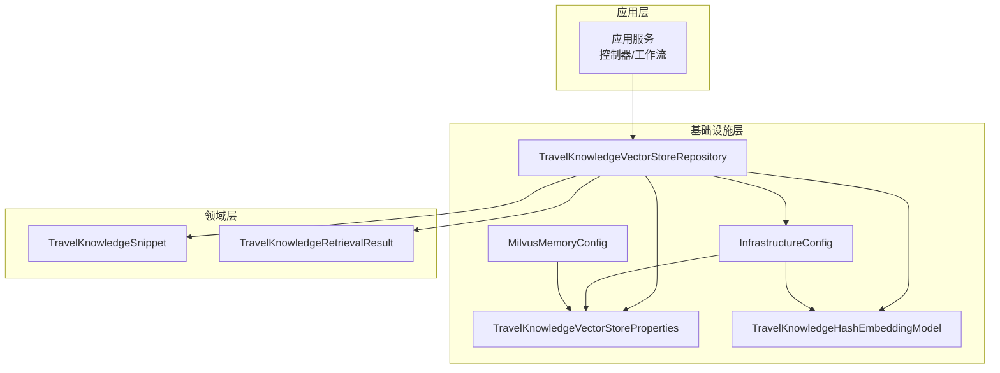
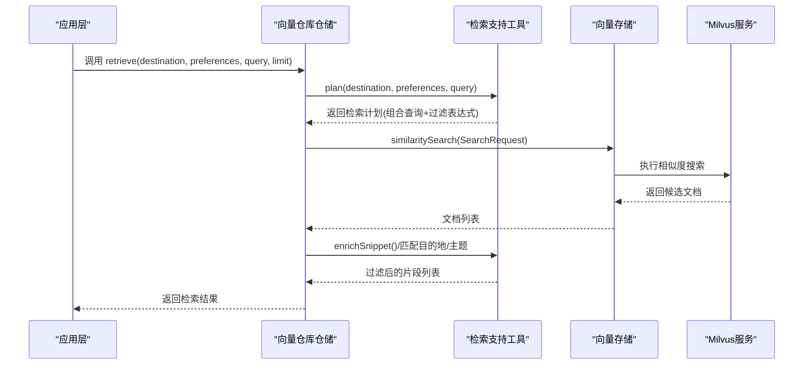
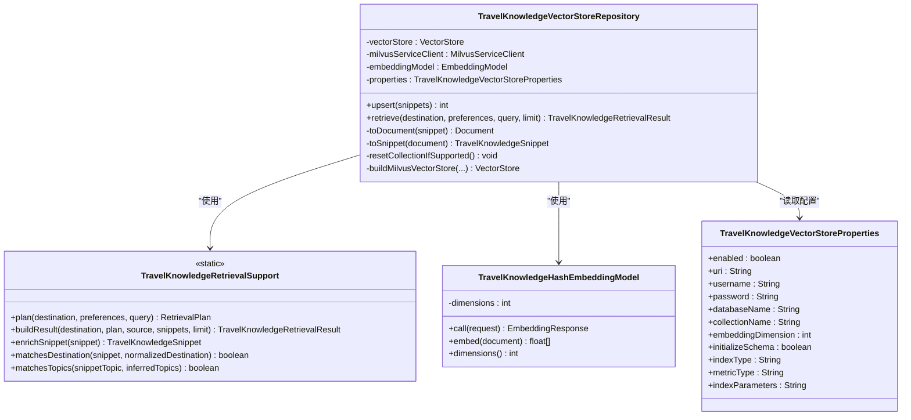
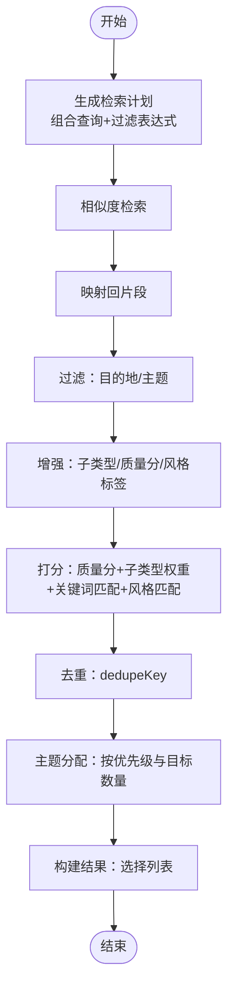
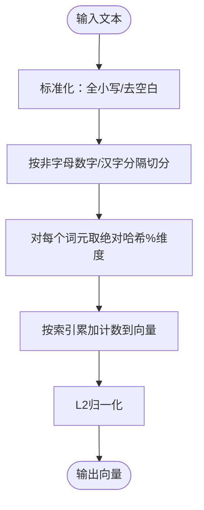
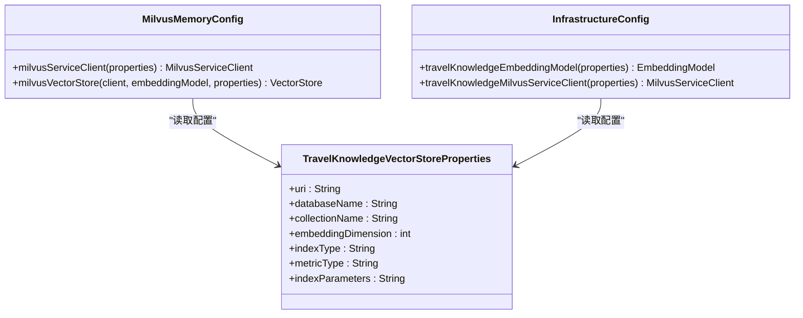
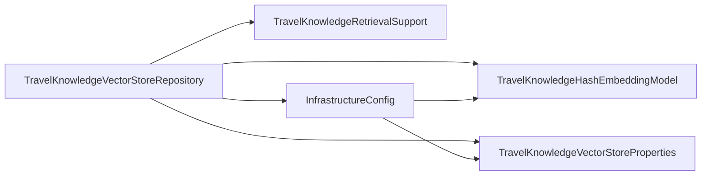

# 向量检索系统

<cite>
**本文引用的文件列表**
- [TravelKnowledgeVectorStoreRepository.java](file://travel-agent-infrastructure/src/main/java/com/travalagent/infrastructure/repository/TravelKnowledgeVectorStoreRepository.java)
- [TravelKnowledgeRetrievalSupport.java](file://travel-agent-infrastructure/src/main/java/com/travalagent/infrastructure/repository/TravelKnowledgeRetrievalSupport.java)
- [TravelKnowledgeVectorStoreProperties.java](file://travel-agent-infrastructure/src/main/java/com/travalagent/infrastructure/config/TravelKnowledgeVectorStoreProperties.java)
- [InfrastructureConfig.java](file://travel-agent-infrastructure/src/main/java/com/travalagent/infrastructure/config/InfrastructureConfig.java)
- [MilvusMemoryConfig.java](file://travel-agent-infrastructure/src/main/java/com/travalagent/infrastructure/config/MilvusMemoryConfig.java)
- [MilvusMemoryProperties.java](file://travel-agent-infrastructure/src/main/java/com/travalagent/infrastructure/config/MilvusMemoryProperties.java)
- [TravelKnowledgeHashEmbeddingModel.java](file://travel-agent-infrastructure/src/main/java/com/travalagent/infrastructure/config/TravelKnowledgeHashEmbeddingModel.java)
- [TravelKnowledgeSnippet.java](file://travel-agent-domain/src/main/java/com/travalagent/domain/model/valobj/TravelKnowledgeSnippet.java)
- [TravelKnowledgeRetrievalResult.java](file://travel-agent-domain/src/main/java/com/travalagent/domain/model/valobj/TravelKnowledgeRetrievalResult.java)
- [application.yml](file://travel-agent-app/src/main/resources/application.yml)
- [TravelKnowledgeVectorStoreRepositoryTest.java](file://travel-agent-infrastructure/src/test/java/com/travalagent/infrastructure/repository/TravelKnowledgeVectorStoreRepositoryTest.java)
</cite>

## 目录
1. [简介](#简介)
2. [项目结构](#项目结构)
3. [核心组件](#核心组件)
4. [架构总览](#架构总览)
5. [详细组件分析](#详细组件分析)
6. [依赖关系分析](#依赖关系分析)
7. [性能考量](#性能考量)
8. [故障排查指南](#故障排查指南)
9. [结论](#结论)
10. [附录](#附录)

## 简介
本文件面向向量检索系统，聚焦于 TravelKnowledgeVectorStoreRepository 的向量化处理实现，涵盖嵌入模型选择与配置、向量存储初始化与连接管理、相似度计算与过滤策略、检索优化（索引构建、批量查询）、向量生成流程（文本预处理、分词与维度控制），以及与 Milvus 向量数据库的集成细节（配置参数与连接池管理）。同时提供查询示例与性能基准建议，帮助读者快速理解并部署该系统。

## 项目结构
系统采用分层与模块化设计：
- 基础设施层：负责向量存储与嵌入模型配置、Milvus 连接与初始化。
- 领域层：定义知识片段与检索结果的数据模型。
- 应用层：对外暴露检索接口，协调检索支持逻辑与向量仓库。

图表来源
- [TravelKnowledgeVectorStoreRepository.java:1-232](file://travel-agent-infrastructure/src/main/java/com/travalagent/infrastructure/repository/TravelKnowledgeVectorStoreRepository.java#L1-L232)
- [InfrastructureConfig.java:1-36](file://travel-agent-infrastructure/src/main/java/com/travalagent/infrastructure/config/InfrastructureConfig.java#L1-L36)
- [MilvusMemoryConfig.java:1-45](file://travel-agent-infrastructure/src/main/java/com/travalagent/infrastructure/config/MilvusMemoryConfig.java#L1-L45)
- [TravelKnowledgeVectorStoreProperties.java:1-108](file://travel-agent-infrastructure/src/main/java/com/travalagent/infrastructure/config/TravelKnowledgeVectorStoreProperties.java#L1-L108)
- [TravelKnowledgeHashEmbeddingModel.java:1-72](file://travel-agent-infrastructure/src/main/java/com/travalagent/infrastructure/config/TravelKnowledgeHashEmbeddingModel.java#L1-L72)
- [TravelKnowledgeSnippet.java:1-48](file://travel-agent-domain/src/main/java/com/travalagent/domain/model/valobj/TravelKnowledgeSnippet.java#L1-L48)
- [TravelKnowledgeRetrievalResult.java:1-42](file://travel-agent-domain/src/main/java/com/travalagent/domain/model/valobj/TravelKnowledgeRetrievalResult.java#L1-L42)

章节来源
- [TravelKnowledgeVectorStoreRepository.java:1-232](file://travel-agent-infrastructure/src/main/java/com/travalagent/infrastructure/repository/TravelKnowledgeVectorStoreRepository.java#L1-L232)
- [application.yml:1-100](file://travel-agent-app/src/main/resources/application.yml#L1-L100)

## 核心组件
- 向量仓库仓储：负责知识片段的增删改查、相似度检索与后处理过滤。
- 检索支持工具：负责查询计划、过滤表达式、去重与排序、主题分配与质量评分。
- 嵌入模型：提供旅行知识专用的哈希嵌入模型，支持可配置维度。
- Milvus 配置：统一管理连接、数据库名、集合名、索引类型、度量方式与索引参数。
- 领域模型：知识片段与检索结果的数据结构。

章节来源
- [TravelKnowledgeVectorStoreRepository.java:28-232](file://travel-agent-infrastructure/src/main/java/com/travalagent/infrastructure/repository/TravelKnowledgeVectorStoreRepository.java#L28-L232)
- [TravelKnowledgeRetrievalSupport.java:17-666](file://travel-agent-infrastructure/src/main/java/com/travalagent/infrastructure/repository/TravelKnowledgeRetrievalSupport.java#L17-L666)
- [TravelKnowledgeHashEmbeddingModel.java:13-72](file://travel-agent-infrastructure/src/main/java/com/travalagent/infrastructure/config/TravelKnowledgeHashEmbeddingModel.java#L13-L72)
- [TravelKnowledgeVectorStoreProperties.java:5-108](file://travel-agent-infrastructure/src/main/java/com/travalagent/infrastructure/config/TravelKnowledgeVectorStoreProperties.java#L5-L108)
- [TravelKnowledgeSnippet.java:5-48](file://travel-agent-domain/src/main/java/com/travalagent/domain/model/valobj/TravelKnowledgeSnippet.java#L5-L48)
- [TravelKnowledgeRetrievalResult.java:5-42](file://travel-agent-domain/src/main/java/com/travalagent/domain/model/valobj/TravelKnowledgeRetrievalResult.java#L5-L42)

## 架构总览
系统通过 Spring AI 的向量存储抽象与 Milvus 集成，实现“文本→嵌入→入库→相似度检索→过滤与排序”的完整链路。检索前会根据目的地、偏好与用户查询生成组合查询，并构建过滤表达式；检索后进行去重、主题优先级与质量评分排序，最终输出结构化结果。

图表来源
- [TravelKnowledgeVectorStoreRepository.java:68-99](file://travel-agent-infrastructure/src/main/java/com/travalagent/infrastructure/repository/TravelKnowledgeVectorStoreRepository.java#L68-L99)
- [TravelKnowledgeRetrievalSupport.java:79-86](file://travel-agent-infrastructure/src/main/java/com/travalagent/infrastructure/repository/TravelKnowledgeRetrievalSupport.java#L79-L86)

## 详细组件分析

### 向量仓库仓储（TravelKnowledgeVectorStoreRepository）
- 初始化与连接管理
  - 通过条件装配确保仅在启用时加载；使用带名称限定符的 Milvus 客户端与嵌入模型注入。
  - 构建 Milvus 向量存储时指定数据库名、集合名、嵌入维度、索引类型、度量类型、是否初始化模式与索引参数。
  - 支持在入库前删除旧集合并重建，保证种子数据导入一致性。
- 数据入库（upsert）
  - 对输入片段进行增强（推断子类型、质量分、风格标签、别名去重等）。
  - 将片段转换为文档并写入向量存储。
- 相似度检索（retrieve）
  - 生成检索计划，构造 SearchRequest：组合查询、topK（按限制放大倍数）、相似度阈值、过滤表达式。
  - 从向量存储获取候选文档，再映射回片段，执行目的地与主题过滤，最后构建结果。
- 文档与片段映射
  - 文档元数据包含城市、主题、显示值、别名、风格标签、来源、子类型、质量分等。
  - 片段字段包含城市、主题、标题、内容、标签、来源、子类型、质量分、城市别名、旅行风格标签。

图表来源
- [TravelKnowledgeVectorStoreRepository.java:28-232](file://travel-agent-infrastructure/src/main/java/com/travalagent/infrastructure/repository/TravelKnowledgeVectorStoreRepository.java#L28-L232)
- [TravelKnowledgeRetrievalSupport.java:17-666](file://travel-agent-infrastructure/src/main/java/com/travalagent/infrastructure/repository/TravelKnowledgeRetrievalSupport.java#L17-L666)
- [TravelKnowledgeHashEmbeddingModel.java:13-72](file://travel-agent-infrastructure/src/main/java/com/travalagent/infrastructure/config/TravelKnowledgeHashEmbeddingModel.java#L13-L72)
- [TravelKnowledgeVectorStoreProperties.java:5-108](file://travel-agent-infrastructure/src/main/java/com/travalagent/infrastructure/config/TravelKnowledgeVectorStoreProperties.java#L5-L108)

章节来源
- [TravelKnowledgeVectorStoreRepository.java:37-47](file://travel-agent-infrastructure/src/main/java/com/travalagent/infrastructure/repository/TravelKnowledgeVectorStoreRepository.java#L37-L47)
- [TravelKnowledgeVectorStoreRepository.java:194-215](file://travel-agent-infrastructure/src/main/java/com/travalagent/infrastructure/repository/TravelKnowledgeVectorStoreRepository.java#L194-L215)
- [TravelKnowledgeVectorStoreRepository.java:178-192](file://travel-agent-infrastructure/src/main/java/com/travalagent/infrastructure/repository/TravelKnowledgeVectorStoreRepository.java#L178-L192)

### 检索支持工具（TravelKnowledgeRetrievalSupport）
- 查询计划与过滤
  - 组合查询：目的地、偏好与用户查询拼接。
  - 过滤表达式：基于规范化后的城市与推断的主题集合。
- 片段增强与质量评分
  - 推断子类型（如酒店区域、交通枢纽等）与质量分。
  - 提取旅行风格标签，结合主题与内容关键词。
- 排序与去重
  - 基于质量分、子类型权重、查询关键词匹配与旅行风格匹配进行打分。
  - 主题优先级分配与去重键生成，避免重复条目。
- 结果构建
  - 按主题分配数量上限，不足时补充其他片段，形成最终选择列表。

图表来源
- [TravelKnowledgeRetrievalSupport.java:79-86](file://travel-agent-infrastructure/src/main/java/com/travalagent/infrastructure/repository/TravelKnowledgeRetrievalSupport.java#L79-L86)
- [TravelKnowledgeRetrievalSupport.java:187-232](file://travel-agent-infrastructure/src/main/java/com/travalagent/infrastructure/repository/TravelKnowledgeRetrievalSupport.java#L187-L232)
- [TravelKnowledgeRetrievalSupport.java:462-485](file://travel-agent-infrastructure/src/main/java/com/travalagent/infrastructure/repository/TravelKnowledgeRetrievalSupport.java#L462-L485)

章节来源
- [TravelKnowledgeRetrievalSupport.java:79-86](file://travel-agent-infrastructure/src/main/java/com/travalagent/infrastructure/repository/TravelKnowledgeRetrievalSupport.java#L79-L86)
- [TravelKnowledgeRetrievalSupport.java:187-232](file://travel-agent-infrastructure/src/main/java/com/travalagent/infrastructure/repository/TravelKnowledgeRetrievalSupport.java#L187-L232)

### 嵌入模型与向量生成（TravelKnowledgeHashEmbeddingModel）
- 文本预处理
  - 全小写标准化，按非字母数字与汉字的分隔符切分词元。
- 分词与向量维度控制
  - 使用词元哈希模维度作为索引，累加计数，最后做 L2 归一化。
  - 维度由配置决定，支持任意正整数。
- 适用场景
  - 在本地或资源受限环境替代外部大模型嵌入，便于快速原型与离线部署。

图表来源
- [TravelKnowledgeHashEmbeddingModel.java:44-57](file://travel-agent-infrastructure/src/main/java/com/travalagent/infrastructure/config/TravelKnowledgeHashEmbeddingModel.java#L44-L57)

章节来源
- [TravelKnowledgeHashEmbeddingModel.java:13-72](file://travel-agent-infrastructure/src/main/java/com/travalagent/infrastructure/config/TravelKnowledgeHashEmbeddingModel.java#L13-L72)

### Milvus 集成与配置
- 连接与客户端
  - 通过条件属性启用；支持用户名/密码鉴权；URI 可配置。
- 向量存储构建
  - 指定数据库名、集合名、嵌入维度、索引类型（如 IVF_FLAT）、度量类型（如 COSINE）、索引参数（如 nlist）。
  - 可选择初始化模式自动创建/更新集合结构。
- 连接池与生命周期
  - 客户端 Bean 设置销毁方法以释放资源；生产环境建议配合连接池与超时配置。

图表来源
- [MilvusMemoryConfig.java:18-44](file://travel-agent-infrastructure/src/main/java/com/travalagent/infrastructure/config/MilvusMemoryConfig.java#L18-L44)
- [InfrastructureConfig.java:20-34](file://travel-agent-infrastructure/src/main/java/com/travalagent/infrastructure/config/InfrastructureConfig.java#L20-L34)
- [TravelKnowledgeVectorStoreProperties.java:5-108](file://travel-agent-infrastructure/src/main/java/com/travalagent/infrastructure/config/TravelKnowledgeVectorStoreProperties.java#L5-L108)

章节来源
- [MilvusMemoryConfig.java:18-44](file://travel-agent-infrastructure/src/main/java/com/travalagent/infrastructure/config/MilvusMemoryConfig.java#L18-L44)
- [InfrastructureConfig.java:20-34](file://travel-agent-infrastructure/src/main/java/com/travalagent/infrastructure/config/InfrastructureConfig.java#L20-L34)
- [application.yml:72-99](file://travel-agent-app/src/main/resources/application.yml#L72-L99)

## 依赖关系分析
- 组件耦合
  - 仓储对检索支持工具为纯静态工具类调用，低耦合。
  - 仓储对 Milvus 与嵌入模型通过构造注入，便于替换与测试。
- 外部依赖
  - Spring AI 向量存储抽象与 Milvus 集成。
  - 配置属性绑定至 application.yml 的 travel.agent.knowledge.vector 前缀。

图表来源
- [TravelKnowledgeVectorStoreRepository.java:32-46](file://travel-agent-infrastructure/src/main/java/com/travalagent/infrastructure/repository/TravelKnowledgeVectorStoreRepository.java#L32-L46)
- [InfrastructureConfig.java:20-34](file://travel-agent-infrastructure/src/main/java/com/travalagent/infrastructure/config/InfrastructureConfig.java#L20-L34)

章节来源
- [TravelKnowledgeVectorStoreRepository.java:32-46](file://travel-agent-infrastructure/src/main/java/com/travalagent/infrastructure/repository/TravelKnowledgeVectorStoreRepository.java#L32-L46)
- [InfrastructureConfig.java:20-34](file://travel-agent-infrastructure/src/main/java/com/travalagent/infrastructure/config/InfrastructureConfig.java#L20-L34)

## 性能考量
- 相似度计算与索引
  - 度量类型默认 COSINE，适合归一化向量；若使用非归一化嵌入，建议改为 EUCLIDEAN 或内积场景下的适配。
  - 索引类型 IVF_FLAT 与 nlist 参数影响召回与吞吐平衡；nlist 越大，召回越高但内存与构建时间增加。
- 检索参数调优
  - topK 设为 limit 的若干倍以提升召回，再通过后处理过滤与排序稳定输出质量。
  - 过滤表达式在 Milvus 层面提前缩小候选集，减少后续排序开销。
- 批量入库与去重
  - 入库前删除集合可避免重复与冲突，但需注意幂等性与迁移成本。
  - 文档 ID 使用规范化字符串的 UUID 生成，保证稳定性与可重复性。
- 嵌入维度
  - 维度越大，表征能力越强但内存与计算成本越高；需结合硬件与业务需求权衡。

[本节为通用性能指导，不直接分析具体文件]

## 故障排查指南
- Milvus 连接失败
  - 检查 URI、鉴权信息与网络连通性；确认集合存在或允许初始化模式自动创建。
- 向量维度不匹配
  - 确保嵌入模型输出维度与 Milvus 集合维度一致；否则会抛出初始化异常。
- 检索结果为空
  - 检查组合查询是否为空、过滤表达式是否过于严格、topK 是否足够大。
- 测试验证
  - 单元测试覆盖了入库时元数据规范化与检索时过滤表达式与 topK 的行为，可参考断言路径定位问题。

章节来源
- [TravelKnowledgeVectorStoreRepositoryTest.java:24-91](file://travel-agent-infrastructure/src/test/java/com/travalagent/infrastructure/repository/TravelKnowledgeVectorStoreRepositoryTest.java#L24-L91)
- [TravelKnowledgeVectorStoreRepository.java:178-192](file://travel-agent-infrastructure/src/main/java/com/travalagent/infrastructure/repository/TravelKnowledgeVectorStoreRepository.java#L178-L192)

## 结论
本系统通过可配置的哈希嵌入模型与 Milvus 向量存储，实现了面向旅行知识的高效检索。检索支持工具提供了完善的查询计划、过滤、去重与排序机制，能够稳定产出高质量的旅行片段选择。通过合理的索引与参数配置，可在召回与性能之间取得良好平衡。

[本节为总结性内容，不直接分析具体文件]

## 附录

### 配置参数一览（来自 application.yml）
- 知识向量存储（travel.agent.knowledge.vector）
  - enabled：是否启用
  - uri：Milvus 地址
  - username/password：鉴权
  - database-name：数据库名
  - collection-name：集合名
  - embedding-dimension：嵌入维度
  - initialize-schema：是否初始化模式
  - index-type：索引类型（如 IVF_FLAT）
  - metric-type：度量类型（如 COSINE）
  - index-parameters：索引参数（如 nlist）

- 内存向量存储（travel.agent.memory.milvus）
  - 同上，用于长期记忆的 Milvus 存储配置

章节来源
- [application.yml:72-99](file://travel-agent-app/src/main/resources/application.yml#L72-L99)

### 实际查询示例与流程
- 示例输入
  - 目的地：某城市
  - 偏好：如“美食”、“休闲”
  - 用户查询：旅行计划描述
  - 限制：返回片段数量
- 流程要点
  - 生成组合查询并构建过滤表达式（城市与主题）。
  - 执行相似度检索，扩大 topK 以提升召回。
  - 过滤目的地与主题，增强片段并打分排序。
  - 按主题分配数量上限，去重后输出最终结果。

章节来源
- [TravelKnowledgeVectorStoreRepository.java:68-99](file://travel-agent-infrastructure/src/main/java/com/travalagent/infrastructure/repository/TravelKnowledgeVectorStoreRepository.java#L68-L99)
- [TravelKnowledgeRetrievalSupport.java:79-86](file://travel-agent-infrastructure/src/main/java/com/travalagent/infrastructure/repository/TravelKnowledgeRetrievalSupport.java#L79-L86)

### 性能基准建议
- 基准指标
  - QPS、P95/P99 延迟、召回率、去重后命中率。
- 调优方向
  - 索引参数：逐步增大 nlist 观察延迟与召回变化。
  - topK：从 limit*6 起步，观察结果质量与性能折中。
  - 过滤表达式：尽量在 Milvus 层面完成，减少回传数据量。
  - 维度：在满足精度前提下降低维度以节省内存与加速计算。

[本节为通用性能指导，不直接分析具体文件]