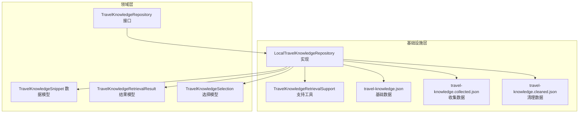
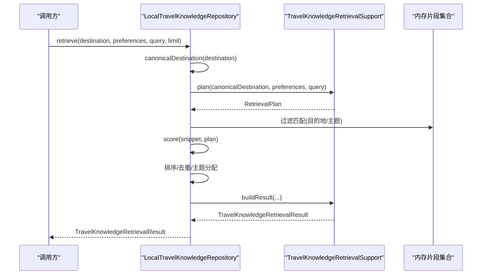
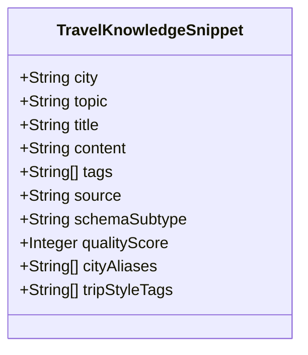
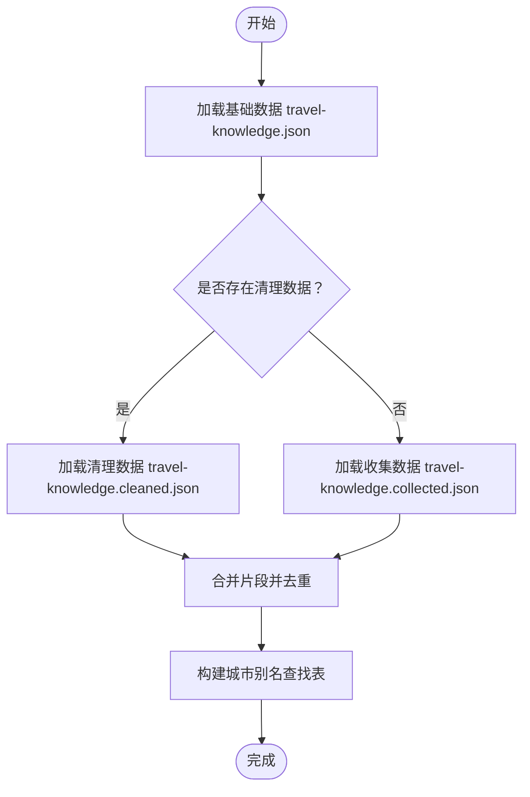
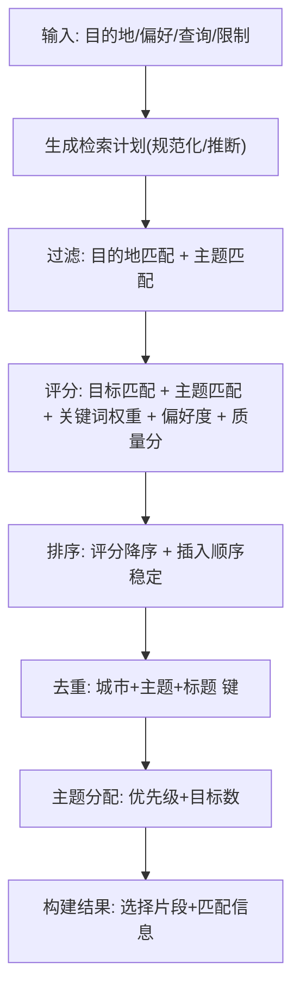
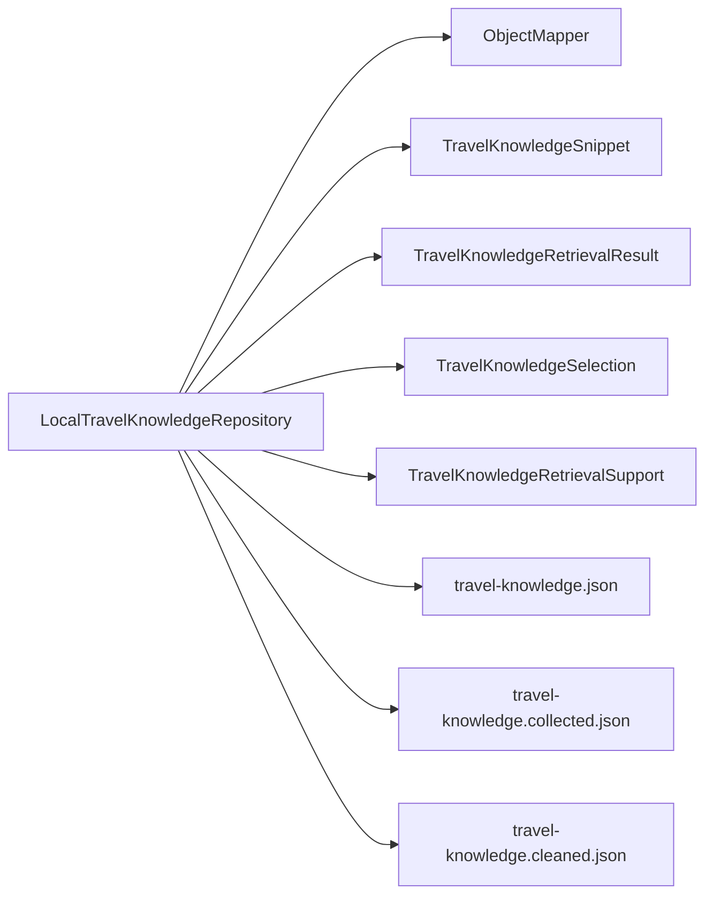

# 本地知识库

<cite>
**本文引用的文件**
- [LocalTravelKnowledgeRepository.java](file://travel-agent-infrastructure/src/main/java/com/travalagent/infrastructure/repository/LocalTravelKnowledgeRepository.java)
- [TravelKnowledgeSnippet.java](file://travel-agent-domain/src/main/java/com/travalagent/domain/model/valobj/TravelKnowledgeSnippet.java)
- [TravelKnowledgeRepository.java](file://travel-agent-domain/src/main/java/com/travalagent/domain/repository/TravelKnowledgeRepository.java)
- [TravelKnowledgeRetrievalSupport.java](file://travel-agent-infrastructure/src/main/java/com/travalagent/infrastructure/repository/TravelKnowledgeRetrievalSupport.java)
- [TravelKnowledgeRetrievalResult.java](file://travel-agent-domain/src/main/java/com/travalagent/domain/model/valobj/TravelKnowledgeRetrievalResult.java)
- [TravelKnowledgeSelection.java](file://travel-agent-domain/src/main/java/com/travalagent/domain/model/valobj/TravelKnowledgeSelection.java)
- [travel-knowledge.json](file://travel-agent-infrastructure/src/main/resources/travel-knowledge.json)
- [travel-knowledge.collected.json](file://travel-agent-infrastructure/src/main/resources/travel-knowledge.collected.json)
- [travel-knowledge.cleaned.json](file://travel-agent-infrastructure/src/main/resources/travel-knowledge.cleaned.json)
- [LocalTravelKnowledgeRepositoryTest.java](file://travel-agent-infrastructure/src/test/java/com/travalagent/infrastructure/repository/LocalTravelKnowledgeRepositoryTest.java)
</cite>

## 目录
1. [简介](#简介)
2. [项目结构](#项目结构)
3. [核心组件](#核心组件)
4. [架构总览](#架构总览)
5. [详细组件分析](#详细组件分析)
6. [依赖分析](#依赖分析)
7. [性能考量](#性能考量)
8. [故障排查指南](#故障排查指南)
9. [结论](#结论)
10. [附录](#附录)

## 简介
本文件系统性解析本地知识库实现，重点围绕 LocalTravelKnowledgeRepository 的数据结构设计、城市别名查找表构建与去重策略、知识加载流程（基础数据、收集数据与清理数据的合并逻辑）、查询评分算法（目的地匹配、主题匹配、关键词权重与偏好度评分），以及文本归一化、分词与城市别名标准化等关键技术细节。同时给出 canonicalDestination 方法的目的地规范化用法示例与最佳实践。

## 项目结构
本地知识库位于基础设施层，面向领域层的旅行知识检索接口提供本地实现；资源文件以 JSON 形式存储多条旅行知识片段，仓库负责加载、去重、构建别名表并执行检索与评分。

图表来源
- [LocalTravelKnowledgeRepository.java:23-37](file://travel-agent-infrastructure/src/main/java/com/travalagent/infrastructure/repository/LocalTravelKnowledgeRepository.java#L23-L37)
- [TravelKnowledgeRepository.java:8-15](file://travel-agent-domain/src/main/java/com/travalagent/domain/repository/TravelKnowledgeRepository.java#L8-L15)
- [TravelKnowledgeSnippet.java:5-16](file://travel-agent-domain/src/main/java/com/travalagent/domain/model/valobj/TravelKnowledgeSnippet.java#L5-L16)
- [TravelKnowledgeRetrievalResult.java:5-17](file://travel-agent-domain/src/main/java/com/travalagent/domain/model/valobj/TravelKnowledgeRetrievalResult.java#L5-L17)
- [TravelKnowledgeSelection.java:5-17](file://travel-agent-domain/src/main/java/com/travalagent/domain/model/valobj/TravelKnowledgeSelection.java#L5-L17)
- [TravelKnowledgeRetrievalSupport.java:17-77](file://travel-agent-infrastructure/src/main/java/com/travalagent/infrastructure/repository/TravelKnowledgeRetrievalSupport.java#L17-L77)
- [travel-knowledge.json:1-50](file://travel-agent-infrastructure/src/main/resources/travel-knowledge.json#L1-L50)
- [travel-knowledge.collected.json:1-800](file://travel-agent-infrastructure/src/main/resources/travel-knowledge.collected.json#L1-L800)
- [travel-knowledge.cleaned.json:1-800](file://travel-agent-infrastructure/src/main/resources/travel-knowledge.cleaned.json#L1-L800)

章节来源
- [LocalTravelKnowledgeRepository.java:23-37](file://travel-agent-infrastructure/src/main/java/com/travalagent/infrastructure/repository/LocalTravelKnowledgeRepository.java#L23-L37)
- [TravelKnowledgeRepository.java:8-15](file://travel-agent-domain/src/main/java/com/travalagent/domain/repository/TravelKnowledgeRepository.java#L8-L15)

## 核心组件
- LocalTravelKnowledgeRepository：本地旅行知识仓库实现，负责加载 JSON 资源、构建城市别名查找表、执行检索与评分、输出领域结果对象。
- TravelKnowledgeSnippet：知识片段数据模型，承载城市、主题、标题、内容、标签、来源、子类型、质量分、城市别名列表、旅行风格标签等字段。
- TravelKnowledgeRetrievalSupport：检索支持工具，提供检索计划生成、目的地与主题匹配、文本归一化与分词、别名标准化、主题/风格推断、质量分与偏好度评分、结果聚合与去重等能力。
- 旅行知识检索结果与选择：领域层的结果与选择模型，用于封装检索到的知识片段及其匹配信息。

章节来源
- [LocalTravelKnowledgeRepository.java:23-37](file://travel-agent-infrastructure/src/main/java/com/travalagent/infrastructure/repository/LocalTravelKnowledgeRepository.java#L23-L37)
- [TravelKnowledgeSnippet.java:5-16](file://travel-agent-domain/src/main/java/com/travalagent/domain/model/valobj/TravelKnowledgeSnippet.java#L5-L16)
- [TravelKnowledgeRetrievalSupport.java:17-77](file://travel-agent-infrastructure/src/main/java/com/travalagent/infrastructure/repository/TravelKnowledgeRetrievalSupport.java#L17-L77)
- [TravelKnowledgeRetrievalResult.java:5-17](file://travel-agent-domain/src/main/java/com/travalagent/domain/model/valobj/TravelKnowledgeRetrievalResult.java#L5-L17)
- [TravelKnowledgeSelection.java:5-17](file://travel-agent-domain/src/main/java/com/travalagent/domain/model/valobj/TravelKnowledgeSelection.java#L5-L17)

## 架构总览
本地知识库采用“资源驱动 + 内存缓存”的轻量级架构：
- 资源加载：从 classpath 加载 travel-knowledge.json 作为基础数据，优先使用 travel-knowledge.cleaned.json（若存在），否则回退到 travel-knowledge.collected.json。
- 别名表构建：基于已加载片段的城市与别名，建立“标准化别名 -> 城市”的映射，用于目的地规范化。
- 检索流程：生成检索计划（含规范化目的地、组合查询、推断主题与旅行风格），过滤匹配片段，按评分排序，去重与主题分配后返回结果。
- 评分体系：综合目的地匹配、主题匹配、关键词权重、偏好度与质量分，形成可解释的加权评分。

图表来源
- [LocalTravelKnowledgeRepository.java:51-68](file://travel-agent-infrastructure/src/main/java/com/travalagent/infrastructure/repository/LocalTravelKnowledgeRepository.java#L51-L68)
- [TravelKnowledgeRetrievalSupport.java:79-86](file://travel-agent-infrastructure/src/main/java/com/travalagent/infrastructure/repository/TravelKnowledgeRetrievalSupport.java#L79-L86)
- [TravelKnowledgeRetrievalSupport.java:187-232](file://travel-agent-infrastructure/src/main/java/com/travalagent/infrastructure/repository/TravelKnowledgeRetrievalSupport.java#L187-L232)

## 详细组件分析

### 知识片段数据结构设计（TravelKnowledgeSnippet）
- 字段构成：城市、主题、标题、内容、标签列表、来源、schema 子类型、质量分、城市别名列表、旅行风格标签列表。
- 不变性：字段在构造时复制为不可变列表，保证线程安全与一致性。
- 扩展性：支持多种构造器，便于从不同来源（种子、收集、清理）统一建模。

图表来源
- [TravelKnowledgeSnippet.java:5-16](file://travel-agent-domain/src/main/java/com/travalagent/domain/model/valobj/TravelKnowledgeSnippet.java#L5-L16)

章节来源
- [TravelKnowledgeSnippet.java:5-16](file://travel-agent-domain/src/main/java/com/travalagent/domain/model/valobj/TravelKnowledgeSnippet.java#L5-L16)

### 城市别名查找表构建与去重策略
- 别名表构建：
  - 以“标准化后的城市/别名”为键，以“原始城市名称”为值，避免重复覆盖。
  - 标准化规则：去除空白、转小写、Locale.ROOT 规范化。
- 去重策略：
  - 合并顺序：先基础数据，再清理/收集数据（优先清理）。
  - 去重键：城市 + 主题 + 标题 经标准化后拼接。
  - 去重过程：使用 LinkedHashMap 保持插入顺序，最后取值列表。

图表来源
- [LocalTravelKnowledgeRepository.java:122-133](file://travel-agent-infrastructure/src/main/java/com/travalagent/infrastructure/repository/LocalTravelKnowledgeRepository.java#L122-L133)
- [LocalTravelKnowledgeRepository.java:166-168](file://travel-agent-infrastructure/src/main/java/com/travalagent/infrastructure/repository/LocalTravelKnowledgeRepository.java#L166-L168)
- [LocalTravelKnowledgeRepository.java:189-202](file://travel-agent-infrastructure/src/main/java/com/travalagent/infrastructure/repository/LocalTravelKnowledgeRepository.java#L189-L202)

章节来源
- [LocalTravelKnowledgeRepository.java:122-133](file://travel-agent-infrastructure/src/main/java/com/travalagent/infrastructure/repository/LocalTravelKnowledgeRepository.java#L122-L133)
- [LocalTravelKnowledgeRepository.java:166-168](file://travel-agent-infrastructure/src/main/java/com/travalagent/infrastructure/repository/LocalTravelKnowledgeRepository.java#L166-L168)
- [LocalTravelKnowledgeRepository.java:189-202](file://travel-agent-infrastructure/src/main/java/com/travalagent/infrastructure/repository/LocalTravelKnowledgeRepository.java#L189-L202)

### 知识加载流程（基础/收集/清理合并）
- 资源选择：优先使用清理数据，否则回退到收集数据；两者均不存在则仅使用基础数据。
- 片段转换：将 JSON 记录映射为领域片段对象，并通过检索支持工具进行增强（推断 schemaSubtype、质量分、tripStyleTags、去重别名）。
- 合并与去重：以“城市+主题+标题”为键进行去重，保留首次出现的片段，确保最终列表唯一且有序。

章节来源
- [LocalTravelKnowledgeRepository.java:122-133](file://travel-agent-infrastructure/src/main/java/com/travalagent/infrastructure/repository/LocalTravelKnowledgeRepository.java#L122-L133)
- [LocalTravelKnowledgeRepository.java:139-164](file://travel-agent-infrastructure/src/main/java/com/travalagent/infrastructure/repository/LocalTravelKnowledgeRepository.java#L139-L164)
- [TravelKnowledgeRetrievalSupport.java:97-123](file://travel-agent-infrastructure/src/main/java/com/travalagent/infrastructure/repository/TravelKnowledgeRetrievalSupport.java#L97-L123)

### 查询评分算法与检索流程
- 检索计划（RetrievalPlan）：
  - 规范化目的地与组合查询。
  - 推断主题与旅行风格。
  - 构建过滤表达式（Spring AI Filter）。
- 匹配与评分：
  - 目的地匹配：城市或别名标准化后比较。
  - 主题匹配：主题标准化后集合包含判断。
  - 关键词权重：对主题、标签、标题、内容、旅行风格等逐项匹配计分。
  - 偏好度评分：结合质量分、子类型（如 hotel_area、transit_*）、查询中的偏好关键词、旅行风格匹配度。
- 排序与去重：
  - 先按评分降序，再按插入顺序稳定排序。
  - 去重：基于“城市+主题+标题”标准化键。
  - 主题分配：根据推断主题与目标数量进行分配，不足时按优先级补充。

图表来源
- [LocalTravelKnowledgeRepository.java:51-68](file://travel-agent-infrastructure/src/main/java/com/travalagent/infrastructure/repository/LocalTravelKnowledgeRepository.java#L51-L68)
- [TravelKnowledgeRetrievalSupport.java:79-86](file://travel-agent-infrastructure/src/main/java/com/travalagent/infrastructure/repository/TravelKnowledgeRetrievalSupport.java#L79-L86)
- [TravelKnowledgeRetrievalSupport.java:125-185](file://travel-agent-infrastructure/src/main/java/com/travalagent/infrastructure/repository/TravelKnowledgeRetrievalSupport.java#L125-L185)
- [TravelKnowledgeRetrievalSupport.java:187-232](file://travel-agent-infrastructure/src/main/java/com/travalagent/infrastructure/repository/TravelKnowledgeRetrievalSupport.java#L187-L232)

章节来源
- [LocalTravelKnowledgeRepository.java:51-68](file://travel-agent-infrastructure/src/main/java/com/travalagent/infrastructure/repository/LocalTravelKnowledgeRepository.java#L51-L68)
- [TravelKnowledgeRetrievalSupport.java:79-86](file://travel-agent-infrastructure/src/main/java/com/travalagent/infrastructure/repository/TravelKnowledgeRetrievalSupport.java#L79-L86)
- [TravelKnowledgeRetrievalSupport.java:125-185](file://travel-agent-infrastructure/src/main/java/com/travalagent/infrastructure/repository/TravelKnowledgeRetrievalSupport.java#L125-L185)
- [TravelKnowledgeRetrievalSupport.java:187-232](file://travel-agent-infrastructure/src/main/java/com/travalagent/infrastructure/repository/TravelKnowledgeRetrievalSupport.java#L187-L232)

### 文本归一化、分词与城市别名标准化
- 文本归一化：
  - 去除空白、转小写、Locale.ROOT 规范化，确保跨语言与大小写不敏感比较。
- 分词策略：
  - 使用 Unicode 字母/数字/中日韩字符正则分割，提取词元并去空白。
- 城市别名标准化：
  - cityComparable：移除“市”“ city”“shi”等后缀，便于跨语言/拼音/汉字混排的匹配。
- 别名查找：
  - canonicalDestination：对输入目的地进行标准化与别名映射，若未命中则返回修剪后的原值。

章节来源
- [LocalTravelKnowledgeRepository.java:185-187](file://travel-agent-infrastructure/src/main/java/com/travalagent/infrastructure/repository/LocalTravelKnowledgeRepository.java#L185-L187)
- [LocalTravelKnowledgeRepository.java:170-183](file://travel-agent-infrastructure/src/main/java/com/travalagent/infrastructure/repository/LocalTravelKnowledgeRepository.java#L170-L183)
- [LocalTravelKnowledgeRepository.java:43-48](file://travel-agent-infrastructure/src/main/java/com/travalagent/infrastructure/repository/LocalTravelKnowledgeRepository.java#L43-L48)
- [TravelKnowledgeRetrievalSupport.java:312-326](file://travel-agent-infrastructure/src/main/java/com/travalagent/infrastructure/repository/TravelKnowledgeRetrievalSupport.java#L312-L326)

### canonicalDestination 方法：目的地规范化
- 功能：将输入的目的地标准化并映射到规范城市名，支持中文别名（如“杭州”→“Hangzhou”）。
- 流程：空/空白直接返回；否则先标准化，再查别名表；未命中则返回修剪后的原值。
- 示例路径：见测试用例对中文别名解析的断言。

章节来源
- [LocalTravelKnowledgeRepository.java:43-48](file://travel-agent-infrastructure/src/main/java/com/travalagent/infrastructure/repository/LocalTravelKnowledgeRepository.java#L43-L48)
- [LocalTravelKnowledgeRepositoryTest.java:30-38](file://travel-agent-infrastructure/src/test/java/com/travalagent/infrastructure/repository/LocalTravelKnowledgeRepositoryTest.java#L30-L38)

## 依赖分析
- 本地仓库依赖：
  - Jackson ObjectMapper：JSON 解析。
  - Spring Resource：classpath 资源访问。
  - 领域模型：TravelKnowledgeSnippet、TravelKnowledgeRetrievalResult、TravelKnowledgeSelection。
  - 检索支持：TravelKnowledgeRetrievalSupport 提供检索计划、匹配、评分、结果构建等。
- 资源文件：
  - travel-knowledge.json：种子/基础数据。
  - travel-knowledge.collected.json：采集数据。
  - travel-knowledge.cleaned.json：清洗后的高质量数据，优先级最高。

图表来源
- [LocalTravelKnowledgeRepository.java:3-20](file://travel-agent-infrastructure/src/main/java/com/travalagent/infrastructure/repository/LocalTravelKnowledgeRepository.java#L3-L20)
- [TravelKnowledgeRetrievalSupport.java:17-77](file://travel-agent-infrastructure/src/main/java/com/travalagent/infrastructure/repository/TravelKnowledgeRetrievalSupport.java#L17-L77)
- [travel-knowledge.json:1-50](file://travel-agent-infrastructure/src/main/resources/travel-knowledge.json#L1-L50)
- [travel-knowledge.collected.json:1-800](file://travel-agent-infrastructure/src/main/resources/travel-knowledge.collected.json#L1-L800)
- [travel-knowledge.cleaned.json:1-800](file://travel-agent-infrastructure/src/main/resources/travel-knowledge.cleaned.json#L1-L800)

章节来源
- [LocalTravelKnowledgeRepository.java:3-20](file://travel-agent-infrastructure/src/main/java/com/travalagent/infrastructure/repository/LocalTravelKnowledgeRepository.java#L3-L20)
- [TravelKnowledgeRetrievalSupport.java:17-77](file://travel-agent-infrastructure/src/main/java/com/travalagent/infrastructure/repository/TravelKnowledgeRetrievalSupport.java#L17-L77)

## 性能考量
- 内存占用：所有知识片段加载至内存，适合中小规模旅行知识库；大规模数据建议引入持久化或向量化检索。
- 时间复杂度：
  - 加载与去重：O(N)，N 为片段总数。
  - 别名表构建：O(N)。
  - 检索评分：O(N·T)，T 为查询词元数量；可通过索引或向量化进一步优化。
- I/O：仅在初始化阶段读取 JSON 资源，运行期无磁盘 I/O。
- 建议：
  - 对高频查询增加缓存（如 LRU）。
  - 将评分与匹配逻辑拆分为可配置权重，便于 A/B 调优。
  - 引入向量化检索以提升大规模场景下的召回效率。

## 故障排查指南
- 无法加载资源：
  - 确认 travel-knowledge.json、collected/cleaned 文件存在于 classpath。
  - 检查文件编码与 JSON 格式是否正确。
- 别名未生效：
  - 确认片段中 cityAliases 是否包含目标别名。
  - 检查 canonicalDestination 输入是否为空/空白。
- 检索结果为空：
  - 检查 combinedQuery 是否为空或 limit ≤ 0。
  - 确认目的地与主题是否被正确规范化与匹配。
- 评分异常：
  - 检查 qualityScore 是否缺失，必要时启用自动推断。
  - 核对偏好关键词与旅行风格标签是否正确匹配。

章节来源
- [LocalTravelKnowledgeRepository.java:135-137](file://travel-agent-infrastructure/src/main/java/com/travalagent/infrastructure/repository/LocalTravelKnowledgeRepository.java#L135-L137)
- [LocalTravelKnowledgeRepository.java:51-68](file://travel-agent-infrastructure/src/main/java/com/travalagent/infrastructure/repository/LocalTravelKnowledgeRepository.java#L51-L68)
- [TravelKnowledgeRetrievalSupport.java:88-95](file://travel-agent-infrastructure/src/main/java/com/travalagent/infrastructure/repository/TravelKnowledgeRetrievalSupport.java#L88-L95)

## 结论
LocalTravelKnowledgeRepository 通过“资源驱动 + 内存缓存 + 检索支持工具”的方式，实现了简洁高效的本地旅行知识检索。其关键优势在于：
- 清晰的数据模型与去重策略，确保知识一致性。
- 完整的别名表与标准化流程，提升跨语言/拼音/汉字场景的匹配鲁棒性。
- 可扩展的评分与偏好度机制，兼顾主题覆盖与用户偏好。
建议在生产环境中结合缓存与向量化检索，进一步提升性能与可维护性。

## 附录
- 使用场景示例（路径参考）：
  - 目的地规范化：[LocalTravelKnowledgeRepositoryTest.java:30-38](file://travel-agent-infrastructure/src/test/java/com/travalagent/infrastructure/repository/LocalTravelKnowledgeRepositoryTest.java#L30-L38)
  - 目标城市与主题筛选：[LocalTravelKnowledgeRepositoryTest.java:18-28](file://travel-agent-infrastructure/src/test/java/com/travalagent/infrastructure/repository/LocalTravelKnowledgeRepositoryTest.java#L18-L28)
- 资源文件示例（路径参考）：
  - 基础数据：[travel-knowledge.json:1-50](file://travel-agent-infrastructure/src/main/resources/travel-knowledge.json#L1-L50)
  - 收集数据：[travel-knowledge.collected.json:1-800](file://travel-agent-infrastructure/src/main/resources/travel-knowledge.collected.json#L1-L800)
  - 清洗数据：[travel-knowledge.cleaned.json:1-800](file://travel-agent-infrastructure/src/main/resources/travel-knowledge.cleaned.json#L1-L800)