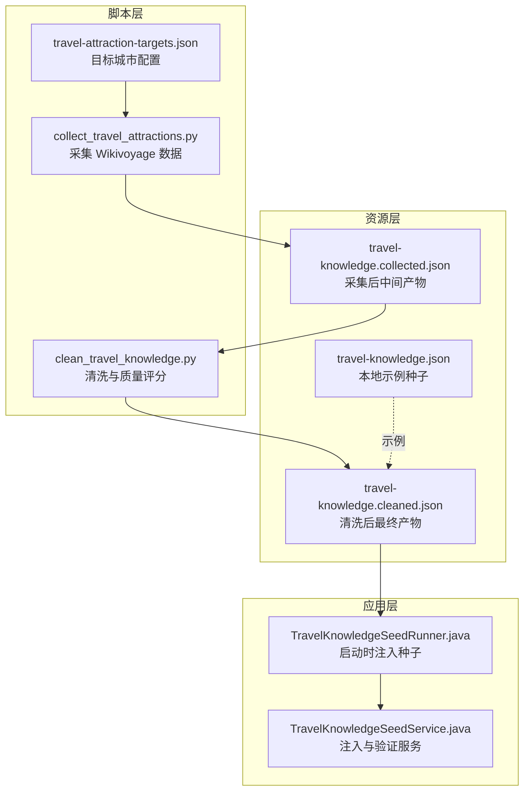
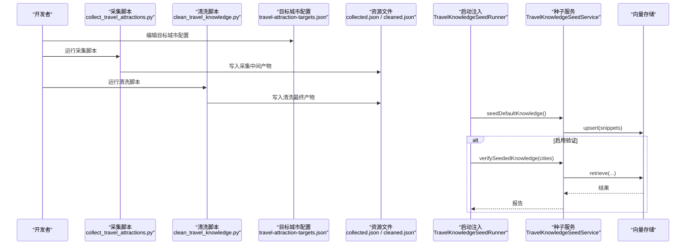
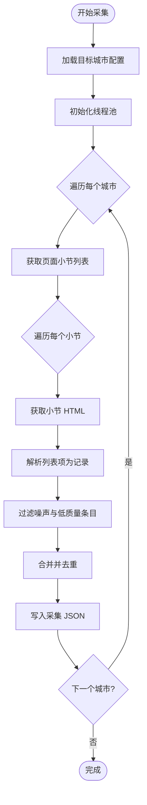
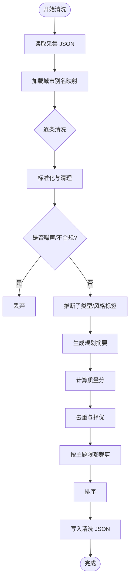
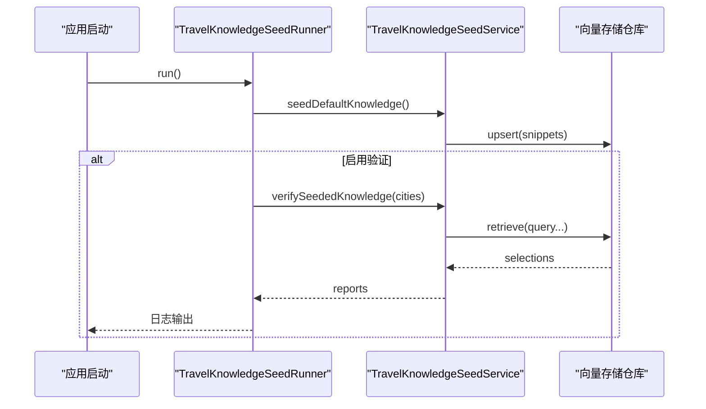
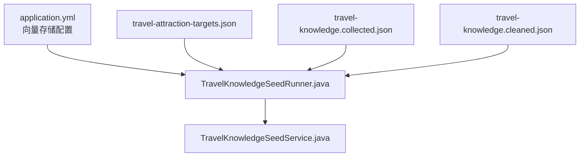

# 知识种子机制

<cite>
**本文引用的文件**
- [collect_travel_attractions.py](file://scripts/collect_travel_attractions.py)
- [clean_travel_knowledge.py](file://scripts/clean_travel_knowledge.py)
- [travel-attraction-targets.json](file://scripts/travel-attraction-targets.json)
- [TravelKnowledgeSeedService.java](file://travel-agent-infrastructure/src/main/java/com/travalagent/infrastructure/repository/TravelKnowledgeSeedService.java)
- [TravelKnowledgeSeedRunner.java](file://travel-agent-app/src/main/java/com/travalagent/app/bootstrap/TravelKnowledgeSeedRunner.java)
- [travel-knowledge.json](file://travel-agent-infrastructure/src/main/resources/travel-knowledge.json)
- [travel-knowledge.collected.json](file://travel-agent-infrastructure/src/main/resources/travel-knowledge.collected.json)
- [travel-knowledge.cleaned.json](file://travel-agent-infrastructure/src/main/resources/travel-knowledge.cleaned.json)
- [application.yml](file://travel-agent-app/src/main/resources/application.yml)
- [TravelKnowledgeSeedServiceTest.java](file://travel-agent-infrastructure/src/test/java/com/travalagent/infrastructure/repository/TravelKnowledgeSeedServiceTest.java)
</cite>

## 目录
1. [引言](#引言)
2. [项目结构](#项目结构)
3. [核心组件](#核心组件)
4. [架构总览](#架构总览)
5. [详细组件分析](#详细组件分析)
6. [依赖分析](#依赖分析)
7. [性能考虑](#性能考虑)
8. [故障排查指南](#故障排查指南)
9. [结论](#结论)
10. [附录](#附录)

## 引言
本文件系统化阐述 TravelAgent 项目的“知识种子机制”，覆盖从 Wikivoyage 数据采集、本地清洗与质量评分，到最终注入向量存储并进行种子验证的完整生命周期。重点包括：
- Python 脚本工具：collect_travel_attractions.py 的景点数据采集流程；clean_travel_knowledge.py 的清洗与质量评分算法。
- 目标城市定义与筛选：travel-attraction-targets.json 的配置格式与优先级策略。
- 知识质量评分体系：内容完整性、准确性验证、重复性检测与主题/子类型推断。
- 数据导入流程：从原始数据到最终知识库的转换步骤与质量指标。
- 实际种子数据示例与评估方法。

## 项目结构
该机制涉及三层文件与两个运行阶段：
- 脚本层：Python 采集与清洗脚本，负责从 Wikivoyage 抓取并生成结构化 JSON。
- 资源层：travel-knowledge.collected.json 与 travel-knowledge.cleaned.json 作为中间与最终产物。
- 应用层：Spring Boot 启动时自动执行种子注入与可选的种子验证。

图示来源
- [collect_travel_attractions.py:1-312](file://scripts/collect_travel_attractions.py#L1-312)
- [clean_travel_knowledge.py:1-632](file://scripts/clean_travel_knowledge.py#L1-632)
- [travel-attraction-targets.json:1-634](file://scripts/travel-attraction-targets.json#L1-634)
- [travel-knowledge.collected.json:1-800](file://travel-agent-infrastructure/src/main/resources/travel-knowledge.collected.json#L1-800)
- [travel-knowledge.cleaned.json:1-800](file://travel-agent-infrastructure/src/main/resources/travel-knowledge.cleaned.json#L1-800)
- [travel-knowledge.json:1-50](file://travel-agent-infrastructure/src/main/resources/travel-knowledge.json#L1-50)
- [TravelKnowledgeSeedRunner.java:1-82](file://travel-agent-app/src/main/java/com/travalagent/app/bootstrap/TravelKnowledgeSeedRunner.java#L1-82)
- [TravelKnowledgeSeedService.java:1-107](file://travel-agent-infrastructure/src/main/java/com/travalagent/infrastructure/repository/TravelKnowledgeSeedService.java#L1-107)

章节来源
- [collect_travel_attractions.py:1-312](file://scripts/collect_travel_attractions.py#L1-312)
- [clean_travel_knowledge.py:1-632](file://scripts/clean_travel_knowledge.py#L1-632)
- [travel-attraction-targets.json:1-634](file://scripts/travel-attraction-targets.json#L1-634)
- [TravelKnowledgeSeedRunner.java:1-82](file://travel-agent-app/src/main/java/com/travalagent/app/bootstrap/TravelKnowledgeSeedRunner.java#L1-82)
- [TravelKnowledgeSeedService.java:1-107](file://travel-agent-infrastructure/src/main/java/com/travalagent/infrastructure/repository/TravelKnowledgeSeedService.java#L1-107)

## 核心组件
- 目标城市配置与筛选
  - travel-attraction-targets.json 定义了采集的目标城市列表，包含城市名、Wikivoyage 页面名、别名与国家等字段。
  - 采集器按配置并发抓取各城市页面的“见/做/吃/喝/睡/交通”等主题段落，并限制每主题采集数量。
- 数据采集与去噪
  - collect_travel_attractions.py 使用 Wikivoyage API 获取页面结构与 HTML 内容，解析列表项，提取标题与正文，过滤噪声与低质量条目，生成带标签与来源标记的记录。
- 清洗与质量评分
  - clean_travel_knowledge.py 对采集结果进行标准化、去噪、主题/子类型推断、摘要生成、去重与限额裁剪，并计算质量分，输出最终 JSON。
- 种子注入与验证
  - TravelKnowledgeSeedRunner 在应用启动时调用 TravelKnowledgeSeedService 将本地知识注入向量库，并可选地对样本城市进行检索验证。

章节来源
- [travel-attraction-targets.json:1-634](file://scripts/travel-attraction-targets.json#L1-634)
- [collect_travel_attractions.py:192-241](file://scripts/collect_travel_attractions.py#L192-241)
- [clean_travel_knowledge.py:551-592](file://scripts/clean_travel_knowledge.py#L551-592)
- [TravelKnowledgeSeedRunner.java:39-70](file://travel-agent-app/src/main/java/com/travalagent/app/bootstrap/TravelKnowledgeSeedRunner.java#L39-70)
- [TravelKnowledgeSeedService.java:35-61](file://travel-agent-infrastructure/src/main/java/com/travalagent/infrastructure/repository/TravelKnowledgeSeedService.java#L35-61)

## 架构总览
下图展示了从采集到注入的端到端流程，以及与配置、资源文件和应用服务的关系。

图示来源
- [collect_travel_attractions.py:272-312](file://scripts/collect_travel_attractions.py#L272-312)
- [clean_travel_knowledge.py:611-632](file://scripts/clean_travel_knowledge.py#L611-632)
- [travel-attraction-targets.json:1-634](file://scripts/travel-attraction-targets.json#L1-634)
- [TravelKnowledgeSeedRunner.java:39-70](file://travel-agent-app/src/main/java/com/travalagent/app/bootstrap/TravelKnowledgeSeedRunner.java#L39-70)
- [TravelKnowledgeSeedService.java:35-61](file://travel-agent-infrastructure/src/main/java/com/travalagent/infrastructure/repository/TravelKnowledgeSeedService.java#L35-61)

## 详细组件分析

### 组件A：旅行景点采集器（collect_travel_attractions.py）
- 功能要点
  - 并发抓取：使用线程池并发访问 Wikivoyage API，按城市并发采集。
  - 主题映射：将页面小节标题映射为主题（见/做/吃/喝/睡/交通）。
  - 解析与过滤：解析 HTML 列表，提取标题与正文，基于长度、噪声模式与主题特征过滤候选。
  - 去重与持久化：合并已存在记录，去重后写入采集 JSON。
- 关键流程

图示来源
- [collect_travel_attractions.py:192-241](file://scripts/collect_travel_attractions.py#L192-241)
- [collect_travel_attractions.py:272-312](file://scripts/collect_travel_attractions.py#L272-312)

章节来源
- [collect_travel_attractions.py:19-30](file://scripts/collect_travel_attractions.py#L19-30)
- [collect_travel_attractions.py:179-189](file://scripts/collect_travel_attractions.py#L179-189)
- [collect_travel_attractions.py:243-251](file://scripts/collect_travel_attractions.py#L243-251)
- [collect_travel_attractions.py:253-263](file://scripts/collect_travel_attractions.py#L253-263)
- [collect_travel_attractions.py:265-270](file://scripts/collect_travel_attractions.py#L265-270)

### 组件B：旅行知识清洗器（clean_travel_knowledge.py）
- 功能要点
  - 文本修复：处理编码异常、多余空白、样式标记与噪声。
  - 记录清洗：标准化标题与内容，去重与过滤无效/噪声记录。
  - 主题/子类型推断：根据内容关键词推断 schemaSubtype（如酒店区域、交通枢纽、到达建议等）。
  - 摘要生成：抽取高分句构建规划摘要。
  - 质量评分：综合内容长度、标签数、主题权重、子类型权重与关键词匹配计算质量分。
  - 限额裁剪：按主题限制每城市保留数量。
- 关键流程

图示来源
- [clean_travel_knowledge.py:551-592](file://scripts/clean_travel_knowledge.py#L551-592)
- [clean_travel_knowledge.py:424-458](file://scripts/clean_travel_knowledge.py#L424-458)
- [clean_travel_knowledge.py:359-404](file://scripts/clean_travel_knowledge.py#L359-404)
- [clean_travel_knowledge.py:514-548](file://scripts/clean_travel_knowledge.py#L514-548)

章节来源
- [clean_travel_knowledge.py:183-259](file://scripts/clean_travel_knowledge.py#L183-259)
- [clean_travel_knowledge.py:285-304](file://scripts/clean_travel_knowledge.py#L285-304)
- [clean_travel_knowledge.py:424-458](file://scripts/clean_travel_knowledge.py#L424-458)
- [clean_travel_knowledge.py:514-548](file://scripts/clean_travel_knowledge.py#L514-548)

### 组件C：目标城市定义与筛选（travel-attraction-targets.json）
- 字段说明
  - city：城市名称（中文或拼音）。
  - page：Wikivoyage 页面名（用于 API 请求）。
  - aliases：城市别名列表（支持中英文）。
  - country：国家。
- 优先级与筛选
  - 采集器按配置并发抓取；清洗器读取别名映射以增强检索召回。
  - 种子服务在未指定请求城市时，按默认偏好顺序与可用城市回退选择样本城市。

章节来源
- [travel-attraction-targets.json:1-634](file://scripts/travel-attraction-targets.json#L1-634)
- [TravelKnowledgeSeedService.java:63-105](file://travel-agent-infrastructure/src/main/java/com/travalagent/infrastructure/repository/TravelKnowledgeSeedService.java#L63-105)

### 组件D：种子注入与验证（TravelKnowledgeSeedRunner.java / TravelKnowledgeSeedService.java）
- 注入流程
  - 应用启动时，TravelKnowledgeSeedRunner 调用 seedDefaultKnowledge，将本地知识片段批量 upsert 至向量存储。
- 验证流程
  - 若启用验证，按请求城市或默认偏好城市集合，对若干查询意图进行检索，输出匹配结果与质量分，辅助评估种子覆盖度与质量。

图示来源
- [TravelKnowledgeSeedRunner.java:39-70](file://travel-agent-app/src/main/java/com/travalagent/app/bootstrap/TravelKnowledgeSeedRunner.java#L39-70)
- [TravelKnowledgeSeedService.java:35-61](file://travel-agent-infrastructure/src/main/java/com/travalagent/infrastructure/repository/TravelKnowledgeSeedService.java#L35-61)

章节来源
- [TravelKnowledgeSeedRunner.java:1-82](file://travel-agent-app/src/main/java/com/travalagent/app/bootstrap/TravelKnowledgeSeedRunner.java#L1-82)
- [TravelKnowledgeSeedService.java:1-107](file://travel-agent-infrastructure/src/main/java/com/travalagent/infrastructure/repository/TravelKnowledgeSeedService.java#L1-107)
- [TravelKnowledgeSeedServiceTest.java:18-107](file://travel-agent-infrastructure/src/test/java/com/travalagent/infrastructure/repository/TravelKnowledgeSeedServiceTest.java#L18-107)

## 依赖分析
- 外部依赖
  - Wikivoyage API：采集器通过 API 获取页面结构与 HTML。
  - 向量存储（Milvus）：种子服务通过向量仓库注入与检索。
- 内部依赖
  - 配置文件 application.yml 控制向量存储启用与参数。
  - 资源文件 travel-knowledge.collected.json 与 travel-knowledge.cleaned.json 作为中间与最终产物。
  - 测试用本地示例 travel-knowledge.json 用于演示与回归。

图示来源
- [application.yml:72-99](file://travel-agent-app/src/main/resources/application.yml#L72-99)
- [TravelKnowledgeSeedRunner.java:18-37](file://travel-agent-app/src/main/java/com/travalagent/app/bootstrap/TravelKnowledgeSeedRunner.java#L18-37)
- [TravelKnowledgeSeedService.java:13-33](file://travel-agent-infrastructure/src/main/java/com/travalagent/infrastructure/repository/TravelKnowledgeSeedService.java#L13-33)
- [travel-knowledge.collected.json:1-800](file://travel-agent-infrastructure/src/main/resources/travel-knowledge.collected.json#L1-800)
- [travel-knowledge.cleaned.json:1-800](file://travel-agent-infrastructure/src/main/resources/travel-knowledge.cleaned.json#L1-800)
- [travel-attraction-targets.json:1-634](file://scripts/travel-attraction-targets.json#L1-634)

章节来源
- [application.yml:72-99](file://travel-agent-app/src/main/resources/application.yml#L72-99)
- [TravelKnowledgeSeedRunner.java:18-37](file://travel-agent-app/src/main/java/com/travalagent/app/bootstrap/TravelKnowledgeSeedRunner.java#L18-37)
- [TravelKnowledgeSeedService.java:13-33](file://travel-agent-infrastructure/src/main/java/com/travalagent/infrastructure/repository/TravelKnowledgeSeedService.java#L13-33)

## 性能考虑
- 并发与限流
  - 采集器使用线程池并发抓取，可通过命令行参数调整最大并发与每主题采集上限，避免对 Wikivoyage 造成过大压力。
- 清洗效率
  - 清洗器采用正则与关键词匹配快速过滤噪声，避免昂贵的外部调用。
- 向量注入
  - 批量 upsert 提升注入吞吐；限额裁剪减少向量库规模与查询开销。
- 建议
  - 在 CI 环境中控制并发与速率，确保稳定性。
  - 定期评估清洗阈值与限额，平衡覆盖率与质量。

## 故障排查指南
- 向量存储不可用
  - 现象：seedDefaultKnowledge 抛出异常。
  - 排查：确认 application.yml 中 Milvus 相关配置与连接参数正确，且服务可用。
- 采集失败
  - 现象：部分城市采集错误计数增加。
  - 排查：检查网络连通性、Wikivoyage API 可达性与代理设置；适当提高超时与重试次数。
- 清洗后记录过少
  - 现象：清洗后最终记录数显著下降。
  - 排查：检查噪声过滤规则与主题限额，必要时放宽阈值或增加 per-section-limit。
- 种子验证无匹配
  - 现象：verifySeededKnowledge 返回空结果。
  - 排查：确认注入成功、查询意图与城市别名映射正确，逐步缩小查询范围定位问题。

章节来源
- [TravelKnowledgeSeedRunner.java:39-70](file://travel-agent-app/src/main/java/com/travalagent/app/bootstrap/TravelKnowledgeSeedRunner.java#L39-70)
- [TravelKnowledgeSeedService.java:35-61](file://travel-agent-infrastructure/src/main/java/com/travalagent/infrastructure/repository/TravelKnowledgeSeedService.java#L35-61)
- [TravelKnowledgeSeedServiceTest.java:37-46](file://travel-agent-infrastructure/src/test/java/com/travalagent/infrastructure/repository/TravelKnowledgeSeedServiceTest.java#L37-46)

## 结论
本机制通过“采集-清洗-注入-验证”的闭环，实现了从 Wikivoyage 到本地知识库的高质量迁移。采集器与清洗器分别承担数据获取与质量保障职责，目标城市配置与种子服务提供可控的筛选与注入能力。结合质量评分与限额裁剪，能够在覆盖广度与内容质量之间取得平衡，支撑后续检索与规划工作。

## 附录

### A. 目标城市配置格式与优先级
- 配置格式
  - 字段：city、page、aliases、country。
  - 示例路径：[travel-attraction-targets.json:1-634](file://scripts/travel-attraction-targets.json#L1-634)
- 优先级与回退
  - 种子服务在未指定请求城市时，按默认偏好顺序与可用城市集合回退选择样本城市。
  - 示例路径：[TravelKnowledgeSeedService.java:63-105](file://travel-agent-infrastructure/src/main/java/com/travalagent/infrastructure/repository/TravelKnowledgeSeedService.java#L63-105)

章节来源
- [travel-attraction-targets.json:1-634](file://scripts/travel-attraction-targets.json#L1-634)
- [TravelKnowledgeSeedService.java:63-105](file://travel-agent-infrastructure/src/main/java/com/travalagent/infrastructure/repository/TravelKnowledgeSeedService.java#L63-105)

### B. 数据导入流程与质量指标
- 导入流程
  - 采集：collect_travel_attractions.py → travel-knowledge.collected.json
  - 清洗：clean_travel_knowledge.py → travel-knowledge.cleaned.json
  - 注入：TravelKnowledgeSeedRunner → TravelKnowledgeSeedService → 向量存储
  - 验证：可选的 verifySeededKnowledge 输出匹配报告
  - 示例路径：
    - [collect_travel_attractions.py:272-312](file://scripts/collect_travel_attractions.py#L272-312)
    - [clean_travel_knowledge.py:611-632](file://scripts/clean_travel_knowledge.py#L611-632)
    - [TravelKnowledgeSeedRunner.java:39-70](file://travel-agent-app/src/main/java/com/travalagent/app/bootstrap/TravelKnowledgeSeedRunner.java#L39-70)
    - [TravelKnowledgeSeedService.java:35-61](file://travel-agent-infrastructure/src/main/java/com/travalagent/infrastructure/repository/TravelKnowledgeSeedService.java#L35-61)
- 质量指标
  - 内容完整性：长度阈值、标签数量、主题权重。
  - 准确性验证：噪声过滤规则、子类型推断一致性。
  - 重复性检测：标题/主题/城市三元组去重与择优。
  - 限额裁剪：按主题限制每城市保留数量。
  - 示例路径：
    - [clean_travel_knowledge.py:461-496](file://scripts/clean_travel_knowledge.py#L461-496)
    - [clean_travel_knowledge.py:514-548](file://scripts/clean_travel_knowledge.py#L514-548)
    - [clean_travel_knowledge.py:551-592](file://scripts/clean_travel_knowledge.py#L551-592)

章节来源
- [collect_travel_attractions.py:272-312](file://scripts/collect_travel_attractions.py#L272-312)
- [clean_travel_knowledge.py:461-496](file://scripts/clean_travel_knowledge.py#L461-496)
- [clean_travel_knowledge.py:514-548](file://scripts/clean_travel_knowledge.py#L514-548)
- [clean_travel_knowledge.py:551-592](file://scripts/clean_travel_knowledge.py#L551-592)
- [TravelKnowledgeSeedRunner.java:39-70](file://travel-agent-app/src/main/java/com/travalagent/app/bootstrap/TravelKnowledgeSeedRunner.java#L39-70)
- [TravelKnowledgeSeedService.java:35-61](file://travel-agent-infrastructure/src/main/java/com/travalagent/infrastructure/repository/TravelKnowledgeSeedService.java#L35-61)

### C. 种子数据示例
- 本地示例种子（travel-knowledge.json）
  - 包含若干城市的主题片段，用于演示与回归测试。
  - 示例路径：[travel-knowledge.json:1-50](file://travel-agent-infrastructure/src/main/resources/travel-knowledge.json#L1-50)
- 清洗后种子样例（travel-knowledge.cleaned.json）
  - 展示清洗后的字段（如 schemaSubtype、tripStyleTags、qualityScore 等）与摘要内容。
  - 示例路径：[travel-knowledge.cleaned.json:1-800](file://travel-agent-infrastructure/src/main/resources/travel-knowledge.cleaned.json#L1-800)

章节来源
- [travel-knowledge.json:1-50](file://travel-agent-infrastructure/src/main/resources/travel-knowledge.json#L1-50)
- [travel-knowledge.cleaned.json:1-800](file://travel-agent-infrastructure/src/main/resources/travel-knowledge.cleaned.json#L1-800)