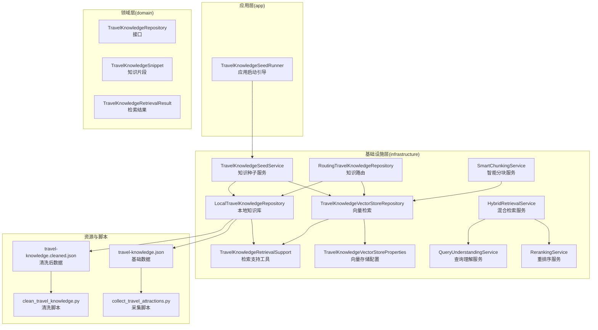
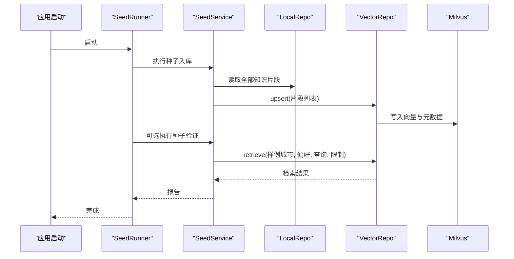
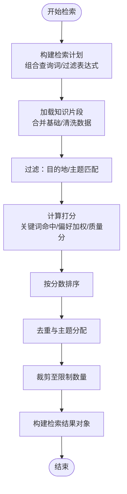
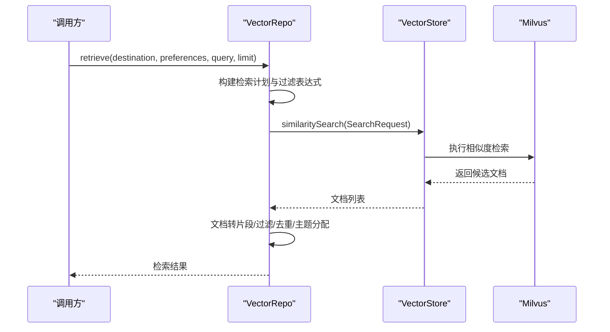
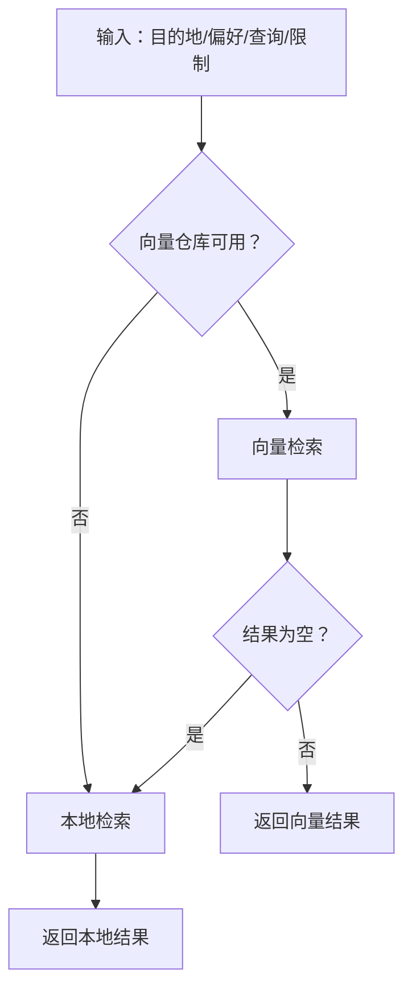
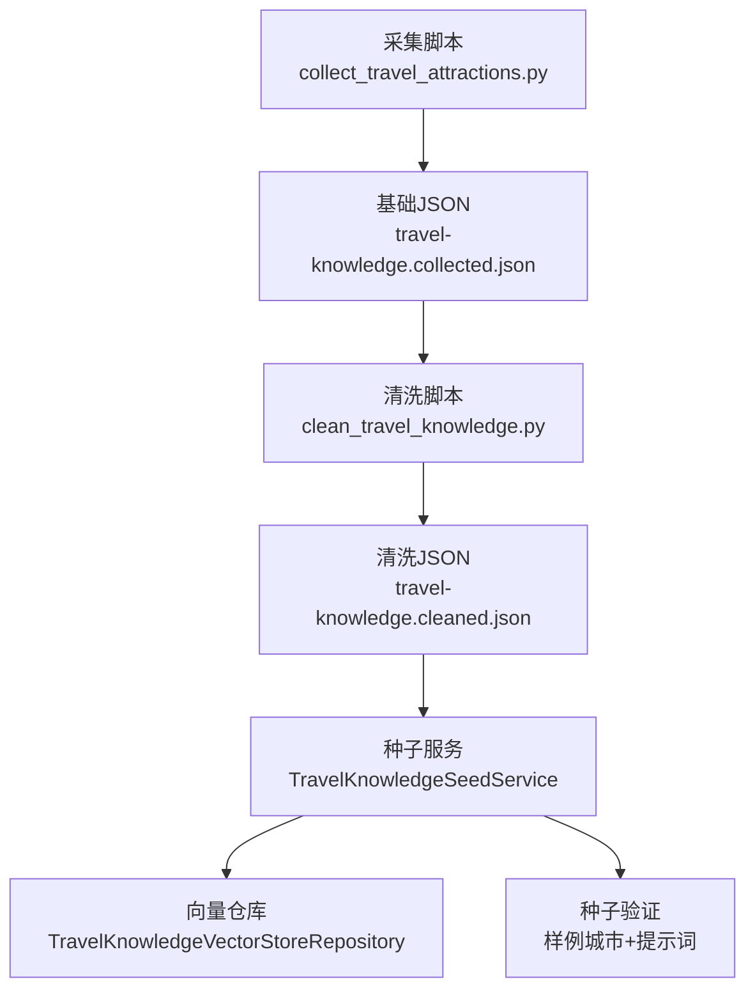
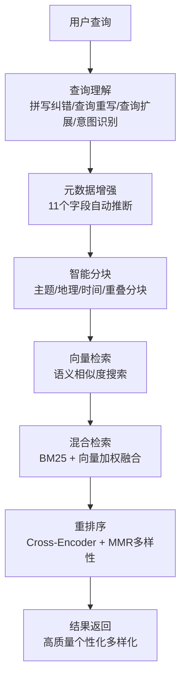
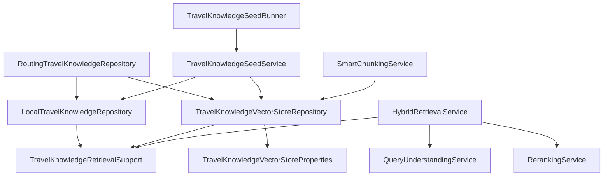

# 知识管理系统

<cite>
**本文引用的文件**
- [LocalTravelKnowledgeRepository.java](file://travel-agent-infrastructure/src/main/java/com/travalagent/infrastructure/repository/LocalTravelKnowledgeRepository.java)
- [RoutingTravelKnowledgeRepository.java](file://travel-agent-infrastructure/src/main/java/com/travalagent/infrastructure/repository/RoutingTravelKnowledgeRepository.java)
- [TravelKnowledgeVectorStoreRepository.java](file://travel-agent-infrastructure/src/main/java/com/travalagent/infrastructure/repository/TravelKnowledgeVectorStoreRepository.java)
- [TravelKnowledgeRetrievalSupport.java](file://travel-agent-infrastructure/src/main/java/com/travalagent/infrastructure/repository/TravelKnowledgeRetrievalSupport.java)
- [TravelKnowledgeRepository.java](file://travel-agent-domain/src/main/java/com/travalagent/domain/repository/TravelKnowledgeRepository.java)
- [TravelKnowledgeRetrievalResult.java](file://travel-agent-domain/src/main/java/com/travalagent/domain/model/valobj/TravelKnowledgeRetrievalResult.java)
- [TravelKnowledgeSnippet.java](file://travel-agent-domain/src/main/java/com/travalagent/domain/model/valobj/TravelKnowledgeSnippet.java)
- [TravelKnowledgeVectorStoreProperties.java](file://travel-agent-infrastructure/src/main/java/com/travalagent/infrastructure/config/TravelKnowledgeVectorStoreProperties.java)
- [TravelKnowledgeSeedService.java](file://travel-agent-infrastructure/src/main/java/com/travalagent/infrastructure/repository/TravelKnowledgeSeedService.java)
- [TravelKnowledgeSeedRunner.java](file://travel-agent-app/src/main/java/com/travalagent/app/bootstrap/TravelKnowledgeSeedRunner.java)
- [HybridRetrievalService.java](file://travel-agent-infrastructure/src/main/java/com/travalagent/infrastructure/repository/HybridRetrievalService.java)
- [QueryUnderstandingService.java](file://travel-agent-infrastructure/src/main/java/com/travalagent/infrastructure/repository/QueryUnderstandingService.java)
- [RerankingService.java](file://travel-agent-infrastructure/src/main/java/com/travalagent/infrastructure/repository/RerankingService.java)
- [SmartChunkingService.java](file://travel-agent-infrastructure/src/main/java/com/travalagent/infrastructure/repository/SmartChunkingService.java)
- [travel-knowledge.json](file://travel-agent-infrastructure/src/main/resources/travel-knowledge.json)
- [travel-knowledge.cleaned.json](file://travel-agent-infrastructure/src/main/resources/travel-knowledge.cleaned.json)
- [clean_travel_knowledge.py](file://scripts/clean_travel_knowledge.py)
- [collect_travel_attractions.py](file://scripts/collect_travel_attractions.py)
- [LocalTravelKnowledgeRepositoryTest.java](file://travel-agent-infrastructure/src/test/java/com/travalagent/infrastructure/repository/LocalTravelKnowledgeRepositoryTest.java)
- [TravelKnowledgeVectorStoreRepositoryTest.java](file://travel-agent-infrastructure/src/test/java/com/travalagent/infrastructure/repository/TravelKnowledgeVectorStoreRepositoryTest.java)
- [RAG_完成报告.md](file://docs/RAG_完成报告.md)
- [RAG_实施报告.md](file://docs/RAG_实施报告.md)
- [RAG_进度报告.md](file://docs/RAG_进度报告.md)
</cite>

## 更新摘要
**变更内容**
- 新增RAG Phase 1四个核心服务：混合检索、查询理解、重排序、智能分块
- 增强TravelKnowledgeSnippet元数据字段，新增11个字段和8个智能推断方法
- 完整的RAG检索管道：查询理解 → 元数据增强 → 智能分块 → 向量检索 → 混合检索 → 重排序
- 增强的检索策略：BM25关键词检索 + 向量语义检索 + Cross-Encoder重排序

## 目录
1. [简介](#简介)
2. [项目结构](#项目结构)
3. [核心组件](#核心组件)
4. [架构总览](#架构总览)
5. [详细组件分析](#详细组件分析)
6. [RAG检索管道](#rag检索管道)
7. [依赖分析](#依赖分析)
8. [性能考虑](#性能考虑)
9. [故障排查指南](#故障排查指南)
10. [结论](#结论)
11. [附录](#附录)

## 简介
本文件面向TravelAgent知识管理系统，聚焦于本地知识库、向量检索与知识路由机制，以及RAG Phase 1新增的四个核心服务。内容覆盖：
- 本地知识库设计与实现：LocalTravelKnowledgeRepository 的数据结构、查询机制与缓存策略
- 向量检索系统：TravelKnowledgeVectorStoreRepository 的向量化处理、相似度计算与检索优化
- 知识路由机制：RoutingTravelKnowledgeRepository 的智能选择策略与多源知识融合
- RAG检索管道：查询理解、元数据增强、智能分块、混合检索与重排序的完整流程
- 知识种子机制：数据准备流程、数据清洗与质量保证
- 增强的元数据系统：11个新字段和8个智能推断方法

## 项目结构
系统采用分层架构，核心知识管理位于基础设施层（infrastructure），领域模型位于 domain 层，应用启动与引导位于 app 层，脚本工具位于 scripts 目录。RAG Phase 1新增了四个核心服务，形成了完整的检索增强生成系统。

**图表来源**
- [TravelKnowledgeSeedRunner.java:1-82](file://travel-agent-app/src/main/java/com/travalagent/app/bootstrap/TravelKnowledgeSeedRunner.java#L1-L82)
- [HybridRetrievalService.java:1-333](file://travel-agent-infrastructure/src/main/java/com/travalagent/infrastructure/repository/HybridRetrievalService.java#L1-L333)
- [QueryUnderstandingService.java:1-567](file://travel-agent-infrastructure/src/main/java/com/travalagent/infrastructure/repository/QueryUnderstandingService.java#L1-L567)
- [RerankingService.java:1-584](file://travel-agent-infrastructure/src/main/java/com/travalagent/infrastructure/repository/RerankingService.java#L1-L584)
- [SmartChunkingService.java:1-491](file://travel-agent-infrastructure/src/main/java/com/travalagent/infrastructure/repository/SmartChunkingService.java#L1-L491)

**章节来源**
- [TravelKnowledgeSeedRunner.java:1-82](file://travel-agent-app/src/main/java/com/travalagent/app/bootstrap/TravelKnowledgeSeedRunner.java#L1-L82)
- [HybridRetrievalService.java:1-333](file://travel-agent-infrastructure/src/main/java/com/travalagent/infrastructure/repository/HybridRetrievalService.java#L1-L333)
- [QueryUnderstandingService.java:1-567](file://travel-agent-infrastructure/src/main/java/com/travalagent/infrastructure/repository/QueryUnderstandingService.java#L1-L567)
- [RerankingService.java:1-584](file://travel-agent-infrastructure/src/main/java/com/travalagent/infrastructure/repository/RerankingService.java#L1-L584)
- [SmartChunkingService.java:1-491](file://travel-agent-infrastructure/src/main/java/com/travalagent/infrastructure/repository/SmartChunkingService.java#L1-L491)

## 核心组件
- 本地知识库 LocalTravelKnowledgeRepository
  - 数据来源：基础 JSON 与清洗后的 JSON，自动合并去重
  - 查询机制：基于检索计划（目的地、主题、偏好、查询词）进行过滤与打分排序
  - 缓存策略：加载时构建城市别名映射与去重键，运行期按需过滤与排序
- 向量检索 TravelKnowledgeVectorStoreRepository
  - 向量化：使用嵌入模型对知识片段进行向量化
  - 检索：基于 Spring AI VectorStore 进行相似度搜索，支持过滤表达式
  - 优化：扩大 TopK 以提升召回，再在应用层二次筛选与去重
- 知识路由 RoutingTravelKnowledgeRepository
  - 路由策略：优先尝试向量检索，若为空则回退到本地检索
  - 多源融合：统一返回结构，屏蔽底层实现差异
- 检索支持工具 TravelKnowledgeRetrievalSupport
  - 主题与旅行风格推断、过滤表达式构建、去重与优先级分配
  - 质量评分与偏好加权，确保结果多样性与相关性平衡
  - **新增**：11个元数据字段的智能推断（season、budgetLevel、duration等）
- 知识种子 TravelKnowledgeSeedService 与引导器 TravelKnowledgeSeedRunner
  - 种子入库：将本地知识批量写入向量库
  - 种子验证：按样例城市与提示词验证检索效果
  - 自动化引导：通过条件属性控制是否执行种子流程
- **新增**：混合检索服务 HybridRetrievalService
  - 结合BM25关键词检索和向量检索，加权融合
  - 支持查询理解、元数据过滤和重排序
- **新增**：查询理解服务 QueryUnderstandingService
  - 拼写纠错、查询重写、查询扩展、意图识别
  - 多轮对话上下文保持、实体提取
- **新增**：重排序服务 RerankingService
  - Cross-Encoder相关性评分、用户偏好匹配、时效性加权
  - MMR多样性保证，提升结果质量和多样性
- **新增**：智能分块服务 SmartChunkingService
  - 主题分块、地理分块、时间分块、重叠分块
  - 15%重叠保持上下文连贯，支持批量分块

**章节来源**
- [LocalTravelKnowledgeRepository.java:1-224](file://travel-agent-infrastructure/src/main/java/com/travalagent/infrastructure/repository/LocalTravelKnowledgeRepository.java#L1-L224)
- [TravelKnowledgeVectorStoreRepository.java:1-232](file://travel-agent-infrastructure/src/main/java/com/travalagent/infrastructure/repository/TravelKnowledgeVectorStoreRepository.java#L1-L232)
- [RoutingTravelKnowledgeRepository.java:1-38](file://travel-agent-infrastructure/src/main/java/com/travalagent/infrastructure/repository/RoutingTravelKnowledgeRepository.java#L1-L38)
- [TravelKnowledgeRetrievalSupport.java:1-979](file://travel-agent-infrastructure/src/main/java/com/travalagent/infrastructure/repository/TravelKnowledgeRetrievalSupport.java#L1-L979)
- [TravelKnowledgeSeedService.java:1-107](file://travel-agent-infrastructure/src/main/java/com/travalagent/infrastructure/repository/TravelKnowledgeSeedService.java#L1-L107)
- [TravelKnowledgeSeedRunner.java:1-82](file://travel-agent-app/src/main/java/com/travalagent/app/bootstrap/TravelKnowledgeSeedRunner.java#L1-L82)
- [HybridRetrievalService.java:1-333](file://travel-agent-infrastructure/src/main/java/com/travalagent/infrastructure/repository/HybridRetrievalService.java#L1-L333)
- [QueryUnderstandingService.java:1-567](file://travel-agent-infrastructure/src/main/java/com/travalagent/infrastructure/repository/QueryUnderstandingService.java#L1-L567)
- [RerankingService.java:1-584](file://travel-agent-infrastructure/src/main/java/com/travalagent/infrastructure/repository/RerankingService.java#L1-L584)
- [SmartChunkingService.java:1-491](file://travel-agent-infrastructure/src/main/java/com/travalagent/infrastructure/repository/SmartChunkingService.java#L1-L491)

## 架构总览
系统通过"本地知识库 + 向量检索"的双轨检索与路由，结合RAG Phase 1新增的四个核心服务，形成从数据准备到检索服务再到答案生成的完整闭环。

**图表来源**
- [TravelKnowledgeSeedRunner.java:1-82](file://travel-agent-app/src/main/java/com/travalagent/app/bootstrap/TravelKnowledgeSeedRunner.java#L1-L82)
- [TravelKnowledgeSeedService.java:1-107](file://travel-agent-infrastructure/src/main/java/com/travalagent/infrastructure/repository/TravelKnowledgeSeedService.java#L1-L107)
- [LocalTravelKnowledgeRepository.java:1-224](file://travel-agent-infrastructure/src/main/java/com/travalagent/infrastructure/repository/LocalTravelKnowledgeRepository.java#L1-L224)
- [TravelKnowledgeVectorStoreRepository.java:1-232](file://travel-agent-infrastructure/src/main/java/com/travalagent/infrastructure/repository/TravelKnowledgeVectorStoreRepository.java#L1-L232)

## 详细组件分析

### 本地知识库 LocalTravelKnowledgeRepository
- 数据结构
  - 知识片段：城市、主题、标题、内容、标签、来源、模式子类型、质量分、城市别名、旅行风格标签
  - 去重键：城市::主题::标题（标准化）
- 查询机制
  - 规划：组合目的地、偏好、查询词，推断主题与旅行风格，构建过滤表达式
  - 匹配：按目的地与主题过滤，计算打分（包含城市别名匹配、关键词命中、偏好加权等）
  - 排序与裁剪：按分数降序，去重后按主题目标数分配与优先级排序
- 缓存策略
  - 加载期：合并基础与清洗数据，去重并构建城市别名查找表
  - 运行期：按需过滤与排序，避免重复计算

**图表来源**
- [LocalTravelKnowledgeRepository.java:50-68](file://travel-agent-infrastructure/src/main/java/com/travalagent/infrastructure/repository/LocalTravelKnowledgeRepository.java#L50-L68)
- [TravelKnowledgeRetrievalSupport.java:79-86](file://travel-agent-infrastructure/src/main/java/com/travalagent/infrastructure/repository/TravelKnowledgeRetrievalSupport.java#L79-L86)
- [TravelKnowledgeRetrievalSupport.java:187-232](file://travel-agent-infrastructure/src/main/java/com/travalagent/infrastructure/repository/TravelKnowledgeRetrievalSupport.java#L187-L232)

**章节来源**
- [LocalTravelKnowledgeRepository.java:1-224](file://travel-agent-infrastructure/src/main/java/com/travalagent/infrastructure/repository/LocalTravelKnowledgeRepository.java#L1-L224)
- [TravelKnowledgeSnippet.java:1-53](file://travel-agent-domain/src/main/java/com/travalagent/domain/model/valobj/TravelKnowledgeSnippet.java#L1-L53)
- [TravelKnowledgeRetrievalResult.java:1-42](file://travel-agent-domain/src/main/java/com/travalagent/domain/model/valobj/TravelKnowledgeRetrievalResult.java#L1-L42)
- [travel-knowledge.json:1-50](file://travel-agent-infrastructure/src/main/resources/travel-knowledge.json#L1-L50)
- [travel-knowledge.cleaned.json:1-800](file://travel-agent-infrastructure/src/main/resources/travel-knowledge.cleaned.json#L1-L800)

### 向量检索 TravelKnowledgeVectorStoreRepository
- 向量化处理
  - 使用嵌入模型生成向量，构建 Spring AI VectorStore
  - 元数据规范化：city/topic/displayCity/displayTopic/cityAliases/tags/schemaSubtype/qualityScore
  - **增强**：支持11个新元数据字段的序列化与反序列化
- 相似度计算与检索优化
  - 扩大 TopK（至少 18，且为 limit*6）以提升召回
  - 应用层二次过滤：目的地与主题匹配，再去重与主题分配
- 配置与初始化
  - 支持动态重建集合（drop + rebuild），便于首次播种或迁移

**图表来源**
- [TravelKnowledgeVectorStoreRepository.java:68-99](file://travel-agent-infrastructure/src/main/java/com/travalagent/infrastructure/repository/TravelKnowledgeVectorStoreRepository.java#L68-L99)
- [TravelKnowledgeVectorStoreRepository.java:101-139](file://travel-agent-infrastructure/src/main/java/com/travalagent/infrastructure/repository/TravelKnowledgeVectorStoreRepository.java#L101-L139)
- [TravelKnowledgeVectorStoreProperties.java:1-108](file://travel-agent-infrastructure/src/main/java/com/travalagent/infrastructure/config/TravelKnowledgeVectorStoreProperties.java#L1-L108)

**章节来源**
- [TravelKnowledgeVectorStoreRepository.java:1-232](file://travel-agent-infrastructure/src/main/java/com/travalagent/infrastructure/repository/TravelKnowledgeVectorStoreRepository.java#L1-L232)
- [TravelKnowledgeVectorStoreProperties.java:1-108](file://travel-agent-infrastructure/src/main/java/com/travalagent/infrastructure/config/TravelKnowledgeVectorStoreProperties.java#L1-L108)
- [TravelKnowledgeVectorStoreRepositoryTest.java:1-92](file://travel-agent-infrastructure/src/test/java/com/travalagent/infrastructure/repository/TravelKnowledgeVectorStoreRepositoryTest.java#L1-L92)

### 知识路由 RoutingTravelKnowledgeRepository
- 智能选择策略
  - 若向量仓库可用：优先执行向量检索；若结果非空则直接返回
  - 否则回退到本地检索，保证可用性与一致性
- 多源知识融合
  - 统一返回结构，屏蔽底层实现差异，便于上层一致消费

**图表来源**
- [RoutingTravelKnowledgeRepository.java:26-36](file://travel-agent-infrastructure/src/main/java/com/travalagent/infrastructure/repository/RoutingTravelKnowledgeRepository.java#L26-L36)

**章节来源**
- [RoutingTravelKnowledgeRepository.java:1-38](file://travel-agent-infrastructure/src/main/java/com/travalagent/infrastructure/repository/RoutingTravelKnowledgeRepository.java#L1-L38)

### 检索支持工具 TravelKnowledgeRetrievalSupport
- 主题与旅行风格推断：基于关键词集合与查询文本，推断目标主题与旅行风格
- 过滤表达式构建：根据目的地与主题集合生成过滤条件
- 去重与优先级分配：按主题优先级与目标数分配，再按质量分与偏好加权排序
- 质量评分与偏好加权：综合内容长度、标签数量、主题权重、子类型特征与旅行风格匹配度
- **新增**：11个元数据字段的智能推断
  - `inferSeason()`：根据季节关键词推断适用季节
  - `inferBudgetLevel()`：根据价格关键词推断预算等级
  - `inferDuration()`：推断建议时长
  - `inferBestTime()`：推断最佳时间
  - `inferCrowdLevel()`：推断拥挤度
  - `extractLocation()`：提取具体位置
  - `extractPriceRange()`：提取价格范围
  - `extractFacilities()`：提取设施标签

**章节来源**
- [TravelKnowledgeRetrievalSupport.java:1-979](file://travel-agent-infrastructure/src/main/java/com/travalagent/infrastructure/repository/TravelKnowledgeRetrievalSupport.java#L1-L979)

### 知识种子机制
- 数据准备流程
  - 采集：从维基导游采集各城市各主题条目，生成基础数据
  - 清洗：去除噪声、修复编码问题、提取旅行风格标签、推断子类型、计算质量分、去重与裁剪
- 数据清洗与质量保证
  - 清洗脚本：正则清理、噪声检测、摘要生成、质量分计算、主题与子类型推断
  - 采集脚本：并发抓取、标题猜测、关键词提取、去重合并
- 种子入库与验证
  - 种子服务：将本地知识片段批量写入向量库，支持可选验证
  - 引导器：按配置自动执行种子流程并在完成后关闭应用上下文

**图表来源**
- [collect_travel_attractions.py:1-312](file://scripts/collect_travel_attractions.py#L1-L312)
- [clean_travel_knowledge.py:1-632](file://scripts/clean_travel_knowledge.py#L1-L632)
- [TravelKnowledgeSeedService.java:35-61](file://travel-agent-infrastructure/src/main/java/com/travalagent/infrastructure/repository/TravelKnowledgeSeedService.java#L35-L61)
- [TravelKnowledgeSeedRunner.java:39-70](file://travel-agent-app/src/main/java/com/travalagent/app/bootstrap/TravelKnowledgeSeedRunner.java#L39-L70)

**章节来源**
- [collect_travel_attractions.py:1-312](file://scripts/collect_travel_attractions.py#L1-L312)
- [clean_travel_knowledge.py:1-632](file://scripts/clean_travel_knowledge.py#L1-L632)
- [TravelKnowledgeSeedService.java:1-107](file://travel-agent-infrastructure/src/main/java/com/travalagent/infrastructure/repository/TravelKnowledgeSeedService.java#L1-L107)
- [TravelKnowledgeSeedRunner.java:1-82](file://travel-agent-app/src/main/java/com/travalagent/app/bootstrap/TravelKnowledgeSeedRunner.java#L1-L82)
- [travel-knowledge.cleaned.json:1-800](file://travel-agent-infrastructure/src/main/resources/travel-knowledge.cleaned.json#L1-L800)

### RAG（检索增强生成）实现细节
- 查询处理
  - 检索前规划：组合目的地、偏好与查询词，推断主题与旅行风格，构建过滤表达式
- 上下文检索
  - 向量检索：扩大 TopK 提升召回，应用层二次过滤与去重
  - 本地检索：基于关键词与偏好加权打分，按主题目标数分配
- 答案生成
  - 将检索到的知识片段作为上下文，结合用户查询与旅行偏好，交由 LLM 生成回答
  - 结果包含来源与质量分，便于后续反馈与优化

**章节来源**
- [TravelKnowledgeRetrievalSupport.java:79-86](file://travel-agent-infrastructure/src/main/java/com/travalagent/infrastructure/repository/TravelKnowledgeRetrievalSupport.java#L79-L86)
- [TravelKnowledgeVectorStoreRepository.java:74-82](file://travel-agent-infrastructure/src/main/java/com/travalagent/infrastructure/repository/TravelKnowledgeVectorStoreRepository.java#L74-L82)
- [LocalTravelKnowledgeRepository.java:58-67](file://travel-agent-infrastructure/src/main/java/com/travalagent/infrastructure/repository/LocalTravelKnowledgeRepository.java#L58-L67)

## RAG检索管道

### 完整RAG流程
RAG Phase 1实现了完整的检索增强生成管道，包含五个核心阶段：

**图表来源**
- [RAG_完成报告.md:25-66](file://docs/RAG_完成报告.md#L25-L66)
- [RAG_实施报告.md:205-254](file://docs/RAG_实施报告.md#L205-L254)

### 查询理解服务
- **拼写纠错**：纠正常见拼写错误和拼音错误
- **查询重写**：标准化地名、时间表达、预算表达
- **查询扩展**：添加同义词、相关词、城市热门推荐
- **意图识别**：识别景点、酒店、美食、交通、购物、行程意图
- **上下文融合**：处理多轮对话，保持上下文一致性
- **实体提取**：提取城市、时间、预算、旅行风格等实体

### 元数据增强系统
- **新增11个元数据字段**：
  - `season`：适用季节（春/夏/秋/冬）
  - `budgetLevel`：预算等级（free/budget/moderate/premium/luxury）
  - `duration`：建议时长（1小时/半天/全天/2天）
  - `bestTime`：最佳时间（早晨/下午/傍晚/夜晚）
  - `crowdLevel`：拥挤度（低/中/高）
  - `location`：具体位置/地址
  - `area`：所在区域
  - `rating`：评分（0-5）
  - `priceRange`：价格范围（¥50-100）
  - `facilities`：设施标签（WiFi/停车场/早餐等）
  - `nearbyPOIs`：周边兴趣点

- **8个智能推断方法**：
  - `inferSeason()`：基于季节关键词推断
  - `inferBudgetLevel()`：基于价格关键词推断
  - `inferDuration()`：基于时间表达推断
  - `inferBestTime()`：基于时间偏好推断
  - `inferCrowdLevel()`：基于热门/小众关键词推断
  - `extractLocation()`：基于地址模式提取
  - `extractPriceRange()`：基于正则表达式提取
  - `extractFacilities()`：基于设施关键词匹配

### 智能分块策略
- **4种分块策略**（按优先级）：
  1. **主题分块**：按景点/酒店/交通/美食等主题分段
  2. **地理分块**：按城市/区域/地标等地理标识分段
  3. **时间分块**：按季节/月份/时段等时间维度分段
  4. **重叠分块**：通用长文档的固定大小分块

- **分块配置**：
  - 最小分块：200字符
  - 最大分块：800字符
  - 重叠大小：100字符（15%重叠）
  - 句子边界检测：避免在句子中间切断

### 混合检索系统
- **BM25关键词检索**（权重40%）：
  - 完整实现BM25算法：词频饱和、文档长度归一化、逆文档频率
  - 支持中英文分词，文档长度归一化处理
  - 基于向量检索结果计算BM25分数

- **向量语义检索**（权重60%）：
  - 基于Spring AI VectorStore的语义相似度搜索
  - 支持元数据过滤和相似度阈值控制

- **加权融合**：
  - Min-Max归一化后加权融合
  - 可配置权重，支持实验调优

### 重排序服务
- **Cross-Encoder相关性评分**（模拟实现）：
  - 标题匹配权重：40%
  - 内容匹配权重：30%
  - 标签匹配权重：15%
  - 元数据匹配权重：15%

- **用户偏好匹配**（25%权重）：
  - 旅行风格匹配（relaxed/family/foodie/budget等）
  - 预算等级匹配
  - 设施偏好匹配
  - 季节匹配（当前季节优先）

- **时效性加权**（20%权重）：
  - 季节匹配（当前季节优先）
  - 质量评分加权
  - 评分加权

- **MMR多样性保证**（20%权重）：
  - 在相关性和多样性之间平衡
  - 避免结果过于单一化

**章节来源**
- [RAG_完成报告.md:1-387](file://docs/RAG_完成报告.md#L1-L387)
- [RAG_实施报告.md:1-376](file://docs/RAG_实施报告.md#L1-L376)
- [RAG_进度报告.md:1-409](file://docs/RAG_进度报告.md#L1-L409)

## 依赖分析
- 组件耦合
  - RoutingTravelKnowledgeRepository 同时依赖本地与向量仓库，体现路由解耦
  - 本地与向量仓库共享检索支持工具，降低重复逻辑
  - **新增**：混合检索服务依赖查询理解、重排序服务
  - **新增**：智能分块服务集成到向量仓库的upsert流程
- 外部依赖
  - 向量检索依赖 Milvus 与嵌入模型（Spring AI）
  - 应用引导依赖 Spring Boot 条件属性与环境变量
  - **新增**：Reranking服务依赖Cross-Encoder模型（生产环境）

**图表来源**
- [RoutingTravelKnowledgeRepository.java:1-38](file://travel-agent-infrastructure/src/main/java/com/travalagent/infrastructure/repository/RoutingTravelKnowledgeRepository.java#L1-L38)
- [LocalTravelKnowledgeRepository.java:1-224](file://travel-agent-infrastructure/src/main/java/com/travalagent/infrastructure/repository/LocalTravelKnowledgeRepository.java#L1-L224)
- [TravelKnowledgeVectorStoreRepository.java:1-232](file://travel-agent-infrastructure/src/main/java/com/travalagent/infrastructure/repository/TravelKnowledgeVectorStoreRepository.java#L1-L232)
- [TravelKnowledgeRetrievalSupport.java:1-979](file://travel-agent-infrastructure/src/main/java/com/travalagent/infrastructure/repository/TravelKnowledgeRetrievalSupport.java#L1-L979)
- [TravelKnowledgeSeedService.java:1-107](file://travel-agent-infrastructure/src/main/java/com/travalagent/infrastructure/repository/TravelKnowledgeSeedService.java#L1-L107)
- [TravelKnowledgeSeedRunner.java:1-82](file://travel-agent-app/src/main/java/com/travalagent/app/bootstrap/TravelKnowledgeSeedRunner.java#L1-L82)
- [HybridRetrievalService.java:1-333](file://travel-agent-infrastructure/src/main/java/com/travalagent/infrastructure/repository/HybridRetrievalService.java#L1-L333)
- [QueryUnderstandingService.java:1-567](file://travel-agent-infrastructure/src/main/java/com/travalagent/infrastructure/repository/QueryUnderstandingService.java#L1-L567)
- [RerankingService.java:1-584](file://travel-agent-infrastructure/src/main/java/com/travalagent/infrastructure/repository/RerankingService.java#L1-L584)
- [SmartChunkingService.java:1-491](file://travel-agent-infrastructure/src/main/java/com/travalagent/infrastructure/repository/SmartChunkingService.java#L1-L491)

**章节来源**
- [RoutingTravelKnowledgeRepository.java:1-38](file://travel-agent-infrastructure/src/main/java/com/travalagent/infrastructure/repository/RoutingTravelKnowledgeRepository.java#L1-L38)
- [TravelKnowledgeVectorStoreRepository.java:1-232](file://travel-agent-infrastructure/src/main/java/com/travalagent/infrastructure/repository/TravelKnowledgeVectorStoreRepository.java#L1-L232)
- [TravelKnowledgeSeedService.java:1-107](file://travel-agent-infrastructure/src/main/java/com/travalagent/infrastructure/repository/TravelKnowledgeSeedService.java#L1-L107)
- [HybridRetrievalService.java:1-333](file://travel-agent-infrastructure/src/main/java/com/travalagent/infrastructure/repository/HybridRetrievalService.java#L1-L333)
- [QueryUnderstandingService.java:1-567](file://travel-agent-infrastructure/src/main/java/com/travalagent/infrastructure/repository/QueryUnderstandingService.java#L1-L567)
- [RerankingService.java:1-584](file://travel-agent-infrastructure/src/main/java/com/travalagent/infrastructure/repository/RerankingService.java#L1-L584)
- [SmartChunkingService.java:1-491](file://travel-agent-infrastructure/src/main/java/com/travalagent/infrastructure/repository/SmartChunkingService.java#L1-L491)

## 性能考虑
- 向量检索 TopK 扩大：默认 TopK 为 limit*6 或至少 18，提升召回后再做二次过滤，平衡准确率与性能
- 本地检索打分与去重：通过关键词命中、偏好加权与主题分配减少无效输出
- 缓存与预处理：加载期完成去重与城市别名映射，运行期避免重复计算
- 并发采集：采集脚本使用线程池并发抓取，缩短数据准备时间
- **新增**：混合检索权重调优，BM25占40%，向量占60%，可根据场景调整
- **新增**：智能分块减少长文档处理开销，15%重叠保持上下文连贯
- **新增**：重排序服务的MMR算法保证结果多样性，避免过度集中

## 故障排查指南
- 向量仓库不可用
  - 现象：种子服务抛出异常，提示未启用 Milvus/嵌入配置
  - 处理：检查配置属性与服务连通性，确认向量存储属性已正确设置
- 检索结果为空
  - 现象：向量检索返回空，路由回退到本地仍为空
  - 处理：检查查询词与过滤表达式，确认目的地与主题是否合理
- 种子验证失败
  - 现象：种子验证报告中匹配数量为 0
  - 处理：调整样例城市与提示词，检查清洗质量与子类型推断
- **新增**：混合检索性能问题
  - 现象：混合检索响应缓慢
  - 处理：检查BM25实现（当前为内存实现，大规模数据建议使用Elasticsearch）
- **新增**：元数据推断准确性问题
  - 现象：某些元数据字段推断错误
  - 处理：检查关键词匹配规则，考虑引入机器学习模型提升准确率
- **新增**：智能分块效果不佳
  - 现象：分块结果不符合预期
  - 处理：调整分块策略优先级，检查分词器（当前为简单分词，建议集成Jieba）

**章节来源**
- [TravelKnowledgeSeedService.java:35-61](file://travel-agent-infrastructure/src/main/java/com/travalagent/infrastructure/repository/TravelKnowledgeSeedService.java#L35-L61)
- [TravelKnowledgeVectorStoreRepositoryTest.java:55-92](file://travel-agent-infrastructure/src/test/java/com/travalagent/infrastructure/repository/TravelKnowledgeVectorStoreRepositoryTest.java#L55-L92)
- [LocalTravelKnowledgeRepositoryTest.java:1-40](file://travel-agent-infrastructure/src/test/java/com/travalagent/infrastructure/repository/LocalTravelKnowledgeRepositoryTest.java#L1-L40)
- [RAG_实施报告.md:331-346](file://docs/RAG_实施报告.md#L331-L346)

## 结论
本系统通过本地知识库与向量检索的双轨设计，结合RAG Phase 1新增的四个核心服务，实现了高质量、可扩展、智能化的知识管理能力。新增的查询理解、元数据增强、智能分块、混合检索和重排序功能，显著提升了检索准确率和用户体验。系统支持多维度过滤查询、个性化推荐和多样化的结果展示，为旅行规划场景提供了强大的检索增强生成能力。

## 附录
- 测试参考
  - 本地知识库测试：验证目的地特定知识、中文地名别名解析与检索元数据完整性
  - 向量检索测试：验证元数据规范化、过滤表达式与 TopK 扩大行为
  - **新增**：混合检索测试：验证BM25与向量检索的加权融合效果
  - **新增**：查询理解测试：验证拼写纠错、意图识别、实体提取功能
  - **新增**：重排序测试：验证Cross-Encoder评分、MMR多样性算法
  - **新增**：智能分块测试：验证4种分块策略的有效性

**章节来源**
- [LocalTravelKnowledgeRepositoryTest.java:1-40](file://travel-agent-infrastructure/src/test/java/com/travalagent/infrastructure/repository/LocalTravelKnowledgeRepositoryTest.java#L1-L40)
- [TravelKnowledgeVectorStoreRepositoryTest.java:1-92](file://travel-agent-infrastructure/src/test/java/com/travalagent/infrastructure/repository/TravelKnowledgeVectorStoreRepositoryTest.java#L1-L92)
- [RAG_进度报告.md:133-140](file://docs/RAG_进度报告.md#L133-L140)