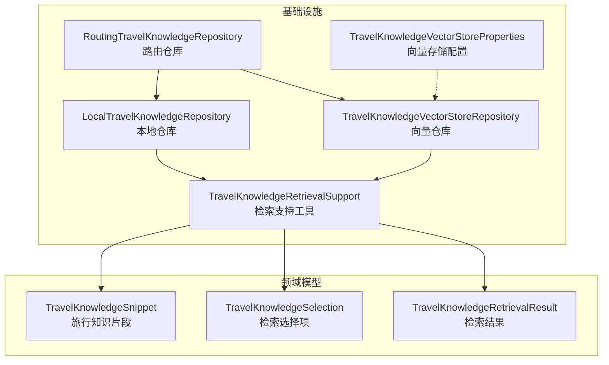
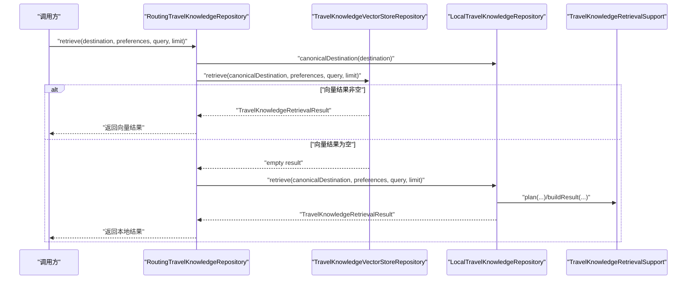
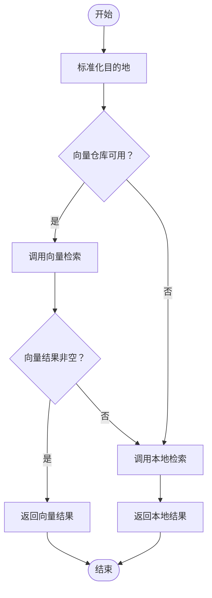
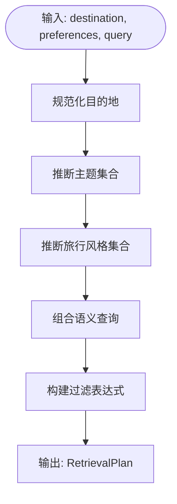
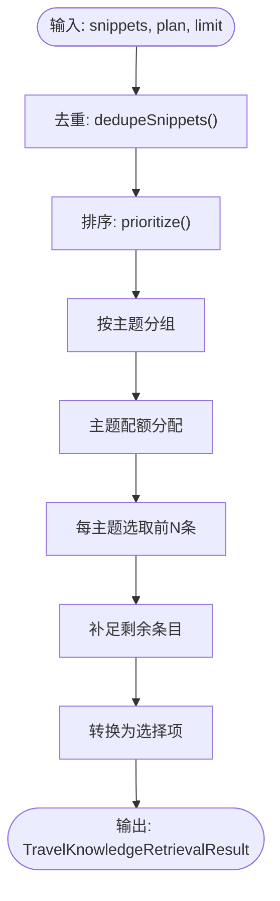
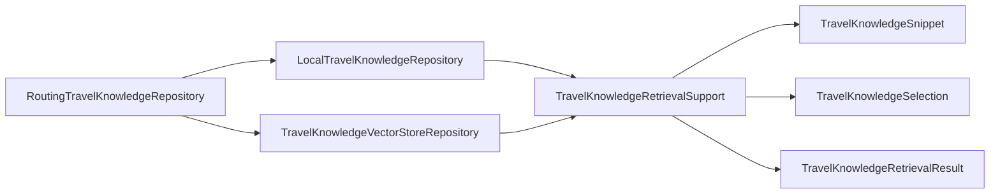

# 知识路由机制

<cite>
**本文引用的文件**
- [RoutingTravelKnowledgeRepository.java](file://travel-agent-infrastructure/src/main/java/com/travalagent/infrastructure/repository/RoutingTravelKnowledgeRepository.java)
- [LocalTravelKnowledgeRepository.java](file://travel-agent-infrastructure/src/main/java/com/travalagent/infrastructure/repository/LocalTravelKnowledgeRepository.java)
- [TravelKnowledgeVectorStoreRepository.java](file://travel-agent-infrastructure/src/main/java/com/travalagent/infrastructure/repository/TravelKnowledgeVectorStoreRepository.java)
- [TravelKnowledgeRetrievalSupport.java](file://travel-agent-infrastructure/src/main/java/com/travalagent/infrastructure/repository/TravelKnowledgeRetrievalSupport.java)
- [TravelKnowledgeRetrievalResult.java](file://travel-agent-domain/src/main/java/com/travalagent/domain/model/valobj/TravelKnowledgeRetrievalResult.java)
- [TravelKnowledgeSelection.java](file://travel-agent-domain/src/main/java/com/travalagent/domain/model/valobj/TravelKnowledgeSelection.java)
- [TravelKnowledgeSnippet.java](file://travel-agent-domain/src/main/java/com/travalagent/domain/model/valobj/TravelKnowledgeSnippet.java)
- [TravelKnowledgeVectorStoreProperties.java](file://travel-agent-infrastructure/src/main/java/com/travalagent/infrastructure/config/TravelKnowledgeVectorStoreProperties.java)
- [knowledge-rag.md](file://docs/knowledge-rag.md)
- [system-architecture.md](file://docs/system-architecture.md)
- [RoutingTravelKnowledgeRepositoryTest.java](file://travel-agent-infrastructure/src/test/java/com/travalagent/infrastructure/repository/RoutingTravelKnowledgeRepositoryTest.java)
</cite>

## 目录
1. [引言](#引言)
2. [项目结构](#项目结构)
3. [核心组件](#核心组件)
4. [架构总览](#架构总览)
5. [详细组件分析](#详细组件分析)
6. [依赖分析](#依赖分析)
7. [性能考虑](#性能考虑)
8. [故障排查指南](#故障排查指南)
9. [结论](#结论)
10. [附录](#附录)

## 引言
本文件系统性阐述旅行知识路由机制，重点围绕 RoutingTravelKnowledgeRepository 的智能选择策略、检索计划（RetrievalPlan）生成逻辑、多源知识融合与去重排序、以及检索支持工具类的设计与使用。文档同时提供路由决策示例、配置项说明与调优建议，帮助读者在不同场景下理解与优化检索性能。

## 项目结构
知识路由位于基础设施层，采用“向量检索优先 + 本地回退”的双轨策略，并通过统一的检索计划与结果构建器实现跨源一致性与可扩展性。

图表来源
- [RoutingTravelKnowledgeRepository.java:13-36](file://travel-agent-infrastructure/src/main/java/com/travalagent/infrastructure/repository/RoutingTravelKnowledgeRepository.java#L13-L36)
- [LocalTravelKnowledgeRepository.java:23-68](file://travel-agent-infrastructure/src/main/java/com/travalagent/infrastructure/repository/LocalTravelKnowledgeRepository.java#L23-L68)
- [TravelKnowledgeVectorStoreRepository.java:30-99](file://travel-agent-infrastructure/src/main/java/com/travalagent/infrastructure/repository/TravelKnowledgeVectorStoreRepository.java#L30-L99)
- [TravelKnowledgeRetrievalSupport.java:17-86](file://travel-agent-infrastructure/src/main/java/com/travalagent/infrastructure/repository/TravelKnowledgeRetrievalSupport.java#L17-L86)
- [TravelKnowledgeVectorStoreProperties.java:6-108](file://travel-agent-infrastructure/src/main/java/com/travalagent/infrastructure/config/TravelKnowledgeVectorStoreProperties.java#L6-L108)

章节来源
- [system-architecture.md:12-49](file://docs/system-architecture.md#L12-L49)

## 核心组件
- 路由仓库：统一入口，优先尝试向量检索，失败或空结果时回退到本地知识库；在委派前完成目的地别名标准化。
- 检索支持工具：负责检索计划生成、主题与风格推断、过滤表达式构建、结果去重与排序、质量评分与片段增强等。
- 结果模型：统一承载目的地、推断主题/风格、检索来源与最终选择项列表。
- 向量仓库：基于 Milvus 的语义检索，结合结构化过滤与二次筛选。
- 本地仓库：基于本地 JSON 数据集的词法匹配与评分，作为向量检索的可靠回退。

章节来源
- [RoutingTravelKnowledgeRepository.java:13-36](file://travel-agent-infrastructure/src/main/java/com/travalagent/infrastructure/repository/RoutingTravelKnowledgeRepository.java#L13-L36)
- [TravelKnowledgeRetrievalSupport.java:17-86](file://travel-agent-infrastructure/src/main/java/com/travalagent/infrastructure/repository/TravelKnowledgeRetrievalSupport.java#L17-L86)
- [TravelKnowledgeRetrievalResult.java:5-41](file://travel-agent-domain/src/main/java/com/travalagent/domain/model/valobj/TravelKnowledgeRetrievalResult.java#L5-L41)
- [TravelKnowledgeVectorStoreRepository.java:30-99](file://travel-agent-infrastructure/src/main/java/com/travalagent/infrastructure/repository/TravelKnowledgeVectorStoreRepository.java#L30-L99)
- [LocalTravelKnowledgeRepository.java:23-68](file://travel-agent-infrastructure/src/main/java/com/travalagent/infrastructure/repository/LocalTravelKnowledgeRepository.java#L23-L68)

## 架构总览
路由仓库在检索前先进行目的地标准化，随后按顺序尝试向量检索与本地检索。向量检索优先返回非空结果时直接使用；否则回退到本地仓库。两者均使用相同的检索计划与结果构建流程，确保跨源一致性与可比性。

图表来源
- [RoutingTravelKnowledgeRepository.java:27-36](file://travel-agent-infrastructure/src/main/java/com/travalagent/infrastructure/repository/RoutingTravelKnowledgeRepository.java#L27-L36)
- [LocalTravelKnowledgeRepository.java:50-68](file://travel-agent-infrastructure/src/main/java/com/travalagent/infrastructure/repository/LocalTravelKnowledgeRepository.java#L50-L68)
- [TravelKnowledgeVectorStoreRepository.java:68-99](file://travel-agent-infrastructure/src/main/java/com/travalagent/infrastructure/repository/TravelKnowledgeVectorStoreRepository.java#L68-L99)
- [TravelKnowledgeRetrievalSupport.java:79-86](file://travel-agent-infrastructure/src/main/java/com/travalagent/infrastructure/repository/TravelKnowledgeRetrievalSupport.java#L79-L86)

## 详细组件分析

### 路由仓库：智能选择策略
- 目的地标准化：在委派前调用本地仓库的别名解析方法，将“杭州”等别名映射为“Hangzhou”，保证跨源一致。
- 优先级策略：若向量仓库可用且返回非空结果，则直接采用；否则回退到本地仓库。
- 容错与可选：当向量仓库不可用时，构造器通过 ObjectProvider 获取，避免启动失败。

图表来源
- [RoutingTravelKnowledgeRepository.java:27-36](file://travel-agent-infrastructure/src/main/java/com/travalagent/infrastructure/repository/RoutingTravelKnowledgeRepository.java#L27-L36)
- [LocalTravelKnowledgeRepository.java:43-48](file://travel-agent-infrastructure/src/main/java/com/travalagent/infrastructure/repository/LocalTravelKnowledgeRepository.java#L43-L48)

章节来源
- [RoutingTravelKnowledgeRepository.java:13-36](file://travel-agent-infrastructure/src/main/java/com/travalagent/infrastructure/repository/RoutingTravelKnowledgeRepository.java#L13-L36)
- [RoutingTravelKnowledgeRepositoryTest.java:18-80](file://travel-agent-infrastructure/src/test/java/com/travalagent/infrastructure/repository/RoutingTravelKnowledgeRepositoryTest.java#L18-L80)

### 检索计划（RetrievalPlan）生成逻辑
检索计划由检索支持工具统一生成，包含以下要素：
- 目的地规范化：去除多余字符与大小写差异，支持城市别名匹配。
- 主题推断：从用户查询与偏好中抽取关键词，映射到六类主题；若均未命中，默认推断“scenic”“food”。
- 查询重组：将目的地、查询与偏好拼接为语义查询文本。
- 过滤表达式：构建结构化过滤条件，强制目的地与主题约束，提升召回准确性与性能。

图表来源
- [TravelKnowledgeRetrievalSupport.java:79-86](file://travel-agent-infrastructure/src/main/java/com/travalagent/infrastructure/repository/TravelKnowledgeRetrievalSupport.java#L79-L86)
- [TravelKnowledgeRetrievalSupport.java:234-257](file://travel-agent-infrastructure/src/main/java/com/travalagent/infrastructure/repository/TravelKnowledgeRetrievalSupport.java#L234-L257)
- [TravelKnowledgeRetrievalSupport.java:598-615](file://travel-agent-infrastructure/src/main/java/com/travalagent/infrastructure/repository/TravelKnowledgeRetrievalSupport.java#L598-L615)

章节来源
- [TravelKnowledgeRetrievalSupport.java:79-86](file://travel-agent-infrastructure/src/main/java/com/travalagent/infrastructure/repository/TravelKnowledgeRetrievalSupport.java#L79-L86)
- [knowledge-rag.md:76-109](file://docs/knowledge-rag.md#L76-L109)

### 多源知识融合：结果合并、去重与排序
- 去重策略：基于“城市+主题+标题”的规范化键进行去重，确保跨源合并后不重复。
- 排序优化：先按片段增强后的质量分与领域偏好分排序，再按原始顺序作为次级排序依据。
- 主题分配：根据推断主题与目标数量，按优先级与目标配额分配每个主题的条目数，不足时循环补齐。
- 结果构建：将去重与排序后的片段转换为选择项，填充目的地与匹配主题字段，形成最终检索结果。

图表来源
- [TravelKnowledgeRetrievalSupport.java:187-232](file://travel-agent-infrastructure/src/main/java/com/travalagent/infrastructure/repository/TravelKnowledgeRetrievalSupport.java#L187-L232)
- [TravelKnowledgeRetrievalSupport.java:478-485](file://travel-agent-infrastructure/src/main/java/com/travalagent/infrastructure/repository/TravelKnowledgeRetrievalSupport.java#L478-L485)
- [TravelKnowledgeRetrievalSupport.java:462-476](file://travel-agent-infrastructure/src/main/java/com/travalagent/infrastructure/repository/TravelKnowledgeRetrievalSupport.java#L462-L476)
- [TravelKnowledgeRetrievalSupport.java:487-516](file://travel-agent-infrastructure/src/main/java/com/travalagent/infrastructure/repository/TravelKnowledgeRetrievalSupport.java#L487-L516)

章节来源
- [TravelKnowledgeRetrievalSupport.java:187-232](file://travel-agent-infrastructure/src/main/java/com/travalagent/infrastructure/repository/TravelKnowledgeRetrievalSupport.java#L187-L232)

### 检索支持工具类：匹配规则、评分函数与结果构建器
- 匹配规则
  - 目的地匹配：支持城市名与别名的规范化比较，模糊匹配同一城市的不同表达。
  - 主题匹配：将片段主题与推断主题集合进行规范化对比，允许空集合时全通过。
- 评分函数
  - 片段增强：自动推断 schema 子类型（如酒店区域、交通到达/枢纽）、质量分与旅行风格标签。
  - 领域偏好分：针对酒店区域、交通类型、美食集群等特征加权，结合查询词命中情况与旅行风格匹配度综合评分。
- 结果构建器
  - 统一输出 TravelKnowledgeRetrievalResult，包含目的地、推断主题/风格、检索来源与选择项列表。

章节来源
- [TravelKnowledgeRetrievalSupport.java:280-310](file://travel-agent-infrastructure/src/main/java/com/travalagent/infrastructure/repository/TravelKnowledgeRetrievalSupport.java#L280-L310)
- [TravelKnowledgeRetrievalSupport.java:97-123](file://travel-agent-infrastructure/src/main/java/com/travalagent/infrastructure/repository/TravelKnowledgeRetrievalSupport.java#L97-L123)
- [TravelKnowledgeRetrievalSupport.java:125-185](file://travel-agent-infrastructure/src/main/java/com/travalagent/infrastructure/repository/TravelKnowledgeRetrievalSupport.java#L125-L185)

### 向量检索仓库：语义搜索与过滤
- 语义查询：组合目的地、查询与偏好，扩大语义覆盖面。
- 搜索参数：topK 默认为 max(limit*6, 18)，兼顾召回与性能；相似度阈值为 0。
- 结构化过滤：在 Milvus 层面过滤 city 与 topic，Java 层再次过滤以确保严格一致性。
- 文档映射：将片段元数据映射为文档元信息，反序列化时恢复为片段对象。

章节来源
- [TravelKnowledgeVectorStoreRepository.java:68-99](file://travel-agent-infrastructure/src/main/java/com/travalagent/infrastructure/repository/TravelKnowledgeVectorStoreRepository.java#L68-L99)
- [knowledge-rag.md:97-109](file://docs/knowledge-rag.md#L97-L109)

### 本地回退仓库：词法匹配与评分
- 数据加载：优先使用清洗后的数据集，若不存在则回退到采集数据集；并进行去重合并。
- 过滤与评分：先按目的地与主题过滤，再对标题、内容、标签与旅行风格进行词法匹配与加权评分，最后与领域偏好分叠加。
- 结果构建：沿用统一构建器，确保与向量检索结果一致。

章节来源
- [LocalTravelKnowledgeRepository.java:122-164](file://travel-agent-infrastructure/src/main/java/com/travalagent/infrastructure/repository/LocalTravelKnowledgeRepository.java#L122-L164)
- [LocalTravelKnowledgeRepository.java:50-68](file://travel-agent-infrastructure/src/main/java/com/travalagent/infrastructure/repository/LocalTravelKnowledgeRepository.java#L50-L68)
- [knowledge-rag.md:111-119](file://docs/knowledge-rag.md#L111-L119)

### 路由决策示例
- 场景一：向量检索返回非空
  - 输入：目的地“杭州”，偏好“美食”，查询“杭州美食”，limit=3
  - 行为：路由仓库标准化目的地为“Hangzhou”，优先调用向量检索；若返回非空则直接返回，检索来源标记为“vector-store”
- 场景二：向量检索为空或不可用
  - 输入：相同参数
  - 行为：路由仓库回退到本地检索；本地检索返回非空则返回，检索来源标记为“local-fallback”
- 场景三：目的地别名解析
  - 输入：目的地“杭州”，偏好“美食”，查询“杭州美食”，limit=3
  - 行为：本地仓库先将“杭州”解析为“Hangzhou”，再进行检索；向量仓库接收标准化后的查询

章节来源
- [RoutingTravelKnowledgeRepositoryTest.java:18-80](file://travel-agent-infrastructure/src/test/java/com/travalagent/infrastructure/repository/RoutingTravelKnowledgeRepositoryTest.java#L18-L80)

## 依赖分析
- 路由仓库依赖本地仓库进行目的地标准化与回退；向量仓库通过 ObjectProvider 可选注入，避免启动期强依赖。
- 检索支持工具为纯静态工具类，被本地与向量仓库共享，确保检索计划与结果构建的一致性。
- 结果模型与片段模型定义清晰，贯穿所有仓库与工具，降低耦合度。

图表来源
- [RoutingTravelKnowledgeRepository.java:15-24](file://travel-agent-infrastructure/src/main/java/com/travalagent/infrastructure/repository/RoutingTravelKnowledgeRepository.java#L15-L24)
- [LocalTravelKnowledgeRepository.java:34-37](file://travel-agent-infrastructure/src/main/java/com/travalagent/infrastructure/repository/LocalTravelKnowledgeRepository.java#L34-L37)
- [TravelKnowledgeVectorStoreRepository.java:37-47](file://travel-agent-infrastructure/src/main/java/com/travalagent/infrastructure/repository/TravelKnowledgeVectorStoreRepository.java#L37-L47)
- [TravelKnowledgeRetrievalSupport.java:17](file://travel-agent-infrastructure/src/main/java/com/travalagent/infrastructure/repository/TravelKnowledgeRetrievalSupport.java#L17)

## 性能考虑
- 向量检索
  - topK 设置为 max(limit*6, 18)，在召回与性能间取得平衡；结构化过滤在 Milvus 层先行过滤，减少后续处理量。
  - 若 Milvus 不可用，路由仓库会自动回退到本地检索，保障服务连续性。
- 本地检索
  - 使用词法匹配与加权评分，避免复杂嵌入计算；在小规模本地数据上具备低延迟优势。
- 结果构建
  - 去重与排序在内存中完成，注意 limit 较大时的内存占用；可通过合理设置 limit 控制输出规模。

章节来源
- [TravelKnowledgeVectorStoreRepository.java:74-80](file://travel-agent-infrastructure/src/main/java/com/travalagent/infrastructure/repository/TravelKnowledgeVectorStoreRepository.java#L74-L80)
- [knowledge-rag.md:101-109](file://docs/knowledge-rag.md#L101-L109)

## 故障排查指南
- 向量检索为空
  - 检查检索计划是否正确生成（目的地、主题、过滤表达式），确认查询与偏好是否足够明确。
  - 确认 Milvus 集合存在且已初始化；必要时检查索引类型与度量方式配置。
- 目的地别名未生效
  - 确认本地仓库的 canonicalDestination 是否被正确调用；检查城市别名表构建逻辑。
- 结果重复或顺序异常
  - 检查去重键生成逻辑与主题分配策略；确认排序时的次级顺序是否影响预期。
- 配置问题
  - 检查向量存储属性（数据库名、集合名、索引类型、度量类型、维度等）是否与 Milvus 实例一致。

章节来源
- [TravelKnowledgeVectorStoreProperties.java:6-108](file://travel-agent-infrastructure/src/main/java/com/travalagent/infrastructure/config/TravelKnowledgeVectorStoreProperties.java#L6-L108)
- [LocalTravelKnowledgeRepository.java:189-202](file://travel-agent-infrastructure/src/main/java/com/travalagent/infrastructure/repository/LocalTravelKnowledgeRepository.java#L189-L202)
- [TravelKnowledgeRetrievalSupport.java:328-331](file://travel-agent-infrastructure/src/main/java/com/travalagent/infrastructure/repository/TravelKnowledgeRetrievalSupport.java#L328-L331)

## 结论
该知识路由机制通过“向量检索优先 + 本地回退”的策略，在保证检索准确性的同时兼顾性能与稳定性。统一的检索计划与结果构建器确保了跨源一致性，而目的地标准化与主题推断进一步提升了召回质量。通过合理的配置与调优，可在不同场景下获得稳定的检索表现。

## 附录

### 配置选项与调优建议
- 向量存储配置（TravelKnowledgeVectorStoreProperties）
  - enabled：启用/禁用向量检索
  - uri：Milvus 服务地址
  - databaseName：数据库名
  - collectionName：集合名
  - embeddingDimension：嵌入维度
  - initializeSchema：是否初始化集合结构
  - indexType：索引类型（如 IVF_FLAT）
  - metricType：距离度量（如 COSINE）
  - indexParameters：索引参数（如 nlist）

- 调优建议
  - 当查询较为宽泛时，适当提高 limit 并在前端做二次筛选；向量检索的 topK 已默认放大，避免过早截断。
  - 对于特定主题（如酒店区域、交通枢纽）的查询，尽量在偏好中明确表达，以提升主题推断与子类型识别的准确性。
  - 在数据规模较大时，优先启用向量检索并确保 Milvus 正常运行；本地回退适合小规模或离线环境。

章节来源
- [TravelKnowledgeVectorStoreProperties.java:6-108](file://travel-agent-infrastructure/src/main/java/com/travalagent/infrastructure/config/TravelKnowledgeVectorStoreProperties.java#L6-L108)
- [knowledge-rag.md:130-137](file://docs/knowledge-rag.md#L130-L137)