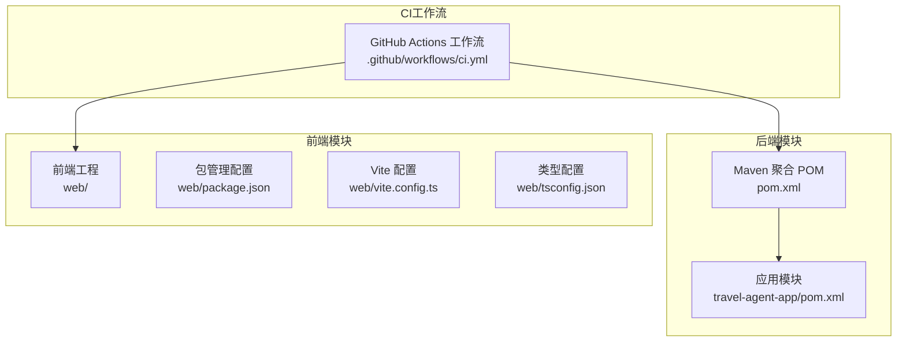
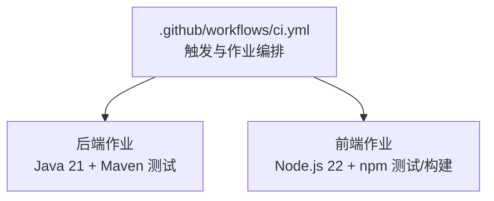
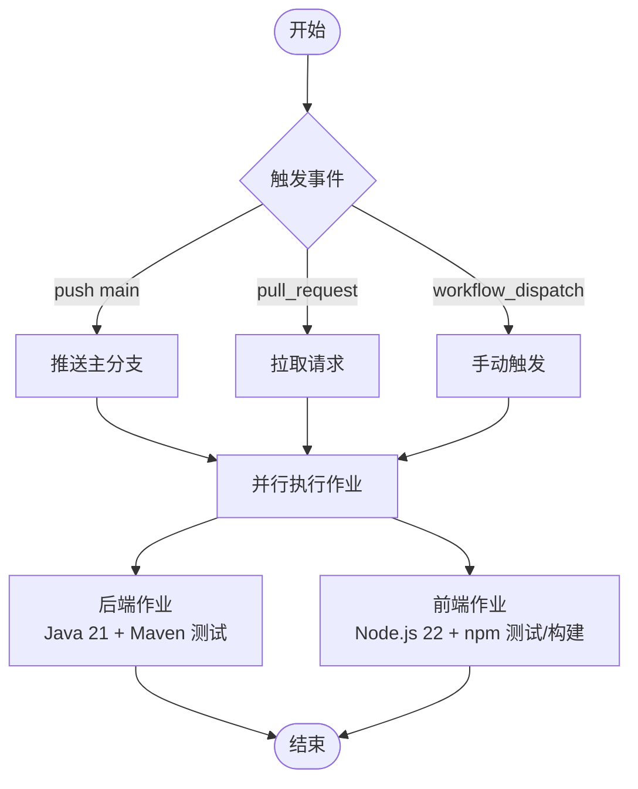
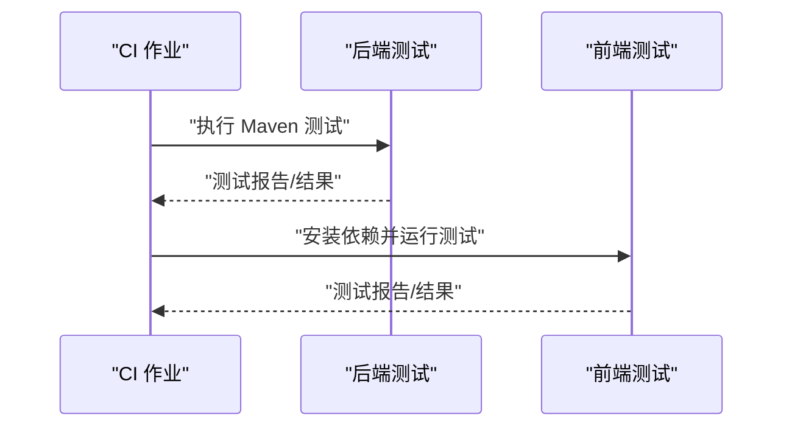
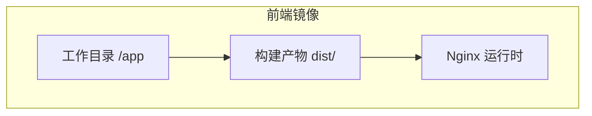
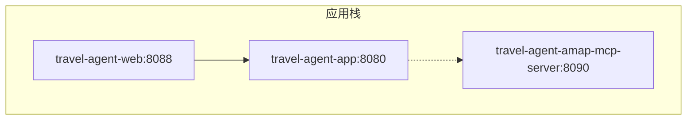
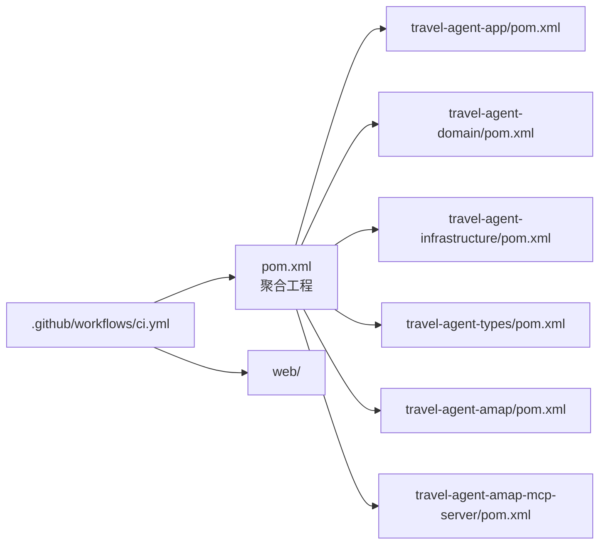

# CI/CD流水线

<cite>
**本文引用的文件**
- [.github/workflows/ci.yml](file://.github/workflows/ci.yml)
- [pom.xml](file://pom.xml)
- [travel-agent-app/pom.xml](file://travel-agent-app/pom.xml)
- [web/Dockerfile](file://web/Dockerfile)
- [docker-compose.app.yml](file://docker-compose.app.yml)
- [Dockerfile.mcp](file://Dockerfile.mcp)
- [docker-compose.milvus.yml](file://docker-compose.milvus.yml)
- [README.md](file://README.md)
- [CONTRIBUTING.md](file://CONTRIBUTING.md)
- [SECURITY.md](file://SECURITY.md)
- [web/package.json](file://web/package.json)
- [web/vite.config.ts](file://web/vite.config.ts)
- [web/tsconfig.json](file://web/tsconfig.json)
- [travel-agent-app/src/test/java/com/travalagent/app/controller/ConversationControllerTest.java](file://travel-agent-app/src/test/java/com/travalagent/app/controller/ConversationControllerTest.java)
- [travel-agent-app/src/test/java/com/travalagent/app/integration/TravelAgentSmokeIntegrationTest.java](file://travel-agent-app/src/test/java/com/travalagent/app/integration/TravelAgentSmokeIntegrationTest.java)
</cite>

## 目录
1. [简介](#简介)
2. [项目结构](#项目结构)
3. [核心组件](#核心组件)
4. [架构总览](#架构总览)
5. [详细组件分析](#详细组件分析)
6. [依赖关系分析](#依赖关系分析)
7. [性能考虑](#性能考虑)
8. [故障排查指南](#故障排查指南)
9. [结论](#结论)
10. [附录](#附录)

## 简介
本指南面向CI/CD流水线的配置与管理，基于仓库现有的GitHub Actions工作流与构建脚本，系统化梳理以下主题：
- 触发条件与分支策略：push主分支、拉取请求、手动触发
- 并行执行与矩阵策略：后端与前端并行作业
- 自动化测试：单元测试、集成测试与前端测试
- 代码质量与安全：依赖漏洞扫描、静态分析与密钥防护
- 构建产物与发布：Docker镜像构建、版本标签与制品库
- 部署自动化：本地容器编排与多环境部署思路
- 监控与通知：健康检查、可观测性与审计日志

## 项目结构
该仓库采用多模块Maven聚合工程，包含后端应用、领域层、基础设施层、Amap网关、MCP服务器以及Vue前端。CI工作流在根目录的GitHub Actions中定义，分别对后端与前端执行测试与构建。

**图表来源**
- [.github/workflows/ci.yml:1-60](file://.github/workflows/ci.yml#L1-L60)
- [pom.xml:22-29](file://pom.xml#L22-L29)
- [travel-agent-app/pom.xml:1-78](file://travel-agent-app/pom.xml#L1-L78)
- [web/package.json:1-26](file://web/package.json#L1-L26)
- [web/vite.config.ts:1-19](file://web/vite.config.ts#L1-L19)
- [web/tsconfig.json:1-17](file://web/tsconfig.json#L1-L17)

**章节来源**
- [.github/workflows/ci.yml:1-60](file://.github/workflows/ci.yml#L1-L60)
- [pom.xml:1-58](file://pom.xml#L1-L58)
- [README.md:230-235](file://README.md#L230-L235)

## 核心组件
- 触发器与权限
  - 推送至主分支、拉取请求、手动触发
  - 默认读取权限，便于下载构件或访问仓库内容
- 后端作业
  - 设置Java 21（Temurin），启用Maven缓存
  - 执行Maven测试命令
- 前端作业
  - 设置Node.js 22（含npm缓存）
  - 安装依赖（npm ci）
  - 运行测试与构建

上述行为直接来源于工作流定义与项目构建配置。

**章节来源**
- [.github/workflows/ci.yml:3-60](file://.github/workflows/ci.yml#L3-L60)
- [pom.xml:31-36](file://pom.xml#L31-L36)
- [web/package.json:6-11](file://web/package.json#L6-L11)

## 架构总览
下图展示CI流水线在仓库中的位置与职责边界，并映射到实际文件：

**图表来源**
- [.github/workflows/ci.yml:13-60](file://.github/workflows/ci.yml#L13-L60)

**章节来源**
- [.github/workflows/ci.yml:1-60](file://.github/workflows/ci.yml#L1-L60)

## 详细组件分析

### GitHub Actions 工作流配置
- 触发条件
  - push到main分支
  - pull_request事件
  - workflow_dispatch手动触发
- 权限
  - 默认contents: read
- 作业
  - 后端作业：ubuntu-latest运行，使用actions/checkout与actions/setup-java，执行Maven测试
  - 前端作业：ubuntu-latest运行，设置默认工作目录为web，使用actions/setup-node，执行npm ci、测试与构建

**图表来源**
- [.github/workflows/ci.yml:3-60](file://.github/workflows/ci.yml#L3-L60)

**章节来源**
- [.github/workflows/ci.yml:1-60](file://.github/workflows/ci.yml#L1-L60)

### 并行执行与矩阵策略
- 当前实现
  - 后端与前端作为独立作业并行运行
- 矩阵策略建议
  - 按操作系统矩阵（ubuntu-latest、windows-latest、macOS-latest）扩展后端测试
  - 按Node版本矩阵（如20.x、22.x）扩展前端测试
  - 按Java版本矩阵（21、17）扩展后端测试
- 并行优化
  - 使用needs/strategy/fail-fast控制依赖与失败策略
  - 将构建产物上传为Artifacts供下游作业复用

**章节来源**
- [.github/workflows/ci.yml:13-60](file://.github/workflows/ci.yml#L13-L60)

### 自动化测试流程
- 单元测试
  - 后端：Maven测试命令覆盖各模块
  - 前端：Vitest运行单元测试
- 集成测试
  - 后端包含随机端口启动的集成测试，验证Actuator健康与聊天接口返回结构化旅行计划
- 端到端测试
  - 建议在CI中新增浏览器测试（如Playwright/Cypress），在容器化环境中运行前端与后端联调

**图表来源**
- [.github/workflows/ci.yml:31-56](file://.github/workflows/ci.yml#L31-L56)
- [travel-agent-app/src/test/java/com/travalagent/app/integration/TravelAgentSmokeIntegrationTest.java:60-92](file://travel-agent-app/src/test/java/com/travalagent/app/integration/TravelAgentSmokeIntegrationTest.java#L60-L92)
- [web/package.json:9-9](file://web/package.json#L9-L9)

**章节来源**
- [travel-agent-app/src/test/java/com/travalagent/app/controller/ConversationControllerTest.java:34-180](file://travel-agent-app/src/test/java/com/travalagent/app/controller/ConversationControllerTest.java#L34-L180)
- [travel-agent-app/src/test/java/com/travalagent/app/integration/TravelAgentSmokeIntegrationTest.java:60-92](file://travel-agent-app/src/test/java/com/travalagent/app/integration/TravelAgentSmokeIntegrationTest.java#L60-L92)
- [web/package.json:9-9](file://web/package.json#L9-L9)

### 代码质量检查与安全扫描
- 依赖漏洞扫描
  - 建议在CI中集成依赖扫描工具（如OWASP Dependency-Check、Snyk、GitHub Dependabot）
- 静态代码分析
  - 后端：可引入SpotBugs、Checkstyle、Spotless等插件
  - 前端：可引入ESLint、TypeScript类型检查（已由web/tsconfig.json与vue-tsc支持）
- 密钥与敏感信息
  - 严格遵循安全策略，禁止提交密钥；使用GitHub Secrets传递机密
  - 参考项目安全文档中的密钥处理与披露规范

**章节来源**
- [SECURITY.md:29-58](file://SECURITY.md#L29-L58)
- [web/tsconfig.json:1-17](file://web/tsconfig.json#L1-L17)
- [web/package.json:16-25](file://web/package.json#L16-L25)

### 构建产物与发布策略
- Docker镜像构建
  - 前端镜像：基于Nginx，构建阶段复制dist目录
  - MCP服务镜像：基于Maven构建后JRE运行
  - 应用栈：通过docker-compose编排应用、MCP与Web服务
- 版本标签管理
  - 建议使用语义化版本（SemVer），结合Git标签与CI变量进行镜像tag命名
- 制品库配置
  - 建议将Docker镜像推送到容器镜像仓库（如Docker Hub、GHCR），并开启自动扫描

**图表来源**
- [web/Dockerfile:16-22](file://web/Dockerfile#L16-L22)

**章节来源**
- [web/Dockerfile:1-22](file://web/Dockerfile#L1-L22)
- [Dockerfile.mcp:1-28](file://Dockerfile.mcp#L1-L28)
- [docker-compose.app.yml:1-62](file://docker-compose.app.yml#L1-L62)

### 部署自动化配置
- 多环境部署
  - 通过环境变量切换配置文件与功能开关（如生产配置、MCP启用、Milvus开关）
- 蓝绿/金丝雀发布
  - 建议在Kubernetes或容器编排平台中实施滚动更新与流量切分
- 本地容器编排
  - 使用docker-compose组合应用、MCP与Web服务，便于本地联调与演示

**图表来源**
- [docker-compose.app.yml:1-62](file://docker-compose.app.yml#L1-L62)

**章节来源**
- [docker-compose.app.yml:1-62](file://docker-compose.app.yml#L1-L62)
- [docker-compose.milvus.yml:1-64](file://docker-compose.milvus.yml#L1-L64)

### 流水线监控与通知
- 健康检查
  - 后端集成测试验证Actuator健康端点
- 性能指标
  - 后端已引入Micrometer与OpenTelemetry桥接，可在CI中采集遥测数据
- 审计日志
  - 建议在CI中记录关键步骤耗时与Artifacts元数据，便于回溯
- 通知
  - 可在工作流中集成邮件、Slack或Teams通知，失败时自动告警

**章节来源**
- [travel-agent-app/pom.xml:47-53](file://travel-agent-app/pom.xml#L47-L53)
- [travel-agent-app/src/test/java/com/travalagent/app/integration/TravelAgentSmokeIntegrationTest.java:61-68](file://travel-agent-app/src/test/java/com/travalagent/app/integration/TravelAgentSmokeIntegrationTest.java#L61-L68)

## 依赖关系分析
- Maven聚合工程组织后端模块，应用模块依赖领域与基础设施模块
- 前端通过npm脚本驱动测试与构建
- CI工作流并行执行后端与前端作业

**图表来源**
- [pom.xml:22-29](file://pom.xml#L22-L29)
- [travel-agent-app/pom.xml:16-31](file://travel-agent-app/pom.xml#L16-L31)
- [.github/workflows/ci.yml:13-60](file://.github/workflows/ci.yml#L13-L60)

**章节来源**
- [pom.xml:22-29](file://pom.xml#L22-L29)
- [travel-agent-app/pom.xml:16-31](file://travel-agent-app/pom.xml#L16-L31)
- [.github/workflows/ci.yml:13-60](file://.github/workflows/ci.yml#L13-L60)

## 性能考虑
- 并行化
  - 后端与前端并行执行，缩短整体流水线时间
- 缓存利用
  - Maven与npm缓存减少重复下载
- 构建优化
  - 前端构建使用生产模式，避免开发依赖进入产物
- 资源隔离
  - 在容器内运行测试，确保环境一致性

[本节为通用指导，无需列出具体文件来源]

## 故障排查指南
- 触发未生效
  - 检查分支保护规则与工作流文件语法
- Java/Node版本不匹配
  - 确认工作流中设置的版本与项目属性一致
- 测试失败
  - 查看后端与前端测试报告；集成测试关注Actuator健康与接口响应结构
- 密钥泄露风险
  - 严格遵守安全策略，使用Secrets管理密钥

**章节来源**
- [.github/workflows/ci.yml:21-26](file://.github/workflows/ci.yml#L21-L26)
- [web/package.json:6-11](file://web/package.json#L6-L11)
- [SECURITY.md:29-58](file://SECURITY.md#L29-L58)
- [travel-agent-app/src/test/java/com/travalagent/app/integration/TravelAgentSmokeIntegrationTest.java:61-92](file://travel-agent-app/src/test/java/com/travalagent/app/integration/TravelAgentSmokeIntegrationTest.java#L61-L92)

## 结论
本指南基于现有CI配置，提供了从触发、并行执行、测试、质量与安全、构建与发布到部署与监控的完整实践路径。建议在现有基础上逐步引入矩阵策略、静态分析、依赖扫描与容器镜像制品库，以进一步提升稳定性与可维护性。

[本节为总结性内容，无需列出具体文件来源]

## 附录
- 常用命令参考
  - 后端测试与打包：见贡献指南与README中的常用命令
  - 前端测试与构建：见web/package.json脚本

**章节来源**
- [CONTRIBUTING.md:43-56](file://CONTRIBUTING.md#L43-L56)
- [README.md:216-226](file://README.md#L216-L226)
- [web/package.json:6-11](file://web/package.json#L6-L11)