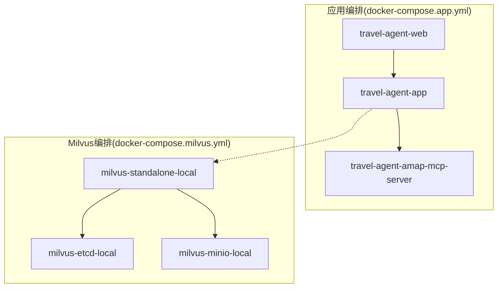
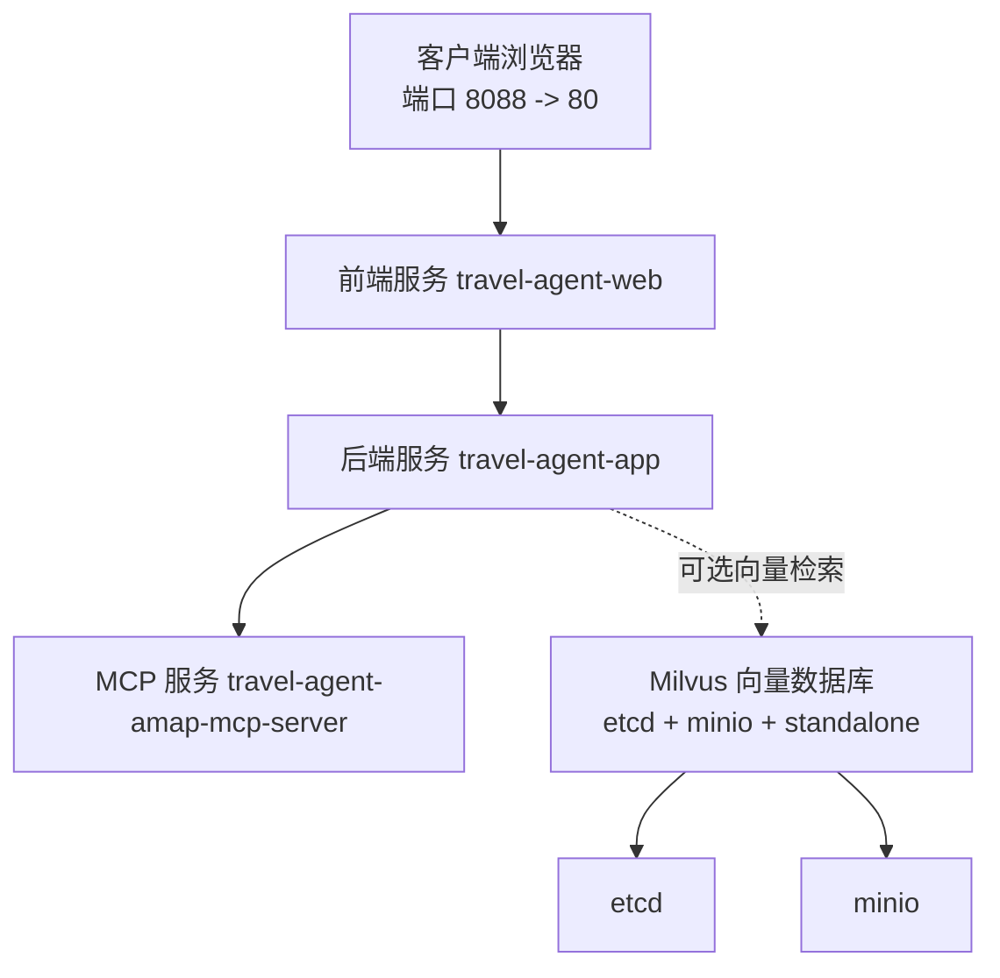
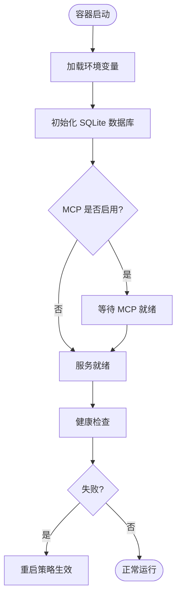
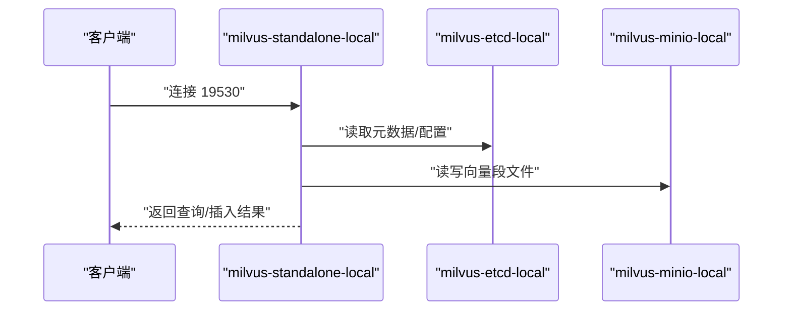
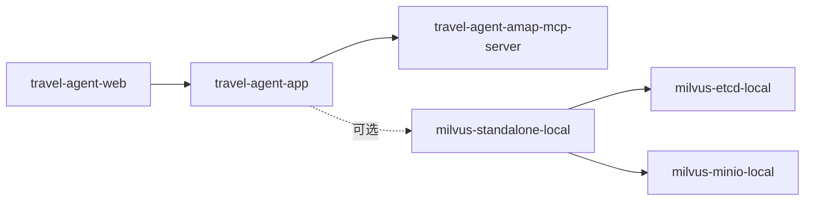

# Docker Compose编排

<cite>
**本文引用的文件**
- [docker-compose.app.yml](file://docker-compose.app.yml)
- [docker-compose.milvus.yml](file://docker-compose.milvus.yml)
- [README.md](file://README.md)
- [docs/operations.md](file://docs/operations.md)
- [docs/system-architecture.md](file://docs/system-architecture.md)
- [.env.travel-agent.example](file://.env.travel-agent.example)
- [web/.env.example](file://web/.env.example)
- [web/Dockerfile](file://web/Dockerfile)
- [travel-agent-app/src/main/resources/application.yml](file://travel-agent-app/src/main/resources/application.yml)
- [travel-agent-amap-mcp-server/src/main/resources/application.yml](file://travel-agent-amap-mcp-server/src/main/resources/application.yml)
</cite>

## 目录
1. [简介](#简介)
2. [项目结构](#项目结构)
3. [核心组件](#核心组件)
4. [架构总览](#架构总览)
5. [详细组件分析](#详细组件分析)
6. [依赖关系分析](#依赖关系分析)
7. [性能与资源考量](#性能与资源考量)
8. [故障排查指南](#故障排查指南)
9. [结论](#结论)
10. [附录：多环境配置与最佳实践](#附录多环境配置与最佳实践)

## 简介
本指南围绕 TravelAgent 的 Docker Compose 编排进行系统化说明，覆盖应用服务（后端、前端、可选 MCP 辅助服务）与 Milvus 向量数据库的独立编排，重点包括：
- 服务定义、网络与数据卷管理
- 服务间依赖与启动顺序、健康检查与重启策略
- Milvus 的资源限制、存储与集群设置
- 多环境配置策略（开发/测试/生产）
- 服务发现、负载均衡与故障转移建议
- 常用编排命令与常见问题解决

## 项目结构
本仓库采用多模块 Maven 工程，配合 Docker Compose 进行本地与开发环境编排。关键编排文件与职责如下：
- 应用编排：docker-compose.app.yml
  - 定义 travel-agent-app、travel-agent-amap-mcp-server、travel-agent-web 三个服务
  - 暴露端口、挂载数据卷、设置环境变量、定义依赖与重启策略
- Milvus 编排：docker-compose.milvus.yml
  - 定义 etcd、minio、milvus-standalone 三类服务，含健康检查与持久化卷
- 配置参考：
  - .env.travel-agent.example 提供环境变量模板
  - web/.env.example 提供前端 API 基础地址示例
  - 各模块 application.yml 提供运行期配置项映射

图表来源
- [docker-compose.app.yml:1-62](file://docker-compose.app.yml#L1-L62)
- [docker-compose.milvus.yml:1-64](file://docker-compose.milvus.yml#L1-L64)

章节来源
- [docker-compose.app.yml:1-62](file://docker-compose.app.yml#L1-L62)
- [docker-compose.milvus.yml:1-64](file://docker-compose.milvus.yml#L1-L64)
- [.env.travel-agent.example:1-50](file://.env.travel-agent.example#L1-L50)
- [web/.env.example:1-2](file://web/.env.example#L1-L2)

## 核心组件
- 应用服务
  - travel-agent-app：后端服务，使用 Spring Boot，暴露 8080 端口；挂载 ./data 至 /app/data；依赖 MCP 服务；重启策略为 unless-stopped。
  - travel-agent-amap-mcp-server：可选 MCP 辅助服务，端口 8090；仅在 profile=mcp 时启用；重启策略 unless-stopped。
  - travel-agent-web：前端静态站点，基于 Nginx，暴露 80 端口并通过 8088 映射到宿主；依赖后端服务；重启策略 unless-stopped。
- Milvus 组件
  - etcd：键值存储，持久化至 ./data/milvus/etcd；健康检查通过 etcdctl。
  - minio：对象存储，持久化至 ./data/milvus/minio；健康检查通过 curl。
  - milvus-standalone：向量数据库，持久化至 ./data/milvus/data；健康检查通过 curl；依赖 etcd 与 minio。

章节来源
- [docker-compose.app.yml:2-62](file://docker-compose.app.yml#L2-L62)
- [docker-compose.milvus.yml:4-64](file://docker-compose.milvus.yml#L4-L64)

## 架构总览
下图展示应用与 Milvus 的整体交互关系，以及服务间的依赖与数据流向。

图表来源
- [docker-compose.app.yml:2-62](file://docker-compose.app.yml#L2-L62)
- [docker-compose.milvus.yml:4-64](file://docker-compose.milvus.yml#L4-L64)

## 详细组件分析

### 后端服务（travel-agent-app）
- 作用：提供 REST API、SSE 流、工作流编排与健康检查；默认端口 8080；挂载 ./data 以持久化 SQLite 数据库与导出目录。
- 环境变量要点：
  - OpenAI 相关：API Key、Base URL、模型名等
  - 工具提供方：LOCAL 或 MCP
  - 允许的跨域来源
  - 向量内存与知识向量开关及连接参数（默认指向本地 Milvus）
- 依赖与启动顺序：依赖 MCP 服务；通过 depends_on 控制启动顺序。
- 重启策略：unless-stopped。

图表来源
- [docker-compose.app.yml:6-32](file://docker-compose.app.yml#L6-L32)
- [travel-agent-app/src/main/resources/application.yml:71-100](file://travel-agent-app/src/main/resources/application.yml#L71-L100)

章节来源
- [docker-compose.app.yml:2-32](file://docker-compose.app.yml#L2-L32)
- [travel-agent-app/src/main/resources/application.yml:1-100](file://travel-agent-app/src/main/resources/application.yml#L1-L100)

### MCP 辅助服务（travel-agent-amap-mcp-server）
- 作用：提供 Amap 工具链的 MCP 协议服务，端口 8090；仅在 profile=mcp 时启用。
- 环境变量要点：Amap API Key、Base URL、MCP 端点路径等。
- 重启策略：unless-stopped。

章节来源
- [docker-compose.app.yml:36-49](file://docker-compose.app.yml#L36-L49)
- [travel-agent-amap-mcp-server/src/main/resources/application.yml:1-35](file://travel-agent-amap-mcp-server/src/main/resources/application.yml#L1-L35)

### 前端服务（travel-agent-web）
- 作用：构建后的静态站点，通过 Nginx 提供；默认对外暴露 80 端口；通过 8088 映射到宿主。
- 环境变量要点：前端侧高德 Web Key 与安全 JS Code，通过构建参数注入。
- 依赖与启动顺序：依赖后端服务；通过 depends_on 控制启动顺序。
- 重启策略：unless-stopped。

章节来源
- [docker-compose.app.yml:50-62](file://docker-compose.app.yml#L50-L62)
- [web/Dockerfile:1-22](file://web/Dockerfile#L1-L22)
- [web/.env.example:1-2](file://web/.env.example#L1-L2)

### Milvus 向量数据库（独立编排）
- 服务组成：
  - etcd：键值存储，持久化卷 ./data/milvus/etcd；健康检查通过 etcdctl。
  - minio：对象存储，持久化卷 ./data/milvus/minio；健康检查通过 curl。
  - milvus-standalone：持久化卷 ./data/milvus/data；健康检查通过 curl；依赖 etcd 与 minio。
- 网络：默认网络名为 milvus-local，便于服务内通信。
- 端口映射：19530（客户端）、9091（健康检查）。

图表来源
- [docker-compose.milvus.yml:4-64](file://docker-compose.milvus.yml#L4-L64)

章节来源
- [docker-compose.milvus.yml:4-64](file://docker-compose.milvus.yml#L4-L64)

## 依赖关系分析
- 应用层依赖
  - travel-agent-app 依赖 travel-agent-amap-mcp-server（当工具提供方为 MCP 时）
  - travel-agent-web 依赖 travel-agent-app
- 存储层依赖
  - milvus-standalone 依赖 etcd 与 minio
- 数据卷与持久化
  - 应用：./data 挂载至 /app/data（后端），用于 SQLite 与导出目录
  - Milvus：etcd、minio、milvus 各自持久化目录
- 网络
  - 应用编排默认网络；Milvus 编排使用自定义网络 milvus-local

图表来源
- [docker-compose.app.yml:33-62](file://docker-compose.app.yml#L33-L62)
- [docker-compose.milvus.yml:57-64](file://docker-compose.milvus.yml#L57-L64)

章节来源
- [docker-compose.app.yml:33-62](file://docker-compose.app.yml#L33-L62)
- [docker-compose.milvus.yml:57-64](file://docker-compose.milvus.yml#L57-L64)

## 性能与资源考量
- 启动顺序与健康检查
  - 应用服务通过 depends_on 保证 MCP 优先启动；Milvus 通过健康检查确保 etcd 与 minio 就绪后再启动 standalone。
- 重启策略
  - unless-stopped 保证非人为停止的服务在异常退出后自动恢复。
- 资源限制
  - 当前编排未显式设置 CPU/内存限制；建议在生产或资源受限环境中为各服务添加 limits/requests。
- 存储与 IO
  - Milvus 的 etcd、minio、milvus 数据目录均使用持久化卷，建议在生产环境配置合适的磁盘与快照策略。
- 端口与网络
  - 建议在生产环境使用反向代理统一入口，结合 TLS 与 WAF；避免直接暴露 19530、9091 等端口于公网。

[本节为通用指导，不直接分析具体文件]

## 故障排查指南
- 健康检查失败
  - Milvus：检查 etcd 与 minio 的健康检查是否通过；确认持久化卷权限与空间充足。
  - 应用：查看后端日志与健康端点输出，确认 MCP 可达性与配置正确。
- 端口冲突
  - 若 8080、8088、8090、19530、9091 等端口被占用，请调整映射或释放端口。
- 数据丢失或损坏
  - 检查 ./data 与 ./data/milvus 下的数据卷是否正确挂载；必要时备份并重建容器。
- 环境变量错误
  - 确认 .env.travel-agent 文件已创建并包含必要的 API Key、Base URL、模型名等；前端 API 基础地址需与后端一致。

章节来源
- [docker-compose.milvus.yml:15-53](file://docker-compose.milvus.yml#L15-L53)
- [docs/operations.md:1-78](file://docs/operations.md#L1-L78)
- [.env.travel-agent.example:1-50](file://.env.travel-agent.example#L1-L50)

## 结论
本指南梳理了 TravelAgent 在 Docker Compose 下的应用与 Milvus 编排方案，明确了服务定义、依赖与启动顺序、健康检查与重启策略、数据卷与网络配置。结合多环境配置模板与常见问题排查建议，可在开发、测试与生产环境中稳定运行该系统。

[本节为总结性内容，不直接分析具体文件]

## 附录：多环境配置与最佳实践

### 多环境配置策略
- 开发环境
  - 使用 .env.travel-agent.example 创建 .env.travel-agent，填入 OpenAI Key、Amap Key、允许的跨域来源等。
  - 前端 API 基础地址指向本地后端（见 web/.env.example）。
  - 向量检索默认关闭，如需 Milvus，单独启动 docker-compose.milvus.yml 并在后端开启 Milvus 相关开关。
- 测试环境
  - 保持与开发一致的环境变量命名；将允许的跨域来源设为测试域名；可启用 MCP 服务以模拟真实工具链。
- 生产环境
  - 使用只读密钥与最小权限原则；通过外部反向代理统一入口并启用 TLS；对 Milvus 设置资源限制与监控告警；将日志与导出目录纳入集中化日志系统。

章节来源
- [.env.travel-agent.example:1-50](file://.env.travel-agent.example#L1-L50)
- [web/.env.example:1-2](file://web/.env.example#L1-L2)
- [docs/system-architecture.md:43-50](file://docs/system-architecture.md#L43-L50)

### 服务发现、负载均衡与故障转移
- 服务发现
  - 在同一 Docker 网络内，服务可通过服务名相互访问（如后端访问 MCP 的 http://travel-agent-amap-mcp-server:8090）。
- 负载均衡
  - 建议在生产环境通过反向代理（如 Nginx/OpenResty）实现多实例的请求分发与会话亲和。
- 故障转移
  - 为关键服务配置健康检查与自动重启；对 Milvus 采用 etcd+minio 的高可用部署（本编排为单节点，生产建议集群化）。

章节来源
- [docker-compose.app.yml:14-16](file://docker-compose.app.yml#L14-L16)
- [docker-compose.milvus.yml:57-64](file://docker-compose.milvus.yml#L57-L64)

### 常用编排命令与最佳实践
- 启动应用栈（含 MCP）
  - docker compose -f docker-compose.app.yml up -d
  - 如需 MCP：docker compose -f docker-compose.app.yml --profile mcp up -d
- 启动 Milvus 单独编排
  - docker compose -f docker-compose.milvus.yml up -d
- 查看日志
  - docker compose logs -f <service>
- 停止与清理
  - docker compose down -v（删除数据卷）
- 最佳实践
  - 为每个服务设置合理的重启策略与健康检查
  - 对 Milvus 的 etcd、minio、milvus 数据目录进行定期备份
  - 在生产环境启用 TLS、WAF 与访问控制

章节来源
- [README.md:141-292](file://README.md#L141-L292)
- [docs/operations.md:25-78](file://docs/operations.md#L25-L78)