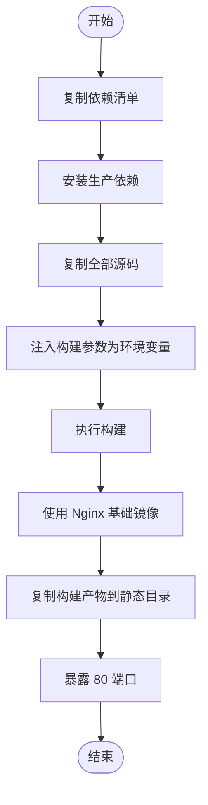
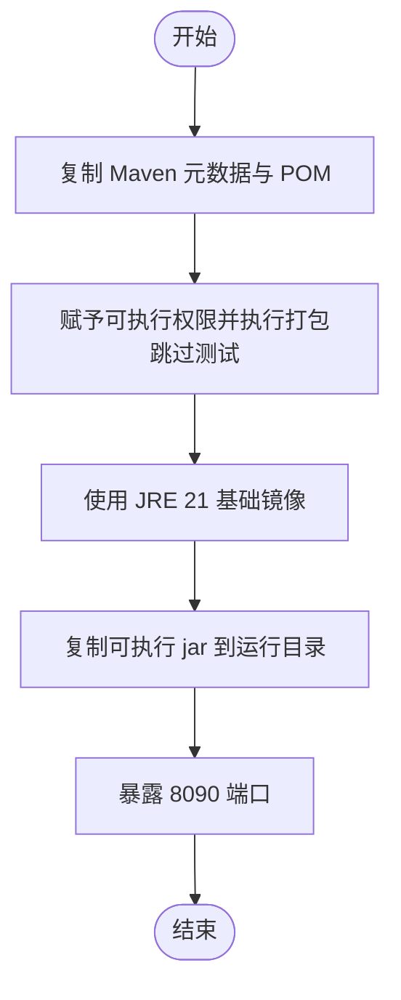
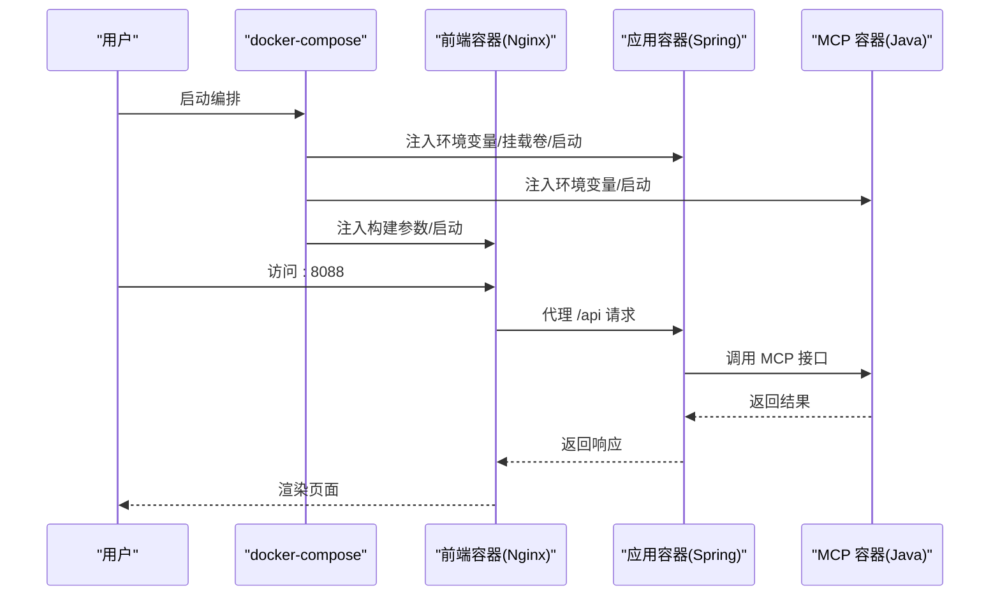
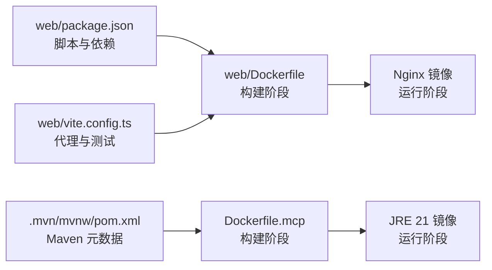

# 容器化配置

<cite>
**本文引用的文件**
- [根.dockerignore](file://.dockerignore)
- [web/.dockerignore](file://web/.dockerignore)
- [web/Dockerfile](file://web/Dockerfile)
- [Dockerfile.mcp](file://Dockerfile.mcp)
- [docker-compose.app.yml](file://docker-compose.app.yml)
- [web/package.json](file://web/package.json)
- [web/vite.config.ts](file://web/vite.config.ts)
</cite>

## 目录
1. [简介](#简介)
2. [项目结构](#项目结构)
3. [核心组件](#核心组件)
4. [架构总览](#架构总览)
5. [详细组件分析](#详细组件分析)
6. [依赖关系分析](#依赖关系分析)
7. [性能考量](#性能考量)
8. [故障排查指南](#故障排查指南)
9. [结论](#结论)
10. [附录](#附录)

## 简介
本文件系统性梳理 TravelAgent 的容器化配置，重点解析前端 Dockerfile 的多阶段构建策略与镜像优化，并结合根级 .dockerignore 与 web 子目录 .dockerignore 的作用与配置原则，说明如何在构建过程中提升效率与安全性。同时给出容器运行时的环境变量、端口映射与卷挂载建议，以及非 root 运行、最小权限与镜像扫描等安全最佳实践。

## 项目结构
本项目采用分层容器化策略：
- 前端服务（web）：基于 Node.js 多阶段构建，产物由 Nginx 镜像提供静态服务。
- MCP 服务：基于 Maven + Eclipse Temurin JDK 21 构建，运行于 JRE 镜像。
- 应用服务：通过 docker-compose 编排，组合应用、MCP 与前端服务，统一管理环境变量、端口与依赖服务。

```mermaid
graph TB
subgraph "前端(web)"
WDF["web/Dockerfile<br/>多阶段构建"]
NGINX["nginx:1.27-alpine<br/>静态资源服务"]
WCFG["web/vite.config.ts<br/>开发代理与测试配置"]
WPACONF["web/package.json<br/>脚本与依赖"]
end
subgraph "后端"
MCP["Dockerfile.mcp<br/>Maven+JDK21 构建<br/>JRE 运行"]
APP["应用服务<br/>通过 compose 编排"]
end
subgraph "编排与忽略"
DCAPP["docker-compose.app.yml<br/>环境变量/端口/卷/依赖"]
ROOTIGN["根.dockerignore"]
WEBIGN["web/.dockerignore"]
end
WDF --> NGINX
WCFG --> WDF
WPACONF --> WDF
MCP --> APP
DCAPP --> APP
ROOTIGN -. 影响构建上下文 .-> WDF
ROOTIGN -. 影响构建上下文 .-> MCP
WEBIGN -. 影响构建上下文 .-> WDF
```

图表来源
- [web/Dockerfile:1-22](file://web/Dockerfile#L1-L22)
- [Dockerfile.mcp:1-28](file://Dockerfile.mcp#L1-L28)
- [docker-compose.app.yml:1-62](file://docker-compose.app.yml#L1-L62)
- [.dockerignore:1-16](file://.dockerignore#L1-L16)
- [web/.dockerignore:1-4](file://web/.dockerignore#L1-L4)
- [web/vite.config.ts:1-19](file://web/vite.config.ts#L1-L19)
- [web/package.json:1-26](file://web/package.json#L1-L26)

章节来源
- [web/Dockerfile:1-22](file://web/Dockerfile#L1-L22)
- [Dockerfile.mcp:1-28](file://Dockerfile.mcp#L1-L28)
- [docker-compose.app.yml:1-62](file://docker-compose.app.yml#L1-L62)
- [.dockerignore:1-16](file://.dockerignore#L1-L16)
- [web/.dockerignore:1-4](file://web/.dockerignore#L1-L4)
- [web/vite.config.ts:1-19](file://web/vite.config.ts#L1-L19)
- [web/package.json:1-26](file://web/package.json#L1-L26)

## 核心组件
- 前端多阶段构建镜像（web/Dockerfile）
  - 第一阶段：Node.js 20 Alpine，安装生产依赖，复制源码，注入构建参数为环境变量，执行构建。
  - 第二阶段：Nginx 1.27 Alpine，复制构建产物至静态目录，暴露 80 端口。
- MCP 服务镜像（Dockerfile.mcp）
  - 第一阶段：Maven 3.9.9 + Eclipse Temurin JDK 21，拷贝 Maven 元数据与模块 POM，执行打包（跳过测试）。
  - 第二阶段：Eclipse Temurin JRE 21，仅复制可执行 jar 至运行时目录，暴露 8090 端口。
- 编排与运行（docker-compose.app.yml）
  - 统一注入 Spring 与工具链相关环境变量，挂载数据目录，定义端口映射与服务依赖。
- 忽略规则（.dockerignore 与 web/.dockerignore）
  - 排除 Git、IDE、本地缓存、日志、构建产物与敏感文件，缩小构建上下文，提升构建速度与安全性。

章节来源
- [web/Dockerfile:1-22](file://web/Dockerfile#L1-L22)
- [Dockerfile.mcp:1-28](file://Dockerfile.mcp#L1-L28)
- [docker-compose.app.yml:1-62](file://docker-compose.app.yml#L1-L62)
- [.dockerignore:1-16](file://.dockerignore#L1-L16)
- [web/.dockerignore:1-4](file://web/.dockerignore#L1-L4)

## 架构总览
下图展示容器化部署的整体交互：前端通过 Nginx 提供静态页面，后端应用监听 8080，MCP 服务监听 8090；compose 将前端映射到宿主机 8088，应用与 MCP 通过服务名相互发现。

```mermaid
graph TB
subgraph "宿主机"
BROWSER["浏览器<br/>访问 :8088"]
HOST8088["端口映射 :8088 -> 80"]
HOST8080["端口映射 :8080 -> 8080"]
end
subgraph "容器网络"
FRONT["旅行助手前端<br/>Nginx:80"]
APP["应用服务<br/>Spring Boot:8080"]
MCP["MCP 服务<br/>Java:8090"]
end
BROWSER --> HOST8088 --> FRONT
FRONT -. 代理 /api -> APP
APP --> MCP
```

图表来源
- [docker-compose.app.yml:50-62](file://docker-compose.app.yml#L50-L62)
- [web/Dockerfile:16-22](file://web/Dockerfile#L16-L22)

章节来源
- [docker-compose.app.yml:1-62](file://docker-compose.app.yml#L1-L62)
- [web/Dockerfile:1-22](file://web/Dockerfile#L1-L22)

## 详细组件分析

### 前端容器镜像（web/Dockerfile）
- 多阶段构建策略
  - 构建阶段：使用 Node.js 20 Alpine，先复制依赖清单并安装生产依赖，再复制源码，注入构建参数为环境变量，最后执行构建。
  - 运行阶段：使用 Nginx 1.27 Alpine，复制构建产物至静态目录，暴露 80 端口。
- 依赖管理与缓存策略
  - 优先复制依赖清单以利用镜像层缓存；仅在依赖变更时重新安装。
  - 使用生产依赖安装命令，避免开发依赖进入最终镜像。
- 镜像体积优化
  - 使用 Alpine 基础镜像，减少体积。
  - 最终仅复制构建产物到 Nginx 静态目录，不包含 Node 或构建工具。
- 构建参数与环境变量
  - 通过构建参数注入前端密钥与安全码，并转换为运行时环境变量，便于构建期注入与运行期使用。



图表来源
- [web/Dockerfile:1-22](file://web/Dockerfile#L1-L22)

章节来源
- [web/Dockerfile:1-22](file://web/Dockerfile#L1-L22)
- [web/package.json:1-26](file://web/package.json#L1-L26)
- [web/vite.config.ts:1-19](file://web/vite.config.ts#L1-L19)

### MCP 服务镜像（Dockerfile.mcp）
- 多阶段构建策略
  - 构建阶段：Maven 3.9.9 + Eclipse Temurin JDK 21，复制 Maven 元数据与模块 POM，执行打包（跳过测试），生成可执行 jar。
  - 运行阶段：Eclipse Temurin JRE 21，仅复制 jar 到运行时目录，暴露 8090 端口。
- JDK 版本选择
  - 构建使用 JDK 21，运行使用 JRE 21，确保最小运行时依赖。
- 依赖缓存与打包
  - 优先复制 POM 与元数据，利用 Maven 层缓存加速依赖下载。
  - 执行打包时跳过测试，缩短构建时间。
- 最终镜像优化
  - 运行阶段仅包含 JRE 与 jar，显著降低镜像体积。



图表来源
- [Dockerfile.mcp:1-28](file://Dockerfile.mcp#L1-L28)

章节来源
- [Dockerfile.mcp:1-28](file://Dockerfile.mcp#L1-L28)

### 容器运行时配置（docker-compose.app.yml）
- 环境变量
  - 激活生产配置、OpenAI 访问凭据与模型、工具链与 Amap 配置、跨域白名单、内存与 Milvus 相关开关与地址等。
- 端口映射
  - 前端：宿主机 8088 映射至容器 80。
  - 应用：容器 8080 对外提供服务。
  - MCP：容器 8090 对外提供服务。
- 卷挂载
  - 将宿主机 data 目录挂载到应用容器内，持久化知识库与运行时数据。
- 服务依赖
  - 前端依赖应用服务；应用服务依赖 MCP 服务。



图表来源
- [docker-compose.app.yml:1-62](file://docker-compose.app.yml#L1-L62)

章节来源
- [docker-compose.app.yml:1-62](file://docker-compose.app.yml#L1-L62)

### .dockerignore 文件的作用与配置原则
- 根级 .dockerignore
  - 排除版本控制目录、IDE 工件、Maven 本地仓库、工具缓存、构建产物、日志与敏感文件，缩小构建上下文，提升构建速度与安全性。
- web 子目录 .dockerignore
  - 排除 node_modules、dist、日志，避免将本地开发产物与缓存带入镜像，保证前后端构建一致性。
- 配置原则
  - 优先排除大型或频繁变动的目录（如 node_modules、dist、target）。
  - 保护敏感信息（日志、密钥、证书）。
  - 保持与 .gitignore 的一致策略，减少重复维护成本。

章节来源
- [.dockerignore:1-16](file://.dockerignore#L1-L16)
- [web/.dockerignore:1-4](file://web/.dockerignore#L1-L4)

## 依赖关系分析
- 前端构建依赖
  - 依赖清单与源码分离，优先复制依赖清单以复用缓存。
  - 构建参数注入前端密钥与安全码，确保构建期注入与运行期可用。
- 后端构建依赖
  - Maven 元数据与模块 POM 先行复制，利用缓存加速依赖解析。
  - 打包阶段跳过测试，缩短构建时间。
- 运行时依赖
  - 前端仅需 Nginx 提供静态服务。
  - MCP 仅需 JRE 运行时。
  - 应用通过 compose 与 MCP 服务通信。



图表来源
- [web/package.json:1-26](file://web/package.json#L1-L26)
- [web/vite.config.ts:1-19](file://web/vite.config.ts#L1-L19)
- [web/Dockerfile:1-22](file://web/Dockerfile#L1-L22)
- [Dockerfile.mcp:1-28](file://Dockerfile.mcp#L1-L28)

章节来源
- [web/package.json:1-26](file://web/package.json#L1-L26)
- [web/vite.config.ts:1-19](file://web/vite.config.ts#L1-L19)
- [web/Dockerfile:1-22](file://web/Dockerfile#L1-L22)
- [Dockerfile.mcp:1-28](file://Dockerfile.mcp#L1-L28)

## 性能考量
- 构建缓存
  - 优先复制依赖清单与 Maven 元数据，避免不必要的重装与下载。
  - 使用多阶段构建，仅将必要产物复制到运行阶段，减少镜像层数与体积。
- 构建上下文
  - 通过 .dockerignore 排除无关文件，显著缩小上下文，提升构建速度。
- 运行时体积
  - 前端使用 Nginx 运行，后端 MCP 使用 JRE 运行，均遵循“仅运行时所需”的最小化原则。
- 端口与代理
  - 前端开发代理指向应用服务端口，生产环境通过 Nginx 提供静态服务，降低应用压力。

## 故障排查指南
- 构建失败（前端）
  - 检查构建参数是否正确传入，确认环境变量已注入。
  - 确认依赖清单与源码复制顺序，避免缓存失效导致的重复安装。
- 构建失败（MCP）
  - 检查 Maven 元数据与 POM 是否完整复制。
  - 确认打包阶段未执行测试，避免超时或失败。
- 运行异常
  - 检查 compose 中的环境变量与端口映射，确保前端可访问应用服务。
  - 确认卷挂载路径正确，数据目录可读写。
- 安全问题
  - 确保 .dockerignore 排除了敏感文件与日志。
  - 生产环境避免使用 dummy 凭据，使用受控的环境变量注入方式。

章节来源
- [web/Dockerfile:1-22](file://web/Dockerfile#L1-L22)
- [Dockerfile.mcp:1-28](file://Dockerfile.mcp#L1-L28)
- [docker-compose.app.yml:1-62](file://docker-compose.app.yml#L1-L62)
- [.dockerignore:1-16](file://.dockerignore#L1-L16)
- [web/.dockerignore:1-4](file://web/.dockerignore#L1-L4)

## 结论
本项目的容器化方案通过多阶段构建与最小运行时依赖，实现了高效的前端静态服务与轻量的后端运行镜像。配合 .dockerignore 的严格排除策略与 compose 的集中编排，既提升了构建效率与安全性，也简化了本地开发与生产部署的一致性。建议在生产环境中进一步引入非 root 用户运行、镜像扫描与只读根文件系统等安全加固措施。

## 附录
- 容器安全最佳实践（建议）
  - 非 root 用户运行：在 Dockerfile 中添加用户与组，切换到非 root 用户执行。
  - 最小权限：仅授予容器运行所需的最小权限，避免使用特权模式。
  - 只读根文件系统：启用只读根文件系统，防止恶意写入。
  - 镜像扫描：集成 CI 流水线中的镜像漏洞扫描，确保基线安全。
  - 环境变量注入：使用受控的环境变量注入方式，避免明文硬编码。
  - 日志与密钥：通过 .dockerignore 与安全存储机制保护敏感信息。