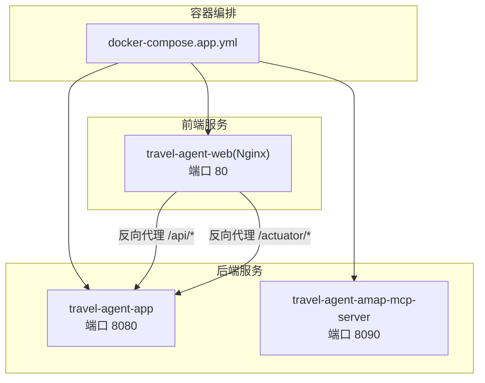
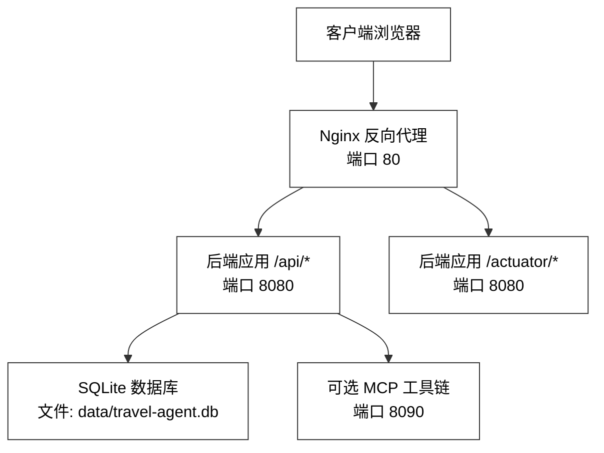
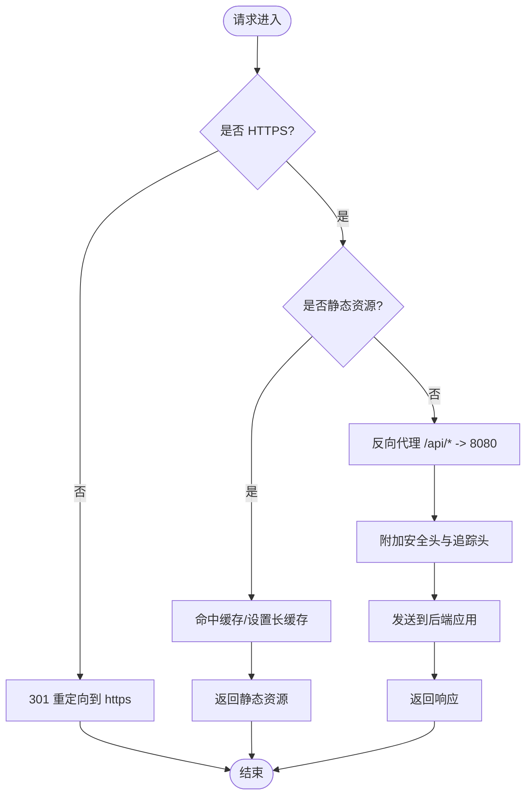
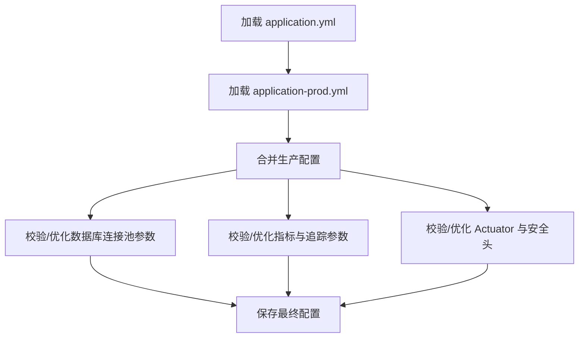
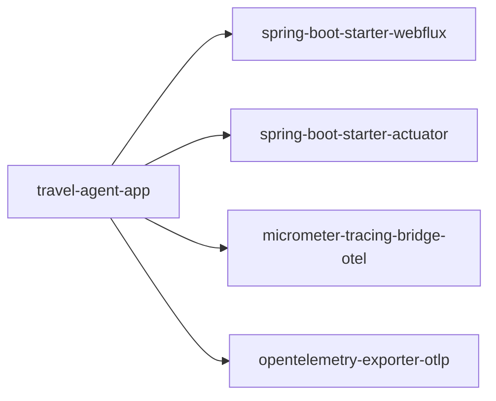

# 生产环境部署

<cite>
**本文引用的文件**
- [application.yml](file://travel-agent-app/src/main/resources/application.yml)
- [application-prod.yml](file://travel-agent-app/src/main/resources/application-prod.yml)
- [Dockerfile.app](file://Dockerfile.app)
- [Dockerfile.mcp](file://Dockerfile.mcp)
- [docker-compose.app.yml](file://docker-compose.app.yml)
- [nginx.conf](file://web/nginx.conf)
- [Dockerfile（前端）](file://web/Dockerfile)
- [vite.config.ts](file://web/vite.config.ts)
- [pom.xml（后端模块）](file://travel-agent-app/pom.xml)
- [InfrastructureConfig.java](file://travel-agent-infrastructure/src/main/java/com/travalagent/infrastructure/config/InfrastructureConfig.java)
- [operations.md](file://docs/operations.md)
- [release-checklist.md](file://docs/release-checklist.md)
</cite>

## 目录
1. [简介](#简介)
2. [项目结构](#项目结构)
3. [核心组件](#核心组件)
4. [架构总览](#架构总览)
5. [详细组件分析](#详细组件分析)
6. [依赖分析](#依赖分析)
7. [性能考虑](#性能考虑)
8. [故障排查指南](#故障排查指南)
9. [结论](#结论)
10. [附录](#附录)

## 简介
本指南面向生产环境部署，覆盖系统与硬件要求、Nginx 反向代理配置、应用配置优化、环境变量与密钥管理策略、部署前检查清单、部署步骤与回滚策略，以及监控与告警建议。文档基于仓库中现有配置与脚本进行梳理与扩展，确保可操作性与可追溯性。

## 项目结构
该工程采用多模块 Maven 结构，包含后端应用、基础设施与领域层、前端 Web 应用及容器化编排。生产部署通过 Docker Compose 启动三个服务：后端应用、MCP 辅助服务、前端 Nginx 镜像；Nginx 负责静态资源与反向代理到后端。

图表来源
- [docker-compose.app.yml:1-62](file://docker-compose.app.yml#L1-L62)
- [nginx.conf:1-30](file://web/nginx.conf#L1-L30)

章节来源
- [docker-compose.app.yml:1-62](file://docker-compose.app.yml#L1-L62)
- [Dockerfile.app](file://Dockerfile.app)
- [Dockerfile.mcp](file://Dockerfile.mcp)
- [Dockerfile（前端）:1-22](file://web/Dockerfile#L1-L22)

## 核心组件
- 后端应用服务：Spring Boot WebFlux 应用，提供聊天对话、计划生成等能力，暴露健康检查与运行信息接口。
- MCP 辅助服务：AMAP 的 MCP 服务器，供后端工具调用，独立容器运行。
- 前端 Nginx 服务：构建产物由 Nginx 提供静态页面，统一反向代理后端 API 与 Actuator 指标端点。

章节来源
- [pom.xml（后端模块）:33-53](file://travel-agent-app/pom.xml#L33-L53)
- [docker-compose.app.yml:2-32](file://docker-compose.app.yml#L2-L32)
- [docker-compose.app.yml:36-48](file://docker-compose.app.yml#L36-L48)
- [Dockerfile（前端）:16-22](file://web/Dockerfile#L16-L22)

## 架构总览
生产部署采用“前端 Nginx + 后端应用 + 可选 MCP 服务”的三层架构。Nginx 作为统一入口，负责静态资源与请求转发；后端应用提供业务能力与指标；可选 MCP 服务承载特定工具链。

图表来源
- [nginx.conf:8-24](file://web/nginx.conf#L8-L24)
- [application.yml:1-100](file://travel-agent-app/src/main/resources/application.yml#L1-L100)
- [docker-compose.app.yml:36-48](file://docker-compose.app.yml#L36-L48)

## 详细组件分析

### 系统要求与硬件配置建议
- CPU：建议至少 2 核，推荐 4 核以上以支持并发与响应式处理。
- 内存：建议 4 GB 起步，推荐 8 GB+，用于 JVM 堆与 Nginx 进程。
- 存储：本地 SQLite 数据库占用较小，但需为数据目录与日志保留足够空间；启用 Milvus 时需额外磁盘与 IO 支持。
- 网络：开放对外端口 80（HTTP）、8080（应用）、8090（MCP），并允许访问外部 OpenAI/Milvus/高德 API。

章节来源
- [application.yml:7-16](file://travel-agent-app/src/main/resources/application.yml#L7-L16)
- [docker-compose.app.yml:28-31](file://docker-compose.app.yml#L28-L31)
- [docker-compose.app.yml:44-45](file://docker-compose.app.yml#L44-L45)

### Nginx 反向代理配置（生产优化）
- SSL 证书与 HTTPS：在生产环境中应在 Nginx 层启用 TLS，绑定域名证书，并将 80 端口重定向至 443。
- 负载均衡：若部署多实例后端，可在 Nginx 层配置 upstream 并轮询或加权。
- 静态资源缓存：对前端构建产物设置长缓存与 ETag，减少带宽与延迟。
- 安全头：建议添加 HSTS、X-Frame-Options、X-Content-Type-Options、Referrer-Policy 等头。
- 请求头透传：已透传 X-Real-IP、X-Forwarded-For、X-Forwarded-Proto，保持后端可观测性与鉴权一致性。

图表来源
- [nginx.conf:1-30](file://web/nginx.conf#L1-L30)
- [vite.config.ts:8-13](file://web/vite.config.ts#L8-L13)

章节来源
- [nginx.conf:1-30](file://web/nginx.conf#L1-L30)
- [Dockerfile（前端）:16-22](file://web/Dockerfile#L16-L22)
- [vite.config.ts:1-19](file://web/vite.config.ts#L1-L19)

### 应用配置文件（生产环境优化）
- 数据库连接池：当前使用 Hikari，最大池大小与最小空闲均为 1，适合小规模部署；生产建议根据 QPS 与事务并发调整。
- 日志级别：默认未显式设置，建议在生产 profile 中将根日志级别设为 INFO 或 WARN，并限制敏感字段输出。
- 性能参数：开启 Micrometer 与 OTLP 导出，便于生产观测；可按需调整采样概率。
- 安全配置：Actuator 默认仅暴露 health/info；生产中建议限制访问来源并启用鉴权。

图表来源
- [application.yml:1-100](file://travel-agent-app/src/main/resources/application.yml#L1-L100)
- [application-prod.yml:1-6](file://travel-agent-app/src/main/resources/application-prod.yml#L1-L6)

章节来源
- [application.yml:1-100](file://travel-agent-app/src/main/resources/application.yml#L1-L100)
- [application-prod.yml:1-6](file://travel-agent-app/src/main/resources/application-prod.yml#L1-L6)
- [pom.xml（后端模块）:47-53](file://travel-agent-app/pom.xml#L47-L53)

### 环境变量管理策略
- 分离敏感信息：通过 .env 文件注入密钥与地址，避免硬编码；在 CI/CD 中使用受控的密钥管理服务。
- 配置分层：使用 Spring Profile（如 prod）隔离生产配置；将默认值置于 compose 文件，敏感值由环境变量注入。
- 密钥管理：OpenAI、高德 API Key、Milvus 凭据均通过环境变量注入；建议使用 KMS 或托管密钥服务。

章节来源
- [docker-compose.app.yml:6-27](file://docker-compose.app.yml#L6-L27)
- [release-checklist.md:5-20](file://docs/release-checklist.md#L5-L20)

### 部署前预检查清单
- 环境准备：确认服务器满足 CPU/内存/存储/网络要求；准备好 SSL 证书与域名解析。
- 配置核对：核对 .env 中的关键变量；验证 Nginx 与后端端口映射；确认 Actuator 可达性。
- 数据与持久化：确认数据卷挂载路径与权限；备份历史数据。
- 外部依赖：验证 OpenAI/Milvus/高德 API 可达性与配额。

章节来源
- [release-checklist.md:3-20](file://docs/release-checklist.md#L3-L20)
- [operations.md:13-16](file://docs/operations.md#L13-L16)

### 部署步骤
- 构建镜像：后端与前端分别构建镜像；必要时构建 MCP 服务镜像。
- 启动服务：使用 docker-compose 启动全部服务，等待各容器健康。
- 验证：访问 /actuator/health 与 /api/conversations/chat 接口，确认返回结构化旅行计划。
- 监控：接入 Prometheus/Grafana 或云监控平台，采集指标与日志。

章节来源
- [docker-compose.app.yml:1-62](file://docker-compose.app.yml#L1-L62)
- [release-checklist.md:50-73](file://docs/release-checklist.md#L50-L73)

### 回滚策略
- 快速回滚：停止当前版本容器，拉取上一版本镜像并重启；回退数据卷时需谨慎。
- 配置回滚：保留上一版本的 .env 与 Nginx 配置；必要时回滚数据库迁移。
- 监控告警：在回滚期间持续观察健康状态与错误率，确保服务恢复。

章节来源
- [operations.md:73-78](file://docs/operations.md#L73-L78)

### 监控与告警配置
- 应用健康检查：定期探测 /actuator/health，异常时触发告警。
- 系统资源监控：采集 CPU、内存、磁盘、网络与容器重启次数。
- 错误日志分析：集中收集 Nginx 与后端日志，建立关键字过滤与聚合规则。

章节来源
- [application.yml:42-55](file://travel-agent-app/src/main/resources/application.yml#L42-L55)
- [operations.md:7-23](file://docs/operations.md#L7-L23)

## 依赖分析
后端应用依赖 WebFlux、Actuator、Micrometer 与 OTLP 导出器，构成可观测性基础；前端通过 Nginx 提供静态资源与反向代理。

图表来源
- [pom.xml（后端模块）:33-53](file://travel-agent-app/pom.xml#L33-L53)

章节来源
- [pom.xml（后端模块）:1-78](file://travel-agent-app/pom.xml#L1-L78)

## 性能考虑
- 连接池：根据并发与 QPS 调整 Hikari 最大池大小与空闲数，避免阻塞。
- 缓存：前端静态资源启用长期缓存；后端对热点查询结果进行缓存。
- 超时与重试：合理设置工具调用超时与指数退避策略，避免级联故障。
- 观测：开启采样追踪与指标导出，结合 APM 平台定位瓶颈。

章节来源
- [application.yml:10-12](file://travel-agent-app/src/main/resources/application.yml#L10-L12)
- [application.yml:33-40](file://travel-agent-app/src/main/resources/application.yml#L33-L40)

## 故障排查指南
- 健康检查失败：查看 /actuator/health 输出，确认数据库初始化、外部服务连通性与密钥配置。
- 前端无法访问：确认 Nginx 是否正确代理 /api 与 /actuator；检查 CORS 与 Allowed Origins。
- 日志定位：关注 logs/runtime 与 logs/archive，定位异常时间点的堆栈与请求上下文。
- 数据问题：检查 data/travel-agent.db 与 Milvus 数据目录权限与可用空间。

章节来源
- [operations.md:7-23](file://docs/operations.md#L7-L23)
- [application.yml:63-64](file://travel-agent-app/src/main/resources/application.yml#L63-L64)

## 结论
本指南提供了从系统要求、Nginx 配置、应用优化、环境变量管理到部署与监控的完整实践路径。建议在生产环境中进一步完善 TLS、限流与熔断、密钥轮换与审计日志等机制，以提升安全性与稳定性。

## 附录
- 关键配置参考路径
  - [后端主配置:1-100](file://travel-agent-app/src/main/resources/application.yml#L1-L100)
  - [生产配置片段:1-6](file://travel-agent-app/src/main/resources/application-prod.yml#L1-L6)
  - [容器编排:1-62](file://docker-compose.app.yml#L1-L62)
  - [前端 Nginx 配置:1-30](file://web/nginx.conf#L1-L30)
  - [前端构建与运行:1-22](file://web/Dockerfile#L1-L22)
  - [开发代理配置:1-19](file://web/vite.config.ts#L1-L19)
  - [后端依赖与插件:1-78](file://travel-agent-app/pom.xml#L1-L78)
  - [基础设施配置（Milvus）:1-36](file://travel-agent-infrastructure/src/main/java/com/travalagent/infrastructure/config/InfrastructureConfig.java#L1-L36)
  - [运维与数据布局:1-78](file://docs/operations.md#L1-L78)
  - [发布检查清单:1-82](file://docs/release-checklist.md#L1-L82)