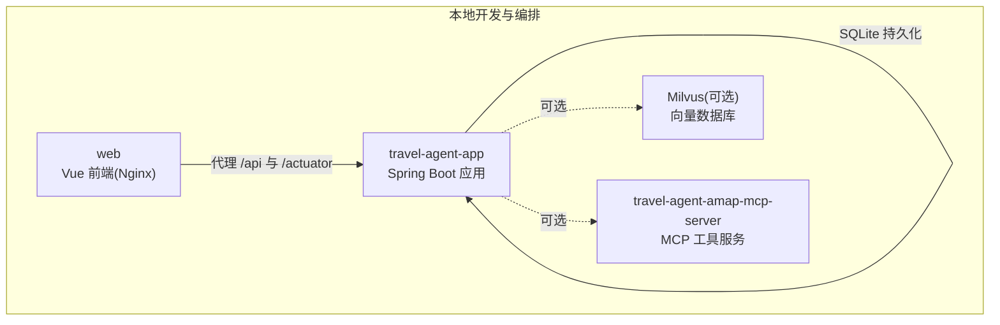
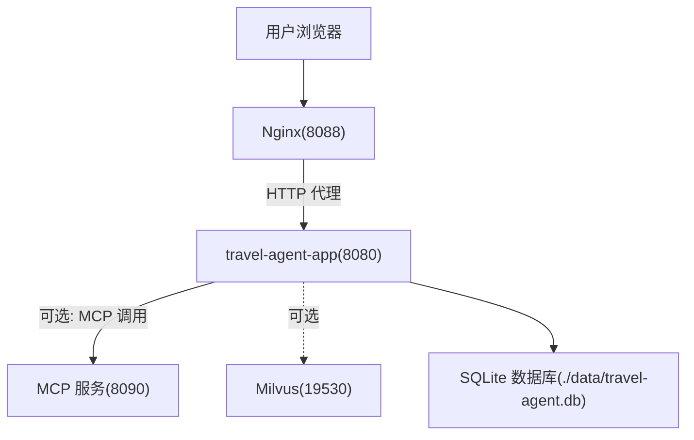
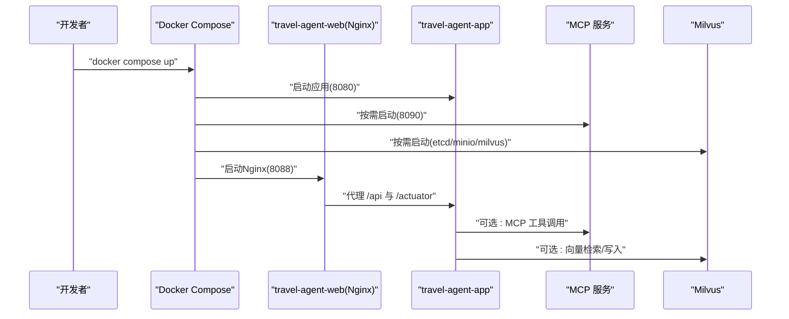
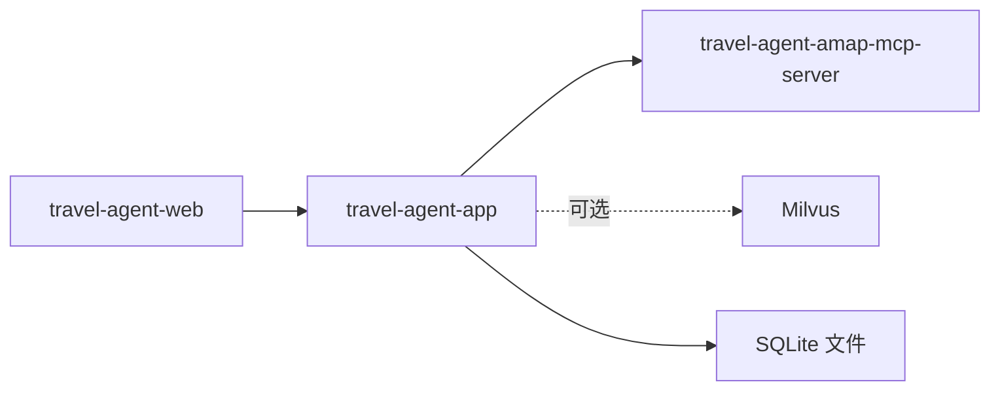

# 部署运维

<cite>
**本文引用的文件**
- [.github/workflows/ci.yml](file://.github/workflows/ci.yml)
- [Dockerfile.mcp](file://Dockerfile.mcp)
- [docker-compose.app.yml](file://docker-compose.app.yml)
- [docker-compose.milvus.yml](file://docker-compose.milvus.yml)
- [web/Dockerfile](file://web/Dockerfile)
- [web/nginx.conf](file://web/nginx.conf)
- [web/.dockerignore](file://web/.dockerignore)
- [.dockerignore](file://.dockerignore)
- [travel-agent-app/src/main/resources/application.yml](file://travel-agent-app/src/main/resources/application.yml)
- [travel-agent-app/src/main/resources/application-prod.yml](file://travel-agent-app/src/main/resources/application-prod.yml)
- [docs/operations.md](file://docs/operations.md)
- [docs/system-architecture.md](file://docs/system-architecture.md)
</cite>

## 目录
1. [简介](#简介)
2. [项目结构](#项目结构)
3. [核心组件](#核心组件)
4. [架构总览](#架构总览)
5. [详细组件分析](#详细组件分析)
6. [依赖关系分析](#依赖关系分析)
7. [性能考虑](#性能考虑)
8. [故障排查指南](#故障排查指南)
9. [结论](#结论)
10. [附录](#附录)

## 简介
本指南面向TravelAgent项目的部署与运维团队，覆盖容器化与编排、生产环境策略、CI/CD流程、性能优化、容量规划与故障恢复，以及常用运维工具的使用方法。文档以仓库中现有的Dockerfile、Docker Compose与Spring Boot配置为依据，结合系统架构与运行约定，提供可操作的实践建议。

## 项目结构
- 后端应用：Spring Boot模块，负责HTTP接口、SSE流式输出、工作流编排、健康检查与知识种子初始化。
- 前端Web：基于Vue的单页应用，通过Nginx在Docker内提供静态资源，并代理后端API与Actuator。
- MCP工具服务器：独立的Spring Boot服务，作为外部工具（如高德MCP）的网关。
- 向量数据库：Milvus（可选），用于长期记忆与旅行知识检索。
- CI/CD：GitHub Actions工作流，分别对后端与前端执行测试与构建。

图表来源
- [docker-compose.app.yml:1-62](file://docker-compose.app.yml#L1-L62)
- [web/nginx.conf:1-30](file://web/nginx.conf#L1-L30)

章节来源
- [docs/system-architecture.md:12-50](file://docs/system-architecture.md#L12-L50)
- [docker-compose.app.yml:1-62](file://docker-compose.app.yml#L1-L62)

## 核心组件
- 应用服务（travel-agent-app）
  - Spring Boot应用，监听8080端口；默认使用SQLite存储；支持OpenAI聊天与嵌入模型；可选启用MCP工具与Milvus向量存储。
  - 生产配置暴露健康与信息端点，支持OTLP链路追踪导出。
- MCP工具服务（travel-agent-amap-mcp-server）
  - 独立JAR运行于8090端口，作为高德MCP工具的回调与同步调用入口。
- 前端服务（web）
  - 使用Nginx提供静态页面，代理后端API与Actuator；支持构建参数注入高德前端密钥。
- 向量数据库（Milvus）
  - 提供Etcd、MinIO与Milvus Standalone服务，支持健康检查与持久化目录映射。

章节来源
- [travel-agent-app/src/main/resources/application.yml:1-100](file://travel-agent-app/src/main/resources/application.yml#L1-L100)
- [travel-agent-app/src/main/resources/application-prod.yml:1-6](file://travel-agent-app/src/main/resources/application-prod.yml#L1-L6)
- [Dockerfile.mcp:1-28](file://Dockerfile.mcp#L1-L28)
- [web/Dockerfile:1-22](file://web/Dockerfile#L1-L22)
- [docker-compose.milvus.yml:1-64](file://docker-compose.milvus.yml#L1-L64)

## 架构总览
下图展示容器化部署下的服务交互：前端通过Nginx代理访问后端；后端根据配置选择MCP工具或本地工具路径；可选启用Milvus进行向量检索与长期记忆。

图表来源
- [docker-compose.app.yml:1-62](file://docker-compose.app.yml#L1-L62)
- [web/nginx.conf:1-30](file://web/nginx.conf#L1-L30)
- [docker-compose.milvus.yml:1-64](file://docker-compose.milvus.yml#L1-L64)

## 详细组件分析

### Dockerfile与镜像构建
- 后端应用镜像（Dockerfile.mcp）
  - 多阶段构建：第一阶段使用Maven构建MCP服务JAR；第二阶段使用Eclipse Temurin JRE运行。
  - 入口暴露8090端口，启动命令为java -jar /app/app.jar。
- 前端镜像（web/Dockerfile）
  - 基于Node Alpine进行依赖安装与构建，随后使用Nginx Alpine提供静态资源。
  - 支持通过构建参数注入高德前端密钥与安全JS码。
- 忽略规则（.dockerignore 与 web/.dockerignore）
  - 排除node_modules、dist、日志与目标产物等，避免污染镜像与加速构建。

章节来源
- [Dockerfile.mcp:1-28](file://Dockerfile.mcp#L1-L28)
- [web/Dockerfile:1-22](file://web/Dockerfile#L1-L22)
- [.dockerignore:1-16](file://.dockerignore#L1-L16)
- [web/.dockerignore:1-4](file://web/.dockerignore#L1-L4)

### Docker Compose 编排
- 应用服务（travel-agent-app）
  - 构建上下文指向根目录，使用Dockerfile.app（未在当前仓库中出现，但被compose引用）。
  - 环境变量覆盖OpenAI、MCP、高德API、跨域、内存与Milvus等配置。
  - 映射本地data目录到容器内/app/data；端口8080映射至宿主机。
  - 依赖MCP服务；重启策略unless-stopped。
- MCP工具服务（travel-agent-amap-mcp-server）
  - 使用Dockerfile.mcp构建；端口8090映射；仅在profile mcp时启用。
- 前端服务（travel-agent-web）
  - 使用web/Dockerfile构建；端口8088映射至Nginx的80；依赖后端。
- Milvus（可选）
  - Etcd、MinIO与Milvus Standalone三容器组成；健康检查与持久化卷；网络自定义为milvus-local。

章节来源
- [docker-compose.app.yml:1-62](file://docker-compose.app.yml#L1-L62)
- [docker-compose.milvus.yml:1-64](file://docker-compose.milvus.yml#L1-L64)

### Nginx 代理与路由
- 将/api/与/actuator/代理至后端应用，保留Host、X-Real-IP、X-Forwarded-*等头部。
- 对静态资源采用try_files回退至index.html，确保Vue Router前端路由生效。

章节来源
- [web/nginx.conf:1-30](file://web/nginx.conf#L1-L30)

### Spring Boot 运行配置
- 服务器端口与数据源
  - 默认监听8080；使用SQLite JDBC驱动，连接./data/travel-agent.db；Hikari连接池最小/最大均为1。
- AI与MCP集成
  - OpenAI聊天与嵌入模型可通过环境变量覆盖；MCP客户端启用、类型、超时与工具回调均在配置中声明。
- 监控与追踪
  - Actuator端点暴露health与info；健康检查细节按授权显示；支持OTLP追踪导出端点。
- 功能开关
  - 工具提供者（LOCAL/MCP）、内存提供者（AUTO/SQLITE/MILVUS）、允许的跨域Origin、高德API密钥与限速等均可通过环境变量控制。
- 向量存储与知识检索
  - Milvus与简单向量存储的启用、URI、用户名密码、数据库名、集合名、索引与度量类型等均有对应配置项。

章节来源
- [travel-agent-app/src/main/resources/application.yml:1-100](file://travel-agent-app/src/main/resources/application.yml#L1-L100)
- [travel-agent-app/src/main/resources/application-prod.yml:1-6](file://travel-agent-app/src/main/resources/application-prod.yml#L1-L6)

### CI/CD 流程（GitHub Actions）
- 触发条件：推送main分支、拉取请求、手动触发。
- 后端作业
  - 设置Java 21（Temurin），缓存Maven；执行./mvnw -B test。
- 前端作业
  - 切换到web目录，设置Node.js 22（缓存npm），安装依赖、测试与构建。
- 权限：仅授予contents读取权限。

章节来源
- [.github/workflows/ci.yml:1-60](file://.github/workflows/ci.yml#L1-L60)

### 容器化部署序列（从Compose到运行）

图表来源
- [docker-compose.app.yml:1-62](file://docker-compose.app.yml#L1-L62)
- [web/nginx.conf:1-30](file://web/nginx.conf#L1-L30)
- [docker-compose.milvus.yml:1-64](file://docker-compose.milvus.yml#L1-L64)

## 依赖关系分析
- 组件耦合
  - 前端依赖后端API与Actuator；后端可选依赖MCP与Milvus。
  - MCP服务与后端通过环境变量建立连接；Milvus服务由后端配置决定是否启用。
- 外部依赖
  - OpenAI兼容服务（聊天/嵌入）、SQLite、高德开放平台API、可选Milvus。
- 网络与卷
  - Compose定义了服务间网络；Milvus使用持久化卷；应用映射本地data目录。

图表来源
- [docker-compose.app.yml:1-62](file://docker-compose.app.yml#L1-L62)
- [docker-compose.milvus.yml:1-64](file://docker-compose.milvus.yml#L1-L64)

章节来源
- [docker-compose.app.yml:1-62](file://docker-compose.app.yml#L1-L62)
- [docker-compose.milvus.yml:1-64](file://docker-compose.milvus.yml#L1-L64)

## 性能考虑
- 连接池与并发
  - 当前SQLite连接池大小为1，适合开发与轻负载；生产建议评估并发与事务需求，必要时迁移至更高吞吐的数据库。
- 向量检索与索引
  - Milvus启用时，合理设置索引类型与nlist参数；控制查询与插入的批大小，避免过载。
- 前端静态化与代理
  - 前端构建产物由Nginx提供，减少后端压力；代理头保持正确，避免鉴权与重定向异常。
- 追踪与可观测性
  - 开启OTLP导出与健康端点，便于定位延迟与错误来源。

## 故障排查指南
- 健康检查
  - 后端Actuator健康端点：/actuator/health；生产配置允许按授权显示组件详情。
  - Milvus健康检查：Etcd、MinIO与Milvus各自提供健康探测，Compose中已内置。
- 日志与数据目录
  - 运行约定：日志位于logs/，导出文件位于data/exports/；SQLite数据库位于data/travel-agent.db；Milvus状态位于data/milvus/。
- 常见问题定位
  - OpenAI模型或API Key错误：检查环境变量与后端日志。
  - MCP不可达：确认MCP容器健康、端口映射与后端MCP基础URL配置。
  - 跨域问题：核对TRAVEL_AGENT_ALLOWED_ORIGIN与前端代理配置。
  - Milvus连接失败：检查URI、认证信息与网络连通性。

章节来源
- [travel-agent-app/src/main/resources/application-prod.yml:1-6](file://travel-agent-app/src/main/resources/application-prod.yml#L1-L6)
- [docker-compose.milvus.yml:15-53](file://docker-compose.milvus.yml#L15-L53)
- [docs/operations.md:1-78](file://docs/operations.md#L1-L78)

## 结论
本指南基于现有Dockerfile、Docker Compose与Spring Boot配置，给出了端到端的部署与运维实践。生产落地时应重点完善环境变量管理、安全加固、监控告警与日志采集，并结合业务流量进行容量与性能优化。

## 附录

### 生产环境部署策略
- 环境配置
  - 使用环境变量覆盖敏感参数（OpenAI API Key、高德API Key、MCP地址、Milvus凭据）。
  - 在Kubernetes或Docker Swarm中以Secret与ConfigMap管理配置。
- 安全设置
  - 限制容器能力与权限；启用只读根文件系统与最小权限；对8090与19530端口进行网络隔离。
  - 启用TLS终止于边缘网关或Ingress，后端内部通信可走明文。
- 监控告警
  - 集成Prometheus/Grafana与OTLP；关注后端QPS、P95/P99、MCP与Milvus延迟与错误率。
- 日志管理
  - 统一收集stdout/stderr与应用日志；归档历史日志；避免在仓库中提交日志文件。

### 容量规划与扩缩容
- 后端实例数：根据前端并发与数据库瓶颈评估；SQLite在高并发下可能成为瓶颈，建议迁移至云数据库。
- 前端：Nginx可水平扩展；注意会话亲和与静态资源缓存策略。
- MCP与Milvus：按查询与写入峰值预留CPU与内存；开启自动扩缩容与健康检查。

### 故障恢复策略
- 快速回滚：使用版本化镜像标签与蓝绿/金丝雀发布。
- 数据备份：定期备份SQLite与Milvus数据卷；验证恢复流程。
- 降级预案：关闭向量检索与MCP工具，切换至本地工具与SQLite模式。

### 运维工具使用指南
- 健康检查
  - 访问/actuator/health与Milvus健康探测端点，确认各组件存活。
- 性能监控
  - 通过/actuator/metrics与外部监控系统联动；关注GC、线程池与数据库连接池指标。
- 问题诊断
  - 结合OTLP链路追踪与后端日志，定位慢请求与异常堆栈；利用Milvus与Etcd/MinIO健康检查判断存储层问题。