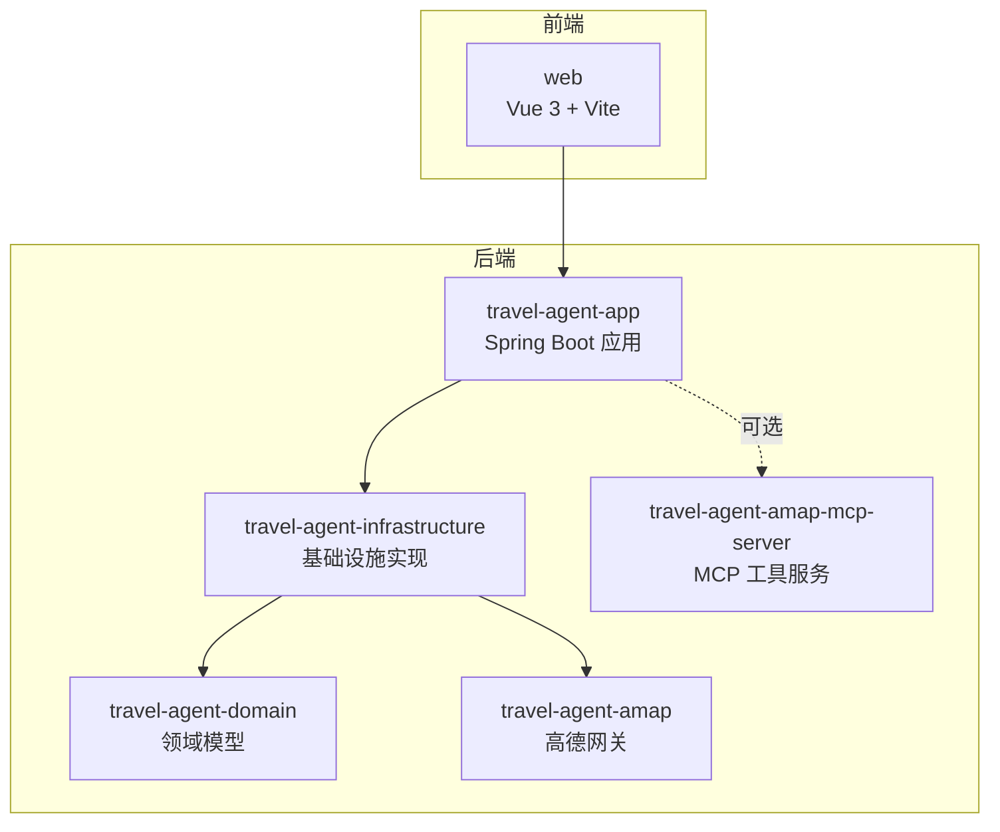
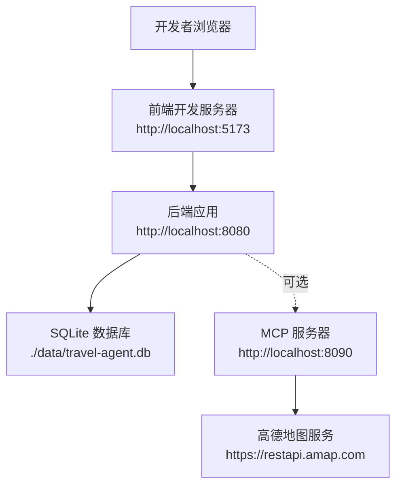
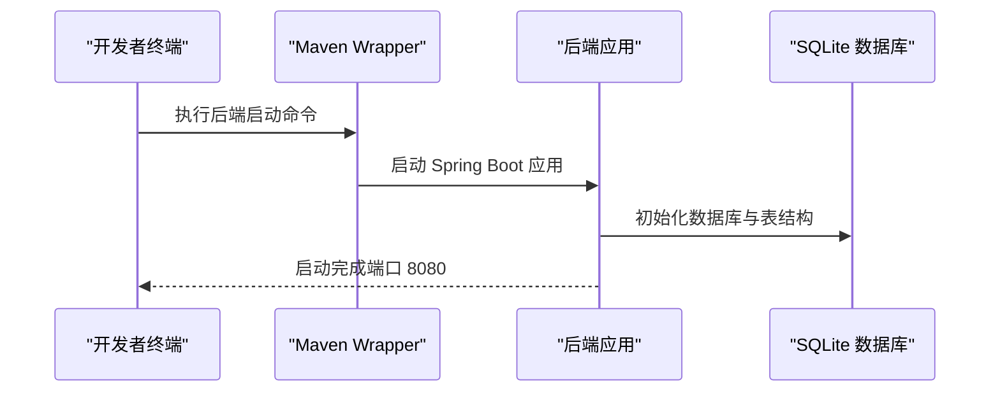
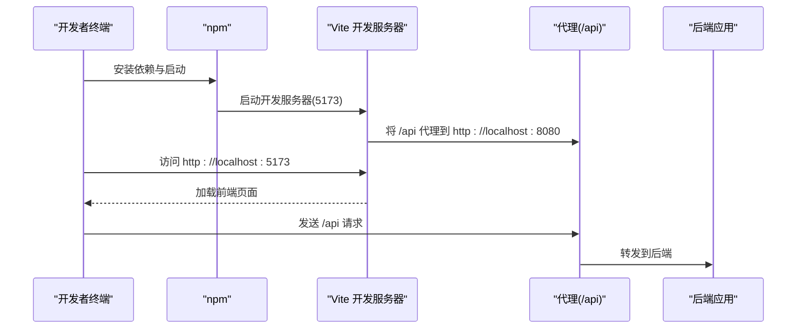
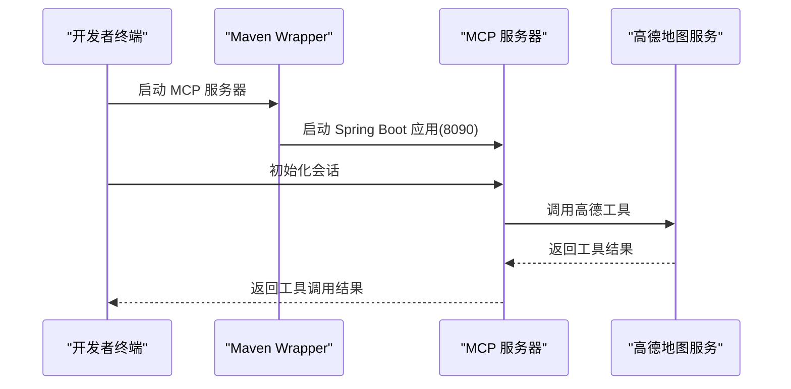
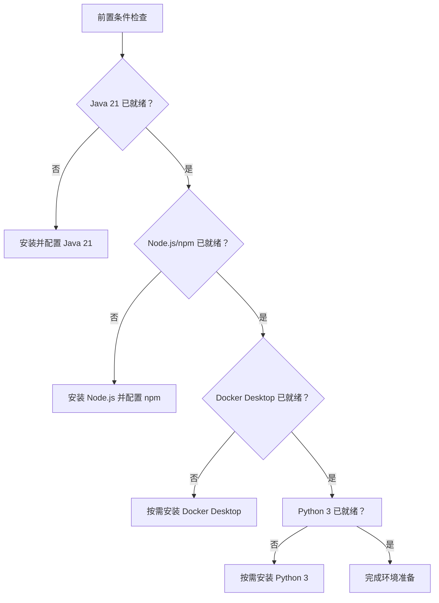

# 快速开始指南

<cite>
**本文引用的文件**
- [README.md](file://README.md)
- [pom.xml](file://pom.xml)
- [web/package.json](file://web/package.json)
- [travel-agent-app/src/main/resources/application.yml](file://travel-agent-app/src/main/resources/application.yml)
- [docker-compose.app.yml](file://docker-compose.app.yml)
- [web/vite.config.ts](file://web/vite.config.ts)
- [Dockerfile.mcp](file://Dockerfile.mcp)
- [web/Dockerfile](file://web/Dockerfile)
- [travel-agent-amap-mcp-server/README.md](file://travel-agent-amap-mcp-server/README.md)
- [travel-agent-app/src/test/java/com/travalagent/app/integration/TravelAgentSmokeIntegrationTest.java](file://travel-agent-app/src/test/java/com/travalagent/app/integration/TravelAgentSmokeIntegrationTest.java)
- [scripts/analyze_feedback_loop.py](file://scripts/analyze_feedback_loop.py)
</cite>

## 目录
1. [简介](#简介)
2. [项目结构](#项目结构)
3. [核心组件](#核心组件)
4. [架构总览](#架构总览)
5. [详细组件分析](#详细组件分析)
6. [依赖分析](#依赖分析)
7. [性能考虑](#性能考虑)
8. [故障排除指南](#故障排除指南)
9. [结论](#结论)
10. [附录](#附录)

## 简介
本指南面向新加入的开发者，帮助你在最短时间内完成 TravelAgent 项目的本地开发环境搭建与运行。你将学到：
- 前置条件检查（Java 21、Node.js、Docker）
- 环境变量配置
- 后端、前端与可选 MCP 服务器的启动步骤
- 默认端点与验证方法
- 开发模式常用命令（单元测试、集成测试、构建与打包）
- 常见问题与故障排除

## 项目结构
TravelAgent 是一个前后端分离的多模块项目，采用 Maven 多模块聚合管理，后端使用 Spring Boot 4，前端使用 Vue 3 + Vite。核心模块包括：
- travel-agent-app：后端应用与 API
- travel-agent-domain：领域模型与契约
- travel-agent-infrastructure：基础设施实现（LLM、检索、持久化等）
- travel-agent-amap：高德地图 HTTP 集成
- travel-agent-amap-mcp-server：高德 MCP 工具服务
- web：前端工程
- scripts：知识准备与离线反馈分析脚本

图表来源
- [pom.xml:22-29](file://pom.xml#L22-L29)
- [README.md:236-261](file://README.md#L236-L261)

章节来源
- [README.md:236-261](file://README.md#L236-L261)
- [pom.xml:22-29](file://pom.xml#L22-L29)

## 核心组件
- 后端应用（travel-agent-app）：提供 REST API、SSE 流、健康检查与对话工作流。
- 前端（web）：Vue 3 单页应用，通过 Vite 提供开发服务器与代理到后端。
- MCP 服务器（travel-agent-amap-mcp-server）：可选的高德工具服务，通过 Streamable HTTP 暴露天气、地理编码等工具。
- 配置中心：后端 application.yml 定义端口、数据库、AI 与高德相关参数；前端 vite.config.ts 定义开发服务器端口与代理。

章节来源
- [travel-agent-app/src/main/resources/application.yml:1-100](file://travel-agent-app/src/main/resources/application.yml#L1-L100)
- [web/vite.config.ts:1-19](file://web/vite.config.ts#L1-L19)
- [README.md:141-192](file://README.md#L141-L192)

## 架构总览
下图展示了本地开发时各组件之间的交互关系与默认端口映射：

图表来源
- [web/vite.config.ts:6-13](file://web/vite.config.ts#L6-L13)
- [travel-agent-app/src/main/resources/application.yml:1-2](file://travel-agent-app/src/main/resources/application.yml#L1-L2)
- [travel-agent-amap-mcp-server/README.md:19-21](file://travel-agent-amap-mcp-server/README.md#L19-L21)

## 详细组件分析

### 后端启动（Spring Boot）
- 使用 Maven 多模块聚合方式启动后端应用。
- 默认监听端口在配置文件中定义。
- 运行后端集成测试以验证健康状态与聊天接口返回结构。

图表来源
- [README.md:164-168](file://README.md#L164-L168)
- [travel-agent-app/src/main/resources/application.yml:1-16](file://travel-agent-app/src/main/resources/application.yml#L1-L16)

章节来源
- [README.md:164-168](file://README.md#L164-L168)
- [travel-agent-app/src/main/resources/application.yml:1-16](file://travel-agent-app/src/main/resources/application.yml#L1-L16)

### 前端启动（Vue 3 + Vite）
- 切换至 web 目录，安装依赖并启动开发服务器。
- Vite 将代理所有 /api 请求到后端 8080 端口。
- 默认开发端口为 5173。

图表来源
- [web/package.json:6-10](file://web/package.json#L6-L10)
- [web/vite.config.ts:6-13](file://web/vite.config.ts#L6-L13)

章节来源
- [web/package.json:6-10](file://web/package.json#L6-L10)
- [web/vite.config.ts:6-13](file://web/vite.config.ts#L6-L13)

### MCP 服务器（可选）
- MCP 服务器提供高德工具能力（天气、地理编码、公交路线等）。
- 默认端口为 8090，可通过配置文件或环境变量控制启用与地址。
- 支持手动初始化会话与调用工具进行冒烟测试。

图表来源
- [README.md:178-182](file://README.md#L178-L182)
- [travel-agent-amap-mcp-server/README.md:19-21](file://travel-agent-amap-mcp-server/README.md#L19-L21)

章节来源
- [README.md:178-182](file://README.md#L178-L182)
- [travel-agent-amap-mcp-server/README.md:19-21](file://travel-agent-amap-mcp-server/README.md#L19-L21)

### 环境变量与配置要点
- 后端配置文件中定义了大量可由环境变量覆盖的参数，包括 AI 服务、高德 API、内存与向量存储、MCP 客户端等。
- 前端通过 Vite 的代理将 /api 请求转发到后端，避免跨域问题。
- Docker Compose 提供了完整的应用栈编排，便于本地或生产部署。

章节来源
- [travel-agent-app/src/main/resources/application.yml:17-100](file://travel-agent-app/src/main/resources/application.yml#L17-L100)
- [web/vite.config.ts:8-13](file://web/vite.config.ts#L8-L13)
- [docker-compose.app.yml:6-31](file://docker-compose.app.yml#L6-L31)

## 依赖分析
- 技术栈与版本要求：
  - Java 21（后端）
  - Node.js 与 npm（前端）
  - Docker Desktop（可选，用于 Milvus 或容器化部署）
  - Python 3（仅当需要重新运行知识收集与清洗脚本）

章节来源
- [README.md:143-148](file://README.md#L143-L148)

## 性能考虑
- 在开发模式下，建议关闭或降低链路追踪采样率以减少开销。
- SQLite 在单连接池配置下适合本地开发，生产环境建议使用更健壮的数据库。
- MCP 服务器与高德 API 的请求频率应受控，避免触发限流。

## 故障排除指南
- 启动后端失败（端口占用）
  - 检查 8080 端口是否被占用，必要时修改配置文件中的端口。
  - 参考：[application.yml:1-2](file://travel-agent-app/src/main/resources/application.yml#L1-L2)
- 前端无法访问后端接口（跨域或代理未生效）
  - 确认 Vite 代理配置已启用并将 /api 转发到 8080。
  - 参考：[vite.config.ts:8-13](file://web/vite.config.ts#L8-L13)
- MCP 服务器未启动或工具不可用
  - 确认 MCP 服务器已在 8090 端口运行，并正确配置高德 API Key。
  - 参考：[README.md:178-182](file://README.md#L178-L182)，[travel-agent-amap-mcp-server/README.md:19-21](file://travel-agent-amap-mcp-server/README.md#L19-L21)
- 集成测试失败
  - 使用提供的冒烟测试验证后端健康与聊天接口返回结构。
  - 参考：[TravelAgentSmokeIntegrationTest.java:60-92](file://travel-agent-app/src/test/java/com/travalagent/app/integration/TravelAgentSmokeIntegrationTest.java#L60-L92)
- 离线反馈分析脚本报错
  - 确保 SQLite 数据库路径存在且可读写，默认路径为 data/travel-agent.db。
  - 参考：[analyze_feedback_loop.py:24-27](file://scripts/analyze_feedback_loop.py#L24-L27)

章节来源
- [travel-agent-app/src/main/resources/application.yml:1-2](file://travel-agent-app/src/main/resources/application.yml#L1-L2)
- [web/vite.config.ts:8-13](file://web/vite.config.ts#L8-L13)
- [README.md:178-182](file://README.md#L178-L182)
- [travel-agent-amap-mcp-server/README.md:19-21](file://travel-agent-amap-mcp-server/README.md#L19-L21)
- [travel-agent-app/src/test/java/com/travalagent/app/integration/TravelAgentSmokeIntegrationTest.java:60-92](file://travel-agent-app/src/test/java/com/travalagent/app/integration/TravelAgentSmokeIntegrationTest.java#L60-L92)
- [scripts/analyze_feedback_loop.py:24-27](file://scripts/analyze_feedback_loop.py#L24-L27)

## 结论
按照本指南完成前置条件检查、环境变量配置与分步启动后，你将成功运行 TravelAgent 的后端、前端与可选 MCP 服务器。随后即可基于默认端点进行功能验证与日常开发工作。遇到问题时，可参考“故障排除指南”定位与解决。

## 附录

### 默认端点与验证
- 后端：http://localhost:8080
  - 健康检查：/actuator/health
  - 聊天接口：/api/conversations/chat
- 前端：http://localhost:5173
- MCP 服务器：http://localhost:8090/mcp（可选）

章节来源
- [README.md:184-187](file://README.md#L184-L187)
- [travel-agent-app/src/main/resources/application.yml:1-2](file://travel-agent-app/src/main/resources/application.yml#L1-L2)
- [web/vite.config.ts:6-13](file://web/vite.config.ts#L6-L13)
- [travel-agent-amap-mcp-server/README.md:19-21](file://travel-agent-amap-mcp-server/README.md#L19-L21)

### 开发模式常用命令
- 后端测试：运行全部后端测试
- 冒烟集成测试：验证健康与聊天返回结构
- 前端测试：运行前端单元测试
- 前端构建：生成生产构建产物
- 后端打包：跳过测试打包后端应用
- 离线反馈分析：使用 Python 脚本分析本地数据库反馈记录

章节来源
- [README.md:216-226](file://README.md#L216-L226)
- [travel-agent-app/src/test/java/com/travalagent/app/integration/TravelAgentSmokeIntegrationTest.java:60-92](file://travel-agent-app/src/test/java/com/travalagent/app/integration/TravelAgentSmokeIntegrationTest.java#L60-L92)
- [scripts/analyze_feedback_loop.py:69-96](file://scripts/analyze_feedback_loop.py#L69-L96)

### 生产部署准备
- Docker Compose 编排
  - 应用服务：暴露 8080 端口，挂载数据目录
  - MCP 服务器：按需启用，暴露 8090 端口
  - 前端服务：Nginx 提供静态资源，映射到 8088
- 前端镜像构建
  - 基于 Node 20 Alpine 构建，支持通过构建参数注入前端密钥
- MCP 服务器镜像构建
  - 基于 Maven 与 Eclipse Temurin 21 构建，最终以 JRE 运行

章节来源
- [docker-compose.app.yml:1-62](file://docker-compose.app.yml#L1-L62)
- [web/Dockerfile:1-22](file://web/Dockerfile#L1-L22)
- [Dockerfile.mcp:1-28](file://Dockerfile.mcp#L1-L28)