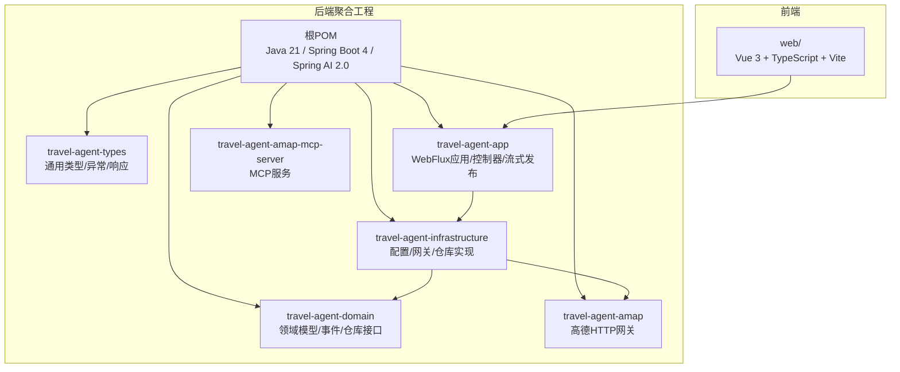
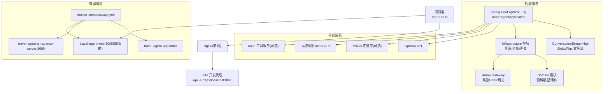
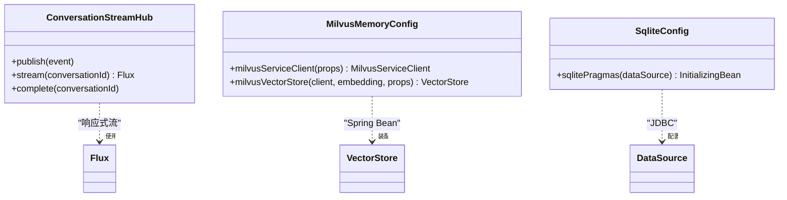
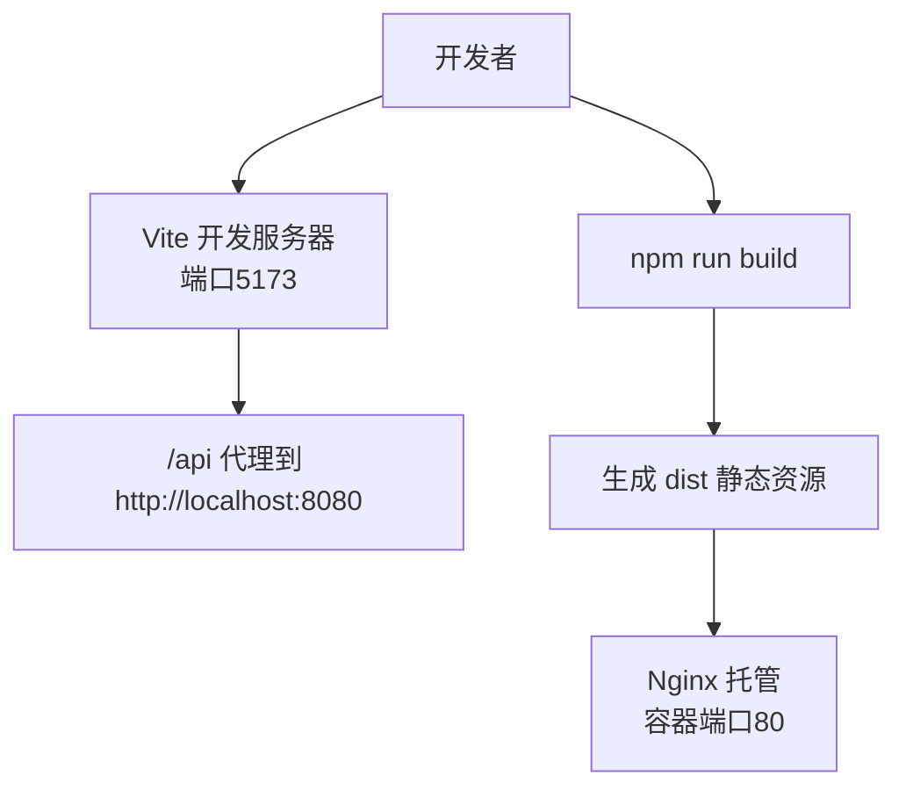
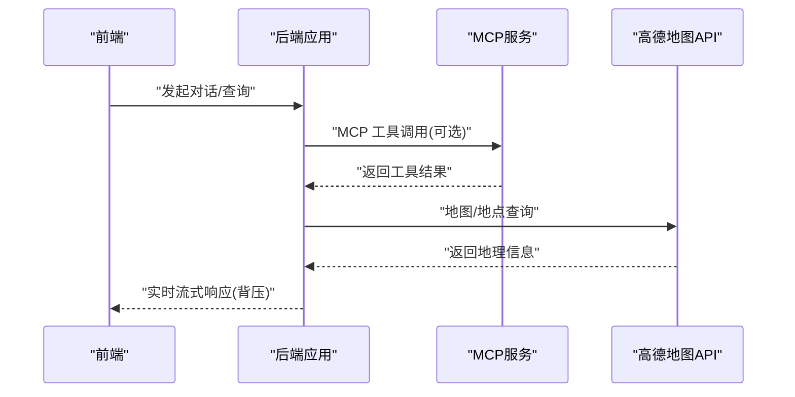
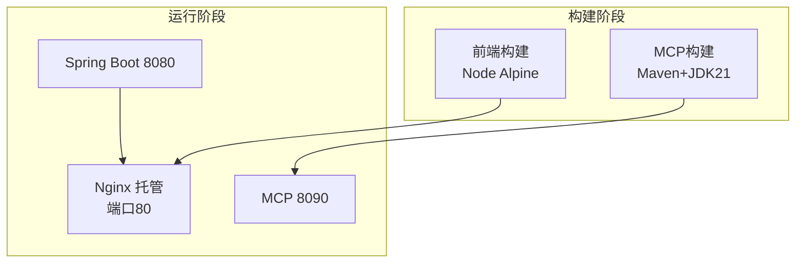
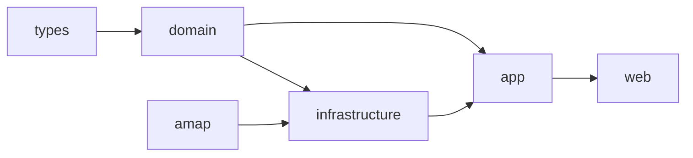

# 技术栈总览

<cite>
**本文引用的文件**
- [pom.xml](file://pom.xml)
- [travel-agent-app\pom.xml](file://travel-agent-app\pom.xml)
- [travel-agent-infrastructure\pom.xml](file://travel-agent-infrastructure\pom.xml)
- [travel-agent-app\src\main\java\com\travalagent\app\TravelAgentApplication.java](file://travel-agent-app\src\main\java\com\travalagent\app\TravelAgentApplication.java)
- [travel-agent-app\src\main\resources\application.yml](file://travel-agent-app\src\main\resources\application.yml)
- [travel-agent-infrastructure\src\main\java\com\travalagent\infrastructure\config\MilvusMemoryConfig.java](file://travel-agent-infrastructure\src\main\java\com\travalagent\infrastructure\config\MilvusMemoryConfig.java)
- [travel-agent-infrastructure\src\main\java\com\travalagent\infrastructure\config\SqliteConfig.java](file://travel-agent-infrastructure\src\main\java\com\travalagent\infrastructure\config\SqliteConfig.java)
- [travel-agent-app\src\main\java\com\travalagent\app\stream\ConversationStreamHub.java](file://travel-agent-app\src\main\java\com\travalagent\app\stream\ConversationStreamHub.java)
- [web\package.json](file://web\package.json)
- [web\vite.config.ts](file://web\vite.config.ts)
- [web\src\main.ts](file://web\src\main.ts)
- [web\tsconfig.json](file://web\tsconfig.json)
- [web\Dockerfile](file://web\Dockerfile)
- [Dockerfile.mcp](file://Dockerfile.mcp)
- [docker-compose.app.yml](file://docker-compose.app.yml)
</cite>

## 目录
1. [引言](#引言)
2. [项目结构](#项目结构)
3. [核心组件](#核心组件)
4. [架构总览](#架构总览)
5. [详细组件分析](#详细组件分析)
6. [依赖分析](#依赖分析)
7. [性能考虑](#性能考虑)
8. [故障排查指南](#故障排查指南)
9. [结论](#结论)
10. [附录](#附录)

## 引言
本文件面向TravelAgent项目，提供完整的技术栈总览与落地说明。项目采用“后端Java 21 + Spring Boot 4 + Spring WebFlux + Spring AI 2.0 + 响应式流”的现代化后端技术组合，前端采用Vue 3 + TypeScript + Vite构建高性能单页应用（SPA），数据库默认SQLite，可选Milvus向量存储，地图服务集成高德地图API，运维通过Docker容器化部署。该技术栈有效支撑多智能体协作、实时流式传输、知识检索与多模态处理等核心能力，并提供清晰的模块边界与可扩展的配置体系。

## 项目结构
项目采用多模块Maven聚合工程组织，按职责划分为类型定义、领域模型、基础设施、应用层与高德MCP服务等模块；前端位于独立web目录，使用Vite进行构建与开发代理；容器化通过Compose编排应用、MCP服务与Web前端。

图表来源
- [pom.xml:1-58](file://pom.xml#L1-L58)
- [travel-agent-app\pom.xml:1-78](file://travel-agent-app\pom.xml#L1-L78)
- [travel-agent-infrastructure\pom.xml:1-77](file://travel-agent-infrastructure\pom.xml#L1-L77)

章节来源
- [pom.xml:1-58](file://pom.xml#L1-L58)
- [travel-agent-app\pom.xml:1-78](file://travel-agent-app\pom.xml#L1-L78)
- [travel-agent-infrastructure\pom.xml:1-77](file://travel-agent-infrastructure\pom.xml#L1-L77)

## 核心组件
- 后端运行时与启动
  - 应用入口与扫描范围覆盖全模块，启用配置属性扫描，确保各模块配置生效。
  - 参考路径：[TravelAgentApplication.java:1-15](file://travel-agent-app\src\main\java\com\travalagent\app\TravelAgentApplication.java#L1-L15)
- 配置中心与外部化配置
  - 数据源默认SQLite，初始化脚本与连接池参数；AI相关OpenAI与MCP客户端配置；可观测性与追踪；旅行Agent内存窗口、工具提供者、高德API等。
  - 参考路径：[application.yml:1-100](file://travel-agent-app\src\main\resources\application.yml#L1-L100)
- 基础设施与数据持久化
  - SQLite连接与PRAGMA优化，确保WAL模式、超时与列兼容性；向量存储可选Milvus，按配置条件装配。
  - 参考路径：[SqliteConfig.java:1-42](file://travel-agent-infrastructure\src\main\java\com\travalagent\infrastructure\config\SqliteConfig.java#L1-L42)，[MilvusMemoryConfig.java:1-45](file://travel-agent-infrastructure\src\main\java\com\travalagent\infrastructure\config\MilvusMemoryConfig.java#L1-L45)
- 实时流式传输
  - 基于Reactor的Sinks与Flux实现对话事件的背压缓冲、按会话分发与完成信号。
  - 参考路径：[ConversationStreamHub.java:1-33](file://travel-agent-app\src\main\java\com\travalagent\app\stream\ConversationStreamHub.java#L1-L33)
- 前端应用
  - Vue 3 + Pinia + TypeScript，Vite开发服务器与代理到后端8080端口，测试环境jsdom。
  - 参考路径：[main.ts:1-7](file://web\src\main.ts#L1-L7)，[vite.config.ts:1-19](file://web\vite.config.ts#L1-L19)，[package.json:1-26](file://web\package.json#L1-L26)，[tsconfig.json:1-17](file://web\tsconfig.json#L1-L17)
- 容器化与编排
  - 后端应用镜像、MCP服务镜像、Web前端镜像；Compose统一编排，暴露必要端口，挂载数据卷。
  - 参考路径：[Dockerfile.mcp:1-28](file://Dockerfile.mcp#L1-L28)，[web\Dockerfile:1-22](file://web\Dockerfile#L1-L22)，[docker-compose.app.yml:1-62](file://docker-compose.app.yml#L1-L62)

章节来源
- [travel-agent-app\src\main\java\com\travalagent\app\TravelAgentApplication.java:1-15](file://travel-agent-app\src\main\java\com\travalagent\app\TravelAgentApplication.java#L1-L15)
- [travel-agent-app\src\main\resources\application.yml:1-100](file://travel-agent-app\src\main\resources\application.yml#L1-L100)
- [travel-agent-infrastructure\src\main\java\com\travalagent\infrastructure\config\SqliteConfig.java:1-42](file://travel-agent-infrastructure\src\main\java\com\travalagent\infrastructure\config\SqliteConfig.java#L1-L42)
- [travel-agent-infrastructure\src\main\java\com\travalagent\infrastructure\config\MilvusMemoryConfig.java:1-45](file://travel-agent-infrastructure\src\main\java\com\travalagent\infrastructure\config\MilvusMemoryConfig.java#L1-L45)
- [travel-agent-app\src\main\java\com\travalagent\app\stream\ConversationStreamHub.java:1-33](file://travel-agent-app\src\main\java\com\travalagent\app\stream\ConversationStreamHub.java#L1-L33)
- [web\src\main.ts:1-7](file://web\src\main.ts#L1-L7)
- [web\vite.config.ts:1-19](file://web\vite.config.ts#L1-L19)
- [web\package.json:1-26](file://web\package.json#L1-L26)
- [web\tsconfig.json:1-17](file://web\tsconfig.json#L1-L17)
- [Dockerfile.mcp:1-28](file://Dockerfile.mcp#L1-L28)
- [web\Dockerfile:1-22](file://web\Dockerfile#L1-L22)
- [docker-compose.app.yml:1-62](file://docker-compose.app.yml#L1-L62)

## 架构总览
下图展示从浏览器到后端应用、MCP工具链与高德地图API的端到端交互，以及容器化部署视图。

图表来源
- [web\vite.config.ts:1-19](file://web\vite.config.ts#L1-L19)
- [travel-agent-app\src\main\java\com\travalagent\app\TravelAgentApplication.java:1-15](file://travel-agent-app\src\main\java\com\travalagent\app\TravelAgentApplication.java#L1-L15)
- [travel-agent-app\src\main\java\com\travalagent\app\stream\ConversationStreamHub.java:1-33](file://travel-agent-app\src\main\java\com\travalagent\app\stream\ConversationStreamHub.java#L1-L33)
- [travel-agent-app\src\main\resources\application.yml:1-100](file://travel-agent-app\src\main\resources\application.yml#L1-L100)
- [docker-compose.app.yml:1-62](file://docker-compose.app.yml#L1-L62)

## 详细组件分析

### 后端技术栈与Spring AI集成
- Java 21与Spring Boot 4
  - 使用Maven聚合工程统一版本与仓库，继承spring-boot-starter-parent，确保依赖一致性与插件生态。
  - 参考路径：[pom.xml:1-58](file://pom.xml#L1-L58)
- Spring WebFlux与响应式流
  - 应用模块引入spring-boot-starter-webflux，结合Reactor Sinks/Flux实现背压流式事件发布，支撑实时对话与时间线更新。
  - 参考路径：[travel-agent-app\pom.xml:1-78](file://travel-agent-app\pom.xml#L1-L78)，[ConversationStreamHub.java:1-33](file://travel-agent-app\src\main\java\com\travalagent\app\stream\ConversationStreamHub.java#L1-L33)
- Spring AI 2.0与MCP客户端
  - 引入spring-ai-starter-model-openai与spring-ai-starter-mcp-client-webflux，结合application.yml中MCP客户端配置，实现同步请求、回调与可流式HTTP连接。
  - 参考路径：[travel-agent-infrastructure\pom.xml:1-77](file://travel-agent-infrastructure\pom.xml#L1-L77)，[application.yml:28-41](file://travel-agent-app\src\main\resources\application.yml#L28-L41)
- 数据持久化与向量存储
  - 默认SQLite：通过Hikari连接池与PRAGMA优化提升并发与稳定性；自动初始化schema.sql。
  - 可选Milvus：按配置条件装配MilvusServiceClient与VectorStore，支持嵌入维度、索引类型与度量方式等参数化。
  - 参考路径：[application.yml:7-16](file://travel-agent-app\src\main\resources\application.yml#L7-L16)，[SqliteConfig.java:1-42](file://travel-agent-infrastructure\src\main\java\com\travalagent\infrastructure\config\SqliteConfig.java#L1-L42)，[MilvusMemoryConfig.java:1-45](file://travel-agent-infrastructure\src\main\java\com\travalagent\infrastructure\config\MilvusMemoryConfig.java#L1-L45)

图表来源
- [travel-agent-app\src\main\java\com\travalagent\app\stream\ConversationStreamHub.java:1-33](file://travel-agent-app\src\main\java\com\travalagent\app\stream\ConversationStreamHub.java#L1-L33)
- [travel-agent-infrastructure\src\main\java\com\travalagent\infrastructure\config\MilvusMemoryConfig.java:1-45](file://travel-agent-infrastructure\src\main\java\com\travalagent\infrastructure\config\MilvusMemoryConfig.java#L1-L45)
- [travel-agent-infrastructure\src\main\java\com\travalagent\infrastructure\config\SqliteConfig.java:1-42](file://travel-agent-infrastructure\src\main\java\com\travalagent\infrastructure\config\SqliteConfig.java#L1-L42)

章节来源
- [pom.xml:1-58](file://pom.xml#L1-L58)
- [travel-agent-app\pom.xml:1-78](file://travel-agent-app\pom.xml#L1-L78)
- [travel-agent-infrastructure\pom.xml:1-77](file://travel-agent-infrastructure\pom.xml#L1-L77)
- [travel-agent-app\src\main\java\com\travalagent\app\stream\ConversationStreamHub.java:1-33](file://travel-agent-app\src\main\java\com\travalagent\app\stream\ConversationStreamHub.java#L1-L33)
- [travel-agent-infrastructure\src\main\java\com\travalagent\infrastructure\config\MilvusMemoryConfig.java:1-45](file://travel-agent-infrastructure\src\main\java\com\travalagent\infrastructure\config\MilvusMemoryConfig.java#L1-L45)
- [travel-agent-infrastructure\src\main\java\com\travalagent\infrastructure\config\SqliteConfig.java:1-42](file://travel-agent-infrastructure\src\main\java\com\travalagent\infrastructure\config\SqliteConfig.java#L1-L42)
- [travel-agent-app\src\main\resources\application.yml:1-100](file://travel-agent-app\src\main\resources\application.yml#L1-L100)

### 前端技术栈与开发工具链
- Vue 3 + TypeScript + Vite
  - 使用Vite作为构建工具与开发服务器，默认代理/api到后端8080端口；测试使用jsdom与vitest；类型严格检查与ESNext模块解析。
  - 参考路径：[main.ts:1-7](file://web\src\main.ts#L1-L7)，[vite.config.ts:1-19](file://web\vite.config.ts#L1-L19)，[package.json:1-26](file://web\package.json#L1-L26)，[tsconfig.json:1-17](file://web\tsconfig.json#L1-L17)
- 包管理与测试
  - 依赖管理基于npm；测试框架为vitest，DOM测试环境为jsdom；类型检查由vue-tsc与tsc配合完成。
  - 参考路径：[package.json:1-26](file://web\package.json#L1-L26)
- 开发体验
  - Vite提供快速热更新与零配置开发；代理简化跨域问题；生产构建输出静态资源由Nginx托管。
  - 参考路径：[vite.config.ts:1-19](file://web\vite.config.ts#L1-L19)，[web\Dockerfile:1-22](file://web\Dockerfile#L1-L22)

图表来源
- [web\vite.config.ts:1-19](file://web\vite.config.ts#L1-L19)
- [web\Dockerfile:1-22](file://web\Dockerfile#L1-L22)

章节来源
- [web\src\main.ts:1-7](file://web\src\main.ts#L1-L7)
- [web\vite.config.ts:1-19](file://web\vite.config.ts#L1-L19)
- [web\package.json:1-26](file://web\package.json#L1-L26)
- [web\tsconfig.json:1-17](file://web\tsconfig.json#L1-L17)
- [web\Dockerfile:1-22](file://web\Dockerfile#L1-L22)

### 地图与MCP工具链集成
- 高德地图API
  - 通过Amap Gateway与REST接口交互；支持在缺少或错误密钥时的Mock策略；限流参数可调。
  - 参考路径：[application.yml:65-70](file://travel-agent-app\src\main\resources\application.yml#L65-L70)
- MCP工具服务
  - MCP客户端可选启用，支持同步请求、回调与可流式HTTP连接；MCP服务独立容器镜像与端口暴露。
  - 参考路径：[application.yml:28-41](file://travel-agent-app\src\main\resources\application.yml#L28-L41)，[Dockerfile.mcp:1-28](file://Dockerfile.mcp#L1-L28)，[docker-compose.app.yml:36-48](file://docker-compose.app.yml#L36-L48)

图表来源
- [travel-agent-app\src\main\resources\application.yml:28-41](file://travel-agent-app\src\main\resources\application.yml#L28-L41)
- [Dockerfile.mcp:1-28](file://Dockerfile.mcp#L1-L28)
- [docker-compose.app.yml:36-48](file://docker-compose.app.yml#L36-L48)

章节来源
- [travel-agent-app\src\main\resources\application.yml:28-41](file://travel-agent-app\src\main\resources\application.yml#L28-L41)
- [Dockerfile.mcp:1-28](file://Dockerfile.mcp#L1-L28)
- [docker-compose.app.yml:1-62](file://docker-compose.app.yml#L1-L62)

### 运维与容器化
- 多阶段构建
  - 前端：Node Alpine构建，复制Nginx配置与dist产物；后端MCP：Maven 3.9 + Eclipse Temurin 21构建，JRE 21运行时镜像。
  - 参考路径：[web\Dockerfile:1-22](file://web\Dockerfile#L1-L22)，[Dockerfile.mcp:1-28](file://Dockerfile.mcp#L1-L28)
- 编排与环境变量
  - Compose统一编排应用、MCP与Web；暴露端口、挂载数据卷、注入环境变量（如OpenAI/Milvus/高德）。
  - 参考路径：[docker-compose.app.yml:1-62](file://docker-compose.app.yml#L1-L62)

图表来源
- [web\Dockerfile:1-22](file://web\Dockerfile#L1-L22)
- [Dockerfile.mcp:1-28](file://Dockerfile.mcp#L1-L28)
- [docker-compose.app.yml:1-62](file://docker-compose.app.yml#L1-L62)

章节来源
- [web\Dockerfile:1-22](file://web\Dockerfile#L1-L22)
- [Dockerfile.mcp:1-28](file://Dockerfile.mcp#L1-L28)
- [docker-compose.app.yml:1-62](file://docker-compose.app.yml#L1-L62)

## 依赖分析
- 模块耦合与职责
  - types/domain为纯Java模块，提供类型与领域抽象；infrastructure依赖domain与amap，负责配置、网关与仓库实现；app依赖infrastructure与domain，提供WebFlux控制器与流式发布；amap提供高德HTTP网关；mcp-server独立运行。
- 外部依赖与集成
  - OpenAI嵌入与对话模型、Milvus向量存储、高德地图REST/MCP、SQLite JDBC、Micrometer/OpenTelemetry追踪。
- 配置驱动的可选能力
  - MCP开关、Milvus开关、工具提供者选择、允许来源白名单等均通过application.yml与环境变量控制。

图表来源
- [pom.xml:22-29](file://pom.xml#L22-L29)
- [travel-agent-app\pom.xml:16-31](file://travel-agent-app\pom.xml#L16-L31)
- [travel-agent-infrastructure\pom.xml:16-31](file://travel-agent-infrastructure\pom.xml#L16-L31)

章节来源
- [pom.xml:1-58](file://pom.xml#L1-L58)
- [travel-agent-app\pom.xml:1-78](file://travel-agent-app\pom.xml#L1-L78)
- [travel-agent-infrastructure\pom.xml:1-77](file://travel-agent-infrastructure\pom.xml#L1-L77)

## 性能考虑
- 响应式与背压
  - 使用Reactor Sinks.multicast().onBackpressureBuffer()保障高并发下的事件可靠传递，避免丢帧。
  - 参考路径：[ConversationStreamHub.java:14-24](file://travel-agent-app\src\main\java\com\travalagent\app\stream\ConversationStreamHub.java#L14-L24)
- 数据库与I/O
  - SQLite PRAGMA WAL/NORMAL/sync与busy_timeout优化，降低锁竞争；Hikari连接池大小限制为1以适配本地演示场景。
  - 参考路径：[SqliteConfig.java:16-26](file://travel-agent-infrastructure\src\main\java\com\travalagent\infrastructure\config\SqliteConfig.java#L16-L26)，[application.yml:10-13](file://travel-agent-app\src\main\resources\application.yml#L10-L13)
- 向量检索与索引
  - Milvus索引类型、度量方式与索引参数可配置，建议根据数据规模与查询延迟目标调整nlist等参数。
  - 参考路径：[application.yml:72-83](file://travel-agent-app\src\main\resources\application.yml#L72-L83)

## 故障排查指南
- 端口与代理
  - 前端默认5173，代理/api至后端8080；若访问404，请确认Vite代理配置与后端是否启动。
  - 参考路径：[vite.config.ts:6-14](file://web\vite.config.ts#L6-L14)
- 数据库初始化
  - 确认schema.sql已执行且数据目录存在；SQLite文件路径在application.yml中配置。
  - 参考路径：[application.yml:13-16](file://travel-agent-app\src\main\resources\application.yml#L13-L16)
- MCP与高德API
  - 若MCP未启用或工具不可用，检查MCP开关与回调配置；高德API需正确设置KEY与限流参数。
  - 参考路径：[application.yml:28-41](file://travel-agent-app\src\main\resources\application.yml#L28-L41)，[application.yml:65-70](file://travel-agent-app\src\main\resources\application.yml#L65-L70)
- Milvus可用性
  - 检查Milvus开关、URI、认证与集合初始化标志；确认嵌入维度与索引参数匹配。
  - 参考路径：[application.yml:72-83](file://travel-agent-app\src\main\resources\application.yml#L72-L83)，[MilvusMemoryConfig.java:18-44](file://travel-agent-infrastructure\src\main\java\com\travalagent\infrastructure\config\MilvusMemoryConfig.java#L18-L44)
- 容器编排
  - 确认Compose服务端口映射与依赖顺序；查看日志定位启动失败原因。
  - 参考路径：[docker-compose.app.yml:1-62](file://docker-compose.app.yml#L1-L62)

章节来源
- [web\vite.config.ts:1-19](file://web\vite.config.ts#L1-L19)
- [travel-agent-app\src\main\resources\application.yml:13-16](file://travel-agent-app\src\main\resources\application.yml#L13-L16)
- [travel-agent-app\src\main\resources\application.yml:28-41](file://travel-agent-app\src\main\resources\application.yml#L28-L41)
- [travel-agent-app\src\main\resources\application.yml:65-70](file://travel-agent-app\src\main\resources\application.yml#L65-L70)
- [travel-agent-app\src\main\resources\application.yml:72-83](file://travel-agent-app\src\main\resources\application.yml#L72-L83)
- [travel-agent-infrastructure\src\main\java\com\travalagent\infrastructure\config\MilvusMemoryConfig.java:18-44](file://travel-agent-infrastructure\src\main\java\com\travalagent\infrastructure\config\MilvusMemoryConfig.java#L18-L44)
- [docker-compose.app.yml:1-62](file://docker-compose.app.yml#L1-L62)

## 结论
本技术栈围绕“响应式流 + 多智能体 + 向量检索 + 地图工具”形成闭环：后端以Spring Boot 4 + WebFlux + Spring AI 2.0为核心，结合SQLite与可选Milvus实现知识与记忆存储；前端以Vue 3 + TypeScript + Vite提供流畅交互；MCP与高德API打通外部工具与地理服务能力；Docker与Compose实现一键部署与可扩展编排。该架构既满足演示场景的轻量化需求，又为后续扩展（如多Agent路由、多模态输入、更复杂的检索策略）预留了清晰的模块边界与配置空间。

## 附录
- 开发工具链建议
  - IDE：IntelliJ IDEA（Maven/Spring Boot插件）、VS Code（Vue/TypeScript插件）
  - 包管理：Maven（后端）、npm（前端）
  - 测试：JUnit 5（后端）、vitest + jsdom（前端）
  - CI：GitHub Actions（示例工作流位于.github/workflows/ci.yml）