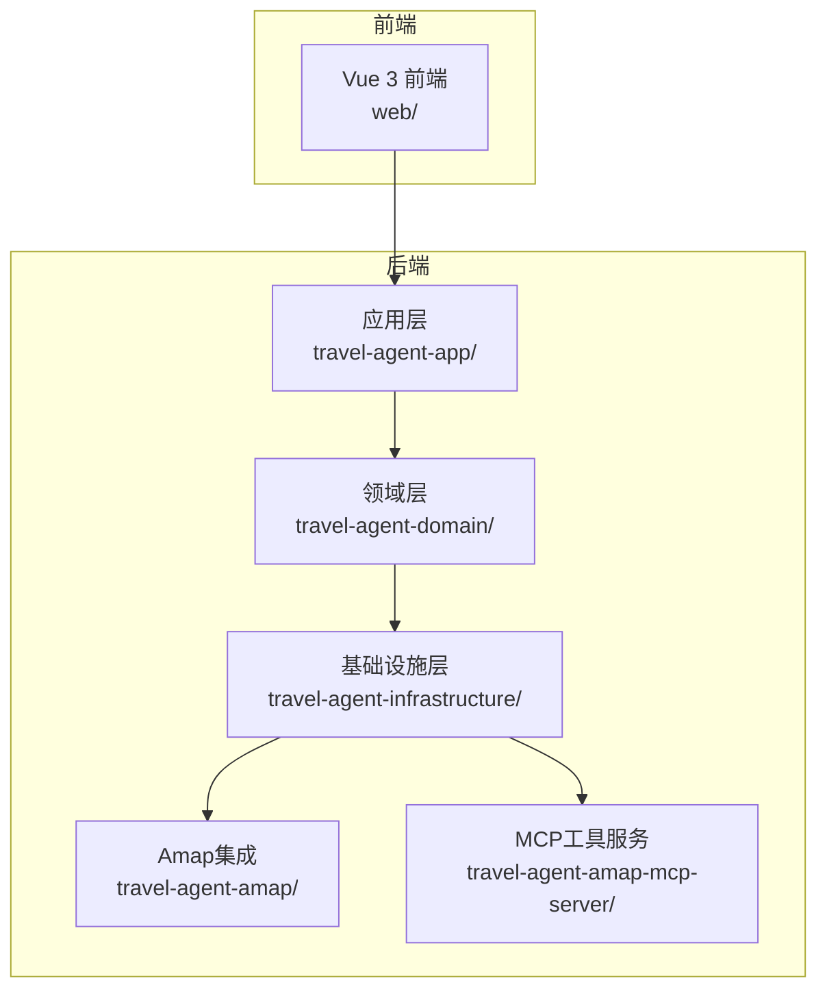
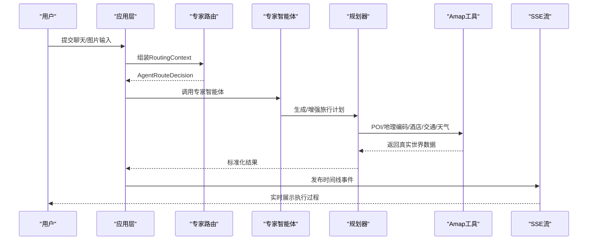
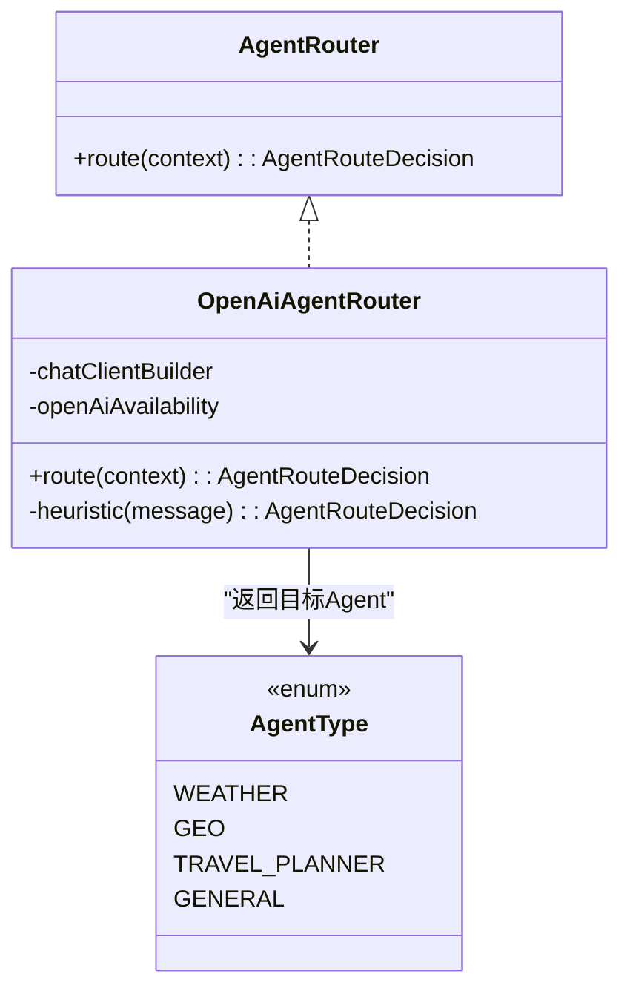
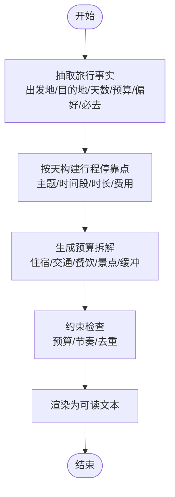
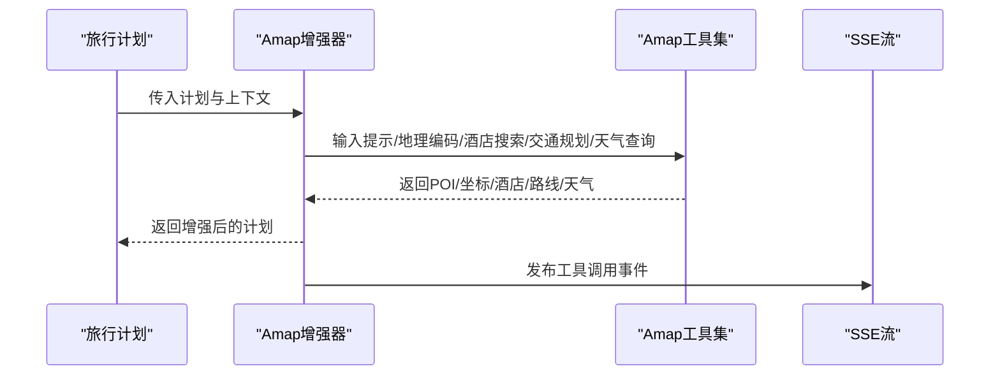
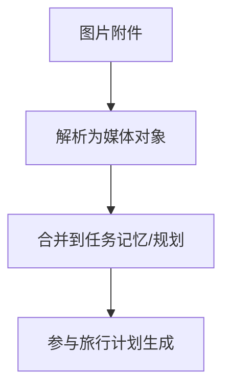
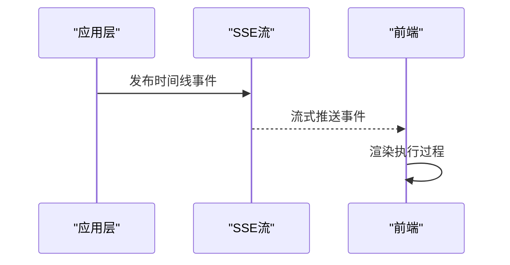
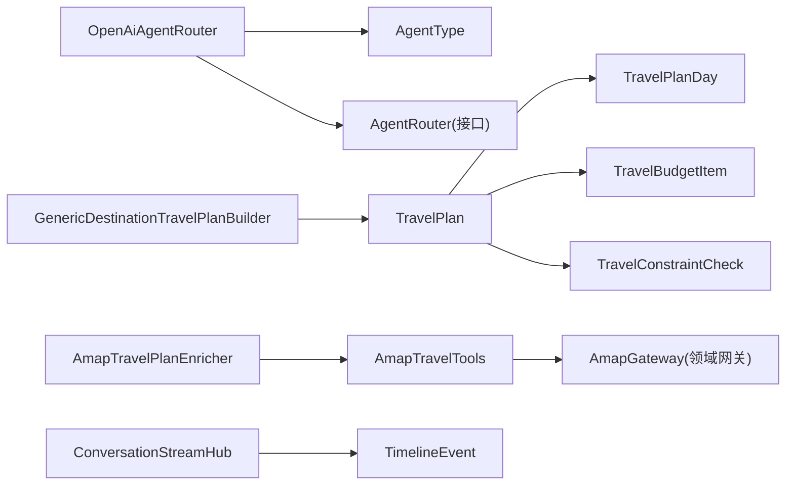

# 核心特性概览

<cite>
**本文引用的文件**
- [README.md](file://README.md)
- [AgentRouter.java](file://travel-agent-domain/src/main/java/com/travalagent/domain/service/AgentRouter.java)
- [OpenAiAgentRouter.java](file://travel-agent-infrastructure/src/main/java/com/travalagent/infrastructure/gateway/llm/OpenAiAgentRouter.java)
- [AgentType.java](file://travel-agent-domain/src/main/java/com/travalagent/domain/model/valobj/AgentType.java)
- [TravelPlanBuilder.java](file://travel-agent-domain/src/main/java/com/travalagent/domain/service/TravelPlanBuilder.java)
- [GenericDestinationTravelPlanBuilder.java](file://travel-agent-infrastructure/src/main/java/com/travalagent/infrastructure/gateway/llm/GenericDestinationTravelPlanBuilder.java)
- [TravelPlan.java](file://travel-agent-domain/src/main/java/com/travalagent/domain/model/entity/TravelPlan.java)
- [TravelPlanDay.java](file://travel-agent-domain/src/main/java/com/travalagent/domain/model/entity/TravelPlanDay.java)
- [TravelPlanSlot.java](file://travel-agent-domain/src/main/java/com/travalagent/domain/model/entity/TravelPlanSlot.java)
- [TravelHotelRecommendation.java](file://travel-agent-domain/src/main/java/com/travalagent/domain/model/entity/TravelHotelRecommendation.java)
- [TravelBudgetItem.java](file://travel-agent-domain/src/main/java/com/travalagent/domain/model/entity/TravelBudgetItem.java)
- [WeatherSnapshot.java](file://travel-agent-domain/src/main/java/com/travalagent/domain/model/valobj/WeatherSnapshot.java)
- [TravelConstraintCheck.java](file://travel-agent-domain/src/main/java/com/travalagent/domain/model/entity/TravelConstraintCheck.java)
- [TravelPoiMatch.java](file://travel-agent-domain/src/main/java/com/travalagent/domain/model/entity/TravelPoiMatch.java)
- [AmapTravelPlanEnricher.java](file://travel-agent-infrastructure/src/main/java/com/travalagent/infrastructure/gateway/llm/AmapTravelPlanEnricher.java)
- [AmapTravelTools.java](file://travel-agent-infrastructure/src/main/java/com/travalagent/infrastructure/gateway/tool/AmapTravelTools.java)
- [ImageAttachmentMediaSupport.java](file://travel-agent-infrastructure/src/main/java/com/travalagent/infrastructure/gateway/llm/ImageAttachmentMediaSupport.java)
- [ConversationStreamHub.java](file://travel-agent-app/src/main/java/com/travalagent/app/stream/ConversationStreamHub.java)
</cite>

## 目录
1. [引言](#引言)
2. [项目结构](#项目结构)
3. [核心组件](#核心组件)
4. [架构总览](#架构总览)
5. [详细组件分析](#详细组件分析)
6. [依赖关系分析](#依赖关系分析)
7. [性能考量](#性能考量)
8. [故障排查指南](#故障排查指南)
9. [结论](#结论)

## 引言
本文件面向TravelAgent项目的“核心特性”，系统梳理并阐释以下八大能力：专家智能体路由、结构化规划、Amap地理数据增强、知识检索、图片辅助输入、内联回馈捕获、相册导出和执行可见性。我们将从技术实现原理、业务价值与用户体验提升三个维度展开，帮助读者快速理解系统如何将自由聊旅行与截图转化为“可落地、可验证、可分享”的结构化行程。

## 项目结构
TravelAgent采用分层与领域驱动设计相结合的组织方式，前后端分离，后端以模块化子工程承载不同职责：
- travel-agent-domain：领域模型、值对象、实体、仓库接口与网关契约
- travel-agent-infrastructure：智能体、检索、持久化适配器、校验与修复器、计划增强器
- travel-agent-amap：Amap HTTP网关
- travel-agent-amap-mcp-server：Amap工具的独立MCP服务器
- travel-agent-app：应用编排、HTTP API、SSE流、对话工作流
- web：Vue 3前端工作区
- scripts/docs：离线反馈分析与架构文档

章节来源
- [README.md: 76-98:76-98](file://README.md#L76-L98)

## 核心组件
- 专家智能体路由：根据用户请求与上下文，将对话路由至WEATHER、GEO、TRAVEL_PLANNER或GENERAL四个专业智能体之一，确保每次交互由最合适的专家处理。
- 结构化规划：从旅行事实中构建包含每日行程、酒店推荐、预算拆解与约束检查的完整计划，并渲染为可读文本。
- Amap地理数据增强：通过POI匹配、地理编码、酒店推荐、交通换乘与天气快照，将行程与真实世界数据绑定，提升可行性与可信度。
- 知识检索：结合本地知识库或可选Milvus向量检索，为规划提供目的地背景信息与策略建议。
- 图片辅助输入：解析旅行截图等图片附件，提取事实并将其合并回规划，形成“所见即所得”的输入闭环。
- 内联回馈捕获：在最新结果卡片下方提供“接受/部分接受/拒绝”等内联回馈，直接记录用户对生成计划的评价。
- 相册导出：将最终行程导出为长图形式的旅行相册，便于保存与分享。
- 执行可见性：通过SSE将时间线事件流式传输到前端，使规划步骤可追踪、可审计。

章节来源
- [README.md: 62-75:62-75](file://README.md#L62-L75)

## 架构总览
系统遵循“应用编排 + 领域建模 + 智能体与工具增强”的思路，核心流程如下：
- 应用层接收请求，组装路由上下文
- 路由器选择专家智能体
- 专家返回标准化执行结果
- 规划路径可进行增强、校验、修复与再校验
- 时间线事件持久化并以SSE推送至前端

图表来源
- [OpenAiAgentRouter.java: 29-72:29-72](file://travel-agent-infrastructure/src/main/java/com/travalagent/infrastructure/gateway/llm/OpenAiAgentRouter.java#L29-L72)
- [AmapTravelPlanEnricher.java: 44-98:44-98](file://travel-agent-infrastructure/src/main/java/com/travalagent/infrastructure/gateway/llm/AmapTravelPlanEnricher.java#L44-L98)
- [ConversationStreamHub.java: 16-24:16-24](file://travel-agent-app/src/main/java/com/travalagent/app/stream/ConversationStreamHub.java#L16-L24)

章节来源
- [README.md: 100-128:100-128](file://README.md#L100-L128)

## 详细组件分析

### 专家智能体路由
- 技术实现要点
  - 契约接口定义路由决策输出，包含目标Agent类型、是否需要澄清以及澄清问题
  - LLM路由：基于系统提示词与用户消息、任务记忆、会话摘要，选择WEATHER/GEO/TRAVEL_PLANNER/GENERAL之一
  - 关键字启发式：当LLM不可用或失败时，退回到基于关键词的启发式规则（如天气、地理、旅行、预算等）
  - Agent类型枚举统一管理四种专家角色
- 业务价值
  - 将复杂旅行问答拆分为专业路径，避免通用模型“尽力而为”带来的不确定性
  - 在缺失必要信息时主动引导用户提供目的地、天数、预算，提高规划质量
- 用户体验
  - 对旅行规划类请求提供“缺什么补什么”的即时澄清，减少反复沟通成本

图表来源
- [AgentRouter.java: 6-9:6-9](file://travel-agent-domain/src/main/java/com/travalagent/domain/service/AgentRouter.java#L6-L9)
- [OpenAiAgentRouter.java: 13-145:13-145](file://travel-agent-infrastructure/src/main/java/com/travalagent/infrastructure/gateway/llm/OpenAiAgentRouter.java#L13-L145)
- [AgentType.java: 3-8:3-8](file://travel-agent-domain/src/main/java/com/travalagent/domain/model/valobj/AgentType.java#L3-L8)

章节来源
- [OpenAiAgentRouter.java: 29-145:29-145](file://travel-agent-infrastructure/src/main/java/com/travalagent/infrastructure/gateway/llm/OpenAiAgentRouter.java#L29-L145)
- [AgentType.java: 3-8:3-8](file://travel-agent-domain/src/main/java/com/travalagent/domain/model/valobj/AgentType.java#L3-L8)

### 结构化规划
- 技术实现要点
  - 规划构建器从用户消息与任务记忆中抽取旅行事实（出发地、目的地、天数、预算、偏好、必去地点等）
  - 生成每日行程停靠点、主题、活动时长、通勤时长、当日费用与总费用
  - 输出预算拆解（住宿、往返交通、市内交通、餐饮、景点与缓冲），并给出约束检查（预算、节奏、去重）
  - 渲染为中英文双语可读文本，便于前端展示与导出
- 业务价值
  - 将模糊的旅行意图转化为可执行的每日行程，降低计划偏差
  - 明确预算分配与约束状态，便于用户快速评估与调整
- 用户体验
  - 一键生成清晰的行程总览与每日明细，减少手工整理成本

图表来源
- [GenericDestinationTravelPlanBuilder.java: 39-99:39-99](file://travel-agent-infrastructure/src/main/java/com/travalagent/infrastructure/gateway/llm/GenericDestinationTravelPlanBuilder.java#L39-L99)
- [TravelPlan.java: 9-104:9-104](file://travel-agent-domain/src/main/java/com/travalagent/domain/model/entity/TravelPlan.java#L9-L104)
- [TravelPlanDay.java: 5-20:5-20](file://travel-agent-domain/src/main/java/com/travalagent/domain/model/entity/TravelPlanDay.java#L5-L20)
- [TravelPlanSlot.java: 3-7:3-7](file://travel-agent-domain/src/main/java/com/travalagent/domain/model/entity/TravelPlanSlot.java#L3-L7)
- [TravelBudgetItem.java: 3-8:3-8](file://travel-agent-domain/src/main/java/com/travalagent/domain/model/entity/TravelBudgetItem.java#L3-L8)
- [TravelConstraintCheck.java: 3-7:3-7](file://travel-agent-domain/src/main/java/com/travalagent/domain/model/entity/TravelConstraintCheck.java#L3-L7)

章节来源
- [GenericDestinationTravelPlanBuilder.java: 39-584:39-584](file://travel-agent-infrastructure/src/main/java/com/travalagent/infrastructure/gateway/llm/GenericDestinationTravelPlanBuilder.java#L39-L584)
- [TravelPlan.java: 9-104:9-104](file://travel-agent-domain/src/main/java/com/travalagent/domain/model/entity/TravelPlan.java#L9-L104)

### Amap地理数据增强
- 技术实现要点
  - POI解析：对行程中的景点名称进行规范化与候选匹配，计算置信度并选择最佳名称/区域/地址/坐标
  - 酒店推荐：基于住宿区与预算区间，综合距离与评分排序，必要时提供“参考住宿点”回退策略
  - 交通换乘：在起点与各停靠点之间规划地铁路线，若原始路线不合理则采用实用回退方案
  - 天气快照：提供城市/区县天气描述、温度、风向风力等实时信息
  - 工具封装：将Amap能力封装为工具方法，统一发布时间线事件，便于前端可视化
- 业务价值
  - 将抽象的行程与真实POI、地理与交通数据绑定，显著提升可行性和可落地性
  - 通过天气与交通信息，帮助用户规避极端天气与拥堵时段
- 用户体验
  - 行程中的每个地点都有权威来源与坐标，用户可直观确认与导航

图表来源
- [AmapTravelPlanEnricher.java: 44-98:44-98](file://travel-agent-infrastructure/src/main/java/com/travalagent/infrastructure/gateway/llm/AmapTravelPlanEnricher.java#L44-L98)
- [AmapTravelTools.java: 32-104:32-104](file://travel-agent-infrastructure/src/main/java/com/travalagent/infrastructure/gateway/tool/AmapTravelTools.java#L32-L104)
- [WeatherSnapshot.java: 3-12:3-12](file://travel-agent-domain/src/main/java/com/travalagent/domain/model/valobj/WeatherSnapshot.java#L3-L12)
- [TravelHotelRecommendation.java: 3-14:3-14](file://travel-agent-domain/src/main/java/com/travalagent/domain/model/entity/TravelHotelRecommendation.java#L3-L14)
- [TravelPoiMatch.java: 5-21:5-21](file://travel-agent-domain/src/main/java/com/travalagent/domain/model/entity/TravelPoiMatch.java#L5-L21)

章节来源
- [AmapTravelPlanEnricher.java: 102-586:102-586](file://travel-agent-infrastructure/src/main/java/com/travalagent/infrastructure/gateway/llm/AmapTravelPlanEnricher.java#L102-L586)
- [AmapTravelTools.java: 21-119:21-119](file://travel-agent-infrastructure/src/main/java/com/travalagent/infrastructure/gateway/tool/AmapTravelTools.java#L21-119)

### 知识检索
- 技术实现要点
  - 通过领域网关与基础设施仓库，支持本地知识库与可选Milvus向量检索
  - 将检索结果与旅行计划结合，为规划提供背景信息与策略建议
- 业务价值
  - 在规划过程中注入目的地文化、节庆、消费水平等背景知识，提升计划的“人情味”与合理性
- 用户体验
  - 无需额外操作即可获得“为什么这样安排”的依据

章节来源
- [README.md: 68-68:68-68](file://README.md#L68-L68)

### 图片辅助输入
- 技术实现要点
  - 将图片附件转换为媒体对象数组，供多模态LLM使用
  - 解析旅行截图等图片中的事实，合并到任务记忆与规划中
- 业务价值
  - 将“看到的”转化为“可用的”，减少用户口头描述误差
- 用户体验
  - 支持粘贴/拖拽/上传图片，输入更自然、更高效

图表来源
- [ImageAttachmentMediaSupport.java: 22-42:22-42](file://travel-agent-infrastructure/src/main/java/com/travalagent/infrastructure/gateway/llm/ImageAttachmentMediaSupport.java#L22-L42)

章节来源
- [ImageAttachmentMediaSupport.java: 15-60:15-60](file://travel-agent-infrastructure/src/main/java/com/travalagent/infrastructure/gateway/llm/ImageAttachmentMediaSupport.java#L15-L60)
- [README.md: 70-70:70-70](file://README.md#L70-L70)

### 内联回馈捕获
- 技术实现要点
  - 在最新生成答案下方提供内联回馈入口（接受/部分接受/拒绝）
  - 后台记录反馈并可用于离线分析与产品迭代优化
- 业务价值
  - 快速收集用户对生成计划的主观评价，形成闭环改进
- 用户体验
  - 反馈一步到位，无需跳转或额外操作

章节来源
- [README.md: 71-71:71-71](file://README.md#L71-L71)

### 相册导出
- 技术实现要点
  - 将最终旅行计划渲染为长图形式的旅行相册，便于保存与分享
- 业务价值
  - 将结构化计划转化为易于传播的视觉载体
- 用户体验
  - 一键导出，分享更便捷

章节来源
- [README.md: 72-72:72-72](file://README.md#L72-L72)

### 执行可见性
- 技术实现要点
  - 通过SSE将时间线事件流式推送到前端，展示工具调用、规划步骤与状态变更
- 业务价值
  - 让“黑盒”规划过程透明化，便于用户理解与审计
- 用户体验
  - 实时看到规划进展，增强信任感与掌控感

图表来源
- [ConversationStreamHub.java: 16-24:16-24](file://travel-agent-app/src/main/java/com/travalagent/app/stream/ConversationStreamHub.java#L16-L24)

章节来源
- [ConversationStreamHub.java: 12-33:12-33](file://travel-agent-app/src/main/java/com/travalagent/app/stream/ConversationStreamHub.java#L12-L33)
- [README.md: 73-73:73-73](file://README.md#L73-L73)

## 依赖关系分析
- 路由器依赖LLM能力；在不可用时回退到启发式规则
- 规划器依赖Amap工具集进行POI/地理/酒店/交通/天气增强
- SSE流依赖时间线事件发布，贯穿规划与执行全过程

图表来源
- [OpenAiAgentRouter.java: 13-145:13-145](file://travel-agent-infrastructure/src/main/java/com/travalagent/infrastructure/gateway/llm/OpenAiAgentRouter.java#L13-L145)
- [GenericDestinationTravelPlanBuilder.java: 24-99:24-99](file://travel-agent-infrastructure/src/main/java/com/travalagent/infrastructure/gateway/llm/GenericDestinationTravelPlanBuilder.java#L24-L99)
- [TravelPlan.java: 9-104:9-104](file://travel-agent-domain/src/main/java/com/travalagent/domain/model/entity/TravelPlan.java#L9-L104)
- [AmapTravelPlanEnricher.java: 34-42:34-42](file://travel-agent-infrastructure/src/main/java/com/travalagent/infrastructure/gateway/llm/AmapTravelPlanEnricher.java#L34-L42)
- [AmapTravelTools.java: 21-119:21-119](file://travel-agent-infrastructure/src/main/java/com/travalagent/infrastructure/gateway/tool/AmapTravelTools.java#L21-119)
- [ConversationStreamHub.java: 12-33:12-33](file://travel-agent-app/src/main/java/com/travalagent/app/stream/ConversationStreamHub.java#L12-L33)

章节来源
- [OpenAiAgentRouter.java: 13-145:13-145](file://travel-agent-infrastructure/src/main/java/com/travalagent/infrastructure/gateway/llm/OpenAiAgentRouter.java#L13-L145)
- [GenericDestinationTravelPlanBuilder.java: 24-99:24-99](file://travel-agent-infrastructure/src/main/java/com/travalagent/infrastructure/gateway/llm/GenericDestinationTravelPlanBuilder.java#L24-L99)
- [AmapTravelPlanEnricher.java: 34-42:34-42](file://travel-agent-infrastructure/src/main/java/com/travalagent/infrastructure/gateway/llm/AmapTravelPlanEnricher.java#L34-L42)
- [AmapTravelTools.java: 21-119:21-119](file://travel-agent-infrastructure/src/main/java/com/travalagent/infrastructure/gateway/tool/AmapTravelTools.java#L21-119)
- [ConversationStreamHub.java: 12-33:12-33](file://travel-agent-app/src/main/java/com/travalagent/app/stream/ConversationStreamHub.java#L12-L33)

## 性能考量
- 路由决策与规划构建应尽量复用上下文，避免重复解析
- Amap工具调用需注意限流与缓存，减少网络抖动对用户体验的影响
- SSE推送应采用背压策略，保证前端渲染与事件消费的平衡
- 图片解析与多模态输入建议异步化，避免阻塞主线程

## 故障排查指南
- 路由失败
  - 检查LLM可用性与配置；若不可用，确认是否触发了启发式回退逻辑
  - 参考：[OpenAiAgentRouter.java: 31-72:31-72](file://travel-agent-infrastructure/src/main/java/com/travalagent/infrastructure/gateway/llm/OpenAiAgentRouter.java#L31-L72)
- 规划不满足约束
  - 查看约束检查项与预算拆解，优先降低住宿等级或缩短景点停留
  - 参考：[GenericDestinationTravelPlanBuilder.java: 85-95:85-95](file://travel-agent-infrastructure/src/main/java/com/travalagent/infrastructure/gateway/llm/GenericDestinationTravelPlanBuilder.java#L85-L95)
- Amap工具异常
  - 检查API Key与城市参数；查看时间线事件中工具调用详情
  - 参考：[AmapTravelTools.java: 106-117:106-117](file://travel-agent-infrastructure/src/main/java/com/travalagent/infrastructure/gateway/tool/AmapTravelTools.java#L106-L117)
- SSE无事件
  - 确认会话ID一致且流未被提前完成
  - 参考：[ConversationStreamHub.java: 16-31:16-31](file://travel-agent-app/src/main/java/com/travalagent/app/stream/ConversationStreamHub.java#L16-L31)

章节来源
- [OpenAiAgentRouter.java: 31-72:31-72](file://travel-agent-infrastructure/src/main/java/com/travalagent/infrastructure/gateway/llm/OpenAiAgentRouter.java#L31-L72)
- [GenericDestinationTravelPlanBuilder.java: 85-95:85-95](file://travel-agent-infrastructure/src/main/java/com/travalagent/infrastructure/gateway/llm/GenericDestinationTravelPlanBuilder.java#L85-L95)
- [AmapTravelTools.java: 106-117:106-117](file://travel-agent-infrastructure/src/main/java/com/travalagent/infrastructure/gateway/tool/AmapTravelTools.java#L106-L117)
- [ConversationStreamHub.java: 16-31:16-31](file://travel-agent-app/src/main/java/com/travalagent/app/stream/ConversationStreamHub.java#L16-L31)

## 结论
TravelAgent通过“专家路由 + 结构化规划 + Amap增强 + 多模态输入 + 内联回馈 + 可视化执行 + 相册导出”的组合拳，实现了从“自由聊旅行”到“可执行行程”的跃迁。该体系既保证了规划的严谨性与可落地性，又提升了用户在输入、执行与分享全链路的体验。未来可在RAG Schema、离线评估与手交接等方面持续演进，进一步强化系统的智能化与工程化水平。