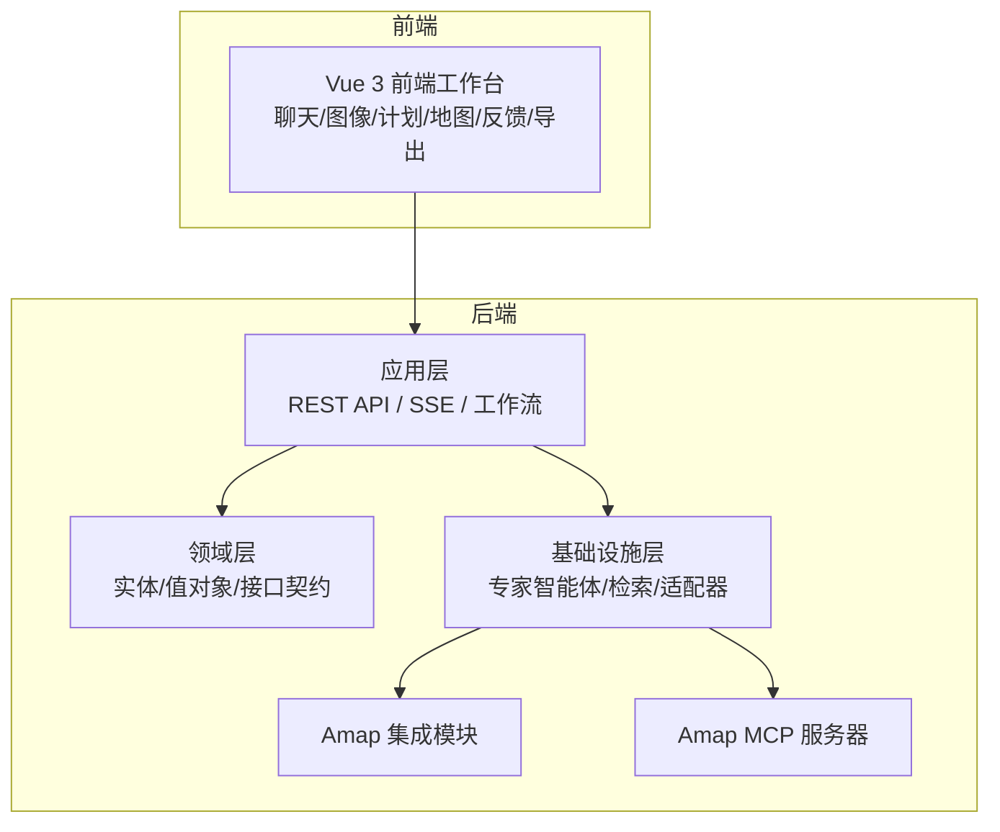
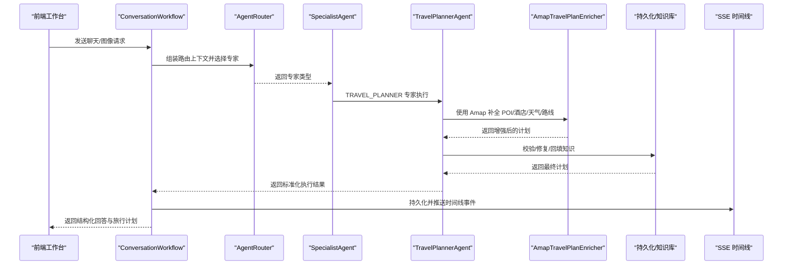
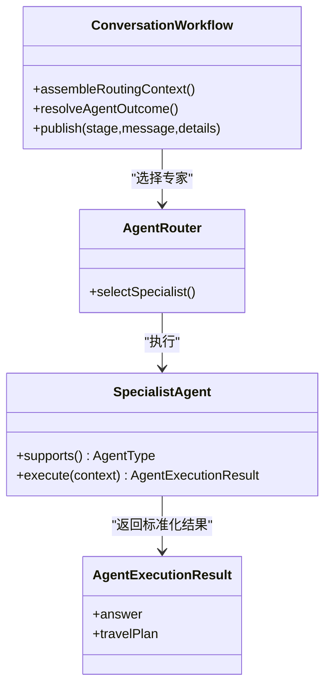
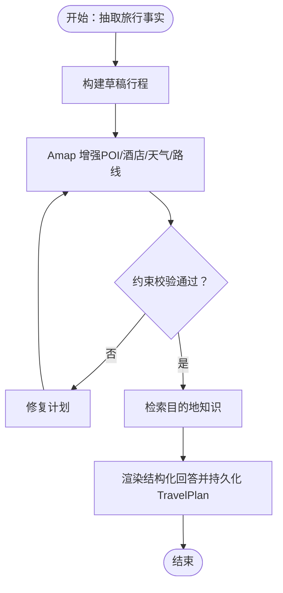
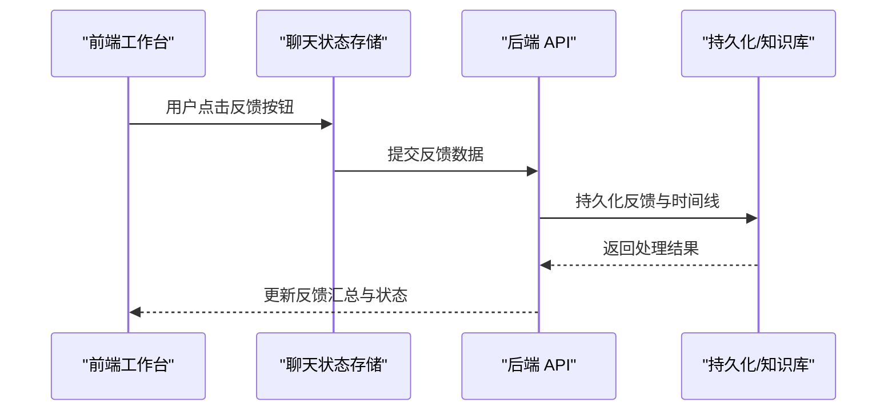
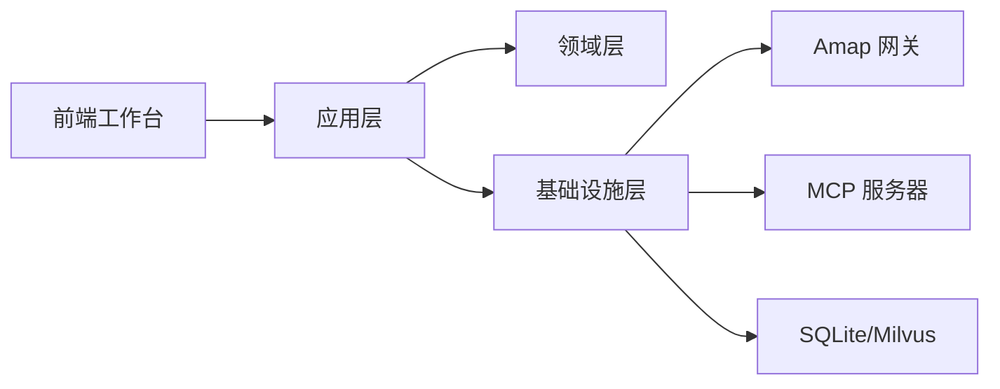

# 项目介绍与愿景

<cite>
**本文引用的文件**
- [README.md](file://README.md)
- [README.zh-CN.md](file://README.zh-CN.md)
- [docs/system-architecture.md](file://docs/system-architecture.md)
- [agent.md](file://agent.md)
- [docs/knowledge-rag.md](file://docs/knowledge-rag.md)
- [docs/multimodal-roadmap.md](file://docs/multimodal-roadmap.md)
- [docs/operations.md](file://docs/operations.md)
- [CONTRIBUTING.md](file://CONTRIBUTING.md)
- [travel-agent-app/src/main/java/com/travalagent/app/service/ConversationWorkflow.java](file://travel-agent-app/src/main/java/com/travalagent/app/service/ConversationWorkflow.java)
- [travel-agent-domain/src/main/java/com/travalagent/domain/service/SpecialistAgent.java](file://travel-agent-domain/src/main/java/com/travalagent/domain/service/SpecialistAgent.java)
- [travel-agent-infrastructure/src/main/java/com/travalagent/infrastructure/gateway/llm/AmapTravelPlanEnricher.java](file://travel-agent-infrastructure/src/main/java/com/travalagent/infrastructure/gateway/llm/AmapTravelPlanEnricher.java)
- [travel-agent-infrastructure/src/main/java/com/travalagent/infrastructure/gateway/llm/TravelPlannerAgent.java](file://travel-agent-infrastructure/src/main/java/com/travalagent/infrastructure/gateway/llm/TravelPlannerAgent.java)
- [travel-agent-infrastructure/src/main/java/com/travalagent/infrastructure/gateway/llm/ConstraintDrivenTravelPlanBuilder.java](file://travel-agent-infrastructure/src/main/java/com/travalagent/infrastructure/gateway/llm/ConstraintDrivenTravelPlanBuilder.java)
- [web/src/components/FeedbackLoopPanel.vue](file://web/src/components/FeedbackLoopPanel.vue)
- [web/src/stores/chat.ts](file://web/src/stores/chat.ts)
</cite>

## 目录
1. [引言](#引言)
2. [项目结构](#项目结构)
3. [核心组件](#核心组件)
4. [架构总览](#架构总览)
5. [详细组件分析](#详细组件分析)
6. [依赖关系分析](#依赖关系分析)
7. [性能考量](#性能考量)
8. [故障排查指南](#故障排查指南)
9. [结论](#结论)
10. [附录](#附录)

## 引言
TravelAgent 是一个面向旅行规划的多智能体工作空间，旨在将“自由形式聊天”和“旅行截图”转化为可执行、可优化、可复用的结构化行程。项目的核心使命是：以产品化工作流程替代传统旅行助手“单答案”的局限，通过专家智能体路由、Amap 地理数据增强、结构化旅行计划、内联回馈收集与旅行手账导出，帮助用户从“想到”到“可行”，再到“可分享”。

项目愿景：
- 让旅行规划从“凭感觉”走向“可落地”。通过专家智能体路由与结构化计划，将模糊需求转化为清晰、可行、可验证的行程。
- 让旅行体验从“一次性问答”升级为“可迭代工作流”。通过内联回馈与执行可见性，持续优化行程质量。
- 让旅行成果从“文字记录”进化为“可分享的视觉资产”。通过旅行手账导出，提升保存与传播效率。

## 项目结构
TravelAgent 采用分层与端口适配相结合的架构，围绕领域驱动设计（DDD）组织模块，确保业务规则与外部依赖解耦，便于演进与维护。

- travel-agent-domain：定义领域契约（实体、值对象、仓储接口、网关接口、服务契约），保持业务纯度。
- travel-agent-app：应用编排与工作流，提供 REST API、SSE 流、健康检查与知识种子初始化。
- travel-agent-infrastructure：具体实现层，包含 LLM 专家智能体、检索、持久化适配器、校验器、修复器、规划增强器等。
- travel-agent-amap：Amap HTTP 集成模块，通过领域网关暴露地理能力。
- travel-agent-amap-mcp-server：独立 MCP 服务器，提供 Amap 工具服务。
- web：Vue 3 前端工作台，负责聊天、图像上传、计划/地图面板、反馈动作与旅行手账导出。
- scripts/docs/data/logs：辅助脚本、知识准备、文档资产、本地数据与日志目录。

图表来源
- [docs/system-architecture.md:12-41](file://docs/system-architecture.md#L12-L41)
- [README.md:76-86](file://README.md#L76-L86)

章节来源
- [README.md:76-86](file://README.md#L76-L86)
- [docs/system-architecture.md:12-41](file://docs/system-architecture.md#L12-L41)

## 核心组件
- 专家智能体路由：根据对话上下文与意图，将请求路由至 WEATHER、GEO、TRAVEL_PLANNER、GENERAL 等专家，统一返回标准化执行结果。
- 结构化旅行计划：从抽取的旅行事实出发，构建每日行程、酒店建议、预算拆分与约束检查，形成可执行的 TravelPlan。
- Amap 地理数据增强：基于城市、POI、行政区中心、酒店区域提示与市内交通进行补全与校验。
- 知识检索与规划支持：优先 Milvus 向量检索，回退本地 JSON，结合目的地知识增强规划。
- 多模态输入与事实回流：支持旅行截图上传，提取旅行事实并通过用户确认后回流到规划链路。
- 内联回馈与执行可见性：在最新结果下方提供“接受/部分接受/拒绝”反馈，SSE 实时推送执行时间线事件。
- 旅行手账导出：将最终行程导出为长图，便于保存与分享。

章节来源
- [README.md:62-75](file://README.md#L62-L75)
- [agent.md:70-98](file://agent.md#L70-L98)
- [docs/knowledge-rag.md:67-119](file://docs/knowledge-rag.md#L67-L119)
- [docs/multimodal-roadmap.md:39-55](file://docs/multimodal-roadmap.md#L39-L55)

## 架构总览
系统采用 DDD 分层 + 端口适配模式，强调“职责清晰、边界明确、可替换适配器”。运行时工作流以编排式多智能体为核心，确保每个步骤可追踪、可验证、可修复。

图表来源
- [docs/system-architecture.md:30-41](file://docs/system-architecture.md#L30-L41)
- [agent.md:70-98](file://agent.md#L70-L98)
- [travel-agent-app/src/main/java/com/travalagent/app/service/ConversationWorkflow.java:375-498](file://travel-agent-app/src/main/java/com/travalagent/app/service/ConversationWorkflow.java#L375-L498)
- [travel-agent-domain/src/main/java/com/travalagent/domain/service/SpecialistAgent.java:7-12](file://travel-agent-domain/src/main/java/com/travalagent/domain/service/SpecialistAgent.java#L7-L12)
- [travel-agent-infrastructure/src/main/java/com/travalagent/infrastructure/gateway/llm/AmapTravelPlanEnricher.java:44-51](file://travel-agent-infrastructure/src/main/java/com/travalagent/infrastructure/gateway/llm/AmapTravelPlanEnricher.java#L44-L51)

章节来源
- [docs/system-architecture.md:30-41](file://docs/system-architecture.md#L30-L41)
- [agent.md:70-98](file://agent.md#L70-L98)

## 详细组件分析

### 专家智能体路由与编排
- ConversationWorkflow：负责意图识别、上下文组装、路由决策、专家执行、持久化与时间线发布；在每个阶段通过 TimelinePublisher 记录事件，前端通过 SSE 实时接收。
- AgentRouter：根据当前轮次的路由上下文选择最适合的专家类型（WEATHER/GEO/TRAVEL_PLANNER/GENERAL），必要时请求澄清。
- SpecialistAgent：统一的专家执行契约，返回标准化 AgentExecutionResult，保证上层编排一致性。

图表来源
- [agent.md:75-98](file://agent.md#L75-L98)
- [travel-agent-app/src/main/java/com/travalagent/app/service/ConversationWorkflow.java:375-498](file://travel-agent-app/src/main/java/com/travalagent/app/service/ConversationWorkflow.java#L375-L498)
- [travel-agent-domain/src/main/java/com/travalagent/domain/service/SpecialistAgent.java:7-12](file://travel-agent-domain/src/main/java/com/travalagent/domain/service/SpecialistAgent.java#L7-L12)

章节来源
- [agent.md:70-98](file://agent.md#L70-L98)
- [travel-agent-app/src/main/java/com/travalagent/app/service/ConversationWorkflow.java:375-498](file://travel-agent-app/src/main/java/com/travalagent/app/service/ConversationWorkflow.java#L375-L498)

### 结构化旅行计划与规划流水线
- ConstraintDrivenTravelPlanBuilder：从抽取的旅行事实出发，构建草稿行程、初始化天数模板、放置停靠点、填充默认值、推荐酒店区域、估算预算与约束检查，最终生成 TravelPlan。
- TravelPlannerAgent：在规划过程中执行“补全-Amap 增强、校验、修复、再校验”的循环，确保计划在预算、开放时间、节奏与重复点位等方面满足约束。
- AmapTravelPlanEnricher：对旅行计划进行 Amap 地理数据增强，包括 POI、行政区、酒店区域与市内交通补全。

图表来源
- [docs/system-architecture.md:118-129](file://docs/system-architecture.md#L118-L129)
- [travel-agent-infrastructure/src/main/java/com/travalagent/infrastructure/gateway/llm/ConstraintDrivenTravelPlanBuilder.java:55-84](file://travel-agent-infrastructure/src/main/java/com/travalagent/infrastructure/gateway/llm/ConstraintDrivenTravelPlanBuilder.java#L55-L84)
- [travel-agent-infrastructure/src/main/java/com/travalagent/infrastructure/gateway/llm/TravelPlannerAgent.java:139-166](file://travel-agent-infrastructure/src/main/java/com/travalagent/infrastructure/gateway/llm/TravelPlannerAgent.java#L139-L166)
- [travel-agent-infrastructure/src/main/java/com/travalagent/infrastructure/gateway/llm/AmapTravelPlanEnricher.java:44-51](file://travel-agent-infrastructure/src/main/java/com/travalagent/infrastructure/gateway/llm/AmapTravelPlanEnricher.java#L44-L51)

章节来源
- [docs/system-architecture.md:118-129](file://docs/system-architecture.md#L118-L129)
- [travel-agent-infrastructure/src/main/java/com/travalagent/infrastructure/gateway/llm/ConstraintDrivenTravelPlanBuilder.java:55-84](file://travel-agent-infrastructure/src/main/java/com/travalagent/infrastructure/gateway/llm/ConstraintDrivenTravelPlanBuilder.java#L55-L84)
- [travel-agent-infrastructure/src/main/java/com/travalagent/infrastructure/gateway/llm/TravelPlannerAgent.java:139-166](file://travel-agent-infrastructure/src/main/java/com/travalagent/infrastructure/gateway/llm/TravelPlannerAgent.java#L139-L166)

### 多模态输入与事实回流
- 多模态路线图明确了“图像输入优先”的策略：上传图像后，系统将其转换为旅行相关的结构化上下文，并与现有路由、记忆、校验、修复与生成流程无缝衔接。
- 用户可在确认后将提取的事实回流到规划链路，从而减少手动输入、降低歧义。

章节来源
- [docs/multimodal-roadmap.md:39-55](file://docs/multimodal-roadmap.md#L39-L55)

### 知识检索与目的地支持
- 检索策略：优先 Milvus 向量搜索，回退本地 JSON 文件；查询计划包含目的地、主题推断、语义查询与结构化过滤。
- 清洗与分块：对 Wikivoyage 数据进行清洗与分块，按城市与主题（景点、活动、美食、夜生活、住宿、交通）组织，控制每城市每主题的记录上限，提升检索准确性与稳定性。

章节来源
- [docs/knowledge-rag.md:67-119](file://docs/knowledge-rag.md#L67-L119)

### 内联回馈与执行可见性
- 前端在最新结果下方提供“接受/部分接受/拒绝”反馈按钮，支持即时闭环。
- SSE 实时推送执行时间线事件，用户可在前端查看规划步骤与状态，便于调试与优化。
- 后端提供反馈汇总视图与导出 API，便于离线分析与产品迭代。

图表来源
- [web/src/components/FeedbackLoopPanel.vue:107-155](file://web/src/components/FeedbackLoopPanel.vue#L107-L155)
- [web/src/stores/chat.ts:120-164](file://web/src/stores/chat.ts#L120-L164)

章节来源
- [web/src/components/FeedbackLoopPanel.vue:107-155](file://web/src/components/FeedbackLoopPanel.vue#L107-L155)
- [web/src/stores/chat.ts:120-164](file://web/src/stores/chat.ts#L120-L164)

## 依赖关系分析
- 模块耦合与内聚：领域层仅定义契约，应用层负责编排，基础设施层实现具体能力，Amap 与 MCP 作为外部依赖通过网关隔离，具备良好内聚与低耦合。
- 外部依赖与集成点：OpenAI 兼容聊天/嵌入、SQLite/可选 Milvus、Amap OpenAPI、MCP 工具服务。
- 运行时开关：工具提供者（LOCAL/MCP）、长期记忆提供者（AUTO/SQLITE/MILVUS）与知识检索偏好，均可通过配置切换。

图表来源
- [docs/system-architecture.md:12-41](file://docs/system-architecture.md#L12-L41)

章节来源
- [docs/system-architecture.md:12-41](file://docs/system-architecture.md#L12-L41)

## 性能考量
- 显式规划流水线优于黑箱提示链：便于定位瓶颈、插入缓存与优化关键步骤。
- Amap 增强与检索策略：优先 Milvus 向量检索，回退本地 JSON，减少跨网络延迟；清洗与分块策略提升命中率与召回质量。
- SSE 实时推送：前端按需订阅时间线事件，避免长轮询带来的开销。
- 多模态输入：图像上传与事实提取应尽量在后端完成，前端仅负责交互与展示，降低带宽与计算压力。

## 故障排查指南
- 启动与健康检查：后端提供健康端点与烟测集成测试，验证聊天接口返回 TRAVEL_PLANNER 类型与结构化旅行计划。
- 日志与导出：运行日志与反馈导出分别归档于 logs/ 与 data/exports/，遵循输出规范，避免污染根目录。
- 环境变量：确保 OpenAI API Key、Amap API Key、前端地图密钥等配置正确，否则会影响聊天、检索与地理增强功能。
- 离线反馈分析：通过 Python 脚本读取 SQLite 数据库，生成 JSON 与 Markdown 报告，用于评估计划接受度与约束满足情况。

章节来源
- [README.md:228-235](file://README.md#L228-L235)
- [docs/operations.md:5-23](file://docs/operations.md#L5-L23)
- [CONTRIBUTING.md:11-29](file://CONTRIBUTING.md#L11-L29)

## 结论
TravelAgent 以“产品化工作流”为核心，通过专家智能体路由、结构化旅行计划、Amap 地理增强、多模态输入与内联回馈，将旅行规划从“单次问答”升级为“可执行、可优化、可分享”的完整旅程。其前瞻性的架构设计与清晰的模块边界，既保障了技术可演进性，也为非技术读者提供了易于理解的价值与意义：让旅行更落地、更可迭代、更易分享。

## 附录
- 快速开始与常用命令：后端启动、前端开发、MCP 服务、测试与构建、离线反馈分析等。
- 已知限制与未来改进：当前最强的落地路径依赖 Amap，适合中国场景；检索片段仍需更 Planner 友好的结构；酒店与路线回退行为偏向实用而非实时库存级；整体效果依赖模型与地图提供商配置。

章节来源
- [README.md:141-227](file://README.md#L141-L227)
- [README.zh-CN.md:142-228](file://README.zh-CN.md#L142-L228)
- [README.md:274-288](file://README.md#L274-L288)
- [README.zh-CN.md:275-289](file://README.zh-CN.md#L275-L289)