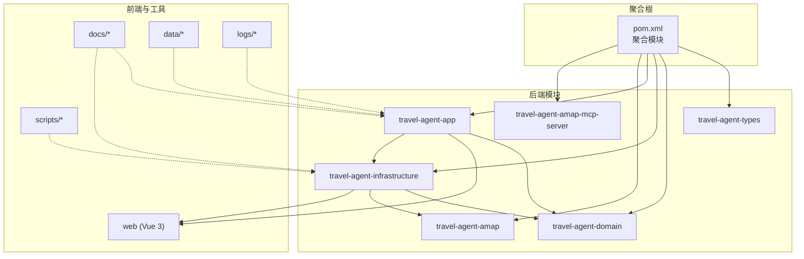
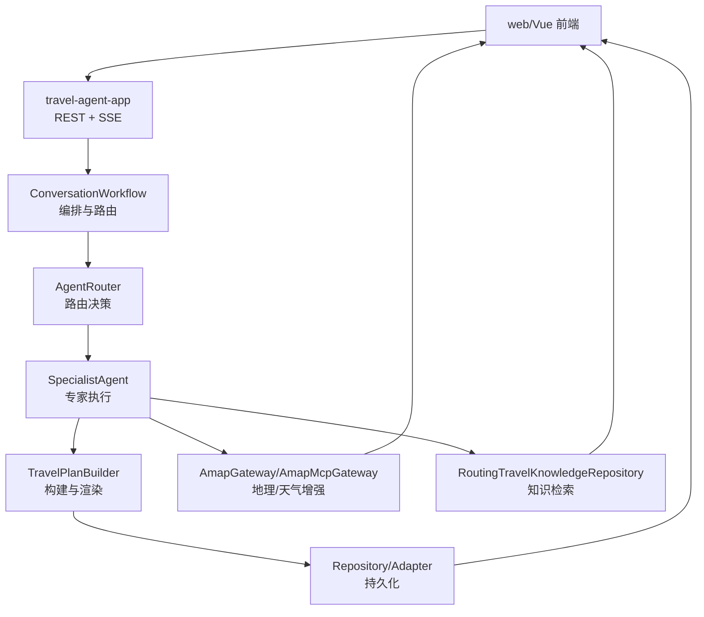
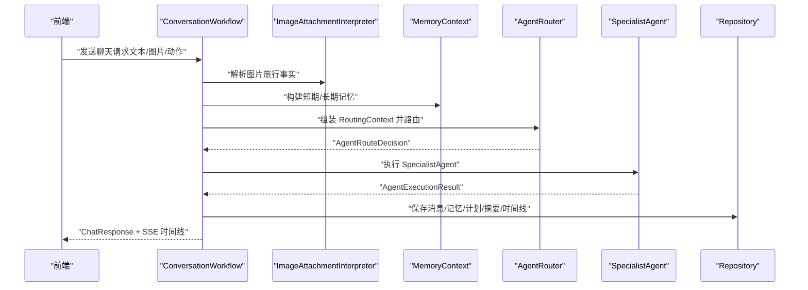
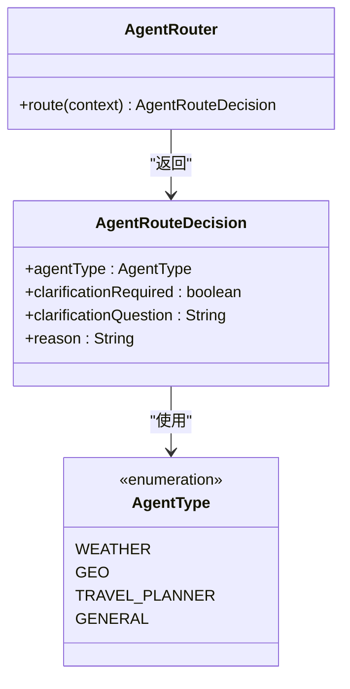
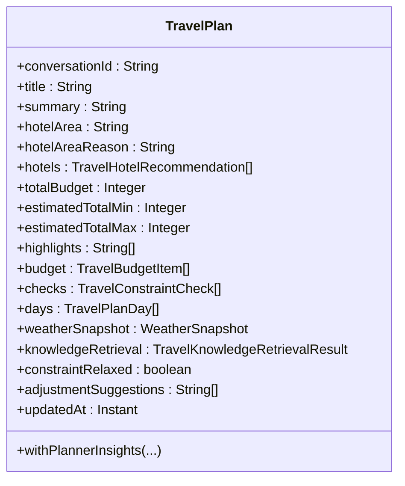
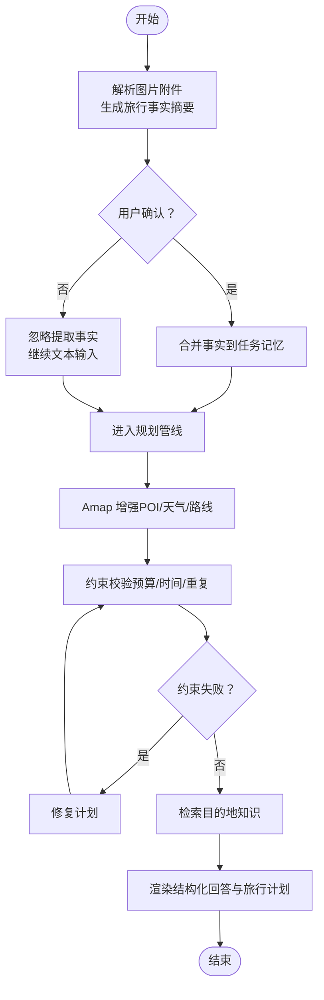
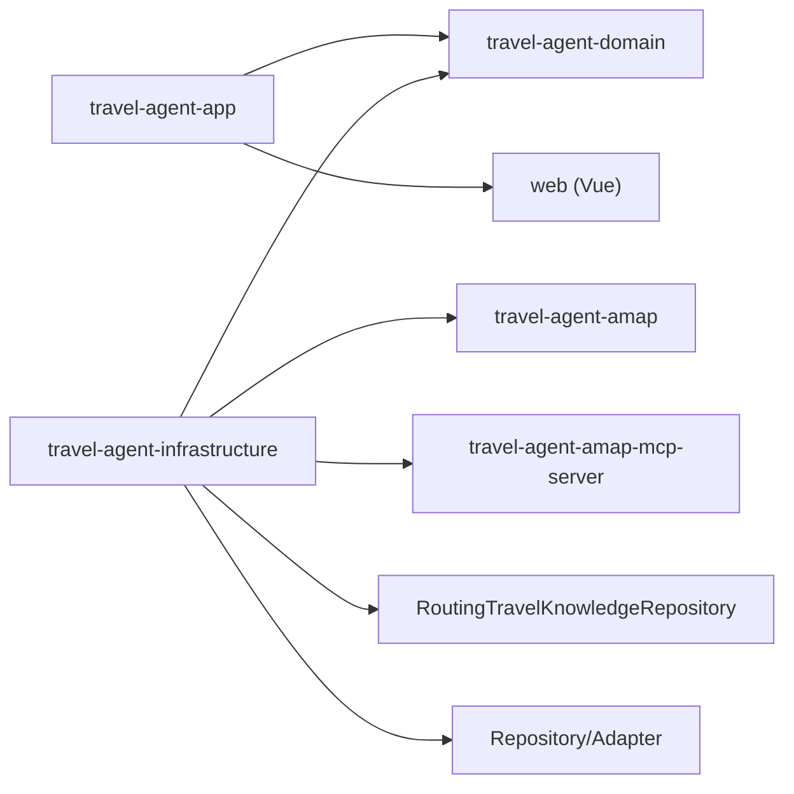

# 项目概述

<cite>
**本文引用的文件**
- [README.md](file://README.md)
- [README.zh-CN.md](file://README.zh-CN.md)
- [agent.md](file://agent.md)
- [docs/system-architecture.md](file://docs/system-architecture.md)
- [docs/knowledge-rag.md](file://docs/knowledge-rag.md)
- [docs/multimodal-roadmap.md](file://docs/multimodal-roadmap.md)
- [docs/operations.md](file://docs/operations.md)
- [CONTRIBUTING.md](file://CONTRIBUTING.md)
- [SECURITY.md](file://SECURITY.md)
- [pom.xml](file://pom.xml)
- [travel-agent-app/src/main/java/com/travalagent/app/service/ConversationWorkflow.java](file://travel-agent-app/src/main/java/com/travalagent/app/service/ConversationWorkflow.java)
- [travel-agent-domain/src/main/java/com/travalagent/domain/service/AgentRouter.java](file://travel-agent-domain/src/main/java/com/travalagent/domain/service/AgentRouter.java)
- [travel-agent-domain/src/main/java/com/travalagent/domain/model/entity/TravelPlan.java](file://travel-agent-domain/src/main/java/com/travalagent/domain/model/entity/TravelPlan.java)
- [travel-agent-domain/src/main/java/com/travalagent/domain/model/valobj/AgentType.java](file://travel-agent-domain/src/main/java/com/travalagent/domain/model/valobj/AgentType.java)
</cite>

## 目录
1. [引言](#引言)
2. [项目结构](#项目结构)
3. [核心组件](#核心组件)
4. [架构总览](#架构总览)
5. [详细组件分析](#详细组件分析)
6. [依赖关系分析](#依赖关系分析)
7. [性能考量](#性能考量)
8. [故障排查指南](#故障排查指南)
9. [结论](#结论)
10. [附录](#附录)

## 引言
TravelAgent 是一个全栈旅行规划工作空间，旨在将用户的自然语言旅行请求与旅行截图转化为结构化、可执行的行程。项目强调“产品化工作流”，通过专家智能体路由、高德地图数据增强、结构化规划与验证修复、知识检索、时间线流式输出与推荐反馈等能力，形成从意图识别到可落地计划的闭环。

- 核心愿景：让旅行规划从“一次性问答”升级为“可追踪、可优化、可导出”的结构化工作流。
- 主要目标：提供稳定、可解释、可扩展的旅行规划体验；支持多模态输入（文本+图片）；在中文场景下具备强落地能力。
- 价值主张：以 DDD 分层 + 端口-适配器为核心架构，结合专家路由与显式规划管线，提升规划的稳定性与可演进性。

章节来源
- [README.md:36-46](file://README.md#L36-L46)
- [README.zh-CN.md:36-47](file://README.zh-CN.md#L36-L47)

## 项目结构
项目采用多模块 Maven 聚合结构，围绕领域驱动设计与端口-适配器模式组织代码，前后端分离，文档与脚本配套完善。

图表来源
- [pom.xml:22-29](file://pom.xml#L22-L29)
- [README.md:236-261](file://README.md#L236-L261)
- [README.zh-CN.md:237-250](file://README.zh-CN.md#L237-L250)

章节来源
- [pom.xml:1-58](file://pom.xml#L1-L58)
- [README.md:236-261](file://README.md#L236-L261)
- [README.zh-CN.md:237-250](file://README.zh-CN.md#L237-L250)

## 核心组件
- 专家路由与编排：ConversationWorkflow 负责意图分析、上下文组装、路由决策、专家执行、记忆更新与计划持久化。
- 专家智能体：WEATHER、GEO、TRAVEL_PLANNER、GENERAL 四类专家，统一执行契约 AgentExecutionResult。
- 结构化行程：TravelPlan 记录标题、摘要、每日行程、预算、约束检查、天气快照、知识检索结果等。
- 多模态输入：图像附件解析与确认机制，将图片中的旅行事实注入规划上下文。
- 地图与知识：Amap 地理与天气增强、本地/向量检索的知识库支持。

章节来源
- [agent.md:70-100](file://agent.md#L70-L100)
- [agent.md:85-93](file://agent.md#L85-L93)
- [travel-agent-domain/src/main/java/com/travalagent/domain/model/entity/TravelPlan.java:9-106](file://travel-agent-domain/src/main/java/com/travalagent/domain/model/entity/TravelPlan.java#L9-L106)
- [travel-agent-domain/src/main/java/com/travalagent/domain/model/valobj/AgentType.java:1-9](file://travel-agent-domain/src/main/java/com/travalagent/domain/model/valobj/AgentType.java#L1-L9)

## 架构总览
系统遵循 DDD 启发的分层设计与端口-适配器模式：
- 领域层（travel-agent-domain）：实体、值对象、仓储接口、网关接口、服务契约，保持业务纯净。
- 应用层（travel-agent-app）：API、SSE、工作流编排、会话与计划持久化。
- 基础设施层（travel-agent-infrastructure）：LLM 代理、检索、持久化适配器、验证/修复器、规划增强器。
- 地图集成（travel-agent-amap 与 travel-agent-amap-mcp-server）：Amap HTTP 与 MCP 工具链。
- 前端（web）：Vue 3 工作台，支持聊天、图片上传、计划面板、反馈与导出。

图表来源
- [docs/system-architecture.md:12-42](file://docs/system-architecture.md#L12-L42)
- [agent.md:70-93](file://agent.md#L70-L93)

章节来源
- [docs/system-architecture.md:12-42](file://docs/system-architecture.md#L12-L42)
- [agent.md:70-100](file://agent.md#L70-L100)

## 详细组件分析

### 专家路由与编排（ConversationWorkflow）
- 输入处理：规范化文本与图片附件，支持多图上传、Base64 校验、大小与类型限制。
- 图像上下文：提取图片中的旅行事实，生成摘要与结构化事实；支持“确认/忽略”两阶段，将已确认事实合并到规划记忆。
- 记忆与总结：短期窗口记忆、长期记忆召回、摘要阈值触发；更新任务记忆与会话摘要。
- 路由与执行：根据 RoutingContext 选择专家（WEATHER/GEO/TRAVEL_PLANNER/GENERAL），执行 SpecialistAgent 并返回统一 AgentExecutionResult。
- 输出与持久化：保存消息、任务记忆、旅行计划、会话摘要与时间线事件；通过 SSE 推送执行阶段事件。

图表来源
- [travel-agent-app/src/main/java/com/travalagent/app/service/ConversationWorkflow.java:106-160](file://travel-agent-app/src/main/java/com/travalagent/app/service/ConversationWorkflow.java#L106-L160)
- [travel-agent-app/src/main/java/com/travalagent/app/service/ConversationWorkflow.java:348-406](file://travel-agent-app/src/main/java/com/travalagent/app/service/ConversationWorkflow.java#L348-L406)
- [travel-agent-app/src/main/java/com/travalagent/app/service/ConversationWorkflow.java:408-486](file://travel-agent-app/src/main/java/com/travalagent/app/service/ConversationWorkflow.java#L408-L486)

章节来源
- [travel-agent-app/src/main/java/com/travalagent/app/service/ConversationWorkflow.java:106-160](file://travel-agent-app/src/main/java/com/travalagent/app/service/ConversationWorkflow.java#L106-L160)
- [travel-agent-app/src/main/java/com/travalagent/app/service/ConversationWorkflow.java:348-406](file://travel-agent-app/src/main/java/com/travalagent/app/service/ConversationWorkflow.java#L348-L406)
- [travel-agent-app/src/main/java/com/travalagent/app/service/ConversationWorkflow.java:408-486](file://travel-agent-app/src/main/java/com/travalagent/app/service/ConversationWorkflow.java#L408-L486)

### 专家智能体与路由接口（AgentRouter）
- AgentRouter 接口定义路由决策入口，接收 RoutingContext 并返回 AgentRouteDecision。
- AgentType 枚举定义 WEATHER、GEO、TRAVEL_PLANNER、GENERAL 四类专家。
- 路由决策可携带澄清需求与问题，保障规划起点质量。

图表来源
- [travel-agent-domain/src/main/java/com/travalagent/domain/service/AgentRouter.java:1-10](file://travel-agent-domain/src/main/java/com/travalagent/domain/service/AgentRouter.java#L1-L10)
- [travel-agent-domain/src/main/java/com/travalagent/domain/model/valobj/AgentType.java:1-9](file://travel-agent-domain/src/main/java/com/travalagent/domain/model/valobj/AgentType.java#L1-L9)

章节来源
- [travel-agent-domain/src/main/java/com/travalagent/domain/service/AgentRouter.java:1-10](file://travel-agent-domain/src/main/java/com/travalagent/domain/service/AgentRouter.java#L1-L10)
- [travel-agent-domain/src/main/java/com/travalagent/domain/model/valobj/AgentType.java:1-9](file://travel-agent-domain/src/main/java/com/travalagent/domain/model/valobj/AgentType.java#L1-L9)

### 结构化行程模型（TravelPlan）
- 旅行计划实体包含标题、摘要、每日行程、预算明细、约束检查、天气快照、知识检索结果、调整建议等字段。
- 提供不可变副本构造与洞察增强方法，便于在规划管线中逐步填充与渲染。

图表来源
- [travel-agent-domain/src/main/java/com/travalagent/domain/model/entity/TravelPlan.java:9-106](file://travel-agent-domain/src/main/java/com/travalagent/domain/model/entity/TravelPlan.java#L9-L106)

章节来源
- [travel-agent-domain/src/main/java/com/travalagent/domain/model/entity/TravelPlan.java:9-106](file://travel-agent-domain/src/main/java/com/travalagent/domain/model/entity/TravelPlan.java#L9-L106)

### 多模态输入与知识检索
- 多模态路线图：以图片输入为主，将截图中的旅行事实抽取为结构化上下文，经用户确认后进入规划流程。
- 知识检索：优先 Milvus 向量检索，回退本地 JSON 数据集；检索计划包含目的地硬约束、主题过滤与本地评分策略。

图表来源
- [docs/multimodal-roadmap.md:1-88](file://docs/multimodal-roadmap.md#L1-L88)
- [docs/knowledge-rag.md:67-137](file://docs/knowledge-rag.md#L67-L137)

章节来源
- [docs/multimodal-roadmap.md:1-88](file://docs/multimodal-roadmap.md#L1-L88)
- [docs/knowledge-rag.md:67-137](file://docs/knowledge-rag.md#L67-L137)

## 依赖关系分析
- 模块耦合：应用层依赖领域层契约，基础设施层实现具体适配器；地图与 MCP 作为外部依赖通过网关解耦。
- 运行时开关：工具提供者（LOCAL/MCP）、长期记忆提供者（AUTO/SQLITE/MILVUS）可通过配置切换。
- 外部依赖：OpenAI 兼容聊天/嵌入、SQLite、本地 JSON 知识、可选 Milvus、Amap OpenAPI。

图表来源
- [docs/system-architecture.md:12-42](file://docs/system-architecture.md#L12-L42)

章节来源
- [docs/system-architecture.md:12-42](file://docs/system-architecture.md#L12-L42)

## 性能考量
- 显式规划管线优于黑盒提示链，便于定位瓶颈与优化关键路径（抽取、增强、校验、修复、检索）。
- 多模态输入的图片解析与确认流程应尽量减少不必要的重复计算，优先缓存与增量更新。
- 知识检索建议按主题与目的地进行结构化过滤，降低无关候选数量，提高命中质量与速度。
- SSE 时间线推送应控制事件粒度与频率，避免前端渲染压力过大。

## 故障排查指南
- 启动与健康：后端提供健康检查端点，集成测试覆盖启动、健康与聊天返回类型。
- 离线评估：通过 Python 脚本读取 SQLite 数据库，生成 JSON 与 Markdown 报告，辅助离线反馈分析。
- 日志与导出：运行日志与导出文件分别置于 logs/ 与 data/exports/，避免混入仓库根目录。
- 安全与密钥：严禁提交密钥、本地环境文件、日志与数据库文件；发现泄露需立即轮换并清理历史。

章节来源
- [README.md:228-235](file://README.md#L228-L235)
- [docs/operations.md:5-78](file://docs/operations.md#L5-L78)
- [SECURITY.md:29-58](file://SECURITY.md#L29-L58)

## 结论
TravelAgent 将多智能体路由、结构化规划、地图增强与知识检索有机结合，形成可解释、可追踪、可优化的旅行规划工作流。其 DDD 分层与端口-适配器架构保证了领域逻辑的纯净与外部依赖的可替换性；显式的规划管线与多模态输入进一步提升了落地能力与用户体验。项目在中文场景下具备较强优势，同时持续迭代检索与规划器 Schema，以提升跨场景适用性与稳定性。

## 附录
- 快速开始与常用命令参见项目自述文件与贡献指南。
- 系统架构、知识检索与多模态路线图详见 docs 目录文档。

章节来源
- [README.md:141-227](file://README.md#L141-L227)
- [CONTRIBUTING.md:11-74](file://CONTRIBUTING.md#L11-L74)
- [docs/system-architecture.md:1-50](file://docs/system-architecture.md#L1-L50)
- [docs/knowledge-rag.md:1-137](file://docs/knowledge-rag.md#L1-L137)
- [docs/multimodal-roadmap.md:1-88](file://docs/multimodal-roadmap.md#L1-L88)