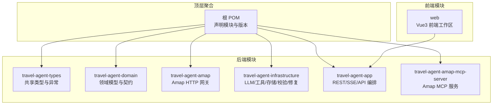
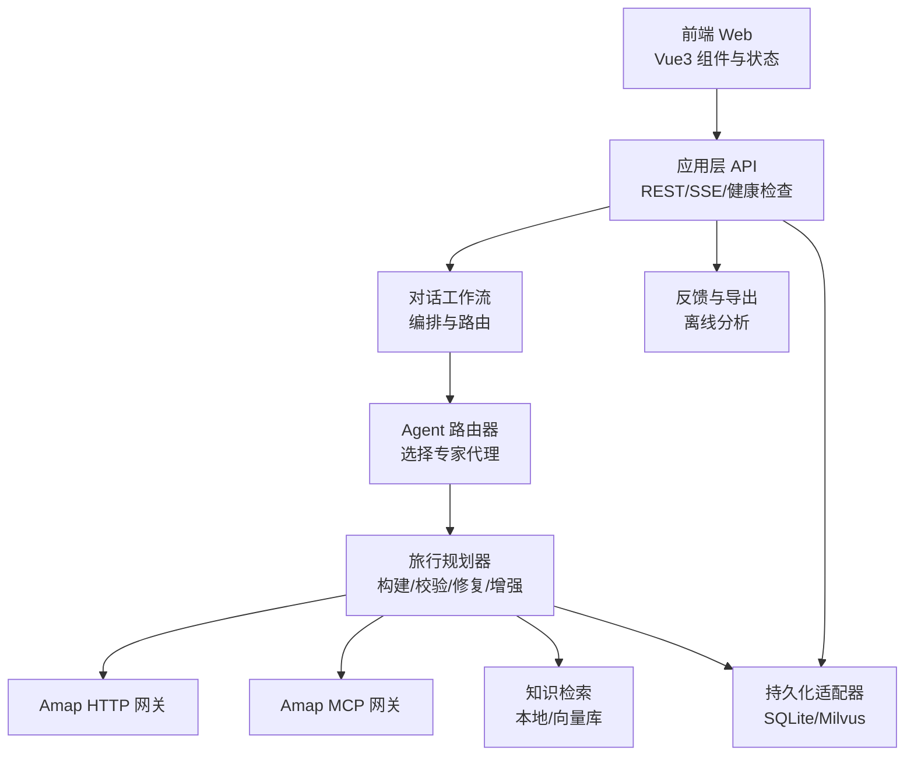
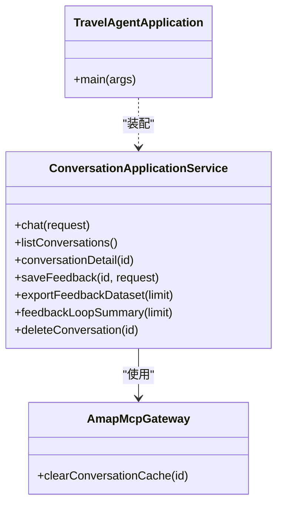
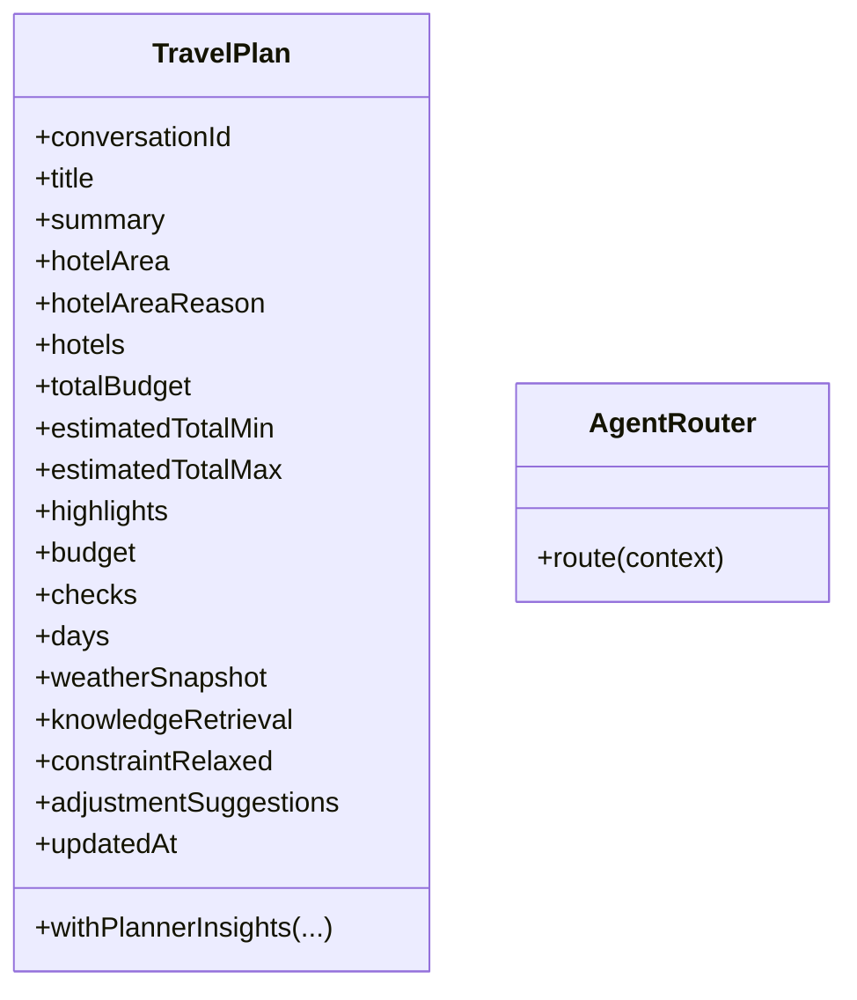
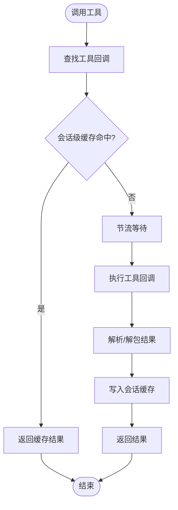
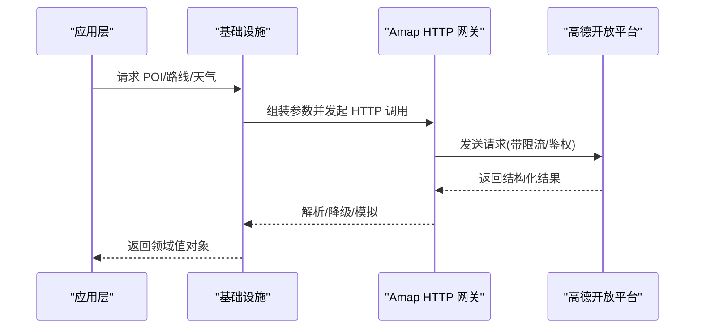
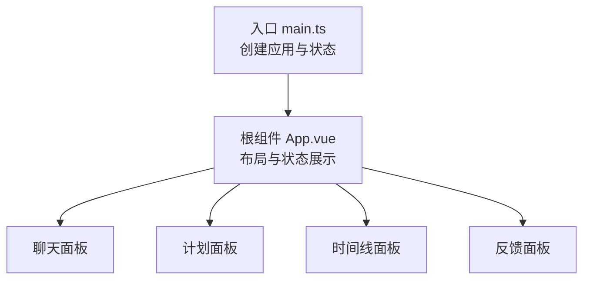
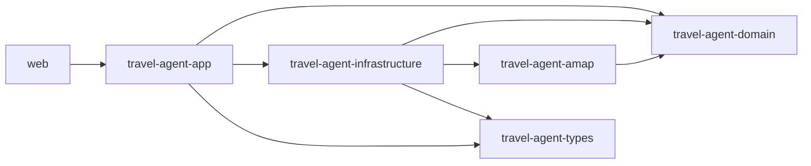

# 项目结构说明

<cite>
**本文引用的文件**
- [pom.xml](file://pom.xml)
- [README.md](file://README.md)
- [docs/system-architecture.md](file://docs/system-architecture.md)
- [travel-agent-app/pom.xml](file://travel-agent-app/pom.xml)
- [travel-agent-app/src/main/java/com/travalagent/app/TravelAgentApplication.java](file://travel-agent-app/src/main/java/com/travalagent/app/TravelAgentApplication.java)
- [travel-agent-app/src/main/java/com/travalagent/app/service/ConversationApplicationService.java](file://travel-agent-app/src/main/java/com/travalagent/app/service/ConversationApplicationService.java)
- [travel-agent-domain/pom.xml](file://travel-agent-domain/pom.xml)
- [travel-agent-domain/src/main/java/com/travalagent/domain/model/entity/TravelPlan.java](file://travel-agent-domain/src/main/java/com/travalagent/domain/model/entity/TravelPlan.java)
- [travel-agent-domain/src/main/java/com/travalagent/domain/service/AgentRouter.java](file://travel-agent-domain/src/main/java/com/travalagent/domain/service/AgentRouter.java)
- [travel-agent-infrastructure/pom.xml](file://travel-agent-infrastructure/pom.xml)
- [travel-agent-infrastructure/src/main/java/com/travalagent/infrastructure/gateway/tool/AmapMcpGateway.java](file://travel-agent-infrastructure/src/main/java/com/travalagent/infrastructure/gateway/tool/AmapMcpGateway.java)
- [travel-agent-infrastructure/src/main/java/com/travalagent/infrastructure/repository/SqliteConversationRepository.java](file://travel-agent-infrastructure/src/main/java/com/travalagent/infrastructure/repository/SqliteConversationRepository.java)
- [travel-agent-amap/pom.xml](file://travel-agent-amap/pom.xml)
- [travel-agent-amap/src/main/java/com/travalagent/amap/gateway/AmapHttpGateway.java](file://travel-agent-amap/src/main/java/com/travalagent/amap/gateway/AmapHttpGateway.java)
- [travel-agent-amap-mcp-server/pom.xml](file://travel-agent-amap-mcp-server/pom.xml)
- [travel-agent-types/pom.xml](file://travel-agent-types/pom.xml)
- [web/package.json](file://web/package.json)
- [web/src/main.ts](file://web/src/main.ts)
- [web/src/App.vue](file://web/src/App.vue)
</cite>

## 目录
1. [引言](#引言)
2. [项目结构](#项目结构)
3. [核心组件](#核心组件)
4. [架构总览](#架构总览)
5. [详细组件分析](#详细组件分析)
6. [依赖分析](#依赖分析)
7. [性能考虑](#性能考虑)
8. [故障排查指南](#故障排查指南)
9. [结论](#结论)
10. [附录](#附录)

## 引言
本项目采用分层与端到端解耦的设计理念，围绕“旅行规划”这一核心业务域，构建了从前端到后端、从应用编排到基础设施实现的完整体系。项目通过模块化拆分，明确划分应用层（API与工作流编排）、领域层（核心业务模型与契约）、基础设施层（技术实现与适配器），并辅以类型与工具模块，确保可测试性、可演进性和可观测性。

## 项目结构
项目采用 Maven 多模块聚合结构，顶层 POM 声明了六大核心模块，并统一管理版本与仓库。各模块职责清晰，边界明确，遵循“领域驱动设计”的端口与适配器思想。

图表来源
- [pom.xml:22-29](file://pom.xml#L22-L29)
- [travel-agent-app/pom.xml:16-31](file://travel-agent-app/pom.xml#L16-L31)
- [travel-agent-domain/pom.xml:16-21](file://travel-agent-domain/pom.xml#L16-L21)
- [travel-agent-amap/pom.xml:16-21](file://travel-agent-amap/pom.xml#L16-L21)
- [travel-agent-infrastructure/pom.xml:16-31](file://travel-agent-infrastructure/pom.xml#L16-L31)
- [travel-agent-amap-mcp-server/pom.xml:16-21](file://travel-agent-amap-mcp-server/pom.xml#L16-L21)
- [travel-agent-types/pom.xml:12-15](file://travel-agent-types/pom.xml#L12-L15)

章节来源
- [pom.xml:22-29](file://pom.xml#L22-L29)
- [README.md:236-261](file://README.md#L236-L261)

## 核心组件
- 应用层（travel-agent-app）
  - 职责：提供 REST API、SSE 流式输出、健康检查、知识种子初始化；编排对话工作流；封装对外 DTO；集成基础设施能力。
  - 关键点：启动类扫描基础包；服务层负责聊天、会话列表、详情、反馈保存与导出、删除会话等；与基础设施层的 MCP 网关交互。
- 领域层（travel-agent-domain）
  - 职责：定义核心业务模型（实体、值对象、事件）、仓储接口、网关接口、路由策略契约。
  - 关键点：如旅行计划实体记录行程、预算、约束检查、天气快照、知识检索结果等；AgentRouter 定义路由决策接口。
- 基础设施层（travel-agent-infrastructure）
  - 职责：实现具体的技术细节，包括 LLM 专家代理、检索、持久化适配器、验证与修复、Amap 工具调用（MCP）等。
  - 关键点：AmapMcpGateway 提供工具回调封装、缓存与节流；SqliteConversationRepository 实现会话、消息、任务记忆、反馈、旅行计划、时间线等持久化。
- Amap 模块（travel-agent-amap）
  - 职责：通过 HTTP 客户端对接高德开放平台，提供天气、地理编码、反向地理编码、路径规划、输入提示等能力。
  - 关键点：支持限流、错误降级与模拟返回；提供领域网关接口的实现。
- Amap MCP 服务器（travel-agent-amap-mcp-server）
  - 职责：独立运行的 MCP 服务，承载 Amap 工具能力，供应用侧通过工具回调调用。
- 类型与工具（travel-agent-types）
  - 职责：统一响应体、枚举与异常类型，避免重复定义。
- 前端（web）
  - 职责：Vue3 单页工作区，包含聊天面板、计划面板、时间线面板、反馈面板等；通过 API 与后端交互。

章节来源
- [travel-agent-app/src/main/java/com/travalagent/app/TravelAgentApplication.java:7-14](file://travel-agent-app/src/main/java/com/travalagent/app/TravelAgentApplication.java#L7-L14)
- [travel-agent-app/src/main/java/com/travalagent/app/service/ConversationApplicationService.java:34-50](file://travel-agent-app/src/main/java/com/travalagent/app/service/ConversationApplicationService.java#L34-L50)
- [travel-agent-domain/src/main/java/com/travalagent/domain/model/entity/TravelPlan.java:9-37](file://travel-agent-domain/src/main/java/com/travalagent/domain/model/entity/TravelPlan.java#L9-L37)
- [travel-agent-domain/src/main/java/com/travalagent/domain/service/AgentRouter.java:6-9](file://travel-agent-domain/src/main/java/com/travalagent/domain/service/AgentRouter.java#L6-L9)
- [travel-agent-infrastructure/src/main/java/com/travalagent/infrastructure/gateway/tool/AmapMcpGateway.java:28-47](file://travel-agent-infrastructure/src/main/java/com/travalagent/infrastructure/gateway/tool/AmapMcpGateway.java#L28-L47)
- [travel-agent-infrastructure/src/main/java/com/travalagent/infrastructure/repository/SqliteConversationRepository.java:36-54](file://travel-agent-infrastructure/src/main/java/com/travalagent/infrastructure/repository/SqliteConversationRepository.java#L36-L54)
- [travel-agent-amap/src/main/java/com/travalagent/amap/gateway/AmapHttpGateway.java:27-39](file://travel-agent-amap/src/main/java/com/travalagent/amap/gateway/AmapHttpGateway.java#L27-L39)
- [web/src/main.ts:1-7](file://web/src/main.ts#L1-L7)
- [web/src/App.vue:1-381](file://web/src/App.vue#L1-L381)

## 架构总览
系统采用“应用层编排 + 领域层建模 + 基础设施层实现”的分层架构，结合端口与适配器模式，将外部依赖（LLM、地图、存储）抽象为适配器，便于替换与测试。

图表来源
- [docs/system-architecture.md:12-41](file://docs/system-architecture.md#L12-L41)
- [README.md:76-128](file://README.md#L76-L128)

章节来源
- [docs/system-architecture.md:12-41](file://docs/system-architecture.md#L12-L41)
- [README.md:76-128](file://README.md#L76-L128)

## 详细组件分析

### 应用层（travel-agent-app）
- 启动与扫描
  - 使用 Spring Boot 注解扫描基础包，配置属性扫描，作为整个应用的入口。
- 服务编排
  - 对话应用服务负责聊天请求处理、会话列表、详情查询、反馈保存与导出、删除会话等；与 MCP 网关交互清理缓存。
- 依赖关系
  - 依赖领域层、基础设施层、类型层；引入 WebFlux、Actuator、Micrometer 等用于响应式与可观测性。

图表来源
- [travel-agent-app/src/main/java/com/travalagent/app/TravelAgentApplication.java:7-14](file://travel-agent-app/src/main/java/com/travalagent/app/TravelAgentApplication.java#L7-L14)
- [travel-agent-app/src/main/java/com/travalagent/app/service/ConversationApplicationService.java:34-50](file://travel-agent-app/src/main/java/com/travalagent/app/service/ConversationApplicationService.java#L34-L50)
- [travel-agent-infrastructure/src/main/java/com/travalagent/infrastructure/gateway/tool/AmapMcpGateway.java:95-100](file://travel-agent-infrastructure/src/main/java/com/travalagent/infrastructure/gateway/tool/AmapMcpGateway.java#L95-L100)

章节来源
- [travel-agent-app/src/main/java/com/travalagent/app/TravelAgentApplication.java:7-14](file://travel-agent-app/src/main/java/com/travalagent/app/TravelAgentApplication.java#L7-L14)
- [travel-agent-app/src/main/java/com/travalagent/app/service/ConversationApplicationService.java:34-50](file://travel-agent-app/src/main/java/com/travalagent/app/service/ConversationApplicationService.java#L34-L50)
- [travel-agent-app/pom.xml:16-31](file://travel-agent-app/pom.xml#L16-L31)

### 领域层（travel-agent-domain）
- 核心模型
  - 旅行计划实体包含行程摘要、预算、酒店区域建议、约束检查、每日行程、天气快照、知识检索结果等字段，并提供派生信息与不可变副本构造。
- 路由策略
  - AgentRouter 接口定义基于上下文的路由决策，为应用层选择合适的专家代理。
- 依赖关系
  - 依赖类型层，为上层提供统一的响应与异常类型。

图表来源
- [travel-agent-domain/src/main/java/com/travalagent/domain/model/entity/TravelPlan.java:9-103](file://travel-agent-domain/src/main/java/com/travalagent/domain/model/entity/TravelPlan.java#L9-L103)
- [travel-agent-domain/src/main/java/com/travalagent/domain/service/AgentRouter.java:6-9](file://travel-agent-domain/src/main/java/com/travalagent/domain/service/AgentRouter.java#L6-L9)

章节来源
- [travel-agent-domain/src/main/java/com/travalagent/domain/model/entity/TravelPlan.java:9-103](file://travel-agent-domain/src/main/java/com/travalagent/domain/model/entity/TravelPlan.java#L9-L103)
- [travel-agent-domain/src/main/java/com/travalagent/domain/service/AgentRouter.java:6-9](file://travel-agent-domain/src/main/java/com/travalagent/domain/service/AgentRouter.java#L6-L9)
- [travel-agent-domain/pom.xml:16-21](file://travel-agent-domain/pom.xml#L16-L21)

### 基础设施层（travel-agent-infrastructure）
- Amap MCP 网关
  - 封装工具回调提供者，按工具名分发参数，支持缓存、序列化与结果解析；内置最小调用间隔节流。
- 存储适配器
  - SqliteConversationRepository 实现会话、消息、任务记忆、反馈、旅行计划、时间线、长期记忆等的持久化与查询。
- 依赖关系
  - 依赖领域层与类型层；引入 Spring AI、Jackson、SQLite JDBC、Milvus 等。

图表来源
- [travel-agent-infrastructure/src/main/java/com/travalagent/infrastructure/gateway/tool/AmapMcpGateway.java:102-123](file://travel-agent-infrastructure/src/main/java/com/travalagent/infrastructure/gateway/tool/AmapMcpGateway.java#L102-L123)

章节来源
- [travel-agent-infrastructure/src/main/java/com/travalagent/infrastructure/gateway/tool/AmapMcpGateway.java:28-196](file://travel-agent-infrastructure/src/main/java/com/travalagent/infrastructure/gateway/tool/AmapMcpGateway.java#L28-L196)
- [travel-agent-infrastructure/src/main/java/com/travalagent/infrastructure/repository/SqliteConversationRepository.java:36-580](file://travel-agent-infrastructure/src/main/java/com/travalagent/infrastructure/repository/SqliteConversationRepository.java#L36-L580)
- [travel-agent-infrastructure/pom.xml:16-76](file://travel-agent-infrastructure/pom.xml#L16-L76)

### Amap 模块（travel-agent-amap）
- 能力范围
  - 天气、地理编码、反向地理编码、公交路径规划、输入提示等；支持限流、错误降级与模拟返回。
- 依赖关系
  - 依赖领域层网关接口，提供 HTTP 实现。

图表来源
- [travel-agent-amap/src/main/java/com/travalagent/amap/gateway/AmapHttpGateway.java:42-57](file://travel-agent-amap/src/main/java/com/travalagent/amap/gateway/AmapHttpGateway.java#L42-L57)
- [travel-agent-amap/src/main/java/com/travalagent/amap/gateway/AmapHttpGateway.java:154-208](file://travel-agent-amap/src/main/java/com/travalagent/amap/gateway/AmapHttpGateway.java#L154-L208)

章节来源
- [travel-agent-amap/src/main/java/com/travalagent/amap/gateway/AmapHttpGateway.java:27-481](file://travel-agent-amap/src/main/java/com/travalagent/amap/gateway/AmapHttpGateway.java#L27-L481)
- [travel-agent-amap/pom.xml:16-46](file://travel-agent-amap/pom.xml#L16-L46)

### Amap MCP 服务器（travel-agent-amap-mcp-server）
- 职责
  - 独立运行的 MCP 服务，承载 Amap 工具能力，供应用侧通过工具回调调用。
- 依赖关系
  - 引入 Spring AI MCP 服务端 Starter、Actuator 等。

章节来源
- [travel-agent-amap-mcp-server/pom.xml:16-40](file://travel-agent-amap-mcp-server/pom.xml#L16-L40)

### 类型与工具（travel-agent-types）
- 职责
  - 统一响应体、枚举与异常类型，避免重复定义，提升跨模块一致性。

章节来源
- [travel-agent-types/pom.xml:12-15](file://travel-agent-types/pom.xml#L12-L15)

### 前端（web）
- 职责
  - Vue3 单页工作区，包含聊天、计划、时间线、反馈等组件；通过 API 与后端交互。
- 技术栈
  - Vue 3、TypeScript、Vite、Pinia、测试框架等。

图表来源
- [web/src/main.ts:1-7](file://web/src/main.ts#L1-L7)
- [web/src/App.vue:1-381](file://web/src/App.vue#L1-L381)
- [web/package.json:12-25](file://web/package.json#L12-L25)

章节来源
- [web/src/main.ts:1-7](file://web/src/main.ts#L1-L7)
- [web/src/App.vue:1-381](file://web/src/App.vue#L1-L381)
- [web/package.json:12-25](file://web/package.json#L12-L25)

## 依赖分析
- 模块间依赖
  - 应用层依赖领域层、基础设施层、类型层。
  - 基础设施层依赖领域层、Amap 模块、类型层。
  - Amap 模块依赖领域层。
  - 前端依赖应用层。
- 外部依赖
  - Spring Boot、Spring WebFlux、Spring AI、Jackson、SQLite、Milvus、高德开放平台等。

图表来源
- [travel-agent-app/pom.xml:16-31](file://travel-agent-app/pom.xml#L16-L31)
- [travel-agent-infrastructure/pom.xml:16-31](file://travel-agent-infrastructure/pom.xml#L16-L31)
- [travel-agent-amap/pom.xml:16-21](file://travel-agent-amap/pom.xml#L16-L21)

章节来源
- [travel-agent-app/pom.xml:16-31](file://travel-agent-app/pom.xml#L16-L31)
- [travel-agent-infrastructure/pom.xml:16-31](file://travel-agent-infrastructure/pom.xml#L16-L31)
- [travel-agent-amap/pom.xml:16-21](file://travel-agent-amap/pom.xml#L16-L21)

## 性能考虑
- 工具调用节流
  - Amap MCP 网关与 Amap HTTP 网关均内置最小调用间隔控制，避免触发第三方速率限制或降级。
- 结果缓存
  - 会话级缓存减少重复调用，提高响应速度与成本控制。
- 数据序列化与解析
  - Jackson 统一封装序列化/反序列化，保证跨模块数据一致性与可维护性。
- 存储与索引
  - SQLite 适合开发与演示场景；可选 Milvus 用于向量检索增强。

章节来源
- [travel-agent-infrastructure/src/main/java/com/travalagent/infrastructure/gateway/tool/AmapMcpGateway.java:180-194](file://travel-agent-infrastructure/src/main/java/com/travalagent/infrastructure/gateway/tool/AmapMcpGateway.java#L180-L194)
- [travel-agent-amap/src/main/java/com/travalagent/amap/gateway/AmapHttpGateway.java:460-479](file://travel-agent-amap/src/main/java/com/travalagent/amap/gateway/AmapHttpGateway.java#L460-L479)
- [travel-agent-infrastructure/src/main/java/com/travalagent/infrastructure/repository/SqliteConversationRepository.java:36-54](file://travel-agent-infrastructure/src/main/java/com/travalagent/infrastructure/repository/SqliteConversationRepository.java#L36-L54)

## 故障排查指南
- 常见问题定位
  - API 层：确认健康检查端点可用、SSE 连接正常、DTO 映射正确。
  - 工作流层：核对路由决策是否符合预期、专家代理返回是否标准化。
  - 基础设施层：检查 MCP 工具回调是否注册、缓存是否命中、限流是否生效。
  - Amap 网关：确认鉴权参数、限流配置、错误降级与模拟返回逻辑。
  - 存储层：核对 SQL 初始化脚本、JSON 序列化异常、事务一致性。
- 反馈与导出
  - 利用反馈汇总与导出接口进行离线分析，定位拒绝/部分接受的原因桶与关键指标。

章节来源
- [travel-agent-app/src/main/java/com/travalagent/app/service/ConversationApplicationService.java:76-122](file://travel-agent-app/src/main/java/com/travalagent/app/service/ConversationApplicationService.java#L76-L122)
- [travel-agent-app/src/main/java/com/travalagent/app/service/ConversationApplicationService.java:124-149](file://travel-agent-app/src/main/java/com/travalagent/app/service/ConversationApplicationService.java#L124-L149)
- [travel-agent-amap/src/main/java/com/travalagent/amap/gateway/AmapHttpGateway.java:392-422](file://travel-agent-amap/src/main/java/com/travalagent/amap/gateway/AmapHttpGateway.java#L392-L422)
- [travel-agent-infrastructure/src/main/java/com/travalagent/infrastructure/gateway/tool/AmapMcpGateway.java:102-123](file://travel-agent-infrastructure/src/main/java/com/travalagent/infrastructure/gateway/tool/AmapMcpGateway.java#L102-L123)

## 结论
本项目通过清晰的模块划分与分层设计，实现了旅行规划领域的可扩展、可观测与易维护。应用层专注于 API 与工作流编排，领域层沉淀核心模型与契约，基础设施层承载技术实现与适配器，前端以产品化体验串联全链路。配合 Amap 的多路径接入与可选向量检索，项目具备良好的工程实践与落地价值。

## 附录
- 快速开始与命令参考
  - 后端启动：在应用模块下运行 Spring Boot 启动命令。
  - 前端启动：进入 web 目录安装依赖并启动开发服务器。
  - 可选 MCP 服务：在 MCP 模块下启动独立服务。
- 文档与资产
  - 系统架构与运行时流程图位于 docs 目录，包含可编辑与 SVG 版本。

章节来源
- [README.md:141-226](file://README.md#L141-L226)
- [docs/system-architecture.md:12-41](file://docs/system-architecture.md#L12-L41)