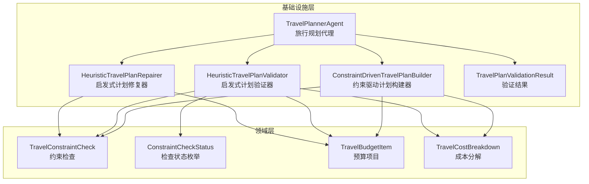
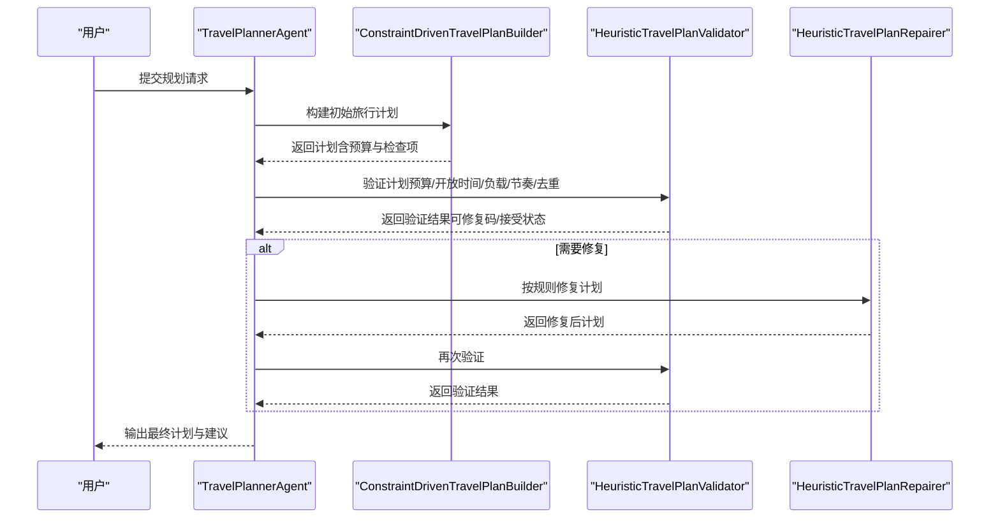
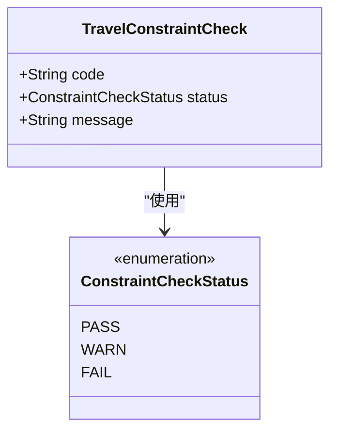
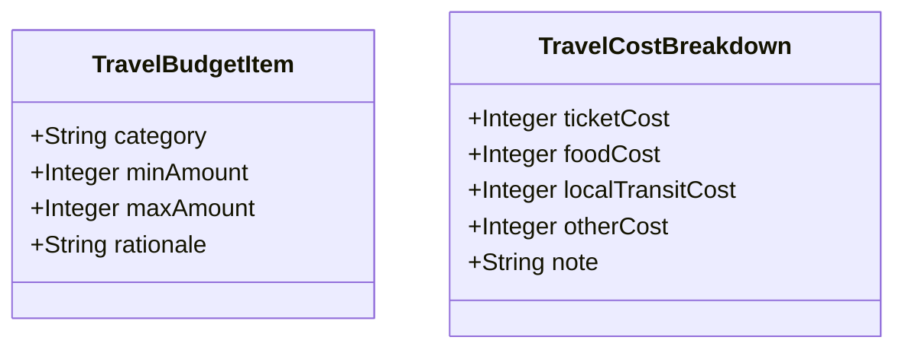
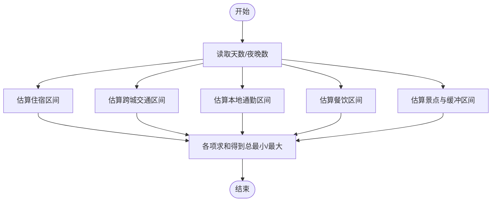
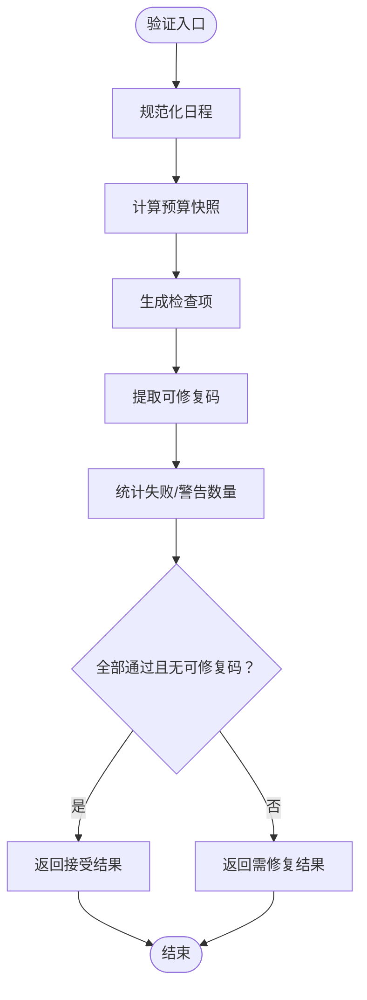
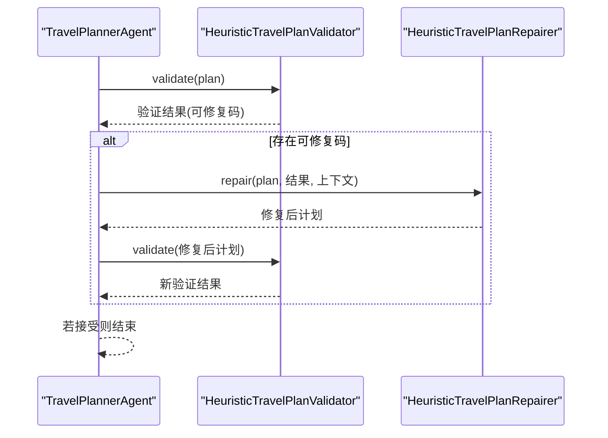
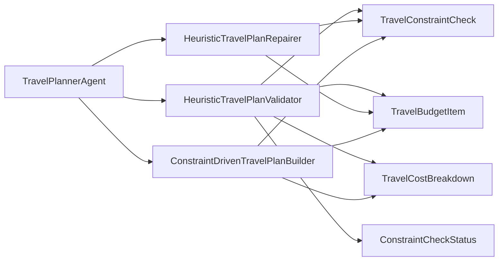

# 业务规则与约束

<cite>
**本文引用的文件**
- [TravelConstraintCheck.java](file://travel-agent-domain/src/main/java/com/travalagent/domain/model/entity/TravelConstraintCheck.java)
- [ConstraintCheckStatus.java](file://travel-agent-domain/src/main/java/com/travalagent/domain/model/entity/ConstraintCheckStatus.java)
- [TravelBudgetItem.java](file://travel-agent-domain/src/main/java/com/travalagent/domain/model/entity/TravelBudgetItem.java)
- [TravelCostBreakdown.java](file://travel-agent-domain/src/main/java/com/travalagent/domain/model/entity/TravelCostBreakdown.java)
- [HeuristicTravelPlanValidator.java](file://travel-agent-infrastructure/src/main/java/com/travalagent/infrastructure/gateway/llm/HeuristicTravelPlanValidator.java)
- [ConstraintDrivenTravelPlanBuilder.java](file://travel-agent-infrastructure/src/main/java/com/travalagent/infrastructure/gateway/llm/ConstraintDrivenTravelPlanBuilder.java)
- [HeuristicTravelPlanRepairer.java](file://travel-agent-infrastructure/src/main/java/com/travalagent/infrastructure/gateway/llm/HeuristicTravelPlanRepairer.java)
- [TravelPlanValidationResult.java](file://travel-agent-infrastructure/src/main/java/com/travalagent/infrastructure/gateway/llm/TravelPlanValidationResult.java)
- [TravelPlannerAgent.java](file://travel-agent-infrastructure/src/main/java/com/travalagent/infrastructure/gateway/llm/TravelPlannerAgent.java)
- [TravelPlannerAgentTest.java](file://travel-agent-infrastructure/src/test/java/com/travalagent/infrastructure/gateway/llm/TravelPlannerAgentTest.java)
- [HeuristicTravelPlanValidatorTest.java](file://travel-agent-infrastructure/src/test/java/com/travalagent/infrastructure/gateway/llm/HeuristicTravelPlanValidatorTest.java)
- [HeuristicTravelPlanRepairerTest.java](file://travel-agent-infrastructure/src/test/java/com/travalagent/infrastructure/gateway/llm/HeuristicTravelPlanRepairerTest.java)
</cite>

## 目录
1. [引言](#引言)
2. [项目结构](#项目结构)
3. [核心组件](#核心组件)
4. [架构总览](#架构总览)
5. [详细组件分析](#详细组件分析)
6. [依赖分析](#依赖分析)
7. [性能考虑](#性能考虑)
8. [故障排查指南](#故障排查指南)
9. [结论](#结论)
10. [附录](#附录)

## 引言
本文件聚焦于TravelAgent项目中的“业务规则与约束”体系，系统性解析以下关键实体与流程：
- TravelConstraintCheck约束检查实体：检查类型、状态管理、结果处理
- ConstraintCheckStatus枚举：状态流转与业务含义
- TravelBudgetItem预算项目：金额计算、分类管理、验证规则
- TravelCostBreakdown成本分解：数据结构与汇总算法
- 规则引擎与动态配置：规则定义、验证机制、错误处理策略
- 规则优先级与修复闭环：检测、修复建议、用户通知
- 测试方法、边界条件与性能优化

## 项目结构
围绕业务规则与约束的核心代码分布在领域层与基础设施层：
- 领域层实体：约束检查、状态枚举、预算项、成本分解
- 基础设施层：构建器（生成初始计划）、验证器（规则校验与修复建议）、修复器（按规则自动修复）、规划代理（编排验证与修复循环）

图表来源
- [ConstraintDrivenTravelPlanBuilder.java:55-84](file://travel-agent-infrastructure/src/main/java/com/travalagent/infrastructure/gateway/llm/ConstraintDrivenTravelPlanBuilder.java#L55-L84)
- [HeuristicTravelPlanValidator.java:29-62](file://travel-agent-infrastructure/src/main/java/com/travalagent/infrastructure/gateway/llm/HeuristicTravelPlanValidator.java#L29-L62)
- [HeuristicTravelPlanRepairer.java:26-69](file://travel-agent-infrastructure/src/main/java/com/travalagent/infrastructure/gateway/llm/HeuristicTravelPlanRepairer.java#L26-L69)
- [TravelPlannerAgent.java:66-86](file://travel-agent-infrastructure/src/main/java/com/travalagent/infrastructure/gateway/llm/TravelPlannerAgent.java#L66-L86)

章节来源
- [ConstraintDrivenTravelPlanBuilder.java:55-84](file://travel-agent-infrastructure/src/main/java/com/travalagent/infrastructure/gateway/llm/ConstraintDrivenTravelPlanBuilder.java#L55-L84)
- [HeuristicTravelPlanValidator.java:29-62](file://travel-agent-infrastructure/src/main/java/com/travalagent/infrastructure/gateway/llm/HeuristicTravelPlanValidator.java#L29-L62)
- [HeuristicTravelPlanRepairer.java:26-69](file://travel-agent-infrastructure/src/main/java/com/travalagent/infrastructure/gateway/llm/HeuristicTravelPlanRepairer.java#L26-L69)
- [TravelPlannerAgent.java:66-86](file://travel-agent-infrastructure/src/main/java/com/travalagent/infrastructure/gateway/llm/TravelPlannerAgent.java#L66-L86)

## 核心组件
- TravelConstraintCheck：记录一次规则检查的标识、状态与提示信息
- ConstraintCheckStatus：检查状态（通过/警告/失败）
- TravelBudgetItem：预算条目（类别、最小/最大金额、理由）
- TravelCostBreakdown：成本细项（票务、餐饮、本地交通、其他、备注）
- HeuristicTravelPlanValidator：规则校验与修复建议生成
- ConstraintDrivenTravelPlanBuilder：基于约束的计划生成与预算估算
- HeuristicTravelPlanRepairer：按规则自动修复计划
- TravelPlannerAgent：编排构建、验证、修复与接受流程
- TravelPlanValidationResult：验证结果（可修复码、接受状态、失败/警告计数）

章节来源
- [TravelConstraintCheck.java:3-8](file://travel-agent-domain/src/main/java/com/travalagent/domain/model/entity/TravelConstraintCheck.java#L3-L8)
- [ConstraintCheckStatus.java:3-7](file://travel-agent-domain/src/main/java/com/travalagent/domain/model/entity/ConstraintCheckStatus.java#L3-L7)
- [TravelBudgetItem.java:3-8](file://travel-agent-domain/src/main/java/com/travalagent/domain/model/entity/TravelBudgetItem.java#L3-L8)
- [TravelCostBreakdown.java:3-9](file://travel-agent-domain/src/main/java/com/travalagent/domain/model/entity/TravelCostBreakdown.java#L3-L9)
- [HeuristicTravelPlanValidator.java:29-62](file://travel-agent-infrastructure/src/main/java/com/travalagent/infrastructure/gateway/llm/HeuristicTravelPlanValidator.java#L29-L62)
- [ConstraintDrivenTravelPlanBuilder.java:434-458](file://travel-agent-infrastructure/src/main/java/com/travalagent/infrastructure/gateway/llm/ConstraintDrivenTravelPlanBuilder.java#L434-L458)
- [HeuristicTravelPlanRepairer.java:26-69](file://travel-agent-infrastructure/src/main/java/com/travalagent/infrastructure/gateway/llm/HeuristicTravelPlanRepairer.java#L26-L69)
- [TravelPlanValidationResult.java:7-18](file://travel-agent-infrastructure/src/main/java/com/travalagent/infrastructure/gateway/llm/TravelPlanValidationResult.java#L7-L18)
- [TravelPlannerAgent.java:66-86](file://travel-agent-infrastructure/src/main/java/com/travalagent/infrastructure/gateway/llm/TravelPlannerAgent.java#L66-L86)

## 架构总览
旅行规划代理负责端到端流程：构建初始计划 → 增强计划 → 验证（预算、开放时间、通勤负载、节奏、去重）→ 若失败则修复（按规则逐项收紧）→ 再验证直至接受。

图表来源
- [TravelPlannerAgent.java:66-86](file://travel-agent-infrastructure/src/main/java/com/travalagent/infrastructure/gateway/llm/TravelPlannerAgent.java#L66-L86)
- [ConstraintDrivenTravelPlanBuilder.java:55-84](file://travel-agent-infrastructure/src/main/java/com/travalagent/infrastructure/gateway/llm/ConstraintDrivenTravelPlanBuilder.java#L55-L84)
- [HeuristicTravelPlanValidator.java:29-62](file://travel-agent-infrastructure/src/main/java/com/travalagent/infrastructure/gateway/llm/HeuristicTravelPlanValidator.java#L29-L62)
- [HeuristicTravelPlanRepairer.java:26-69](file://travel-agent-infrastructure/src/main/java/com/travalagent/infrastructure/gateway/llm/HeuristicTravelPlanRepairer.java#L26-L69)

## 详细组件分析

### TravelConstraintCheck 与 ConstraintCheckStatus
- 设计要点
  - 记录规则代码（如预算、开放时间、通勤负载、节奏、去重）、状态（PASS/WARN/FAIL）与提示文本
  - 状态用于决定是否需要修复以及修复优先级
- 状态语义
  - PASS：规则满足，无需修复
  - WARN：规则接近不满足，建议收紧
  - FAIL：规则严重不满足，必须修复
- 在验证器中的使用
  - 根据实际指标（如最大通勤分钟数、最大活动分钟数、开放时间窗口、重复景点集合）生成检查项
  - 依据检查代码与状态，确定可修复码集合

图表来源
- [TravelConstraintCheck.java:3-8](file://travel-agent-domain/src/main/java/com/travalagent/domain/model/entity/TravelConstraintCheck.java#L3-L8)
- [ConstraintCheckStatus.java:3-7](file://travel-agent-domain/src/main/java/com/travalagent/domain/model/entity/ConstraintCheckStatus.java#L3-L7)

章节来源
- [TravelConstraintCheck.java:3-8](file://travel-agent-domain/src/main/java/com/travalagent/domain/model/entity/TravelConstraintCheck.java#L3-L8)
- [ConstraintCheckStatus.java:3-7](file://travel-agent-domain/src/main/java/com/travalagent/domain/model/entity/ConstraintCheckStatus.java#L3-L7)
- [HeuristicTravelPlanValidator.java:85-145](file://travel-agent-infrastructure/src/main/java/com/travalagent/infrastructure/gateway/llm/HeuristicTravelPlanValidator.java#L85-L145)

### 预算项目 TravelBudgetItem 与成本分解 TravelCostBreakdown
- 预算项目
  - 字段：类别、最小金额、最大金额、理由
  - 用途：展示与指导预算分配（住宿、跨城交通、本地通勤、餐饮、景点与缓冲）
- 成本分解
  - 字段：票务成本、餐饮成本、本地交通成本、其他成本、备注
  - 用途：细化单点成本构成，支持修复器按景点成本裁剪

图表来源
- [TravelBudgetItem.java:3-8](file://travel-agent-domain/src/main/java/com/travalagent/domain/model/entity/TravelBudgetItem.java#L3-L8)
- [TravelCostBreakdown.java:3-9](file://travel-agent-domain/src/main/java/com/travalagent/domain/model/entity/TravelCostBreakdown.java#L3-L9)

章节来源
- [TravelBudgetItem.java:3-8](file://travel-agent-domain/src/main/java/com/travalagent/domain/model/entity/TravelBudgetItem.java#L3-L8)
- [TravelCostBreakdown.java:3-9](file://travel-agent-domain/src/main/java/com/travalagent/domain/model/entity/TravelCostBreakdown.java#L3-L9)
- [ConstraintDrivenTravelPlanBuilder.java:424-432](file://travel-agent-infrastructure/src/main/java/com/travalagent/infrastructure/gateway/llm/ConstraintDrivenTravelPlanBuilder.java#L424-L432)
- [HeuristicTravelPlanValidator.java:147-194](file://travel-agent-infrastructure/src/main/java/com/travalagent/infrastructure/gateway/llm/HeuristicTravelPlanValidator.java#L147-L194)

### 预算估算与汇总算法
- 估算维度
  - 住宿：按天数与预算上限推导区间
  - 跨城交通：若起点/终点相同或未指定则置零或低区间
  - 本地通勤：基于实际路线与少量缓冲
  - 餐饮：基于停靠点实际安排与缓冲
  - 景点与缓冲：基于景点门票与体验成本重算
- 汇总
  - 各类预算项求和得到总最小/最大值
  - 作为后续预算检查的阈值

图表来源
- [ConstraintDrivenTravelPlanBuilder.java:408-422](file://travel-agent-infrastructure/src/main/java/com/travalagent/infrastructure/gateway/llm/ConstraintDrivenTravelPlanBuilder.java#L408-L422)
- [HeuristicTravelPlanValidator.java:147-194](file://travel-agent-infrastructure/src/main/java/com/travalagent/infrastructure/gateway/llm/HeuristicTravelPlanValidator.java#L147-L194)

章节来源
- [ConstraintDrivenTravelPlanBuilder.java:408-422](file://travel-agent-infrastructure/src/main/java/com/travalagent/infrastructure/gateway/llm/ConstraintDrivenTravelPlanBuilder.java#L408-L422)
- [HeuristicTravelPlanValidator.java:147-194](file://travel-agent-infrastructure/src/main/java/com/travalagent/infrastructure/gateway/llm/HeuristicTravelPlanValidator.java#L147-L194)

### 规则定义、验证机制与错误处理
- 规则定义
  - 预算：总上限是否超过预算
  - 开放时间：是否存在超出开放时段的时间段
  - 通勤负载：是否存在某日通勤时间过长
  - 节奏：在“轻松”偏好下，活动时间是否过长
  - 去重：是否存在重复景点
- 验证机制
  - 生成检查项列表，统计失败与警告数量
  - 根据检查代码与状态，提取可修复码集合
  - 结果封装为验证结果对象，包含接受状态与计数
- 错误处理策略
  - 对空输入进行兜底（如默认时间、默认预算）
  - 宽松解析时间字符串，避免异常中断
  - 对缺失字段采用安全函数转为0，保证聚合稳健

图表来源
- [HeuristicTravelPlanValidator.java:29-62](file://travel-agent-infrastructure/src/main/java/com/travalagent/infrastructure/gateway/llm/HeuristicTravelPlanValidator.java#L29-L62)
- [HeuristicTravelPlanValidator.java:85-145](file://travel-agent-infrastructure/src/main/java/com/travalagent/infrastructure/gateway/llm/HeuristicTravelPlanValidator.java#L85-L145)

章节来源
- [HeuristicTravelPlanValidator.java:29-62](file://travel-agent-infrastructure/src/main/java/com/travalagent/infrastructure/gateway/llm/HeuristicTravelPlanValidator.java#L29-L62)
- [HeuristicTravelPlanValidator.java:85-145](file://travel-agent-infrastructure/src/main/java/com/travalagent/infrastructure/gateway/llm/HeuristicTravelPlanValidator.java#L85-L145)
- [TravelPlanValidationResult.java:7-18](file://travel-agent-infrastructure/src/main/java/com/travalagent/infrastructure/gateway/llm/TravelPlanValidationResult.java#L7-L18)

### 规则优先级与修复闭环
- 修复优先级
  - 预算、通勤负载、节奏：非通过即纳入修复
  - 开放时间、去重：仅在失败时纳入修复
- 修复策略
  - 去重：移除重复景点
  - 开放时间：调整起止时间至开放窗口内
  - 节奏/通勤负载：裁剪最繁忙日的最后一个停靠点
  - 预算：下调酒店预算区间（按比例收紧）
- 修复闭环
  - 旅行规划代理在严格模式与宽松模式下迭代修复，发布时间线事件，最终输出接受结果与建议

图表来源
- [TravelPlannerAgent.java:66-86](file://travel-agent-infrastructure/src/main/java/com/travalagent/infrastructure/gateway/llm/TravelPlannerAgent.java#L66-L86)
- [HeuristicTravelPlanValidator.java:64-83](file://travel-agent-infrastructure/src/main/java/com/travalagent/infrastructure/gateway/llm/HeuristicTravelPlanValidator.java#L64-L83)
- [HeuristicTravelPlanRepairer.java:26-69](file://travel-agent-infrastructure/src/main/java/com/travalagent/infrastructure/gateway/llm/HeuristicTravelPlanRepairer.java#L26-L69)

章节来源
- [HeuristicTravelPlanValidator.java:64-83](file://travel-agent-infrastructure/src/main/java/com/travalagent/infrastructure/gateway/llm/HeuristicTravelPlanValidator.java#L64-L83)
- [HeuristicTravelPlanRepairer.java:26-69](file://travel-agent-infrastructure/src/main/java/com/travalagent/infrastructure/gateway/llm/HeuristicTravelPlanRepairer.java#L26-L69)
- [TravelPlannerAgent.java:66-86](file://travel-agent-infrastructure/src/main/java/com/travalagent/infrastructure/gateway/llm/TravelPlannerAgent.java#L66-L86)

### 用户通知与渲染
- 构建器在渲染阶段输出中文/英文双语的检查项、预算拆分、酒店建议与每日行程明细
- 验证器与修复器均提供中英双语提示，确保国际化可用性

章节来源
- [ConstraintDrivenTravelPlanBuilder.java:90-210](file://travel-agent-infrastructure/src/main/java/com/travalagent/infrastructure/gateway/llm/ConstraintDrivenTravelPlanBuilder.java#L90-L210)
- [HeuristicTravelPlanValidator.java:103-144](file://travel-agent-infrastructure/src/main/java/com/travalagent/infrastructure/gateway/llm/HeuristicTravelPlanValidator.java#L103-L144)

## 依赖分析
- 组件耦合
  - HeuristicTravelPlanValidator 依赖领域实体（检查项、状态、预算、成本分解）
  - HeuristicTravelPlanRepairer 依赖预算与日程实体，对计划进行就地修复
  - ConstraintDrivenTravelPlanBuilder 生成计划并内置预算估算与检查项
  - TravelPlannerAgent 协调构建、验证与修复流程
- 外部依赖
  - 时间解析与格式化工具（LocalTime/DateTimeFormatter）
  - 安全函数（空值转0）保障聚合稳健

图表来源
- [HeuristicTravelPlanValidator.java:3-12](file://travel-agent-infrastructure/src/main/java/com/travalagent/infrastructure/gateway/llm/HeuristicTravelPlanValidator.java#L3-L12)
- [HeuristicTravelPlanRepairer.java:3-7](file://travel-agent-infrastructure/src/main/java/com/travalagent/infrastructure/gateway/llm/HeuristicTravelPlanRepairer.java#L3-L7)
- [ConstraintDrivenTravelPlanBuilder.java:3-15](file://travel-agent-infrastructure/src/main/java/com/travalagent/infrastructure/gateway/llm/ConstraintDrivenTravelPlanBuilder.java#L3-L15)
- [TravelPlannerAgent.java:66-86](file://travel-agent-infrastructure/src/main/java/com/travalagent/infrastructure/gateway/llm/TravelPlannerAgent.java#L66-L86)

章节来源
- [HeuristicTravelPlanValidator.java:3-12](file://travel-agent-infrastructure/src/main/java/com/travalagent/infrastructure/gateway/llm/HeuristicTravelPlanValidator.java#L3-L12)
- [HeuristicTravelPlanRepairer.java:3-7](file://travel-agent-infrastructure/src/main/java/com/travalagent/infrastructure/gateway/llm/HeuristicTravelPlanRepairer.java#L3-L7)
- [ConstraintDrivenTravelPlanBuilder.java:3-15](file://travel-agent-infrastructure/src/main/java/com/travalagent/infrastructure/gateway/llm/ConstraintDrivenTravelPlanBuilder.java#L3-L15)
- [TravelPlannerAgent.java:66-86](file://travel-agent-infrastructure/src/main/java/com/travalagent/infrastructure/gateway/llm/TravelPlannerAgent.java#L66-L86)

## 性能考虑
- 避免重复计算
  - 使用流式聚合一次性完成最大值/总和统计，减少多次遍历
- 空值安全
  - 通过安全函数将null转为0，避免分支判断分散在各处
- 修复策略的贪心性
  - 每轮仅裁剪最繁忙日的最后一个停靠点，复杂度线性，易于扩展
- 可选：缓存预算快照与检查项，减少重复验证成本

## 故障排查指南
- 常见问题
  - 预算超支：检查总上限是否超过预算；可通过降低酒店预算或减少付费项目解决
  - 通勤过重：裁剪最繁忙日的停靠点或缩短跨区移动
  - 节奏过紧：在“轻松”偏好下控制每日活动时长
  - 开放时间冲突：调整停靠点起止时间至开放窗口内
  - 重复景点：启用去重修复
- 诊断手段
  - 查看验证结果中的失败/警告计数与可修复码
  - 检查预算快照与检查项列表，定位具体违规项
  - 关注时间解析异常与默认时间回退逻辑
- 测试参考
  - 验证器测试：覆盖预算、开放时间、通勤负载、节奏与去重场景
  - 修复器测试：验证裁剪停靠点与下调酒店预算的效果
  - 规划代理测试：验证严格/宽松修复循环与接受流程

章节来源
- [HeuristicTravelPlanValidatorTest.java:25-57](file://travel-agent-infrastructure/src/test/java/com/travalagent/infrastructure/gateway/llm/HeuristicTravelPlanValidatorTest.java#L25-L57)
- [HeuristicTravelPlanRepairerTest.java:25-51](file://travel-agent-infrastructure/src/test/java/com/travalagent/infrastructure/gateway/llm/HeuristicTravelPlanRepairerTest.java#L25-L51)
- [TravelPlannerAgentTest.java:76-93](file://travel-agent-infrastructure/src/test/java/com/travalagent/infrastructure/gateway/llm/TravelPlannerAgentTest.java#L76-L93)

## 结论
本系统通过清晰的领域实体与严格的验证/修复流程，实现了对旅行计划的预算、时间窗口、负载与节奏的多维约束管理。检查状态与可修复码形成闭环，结合启发式修复策略与中英双语渲染，提升了用户体验与可维护性。建议在生产环境中持续完善边界条件与性能监控，以应对更复杂的用户输入与大规模并发场景。

## 附录
- 测试方法
  - 单元测试：针对验证器、修复器的关键路径进行断言
  - 集成测试：模拟规划代理的完整流程，验证接受与建议输出
- 边界条件
  - 空输入、缺失字段、非法时间格式、极端预算与天数
- 性能优化建议
  - 复用预算快照与检查项，减少重复计算
  - 将时间解析与字符串处理集中化，提升稳定性