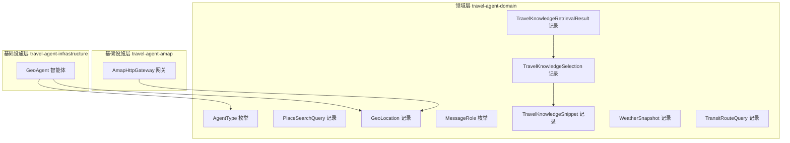
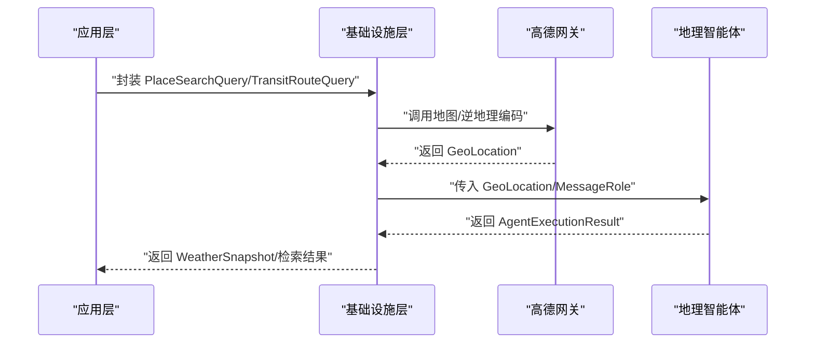
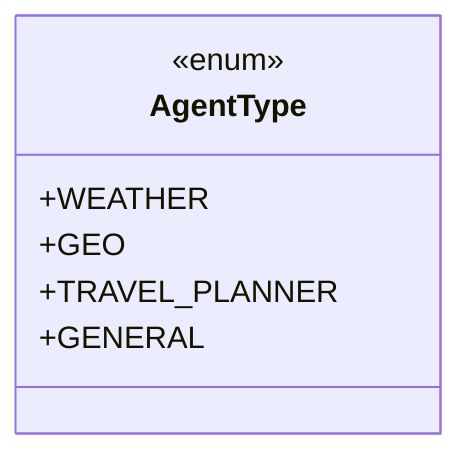
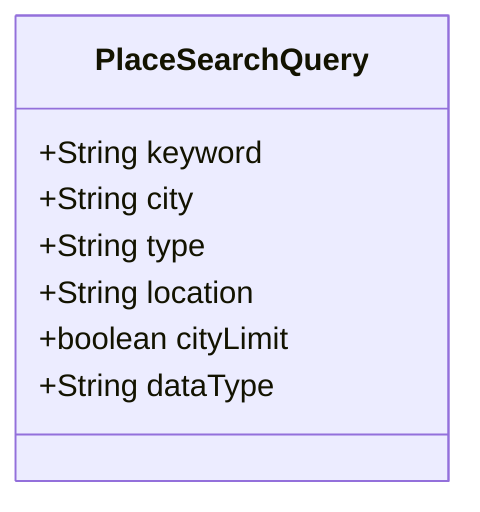
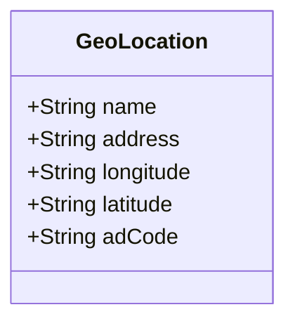
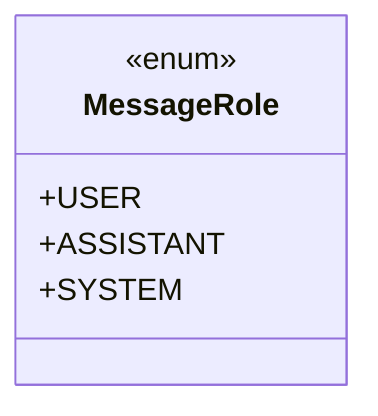
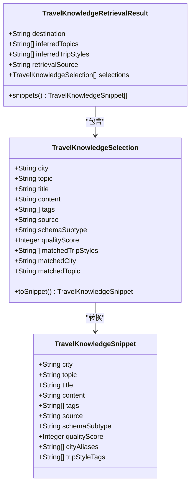
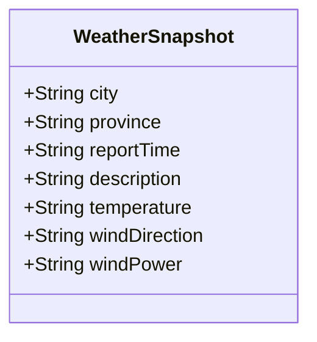
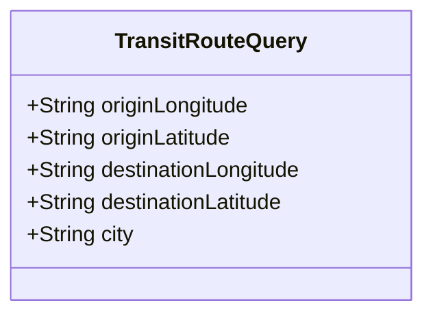
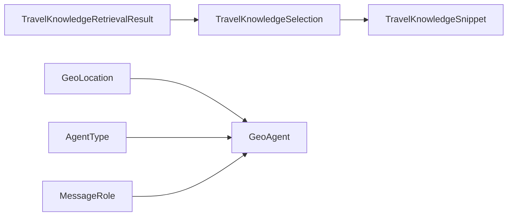

# 值对象设计

<cite>
**本文引用的文件**
- [AgentType.java](file://travel-agent-domain/src/main/java/com/travalagent/domain/model/valobj/AgentType.java)
- [PlaceSearchQuery.java](file://travel-agent-domain/src/main/java/com/travalagent/domain/model/valobj/PlaceSearchQuery.java)
- [GeoLocation.java](file://travel-agent-domain/src/main/java/com/travalagent/domain/model/valobj/GeoLocation.java)
- [MessageRole.java](file://travel-agent-domain/src/main/java/com/travalagent/domain/model/valobj/MessageRole.java)
- [TravelKnowledgeRetrievalResult.java](file://travel-agent-domain/src/main/java/com/travalagent/domain/model/valobj/TravelKnowledgeRetrievalResult.java)
- [TravelKnowledgeSelection.java](file://travel-agent-domain/src/main/java/com/travalagent/domain/model/valobj/TravelKnowledgeSelection.java)
- [TravelKnowledgeSnippet.java](file://travel-agent-domain/src/main/java/com/travalagent/domain/model/valobj/TravelKnowledgeSnippet.java)
- [WeatherSnapshot.java](file://travel-agent-domain/src/main/java/com/travalagent/domain/model/valobj/WeatherSnapshot.java)
- [TransitRouteQuery.java](file://travel-agent-domain/src/main/java/com/travalagent/domain/model/valobj/TransitRouteQuery.java)
- [AmapHttpGateway.java](file://travel-agent-amap/src/main/java/com/travalagent/amap/gateway/AmapHttpGateway.java)
- [GeoAgent.java](file://travel-agent-infrastructure/src/main/java/com/travalagent/infrastructure/gateway/llm/GeoAgent.java)
- [TravelKnowledgeRetrievalSupport.java](file://travel-agent-infrastructure/src/main/java/com/travalagent/infrastructure/repository/TravelKnowledgeRetrievalSupport.java)
</cite>

## 目录
1. [引言](#引言)
2. [项目结构](#项目结构)
3. [核心组件](#核心组件)
4. [架构总览](#架构总览)
5. [详细组件分析](#详细组件分析)
6. [依赖分析](#依赖分析)
7. [性能考虑](#性能考虑)
8. [故障排查指南](#故障排查指南)
9. [结论](#结论)
10. [附录：值对象使用模式与最佳实践](#附录值对象使用模式与最佳实践)

## 引言
本文件系统性梳理旅行助手领域的值对象设计，围绕以下主题展开：AgentType 智能体类型的枚举设计与类型安全；PlaceSearchQuery 搜索查询的参数组合与验证规则；GeoLocation 地理位置值对象的坐标表示与精度处理；MessageRole 消息角色的业务语义与权限控制；TravelKnowledgeRetrievalResult 知识检索结果的数据结构与评分机制；WeatherSnapshot 天气快照的标准化数据格式；TransitRouteQuery 交通路线查询的参数设计与约束条件。同时总结值对象的不可变性、equals/hashCode 实现与序列化处理方式，并给出在领域模型中的使用模式与最佳实践。

## 项目结构
值对象主要位于领域层模块中，作为不可变数据载体在应用与基础设施层之间传递，确保业务语义清晰、行为可预测。下图展示与本文相关的核心值对象及其所在模块：

图表来源
- [AgentType.java:1-9](file://travel-agent-domain/src/main/java/com/travalagent/domain/model/valobj/AgentType.java#L1-L9)
- [PlaceSearchQuery.java:1-12](file://travel-agent-domain/src/main/java/com/travalagent/domain/model/valobj/PlaceSearchQuery.java#L1-L12)
- [GeoLocation.java:1-11](file://travel-agent-domain/src/main/java/com/travalagent/domain/model/valobj/GeoLocation.java#L1-L11)
- [MessageRole.java:1-8](file://travel-agent-domain/src/main/java/com/travalagent/domain/model/valobj/MessageRole.java#L1-L8)
- [TravelKnowledgeRetrievalResult.java:1-42](file://travel-agent-domain/src/main/java/com/travalagent/domain/model/valobj/TravelKnowledgeRetrievalResult.java#L1-L42)
- [TravelKnowledgeSelection.java:1-56](file://travel-agent-domain/src/main/java/com/travalagent/domain/model/valobj/TravelKnowledgeSelection.java#L1-L56)
- [TravelKnowledgeSnippet.java:1-48](file://travel-agent-domain/src/main/java/com/travalagent/domain/model/valobj/TravelKnowledgeSnippet.java#L1-L48)
- [WeatherSnapshot.java:1-13](file://travel-agent-domain/src/main/java/com/travalagent/domain/model/valobj/WeatherSnapshot.java#L1-L13)
- [TransitRouteQuery.java:1-11](file://travel-agent-domain/src/main/java/com/travalagent/domain/model/valobj/TransitRouteQuery.java#L1-L11)
- [AmapHttpGateway.java:77-98](file://travel-agent-amap/src/main/java/com/travalagent/amap/gateway/AmapHttpGateway.java#L77-L98)
- [GeoAgent.java:35-68](file://travel-agent-infrastructure/src/main/java/com/travalagent/infrastructure/gateway/llm/GeoAgent.java#L35-L68)

章节来源
- [AgentType.java:1-9](file://travel-agent-domain/src/main/java/com/travalagent/domain/model/valobj/AgentType.java#L1-L9)
- [PlaceSearchQuery.java:1-12](file://travel-agent-domain/src/main/java/com/travalagent/domain/model/valobj/PlaceSearchQuery.java#L1-L12)
- [GeoLocation.java:1-11](file://travel-agent-domain/src/main/java/com/travalagent/domain/model/valobj/GeoLocation.java#L1-L11)
- [MessageRole.java:1-8](file://travel-agent-domain/src/main/java/com/travalagent/domain/model/valobj/MessageRole.java#L1-L8)
- [TravelKnowledgeRetrievalResult.java:1-42](file://travel-agent-domain/src/main/java/com/travalagent/domain/model/valobj/TravelKnowledgeRetrievalResult.java#L1-L42)
- [TravelKnowledgeSelection.java:1-56](file://travel-agent-domain/src/main/java/com/travalagent/domain/model/valobj/TravelKnowledgeSelection.java#L1-L56)
- [TravelKnowledgeSnippet.java:1-48](file://travel-agent-domain/src/main/java/com/travalagent/domain/model/valobj/TravelKnowledgeSnippet.java#L1-L48)
- [WeatherSnapshot.java:1-13](file://travel-agent-domain/src/main/java/com/travalagent/domain/model/valobj/WeatherSnapshot.java#L1-L13)
- [TransitRouteQuery.java:1-11](file://travel-agent-domain/src/main/java/com/travalagent/domain/model/valobj/TransitRouteQuery.java#L1-L11)

## 核心组件
本节对关键值对象进行逐项解析，涵盖设计动机、字段语义、不变性保障、构造器与工厂方法、以及与外部系统的交互。

- AgentType（智能体类型）
  - 设计要点：以枚举形式定义智能体类型，保证类型安全与可读性，避免魔法字符串。
  - 使用场景：在智能体路由与执行上下文中标识能力边界。
  - 类型安全：通过枚举限定取值集合，防止非法状态进入业务流程。

- PlaceSearchQuery（地点搜索查询）
  - 字段组合：关键词、城市、类型、位置、是否仅限城市、数据类型等。
  - 验证规则：建议在上层服务或网关处进行非空校验与长度限制；当 cityLimit 为真时，应优先按城市过滤。
  - 用途：驱动地图服务的搜索与建议生成。

- GeoLocation（地理位置）
  - 字段语义：名称、地址、经度、纬度、区划编码。
  - 不变性：记录类天然不可变；构造阶段可做空值兜底与格式清理。
  - 精度处理：经纬度以字符串存储，便于跨系统传递；计算距离时需转换为数值并注意异常值处理。

- MessageRole（消息角色）
  - 语义：用户、助手、系统三类角色，用于对话历史与提示词组织。
  - 权限控制：结合角色与工具调用策略，限制敏感操作仅由系统或特定角色触发。

- TravelKnowledgeRetrievalResult（知识检索结果）
  - 数据结构：目标地、推断主题、推断旅行风格、检索来源、选择列表。
  - 不变性：构造器内对集合进行不可变包装；提供多个重载与静态工厂方法以简化空结果构建。
  - 评分机制：通过 Selection/Snippet 的质量分字段表达内容质量，支持排序与筛选。

- WeatherSnapshot（天气快照）
  - 标准化字段：城市、省、发布时间、描述、温度、风向、风级。
  - 序列化友好：字段均为字符串，便于 JSON 序列化与前端渲染。

- TransitRouteQuery（交通路线查询）
  - 参数设计：起点与终点经纬度、城市。
  - 约束条件：经纬度应为有效数值字符串；城市字段用于区域限制与默认值填充。

章节来源
- [AgentType.java:1-9](file://travel-agent-domain/src/main/java/com/travalagent/domain/model/valobj/AgentType.java#L1-L9)
- [PlaceSearchQuery.java:1-12](file://travel-agent-domain/src/main/java/com/travalagent/domain/model/valobj/PlaceSearchQuery.java#L1-L12)
- [GeoLocation.java:1-11](file://travel-agent-domain/src/main/java/com/travalagent/domain/model/valobj/GeoLocation.java#L1-L11)
- [MessageRole.java:1-8](file://travel-agent-domain/src/main/java/com/travalagent/domain/model/valobj/MessageRole.java#L1-L8)
- [TravelKnowledgeRetrievalResult.java:1-42](file://travel-agent-domain/src/main/java/com/travalagent/domain/model/valobj/TravelKnowledgeRetrievalResult.java#L1-L42)
- [WeatherSnapshot.java:1-13](file://travel-agent-domain/src/main/java/com/travalagent/domain/model/valobj/WeatherSnapshot.java#L1-L13)
- [TransitRouteQuery.java:1-11](file://travel-agent-domain/src/main/java/com/travalagent/domain/model/valobj/TransitRouteQuery.java#L1-L11)

## 架构总览
下图展示值对象在系统中的流转路径：应用层接收请求后封装为查询值对象，基础设施层通过网关与智能体消费这些值对象，最终产出标准化的结果值对象。

图表来源
- [AmapHttpGateway.java:77-98](file://travel-agent-amap/src/main/java/com/travalagent/amap/gateway/AmapHttpGateway.java#L77-L98)
- [GeoAgent.java:35-68](file://travel-agent-infrastructure/src/main/java/com/travalagent/infrastructure/gateway/llm/GeoAgent.java#L35-L68)
- [PlaceSearchQuery.java:1-12](file://travel-agent-domain/src/main/java/com/travalagent/domain/model/valobj/PlaceSearchQuery.java#L1-L12)
- [TransitRouteQuery.java:1-11](file://travel-agent-domain/src/main/java/com/travalagent/domain/model/valobj/TransitRouteQuery.java#L1-L11)
- [GeoLocation.java:1-11](file://travel-agent-domain/src/main/java/com/travalagent/domain/model/valobj/GeoLocation.java#L1-L11)
- [WeatherSnapshot.java:1-13](file://travel-agent-domain/src/main/java/com/travalagent/domain/model/valobj/WeatherSnapshot.java#L1-L13)

## 详细组件分析

### AgentType 智能体类型与类型安全
- 设计模式：枚举作为类型安全的标签，配合智能体路由策略使用。
- 使用示例：智能体声明支持的类型，路由器据此分发任务。
- 最佳实践：新增类型时同步更新路由表与权限矩阵，避免遗漏。

图表来源
- [AgentType.java:1-9](file://travel-agent-domain/src/main/java/com/travalagent/domain/model/valobj/AgentType.java#L1-L9)

章节来源
- [AgentType.java:1-9](file://travel-agent-domain/src/main/java/com/travalagent/domain/model/valobj/AgentType.java#L1-L9)
- [GeoAgent.java:35-38](file://travel-agent-infrastructure/src/main/java/com/travalagent/infrastructure/gateway/llm/GeoAgent.java#L35-L38)

### PlaceSearchQuery 搜索查询参数与验证
- 参数组合：keyword/city/type/location/cityLimit/dataType 共同决定搜索范围与粒度。
- 验证建议：非空校验、长度限制、城市合法性检查；cityLimit 为真时强制按城市过滤。
- 与建议：在 DTO 层或服务入口统一校验，失败快速返回错误码。

图表来源
- [PlaceSearchQuery.java:1-12](file://travel-agent-domain/src/main/java/com/travalagent/domain/model/valobj/PlaceSearchQuery.java#L1-L12)

章节来源
- [PlaceSearchQuery.java:1-12](file://travel-agent-domain/src/main/java/com/travalagent/domain/model/valobj/PlaceSearchQuery.java#L1-L12)

### GeoLocation 地理位置值对象与精度处理
- 字段语义：name/address/longitude/latitude/adCode。
- 不变性：记录类不可变；构造阶段进行空值兜底与格式清理。
- 精度处理：经纬度以字符串存储，计算距离时转换为数值并处理 NaN/异常值；建议在网关层统一解析与校验。

图表来源
- [GeoLocation.java:1-11](file://travel-agent-domain/src/main/java/com/travalagent/domain/model/valobj/GeoLocation.java#L1-L11)
- [AmapHttpGateway.java:77-98](file://travel-agent-amap/src/main/java/com/travalagent/amap/gateway/AmapHttpGateway.java#L77-L98)

章节来源
- [GeoLocation.java:1-11](file://travel-agent-domain/src/main/java/com/travalagent/domain/model/valobj/GeoLocation.java#L1-L11)
- [AmapHttpGateway.java:77-98](file://travel-agent-amap/src/main/java/com/travalagent/amap/gateway/AmapHttpGateway.java#L77-L98)
- [GeoAgent.java:56-68](file://travel-agent-infrastructure/src/main/java/com/travalagent/infrastructure/gateway/llm/GeoAgent.java#L56-L68)

### MessageRole 消息角色的业务语义与权限控制
- 业务语义：USER 表示用户输入，ASSISTANT 表示模型输出，SYSTEM 表示系统提示与上下文。
- 权限控制：敏感工具调用仅允许 SYSTEM 或受控角色；结合角色与工具白名单实现最小权限。

图表来源
- [MessageRole.java:1-8](file://travel-agent-domain/src/main/java/com/travalagent/domain/model/valobj/MessageRole.java#L1-L8)

章节来源
- [MessageRole.java:1-8](file://travel-agent-domain/src/main/java/com/travalagent/domain/model/valobj/MessageRole.java#L1-L8)

### TravelKnowledgeRetrievalResult 知识检索结果的数据结构与评分机制
- 结构组成：destination/inferredTopics/inferredTripStyles/retrievalSource/selections。
- 不变性：构造器内对集合进行不可变复制；提供多种重载与静态工厂方法。
- 评分机制：Selection/Snippet 中的 qualityScore 字段用于量化内容质量；Result 提供 snippets() 聚合视图。

图表来源
- [TravelKnowledgeRetrievalResult.java:1-42](file://travel-agent-domain/src/main/java/com/travalagent/domain/model/valobj/TravelKnowledgeRetrievalResult.java#L1-L42)
- [TravelKnowledgeSelection.java:1-56](file://travel-agent-domain/src/main/java/com/travalagent/domain/model/valobj/TravelKnowledgeSelection.java#L1-L56)
- [TravelKnowledgeSnippet.java:1-48](file://travel-agent-domain/src/main/java/com/travalagent/domain/model/valobj/TravelKnowledgeSnippet.java#L1-L48)

章节来源
- [TravelKnowledgeRetrievalResult.java:1-42](file://travel-agent-domain/src/main/java/com/travalagent/domain/model/valobj/TravelKnowledgeRetrievalResult.java#L1-L42)
- [TravelKnowledgeSelection.java:1-56](file://travel-agent-domain/src/main/java/com/travalagent/domain/model/valobj/TravelKnowledgeSelection.java#L1-L56)
- [TravelKnowledgeSnippet.java:1-48](file://travel-agent-domain/src/main/java/com/travalagent/domain/model/valobj/TravelKnowledgeSnippet.java#L1-L48)
- [TravelKnowledgeRetrievalSupport.java:79-95](file://travel-agent-infrastructure/src/main/java/com/travalagent/infrastructure/repository/TravelKnowledgeRetrievalSupport.java#L79-L95)

### WeatherSnapshot 天气快照的标准化数据格式
- 字段设计：city/province/reportTime/description/temperature/windDirection/windPower。
- 序列化友好：全部为字符串，便于 JSON 序列化与前端渲染；建议在网关层统一格式化。

图表来源
- [WeatherSnapshot.java:1-13](file://travel-agent-domain/src/main/java/com/travalagent/domain/model/valobj/WeatherSnapshot.java#L1-L13)

章节来源
- [WeatherSnapshot.java:1-13](file://travel-agent-domain/src/main/java/com/travalagent/domain/model/valobj/WeatherSnapshot.java#L1-L13)

### TransitRouteQuery 交通路线查询的参数设计与约束条件
- 参数设计：originLongitude/originLatitude/destinationLongitude/destinationLatitude/city。
- 约束条件：经纬度应为有效数值字符串；city 用于区域限制与默认值填充；建议在服务层进行数值解析与异常处理。

图表来源
- [TransitRouteQuery.java:1-11](file://travel-agent-domain/src/main/java/com/travalagent/domain/model/valobj/TransitRouteQuery.java#L1-L11)

章节来源
- [TransitRouteQuery.java:1-11](file://travel-agent-domain/src/main/java/com/travalagent/domain/model/valobj/TransitRouteQuery.java#L1-L11)

## 依赖分析
- 值对象之间的依赖关系：TravelKnowledgeRetrievalResult 依赖 TravelKnowledgeSelection；Selection 可转换为 Snippet。
- 外部依赖：GeoLocation 由地图网关返回；MessageRole 用于智能体提示词组织；AgentType 用于智能体路由。

图表来源
- [TravelKnowledgeRetrievalResult.java:1-42](file://travel-agent-domain/src/main/java/com/travalagent/domain/model/valobj/TravelKnowledgeRetrievalResult.java#L1-L42)
- [TravelKnowledgeSelection.java:1-56](file://travel-agent-domain/src/main/java/com/travalagent/domain/model/valobj/TravelKnowledgeSelection.java#L1-L56)
- [TravelKnowledgeSnippet.java:1-48](file://travel-agent-domain/src/main/java/com/travalagent/domain/model/valobj/TravelKnowledgeSnippet.java#L1-L48)
- [GeoLocation.java:1-11](file://travel-agent-domain/src/main/java/com/travalagent/domain/model/valobj/GeoLocation.java#L1-L11)
- [AgentType.java:1-9](file://travel-agent-domain/src/main/java/com/travalagent/domain/model/valobj/AgentType.java#L1-L9)
- [MessageRole.java:1-8](file://travel-agent-domain/src/main/java/com/travalagent/domain/model/valobj/MessageRole.java#L1-L8)
- [GeoAgent.java:35-38](file://travel-agent-infrastructure/src/main/java/com/travalagent/infrastructure/gateway/llm/GeoAgent.java#L35-L38)

章节来源
- [TravelKnowledgeRetrievalResult.java:1-42](file://travel-agent-domain/src/main/java/com/travalagent/domain/model/valobj/TravelKnowledgeRetrievalResult.java#L1-L42)
- [TravelKnowledgeSelection.java:1-56](file://travel-agent-domain/src/main/java/com/travalagent/domain/model/valobj/TravelKnowledgeSelection.java#L1-L56)
- [TravelKnowledgeSnippet.java:1-48](file://travel-agent-domain/src/main/java/com/travalagent/domain/model/valobj/TravelKnowledgeSnippet.java#L1-L48)
- [GeoLocation.java:1-11](file://travel-agent-domain/src/main/java/com/travalagent/domain/model/valobj/GeoLocation.java#L1-L11)
- [AgentType.java:1-9](file://travel-agent-domain/src/main/java/com/travalagent/domain/model/valobj/AgentType.java#L1-L9)
- [MessageRole.java:1-8](file://travel-agent-domain/src/main/java/com/travalagent/domain/model/valobj/MessageRole.java#L1-L8)
- [GeoAgent.java:35-38](file://travel-agent-infrastructure/src/main/java/com/travalagent/infrastructure/gateway/llm/GeoAgent.java#L35-L38)

## 性能考虑
- 不可变性带来的优势：线程安全、易于缓存与复用；但频繁复制集合会带来额外开销。
- 集合不可变化：在构造器中使用不可变副本，避免外部修改；建议在高频路径上复用已不可变的集合。
- 解析与转换：经纬度字符串解析与距离计算需注意异常值与 NaN 处理，避免重复解析。
- 序列化：字符串字段利于 JSON 序列化；建议在网关层统一格式化，减少下游处理成本。

## 故障排查指南
- 逆地理编码失败：当模型服务不可用时，GeoAgent 会回退到直接调用地图网关进行反向地理编码；若返回空结果，需检查经纬度格式与网络连通性。
- 经纬度解析异常：地图网关对无效字符串返回 NaN，需在调用方进行保护与兜底。
- 检索结果为空：可通过空结果工厂方法快速构建，避免空指针；确认检索计划与过滤表达式是否正确。

章节来源
- [GeoAgent.java:52-68](file://travel-agent-infrastructure/src/main/java/com/travalagent/infrastructure/gateway/llm/GeoAgent.java#L52-L68)
- [AmapHttpGateway.java:359-365](file://travel-agent-amap/src/main/java/com/travalagent/amap/gateway/AmapHttpGateway.java#L359-L365)
- [TravelKnowledgeRetrievalSupport.java:88-95](file://travel-agent-infrastructure/src/main/java/com/travalagent/infrastructure/repository/TravelKnowledgeRetrievalSupport.java#L88-L95)

## 结论
值对象是领域建模的重要基石，通过明确的字段语义、严格的不变性与清晰的构造策略，显著提升了系统的可维护性与可测试性。本文针对旅行助手场景中的关键值对象进行了系统性分析，并给出了与外部系统的交互路径与最佳实践建议。建议在后续迭代中持续完善参数校验、异常处理与序列化策略，确保值对象在全链路中保持一致的契约与行为。

## 附录：值对象使用模式与最佳实践
- 不可变性设计
  - 优先使用记录类（record）或不可变字段；在构造器中进行空值兜底与格式清理。
  - 对集合字段进行不可变复制，防止外部修改。
- equals/hashCode 实现
  - 记录类自动生成基于组件字段的相等性判断；如需自定义，应保持一致性与传递性。
- 序列化处理
  - 字段尽量采用基本类型或字符串，便于 JSON 序列化；在网关层统一格式化。
- 领域模型使用模式
  - 将值对象作为命令与查询的载体，避免在实体中混入业务逻辑。
  - 在服务层集中进行参数校验与转换，确保值对象进入领域层前已满足约束。
- 权限与角色控制
  - 结合 MessageRole 与 AgentType 进行最小权限控制，敏感操作仅由受控角色触发。