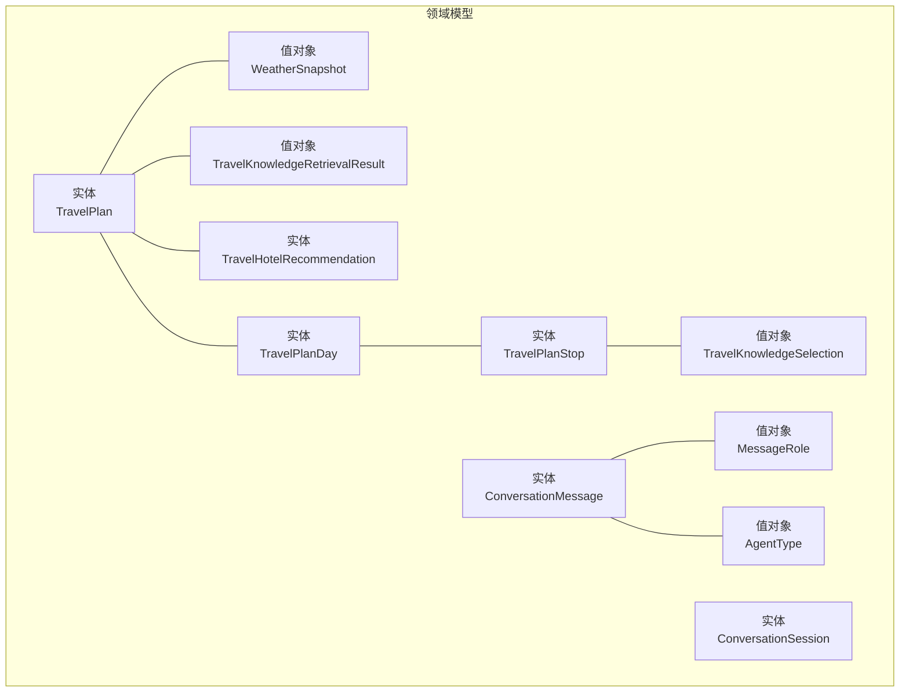
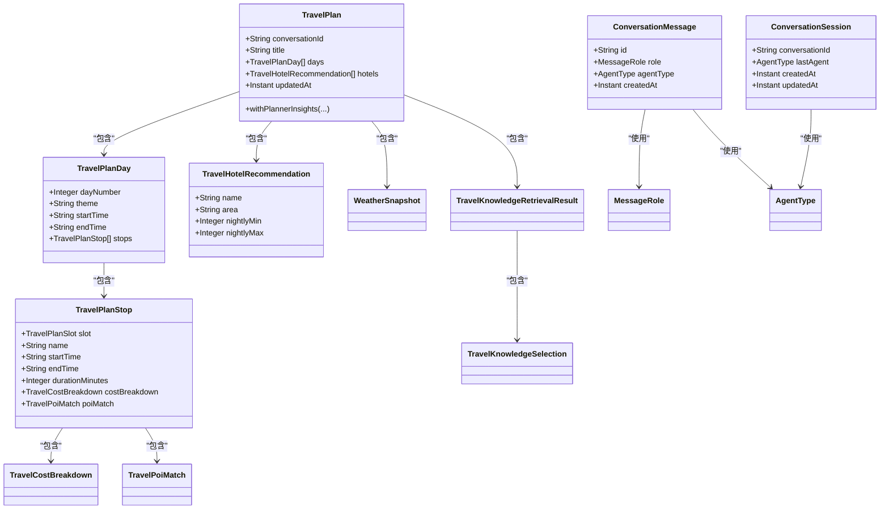
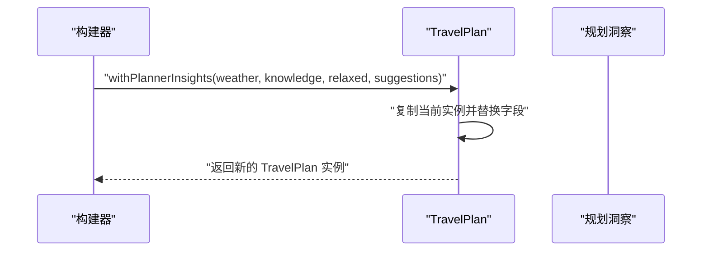
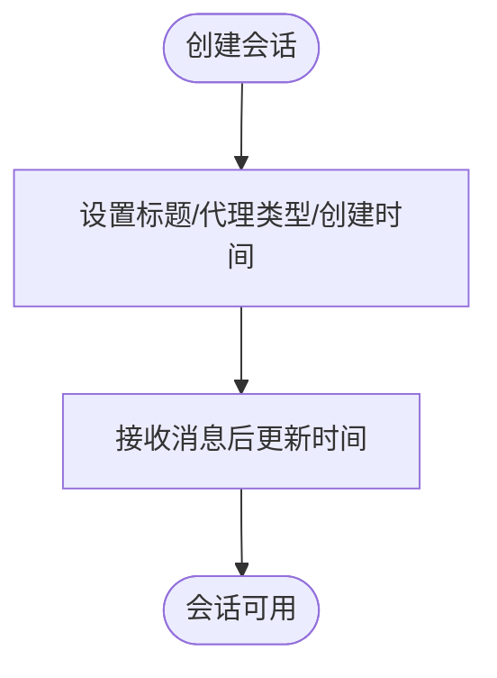
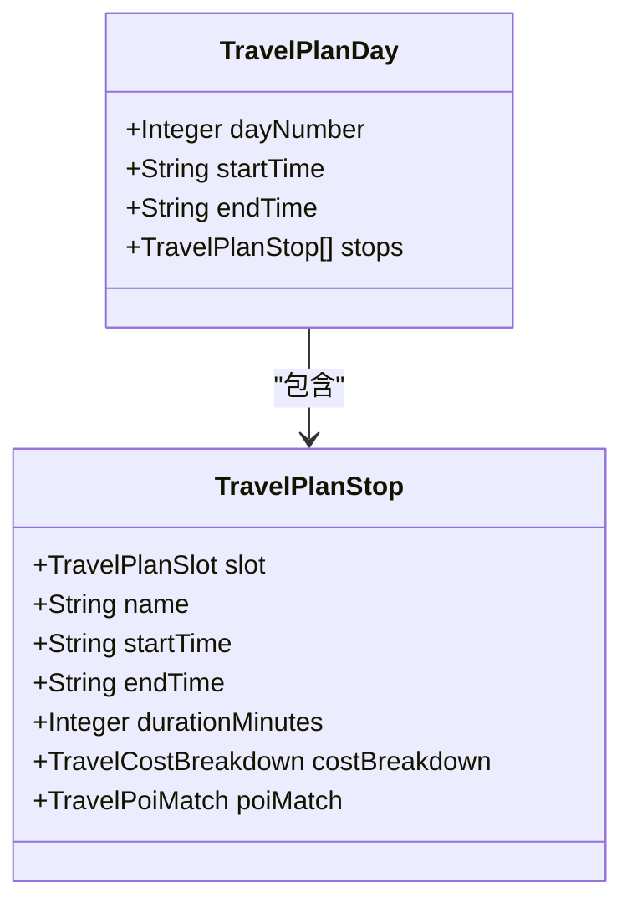
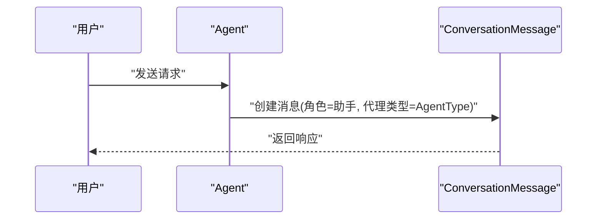
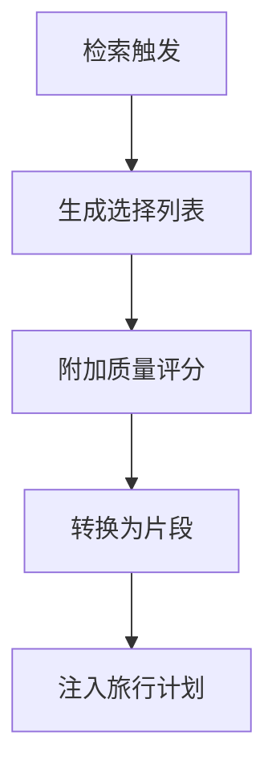
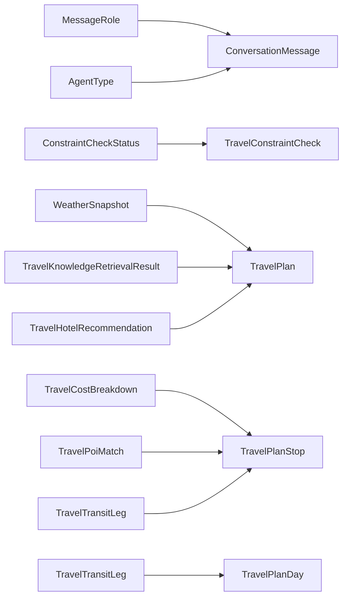

# 核心实体模型

<cite>
**本文引用的文件**
- [TravelPlan.java](file://travel-agent-domain/src/main/java/com/travalagent/domain/model/entity/TravelPlan.java)
- [ConversationSession.java](file://travel-agent-domain/src/main/java/com/travalagent/domain/model/entity/ConversationSession.java)
- [TravelPlanDay.java](file://travel-agent-domain/src/main/java/com/travalagent/domain/model/entity/TravelPlanDay.java)
- [TravelPlanStop.java](file://travel-agent-domain/src/main/java/com/travalagent/domain/model/entity/TravelPlanStop.java)
- [ConversationMessage.java](file://travel-agent-domain/src/main/java/com/travalagent/domain/model/entity/ConversationMessage.java)
- [TravelHotelRecommendation.java](file://travel-agent-domain/src/main/java/com/travalagent/domain/model/entity/TravelHotelRecommendation.java)
- [TravelPlanSlot.java](file://travel-agent-domain/src/main/java/com/travalagent/domain/model/entity/TravelPlanSlot.java)
- [TravelTransitLeg.java](file://travel-agent-domain/src/main/java/com/travalagent/domain/model/entity/TravelTransitLeg.java)
- [TravelBudgetItem.java](file://travel-agent-domain/src/main/java/com/travalagent/domain/model/entity/TravelBudgetItem.java)
- [TravelConstraintCheck.java](file://travel-agent-domain/src/main/java/com/travalagent/domain/model/entity/TravelConstraintCheck.java)
- [ConstraintCheckStatus.java](file://travel-agent-domain/src/main/java/com/travalagent/domain/model/entity/ConstraintCheckStatus.java)
- [TravelCostBreakdown.java](file://travel-agent-domain/src/main/java/com/travalagent/domain/model/entity/TravelCostBreakdown.java)
- [TravelPoiMatch.java](file://travel-agent-domain/src/main/java/com/travalagent/domain/model/entity/TravelPoiMatch.java)
- [MessageRole.java](file://travel-agent-domain/src/main/java/com/travalagent/domain/model/valobj/MessageRole.java)
- [AgentType.java](file://travel-agent-domain/src/main/java/com/travalagent/domain/model/valobj/AgentType.java)
- [WeatherSnapshot.java](file://travel-agent-domain/src/main/java/com/travalagent/domain/model/valobj/WeatherSnapshot.java)
- [TravelKnowledgeRetrievalResult.java](file://travel-agent-domain/src/main/java/com/travalagent/domain/model/valobj/TravelKnowledgeRetrievalResult.java)
- [TravelKnowledgeSelection.java](file://travel-agent-domain/src/main/java/com/travalagent/domain/model/valobj/TravelKnowledgeSelection.java)
</cite>

## 目录
1. [引言](#引言)
2. [项目结构](#项目结构)
3. [核心组件](#核心组件)
4. [架构总览](#架构总览)
5. [详细组件分析](#详细组件分析)
6. [依赖分析](#依赖分析)
7. [性能考虑](#性能考虑)
8. [故障排查指南](#故障排查指南)
9. [结论](#结论)
10. [附录](#附录)

## 引言
本文件聚焦于旅行智能体系统中的核心领域模型，围绕以下实体展开：旅行计划、会话、日程与停留点、消息、酒店推荐以及相关的时间段、交通路线、预算与约束等值对象。我们将从不可变记录（record）设计、with方法模式、状态与生命周期、层级关系与时间安排、消息类型与角色分配、评分与质量机制等方面进行系统化解析，并给出实体间关联、外键约束与数据完整性保障的最佳实践。

## 项目结构
核心实体与值对象主要位于领域层（travel-agent-domain），采用“实体+值对象”的分层组织方式，确保业务不变量与数据封装：

- 实体层（entity）：旅行计划、会话、日程、停留点、消息、酒店推荐等
- 值对象层（valobj）：消息角色、代理类型、天气快照、知识检索结果等

图示来源
- [TravelPlan.java:1-106](file://travel-agent-domain/src/main/java/com/travalagent/domain/model/entity/TravelPlan.java#L1-L106)
- [ConversationSession.java:1-16](file://travel-agent-domain/src/main/java/com/travalagent/domain/model/entity/ConversationSession.java#L1-L16)
- [TravelPlanDay.java:1-22](file://travel-agent-domain/src/main/java/com/travalagent/domain/model/entity/TravelPlanDay.java#L1-L22)
- [TravelPlanStop.java:1-24](file://travel-agent-domain/src/main/java/com/travalagent/domain/model/entity/TravelPlanStop.java#L1-L24)
- [ConversationMessage.java:1-34](file://travel-agent-domain/src/main/java/com/travalagent/domain/model/entity/ConversationMessage.java#L1-L34)
- [TravelHotelRecommendation.java:1-15](file://travel-agent-domain/src/main/java/com/travalagent/domain/model/entity/TravelHotelRecommendation.java#L1-L15)
- [MessageRole.java:1-8](file://travel-agent-domain/src/main/java/com/travalagent/domain/model/valobj/MessageRole.java#L1-L8)
- [AgentType.java:1-9](file://travel-agent-domain/src/main/java/com/travalagent/domain/model/valobj/AgentType.java#L1-L9)
- [WeatherSnapshot.java:1-13](file://travel-agent-domain/src/main/java/com/travalagent/domain/model/valobj/WeatherSnapshot.java#L1-L13)
- [TravelKnowledgeRetrievalResult.java:1-42](file://travel-agent-domain/src/main/java/com/travalagent/domain/model/valobj/TravelKnowledgeRetrievalResult.java#L1-L42)
- [TravelKnowledgeSelection.java:1-56](file://travel-agent-domain/src/main/java/com/travalagent/domain/model/valobj/TravelKnowledgeSelection.java#L1-L56)

章节来源
- [TravelPlan.java:1-106](file://travel-agent-domain/src/main/java/com/travalagent/domain/model/entity/TravelPlan.java#L1-L106)
- [ConversationSession.java:1-16](file://travel-agent-domain/src/main/java/com/travalagent/domain/model/entity/ConversationSession.java#L1-L16)
- [TravelPlanDay.java:1-22](file://travel-agent-domain/src/main/java/com/travalagent/domain/model/entity/TravelPlanDay.java#L1-L22)
- [TravelPlanStop.java:1-24](file://travel-agent-domain/src/main/java/com/travalagent/domain/model/entity/TravelPlanStop.java#L1-L24)
- [ConversationMessage.java:1-34](file://travel-agent-domain/src/main/java/com/travalagent/domain/model/entity/ConversationMessage.java#L1-L34)
- [TravelHotelRecommendation.java:1-15](file://travel-agent-domain/src/main/java/com/travalagent/domain/model/entity/TravelHotelRecommendation.java#L1-L15)
- [MessageRole.java:1-8](file://travel-agent-domain/src/main/java/com/travalagent/domain/model/valobj/MessageRole.java#L1-L8)
- [AgentType.java:1-9](file://travel-agent-domain/src/main/java/com/travalagent/domain/model/valobj/AgentType.java#L1-L9)
- [WeatherSnapshot.java:1-13](file://travel-agent-domain/src/main/java/com/travalagent/domain/model/valobj/WeatherSnapshot.java#L1-L13)
- [TravelKnowledgeRetrievalResult.java:1-42](file://travel-agent-domain/src/main/java/com/travalagent/domain/model/valobj/TravelKnowledgeRetrievalResult.java#L1-L42)
- [TravelKnowledgeSelection.java:1-56](file://travel-agent-domain/src/main/java/com/travalagent/domain/model/valobj/TravelKnowledgeSelection.java#L1-L56)

## 核心组件
本节对关键实体进行要点提炼与设计解读，突出不可变性、with方法模式、时间与成本建模、消息角色与代理类型等。

- 不可变记录（record）设计
  - 所有实体均以record定义，字段在构造时初始化，运行期不可变，天然线程安全，便于缓存与跨层传递。
  - 构造器中对集合字段执行不可变拷贝，避免外部修改影响内部状态。
- with方法模式
  - 通过复制当前实例并替换指定字段的方式返回新实例，实现函数式风格的“更新”，常用于组合器或工作流中逐步构建与增强。
- 时间与成本建模
  - 日程与停留点使用字符串表示时间段，同时提供分钟级的估计成本与时长字段，便于计算与展示。
- 消息与角色
  - 消息实体包含角色（用户/助手/系统）与代理类型，支持多Agent协作与元数据扩展。
- 酒店推荐与评分
  - 酒店推荐包含价格区间、经纬度、来源等信息；知识检索结果与选择包含质量评分与片段转换能力，支撑推荐可信度评估。

章节来源
- [TravelPlan.java:30-37](file://travel-agent-domain/src/main/java/com/travalagent/domain/model/entity/TravelPlan.java#L30-L37)
- [TravelPlan.java:77-103](file://travel-agent-domain/src/main/java/com/travalagent/domain/model/entity/TravelPlan.java#L77-L103)
- [ConversationMessage.java:19-21](file://travel-agent-domain/src/main/java/com/travalagent/domain/model/entity/ConversationMessage.java#L19-L21)
- [TravelPlanDay.java:17-19](file://travel-agent-domain/src/main/java/com/travalagent/domain/model/entity/TravelPlanDay.java#L17-L19)
- [TravelPlanStop.java:3-21](file://travel-agent-domain/src/main/java/com/travalagent/domain/model/entity/TravelPlanStop.java#L3-L21)
- [TravelHotelRecommendation.java:3-13](file://travel-agent-domain/src/main/java/com/travalagent/domain/model/entity/TravelHotelRecommendation.java#L3-L13)
- [TravelKnowledgeRetrievalResult.java:36-40](file://travel-agent-domain/src/main/java/com/travalagent/domain/model/valobj/TravelKnowledgeRetrievalResult.java#L36-L40)

## 架构总览
下图展示了核心实体与值对象之间的聚合与组合关系，体现旅行计划的层级结构与消息驱动的会话管理。

图示来源
- [TravelPlan.java:1-106](file://travel-agent-domain/src/main/java/com/travalagent/domain/model/entity/TravelPlan.java#L1-L106)
- [TravelPlanDay.java:1-22](file://travel-agent-domain/src/main/java/com/travalagent/domain/model/entity/TravelPlanDay.java#L1-L22)
- [TravelPlanStop.java:1-24](file://travel-agent-domain/src/main/java/com/travalagent/domain/model/entity/TravelPlanStop.java#L1-L24)
- [TravelHotelRecommendation.java:1-15](file://travel-agent-domain/src/main/java/com/travalagent/domain/model/entity/TravelHotelRecommendation.java#L1-L15)
- [ConversationMessage.java:1-34](file://travel-agent-domain/src/main/java/com/travalagent/domain/model/entity/ConversationMessage.java#L1-L34)
- [ConversationSession.java:1-16](file://travel-agent-domain/src/main/java/com/travalagent/domain/model/entity/ConversationSession.java#L1-L16)
- [WeatherSnapshot.java:1-13](file://travel-agent-domain/src/main/java/com/travalagent/domain/model/valobj/WeatherSnapshot.java#L1-L13)
- [TravelKnowledgeRetrievalResult.java:1-42](file://travel-agent-domain/src/main/java/com/travalagent/domain/model/valobj/TravelKnowledgeRetrievalResult.java#L1-L42)
- [TravelKnowledgeSelection.java:1-56](file://travel-agent-domain/src/main/java/com/travalagent/domain/model/valobj/TravelKnowledgeSelection.java#L1-L56)

## 详细组件分析

### 旅行计划（TravelPlan）
- 设计要点
  - 不可变记录：所有字段在构造时确定，避免并发与状态漂移问题。
  - 不可变集合拷贝：在构造器中对列表字段执行只读拷贝，防止外部修改污染内部状态。
  - with方法模式：提供带规划洞察的更新方法，返回新实例，保持原实例不变。
  - 组合丰富：包含天气快照、知识检索结果、酒店推荐、预算条目、约束检查、日程天数等。
- 关键字段与职责
  - 会话标识与标题：用于关联对话上下文与展示。
  - 酒店区域与理由：指导住宿策略与解释。
  - 总预算与估算范围：支撑预算约束与超支预警。
  - 高亮、预算条目、约束检查：用于摘要与合规性校验。
  - 日程天数：承载行程主体。
  - 更新时间：用于排序、缓存失效与审计。
- 规划洞察with方法
  - 将天气、知识检索、约束放宽标记与调整建议注入旅行计划，形成“增强版”计划，便于后续渲染与反馈。

图示来源
- [TravelPlan.java:77-103](file://travel-agent-domain/src/main/java/com/travalagent/domain/model/entity/TravelPlan.java#L77-L103)

章节来源
- [TravelPlan.java:9-28](file://travel-agent-domain/src/main/java/com/travalagent/domain/model/entity/TravelPlan.java#L9-L28)
- [TravelPlan.java:30-37](file://travel-agent-domain/src/main/java/com/travalagent/domain/model/entity/TravelPlan.java#L30-L37)
- [TravelPlan.java:77-103](file://travel-agent-domain/src/main/java/com/travalagent/domain/model/entity/TravelPlan.java#L77-L103)

### 会话（ConversationSession）
- 设计要点
  - 记录类实体，包含会话标识、标题、最后代理类型、摘要、创建与更新时间。
  - 生命周期控制：由创建与更新时间维护；最后代理类型用于路由与上下文恢复。
- 状态与上下文
  - 作为会话上下文的根实体，承载对话历史与代理交互的元信息。
  - 可用于会话列表展示、摘要检索与代理选择。

图示来源
- [ConversationSession.java:7-14](file://travel-agent-domain/src/main/java/com/travalagent/domain/model/entity/ConversationSession.java#L7-L14)

章节来源
- [ConversationSession.java:7-14](file://travel-agent-domain/src/main/java/com/travalagent/domain/model/entity/ConversationSession.java#L7-L14)

### 行程日（TravelPlanDay）与停留点（TravelPlanStop）
- 层级关系
  - 旅行计划包含多个行程日；每个行程日包含多个停留点。
  - 停留点携带时间段、时长、成本分解与POI匹配信息，支撑可视化与成本核算。
- 时间安排逻辑
  - 使用字符串表示起止时间，便于灵活表达不同粒度的时间段。
  - 提供总交通时长与总活动时长，辅助日程平衡与瓶颈识别。
- 与交通路线的关系
  - 停留点可携带从上一个停留点的交通路线，形成连续路径。

图示来源
- [TravelPlanDay.java:5-15](file://travel-agent-domain/src/main/java/com/travalagent/domain/model/entity/TravelPlanDay.java#L5-L15)
- [TravelPlanStop.java:3-21](file://travel-agent-domain/src/main/java/com/travalagent/domain/model/entity/TravelPlanStop.java#L3-L21)

章节来源
- [TravelPlanDay.java:5-15](file://travel-agent-domain/src/main/java/com/travalagent/domain/model/entity/TravelPlanDay.java#L5-L15)
- [TravelPlanStop.java:3-21](file://travel-agent-domain/src/main/java/com/travalagent/domain/model/entity/TravelPlanStop.java#L3-L21)

### 消息（ConversationMessage）
- 消息类型与角色
  - 角色枚举涵盖用户、助手、系统三类，用于区分消息来源与用途。
  - 代理类型用于标注消息由哪个Agent生成，便于追踪与回放。
- 内容结构与元数据
  - 内容为自由文本；元数据为键值对，可用于扩展字段（如附件、意图标签等）。
  - 默认构造器提供空元数据的便捷版本。
- 生命周期
  - 创建时间用于排序与审计；与会话ID关联形成消息归属。

图示来源
- [ConversationMessage.java:9-17](file://travel-agent-domain/src/main/java/com/travalagent/domain/model/entity/ConversationMessage.java#L9-L17)
- [MessageRole.java:3-7](file://travel-agent-domain/src/main/java/com/travalagent/domain/model/valobj/MessageRole.java#L3-L7)
- [AgentType.java:3-8](file://travel-agent-domain/src/main/java/com/travalagent/domain/model/valobj/AgentType.java#L3-L8)

章节来源
- [ConversationMessage.java:9-17](file://travel-agent-domain/src/main/java/com/travalagent/domain/model/entity/ConversationMessage.java#L9-L17)
- [MessageRole.java:3-7](file://travel-agent-domain/src/main/java/com/travalagent/domain/model/valobj/MessageRole.java#L3-L7)
- [AgentType.java:3-8](file://travel-agent-domain/src/main/java/com/travalagent/domain/model/valobj/AgentType.java#L3-L8)

### 酒店推荐（TravelHotelRecommendation）
- 属性设计
  - 名称、区域、地址、夜间价格区间、经纬度、来源等，满足地图与预订对接需求。
- 评分机制
  - 当前实体未直接暴露评分字段；可通过外部检索结果与选择（见下节）间接评估可信度。
- 与旅行计划的集成
  - 旅行计划持有酒店推荐列表，作为住宿策略的一部分。

章节来源
- [TravelHotelRecommendation.java:3-13](file://travel-agent-domain/src/main/java/com/travalagent/domain/model/entity/TravelHotelRecommendation.java#L3-L13)
- [TravelPlan.java:15](file://travel-agent-domain/src/main/java/com/travalagent/domain/model/entity/TravelPlan.java#L15)

### 知识检索与评分（TravelKnowledgeRetrievalResult / TravelKnowledgeSelection）
- 结构与职责
  - 检索结果包含目的地、推断主题与旅行风格、来源与选择列表。
  - 选择项包含城市、话题、标题、内容、标签、来源、子类型、质量评分、匹配信息等。
- 质量机制
  - 选择项提供质量评分字段，用于排序与筛选。
  - 支持将选择转换为片段，便于下游消费。
- 与旅行计划的关联
  - 旅行计划可注入检索结果与天气快照，形成“带洞察”的计划。

图示来源
- [TravelKnowledgeRetrievalResult.java:5-11](file://travel-agent-domain/src/main/java/com/travalagent/domain/model/valobj/TravelKnowledgeRetrievalResult.java#L5-L11)
- [TravelKnowledgeSelection.java:5-17](file://travel-agent-domain/src/main/java/com/travalagent/domain/model/valobj/TravelKnowledgeSelection.java#L5-L17)
- [TravelKnowledgeSelection.java:52-54](file://travel-agent-domain/src/main/java/com/travalagent/domain/model/valobj/TravelKnowledgeSelection.java#L52-L54)
- [TravelPlan.java:23-24](file://travel-agent-domain/src/main/java/com/travalagent/domain/model/entity/TravelPlan.java#L23-L24)

章节来源
- [TravelKnowledgeRetrievalResult.java:5-11](file://travel-agent-domain/src/main/java/com/travalagent/domain/model/valobj/TravelKnowledgeRetrievalResult.java#L5-L11)
- [TravelKnowledgeSelection.java:5-17](file://travel-agent-domain/src/main/java/com/travalagent/domain/model/valobj/TravelKnowledgeSelection.java#L5-L17)
- [TravelKnowledgeSelection.java:52-54](file://travel-agent-domain/src/main/java/com/travalagent/domain/model/valobj/TravelKnowledgeSelection.java#L52-L54)
- [TravelPlan.java:23-24](file://travel-agent-domain/src/main/java/com/travalagent/domain/model/entity/TravelPlan.java#L23-L24)

## 依赖分析
- 枚举与值对象
  - 消息角色与代理类型为简单枚举，被消息实体直接使用。
  - 约束检查状态为枚举，被约束检查实体使用。
- 复杂值对象
  - 天气快照与知识检索结果为记录类，被旅行计划组合。
  - 成本分解与POI匹配为记录类，被停留点组合。
  - 交通路线为记录类，被停留点与日程组合。
- 实体间耦合
  - 旅行计划聚合多个日程与酒店推荐；日程聚合多个停留点；停留点进一步组合成本分解、POI匹配与交通路线。
  - 消息实体与会话实体通过会话ID建立一对多关系，但消息本身不直接持久化到旅行计划中。

图示来源
- [MessageRole.java:3-7](file://travel-agent-domain/src/main/java/com/travalagent/domain/model/valobj/MessageRole.java#L3-L7)
- [AgentType.java:3-8](file://travel-agent-domain/src/main/java/com/travalagent/domain/model/valobj/AgentType.java#L3-L8)
- [ConstraintCheckStatus.java:3-7](file://travel-agent-domain/src/main/java/com/travalagent/domain/model/entity/ConstraintCheckStatus.java#L3-L7)
- [WeatherSnapshot.java:3-11](file://travel-agent-domain/src/main/java/com/travalagent/domain/model/valobj/WeatherSnapshot.java#L3-L11)
- [TravelKnowledgeRetrievalResult.java:5-11](file://travel-agent-domain/src/main/java/com/travalagent/domain/model/valobj/TravelKnowledgeRetrievalResult.java#L5-L11)
- [TravelCostBreakdown.java:3-9](file://travel-agent-domain/src/main/java/com/travalagent/domain/model/entity/TravelCostBreakdown.java#L3-L9)
- [TravelPoiMatch.java:5-16](file://travel-agent-domain/src/main/java/com/travalagent/domain/model/entity/TravelPoiMatch.java#L5-L16)
- [TravelTransitLeg.java:5-18](file://travel-agent-domain/src/main/java/com/travalagent/domain/model/entity/TravelTransitLeg.java#L5-L18)
- [TravelPlanStop.java:18-20](file://travel-agent-domain/src/main/java/com/travalagent/domain/model/entity/TravelPlanStop.java#L18-L20)
- [TravelPlanDay.java:14](file://travel-agent-domain/src/main/java/com/travalagent/domain/model/entity/TravelPlanDay.java#L14)
- [TravelHotelRecommendation.java:3-13](file://travel-agent-domain/src/main/java/com/travalagent/domain/model/entity/TravelHotelRecommendation.java#L3-L13)
- [TravelPlan.java:22-23](file://travel-agent-domain/src/main/java/com/travalagent/domain/model/entity/TravelPlan.java#L22-L23)

章节来源
- [MessageRole.java:3-7](file://travel-agent-domain/src/main/java/com/travalagent/domain/model/valobj/MessageRole.java#L3-L7)
- [AgentType.java:3-8](file://travel-agent-domain/src/main/java/com/travalagent/domain/model/valobj/AgentType.java#L3-L8)
- [ConstraintCheckStatus.java:3-7](file://travel-agent-domain/src/main/java/com/travalagent/domain/model/entity/ConstraintCheckStatus.java#L3-L7)
- [WeatherSnapshot.java:3-11](file://travel-agent-domain/src/main/java/com/travalagent/domain/model/valobj/WeatherSnapshot.java#L3-L11)
- [TravelKnowledgeRetrievalResult.java:5-11](file://travel-agent-domain/src/main/java/com/travalagent/domain/model/valobj/TravelKnowledgeRetrievalResult.java#L5-L11)
- [TravelCostBreakdown.java:3-9](file://travel-agent-domain/src/main/java/com/travalagent/domain/model/entity/TravelCostBreakdown.java#L3-L9)
- [TravelPoiMatch.java:5-16](file://travel-agent-domain/src/main/java/com/travalagent/domain/model/entity/TravelPoiMatch.java#L5-L16)
- [TravelTransitLeg.java:5-18](file://travel-agent-domain/src/main/java/com/travalagent/domain/model/entity/TravelTransitLeg.java#L5-L18)
- [TravelPlanStop.java:18-20](file://travel-agent-domain/src/main/java/com/travalagent/domain/model/entity/TravelPlanStop.java#L18-L20)
- [TravelPlanDay.java:14](file://travel-agent-domain/src/main/java/com/travalagent/domain/model/entity/TravelPlanDay.java#L14)
- [TravelHotelRecommendation.java:3-13](file://travel-agent-domain/src/main/java/com/travalagent/domain/model/entity/TravelHotelRecommendation.java#L3-L13)
- [TravelPlan.java:22-23](file://travel-agent-domain/src/main/java/com/travalagent/domain/model/entity/TravelPlan.java#L22-L23)

## 性能考虑
- 不可变性带来的优势
  - 线程安全与零锁共享，适合高并发场景；可缓存与复用，减少GC压力。
- 集合不可变拷贝的成本
  - 在高频更新场景下，频繁拷贝可能带来开销；建议批量更新或使用builder模式合并多次变更后再生成最终实体。
- 时间与成本字段的使用
  - 字符串时间与整型时长/成本便于序列化与计算；建议在展示层统一格式化，避免重复转换。
- 元数据与片段转换
  - 元数据与片段转换在需要时再执行，避免不必要的内存占用。

## 故障排查指南
- 不可变性导致的“更新无效”
  - 症状：修改字段后未生效。
  - 排查：确认是否使用了with方法或构造器返回的新实例，而非期望原地修改。
- 集合被外部修改
  - 症状：实体内部集合被外部代码修改。
  - 排查：检查构造器中的不可变拷贝是否生效；确保对外暴露只读视图。
- 时间格式不一致
  - 症状：排序或展示异常。
  - 排查：统一使用ISO时间格式或约定的字符串格式；在输入端进行校验。
- 元数据缺失
  - 症状：下游处理失败。
  - 排查：默认构造器提供空元数据；若业务要求非空，应在上层进行校验。

章节来源
- [TravelPlan.java:30-37](file://travel-agent-domain/src/main/java/com/travalagent/domain/model/entity/TravelPlan.java#L30-L37)
- [ConversationMessage.java:19-21](file://travel-agent-domain/src/main/java/com/travalagent/domain/model/entity/ConversationMessage.java#L19-L21)

## 结论
本文件系统梳理了旅行智能体的核心领域模型：以不可变记录为核心的数据结构、with方法模式的函数式更新、消息与会话的角色与生命周期、日程与停留点的时间与成本建模、酒店推荐与知识检索的质量机制。通过清晰的层级关系与值对象组合，系统实现了强一致、可演进且易于测试的领域模型。建议在实际落地中遵循“不可变优先、with方法更新、明确边界”的原则，结合最佳实践进行持久化与缓存设计。

## 附录
- 最佳实践清单
  - 创建：使用带默认值的构造器或工厂方法，确保必要字段完整。
  - 更新：优先使用with方法或组合器，避免直接修改字段。
  - 查询：基于不可变字段进行过滤与排序；对集合使用只读视图。
  - 完整性：在上层校验时间格式、预算范围与约束状态；对元数据进行白名单控制。
  - 关联：通过会话ID与计划ID建立外键约束；在数据库层面保证引用一致性。