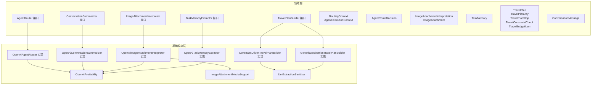
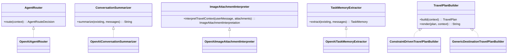
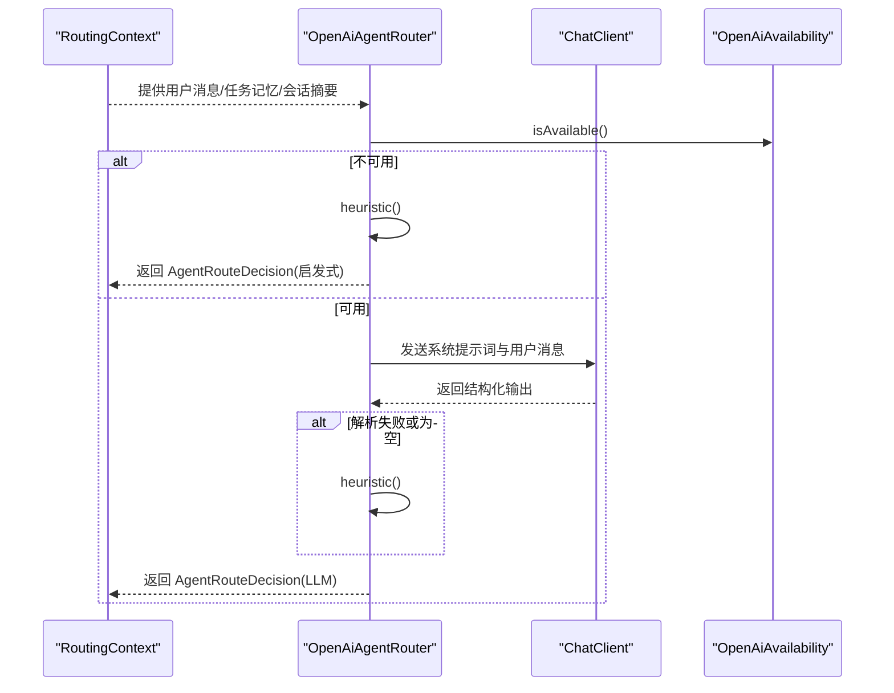
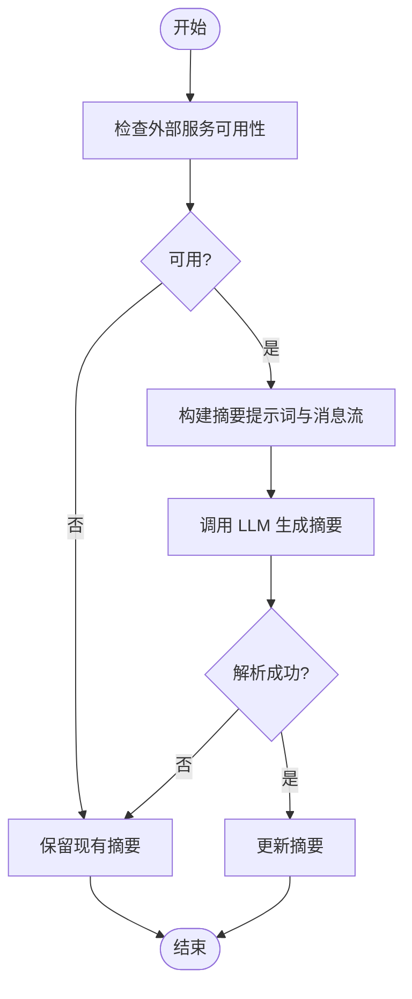
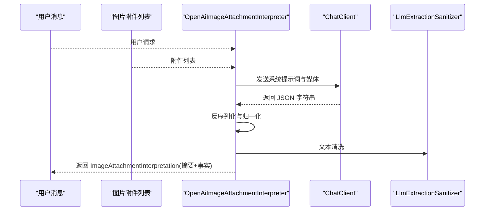
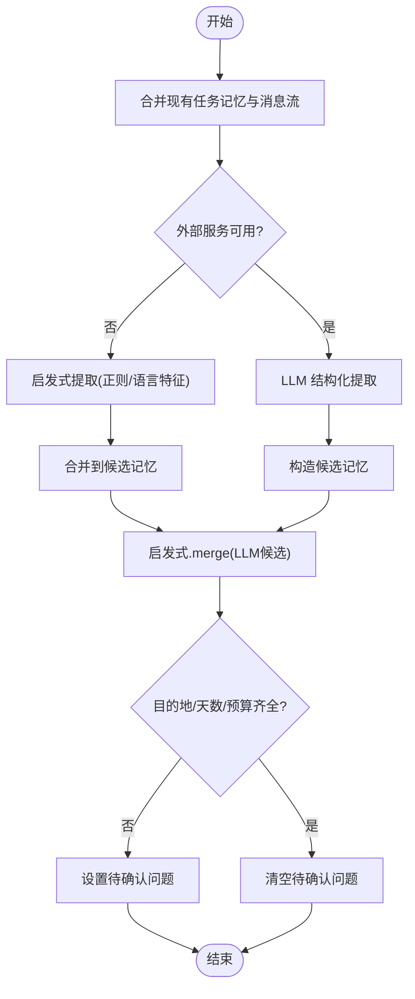
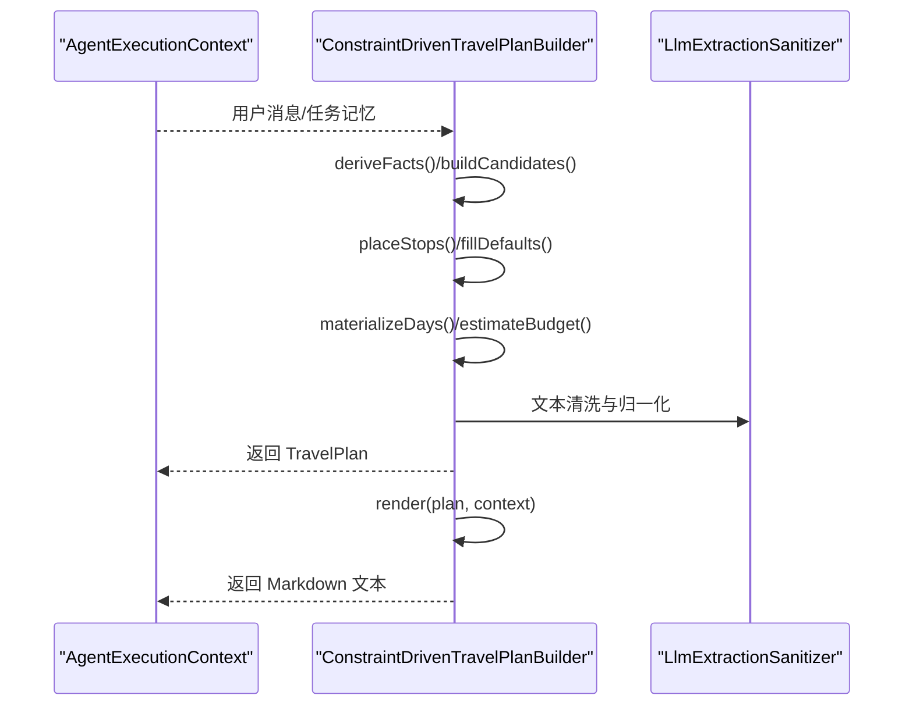
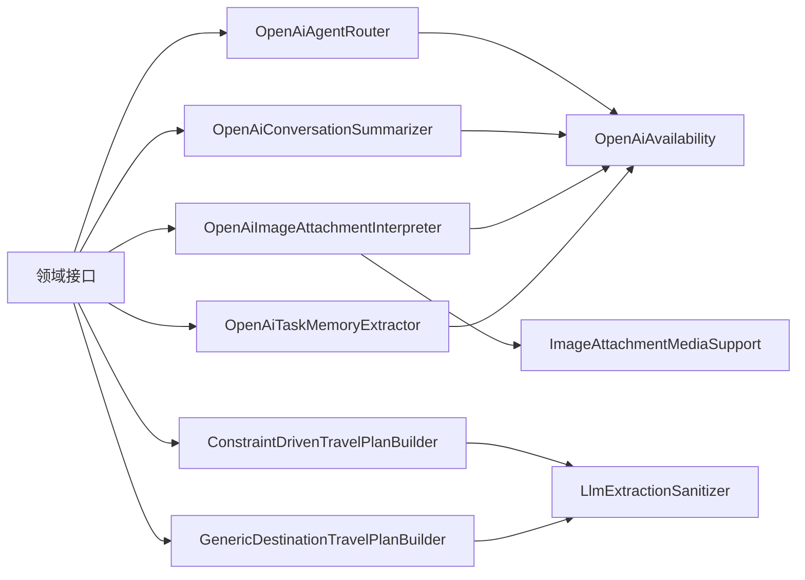

# 领域服务

<cite>
**本文引用的文件**
- [AgentRouter.java](file://travel-agent-domain/src/main/java/com/travalagent/domain/service/AgentRouter.java)
- [OpenAiAgentRouter.java](file://travel-agent-infrastructure/src/main/java/com/travalagent/infrastructure/gateway/llm/OpenAiAgentRouter.java)
- [ConversationSummarizer.java](file://travel-agent-domain/src/main/java/com/travalagent/domain/service/ConversationSummarizer.java)
- [OpenAiConversationSummarizer.java](file://travel-agent-infrastructure/src/main/java/com/travalagent/infrastructure/gateway/llm/OpenAiConversationSummarizer.java)
- [ImageAttachmentInterpreter.java](file://travel-agent-domain/src/main/java/com/travalagent/domain/service/ImageAttachmentInterpreter.java)
- [OpenAiImageAttachmentInterpreter.java](file://travel-agent-infrastructure/src/main/java/com/travalagent/infrastructure/gateway/llm/OpenAiImageAttachmentInterpreter.java)
- [TaskMemoryExtractor.java](file://travel-agent-domain/src/main/java/com/travalagent/domain/service/TaskMemoryExtractor.java)
- [OpenAiTaskMemoryExtractor.java](file://travel-agent-infrastructure/src/main/java/com/travalagent/infrastructure/gateway/llm/OpenAiTaskMemoryExtractor.java)
- [TravelPlanBuilder.java](file://travel-agent-domain/src/main/java/com/travalagent/domain/service/TravelPlanBuilder.java)
- [ConstraintDrivenTravelPlanBuilder.java](file://travel-agent-infrastructure/src/main/java/com/travalagent/infrastructure/gateway/llm/ConstraintDrivenTravelPlanBuilder.java)
- [GenericDestinationTravelPlanBuilder.java](file://travel-agent-infrastructure/src/main/java/com/travalagent/infrastructure/gateway/llm/GenericDestinationTravelPlanBuilder.java)
- [RoutingContext.java](file://travel-agent-domain/src/main/java/com/travalagent/domain/model/valobj/RoutingContext.java)
- [AgentExecutionContext.java](file://travel-agent-domain/src/main/java/com/travalagent/domain/model/valobj/AgentExecutionContext.java)
- [AgentRouteDecision.java](file://travel-agent-domain/src/main/java/com/travalagent/domain/model/valobj/AgentRouteDecision.java)
- [ImageAttachmentInterpretation.java](file://travel-agent-domain/src/main/java/com/travalagent/domain/model/valobj/ImageAttachmentInterpretation.java)
- [ImageAttachment.java](file://travel-agent-domain/src/main/java/com/travalagent/domain/model/valobj/ImageAttachment.java)
- [ConversationImageFacts.java](file://travel-agent-domain/src/main/java/com/travalagent/domain/model/entity/ConversationImageFacts.java)
- [TaskMemory.java](file://travel-agent-domain/src/main/java/com/travalagent/domain/model/entity/TaskMemory.java)
- [TravelPlan.java](file://travel-agent-domain/src/main/java/com/travalagent/domain/model/entity/TravelPlan.java)
- [TravelPlanDay.java](file://travel-agent-domain/src/main/java/com/travalagent/domain/model/entity/TravelPlanDay.java)
- [TravelPlanStop.java](file://travel-agent-domain/src/main/java/com/travalagent/domain/model/entity/TravelPlanStop.java)
- [TravelConstraintCheck.java](file://travel-agent-domain/src/main/java/com/travalagent/domain/model/entity/TravelConstraintCheck.java)
- [TravelBudgetItem.java](file://travel-agent-domain/src/main/java/com/travalagent/domain/model/entity/TravelBudgetItem.java)
- [ConversationMessage.java](file://travel-agent-domain/src/main/java/com/travalagent/domain/model/entity/ConversationMessage.java)
- [OpenAiAvailability.java](file://travel-agent-infrastructure/src/main/java/com/travalagent/infrastructure/gateway/llm/OpenAiAvailability.java)
- [ImageAttachmentMediaSupport.java](file://travel-agent-infrastructure/src/main/java/com/travalagent/infrastructure/gateway/llm/ImageAttachmentMediaSupport.java)
- [LlmExtractionSanitizer.java](file://travel-agent-infrastructure/src/main/java/com/travalagent/infrastructure/gateway/llm/LlmExtractionSanitizer.java)
</cite>

## 目录
1. [简介](#简介)
2. [项目结构](#项目结构)
3. [核心组件](#核心组件)
4. [架构总览](#架构总览)
5. [详细组件分析](#详细组件分析)
6. [依赖分析](#依赖分析)
7. [性能考虑](#性能考虑)
8. [故障排查指南](#故障排查指南)
9. [结论](#结论)
10. [附录](#附录)

## 简介
本文件系统性梳理旅行助手领域的五大核心服务：AgentRouter 智能体路由、ConversationSummarizer 会话摘要、ImageAttachmentInterpreter 图片附件解释、TaskMemoryExtractor 任务记忆提取、TravelPlanBuilder 旅行计划构建。文档覆盖接口设计、实现策略、算法细节、数据流、错误处理、依赖注入模式、测试策略、扩展点与插件机制、以及服务间协作与事件驱动架构。

## 项目结构
领域层提供服务接口与模型值对象/实体，基础设施层提供基于 LLM 的具体实现，并通过 Spring 组件装配与可用性探测进行降级与容错。

图表来源
- [AgentRouter.java:1-10](file://travel-agent-domain/src/main/java/com/travalagent/domain/service/AgentRouter.java#L1-L10)
- [OpenAiAgentRouter.java:1-145](file://travel-agent-infrastructure/src/main/java/com/travalagent/infrastructure/gateway/llm/OpenAiAgentRouter.java#L1-L145)
- [ConversationSummarizer.java:1-11](file://travel-agent-domain/src/main/java/com/travalagent/domain/service/ConversationSummarizer.java#L1-L11)
- [OpenAiConversationSummarizer.java:1-54](file://travel-agent-infrastructure/src/main/java/com/travalagent/infrastructure/gateway/llm/OpenAiConversationSummarizer.java#L1-L54)
- [ImageAttachmentInterpreter.java:1-12](file://travel-agent-domain/src/main/java/com/travalagent/domain/service/ImageAttachmentInterpreter.java#L1-L12)
- [OpenAiImageAttachmentInterpreter.java:1-173](file://travel-agent-infrastructure/src/main/java/com/travalagent/infrastructure/gateway/llm/OpenAiImageAttachmentInterpreter.java#L1-L173)
- [TaskMemoryExtractor.java:1-12](file://travel-agent-domain/src/main/java/com/travalagent/domain/service/TaskMemoryExtractor.java#L1-L12)
- [OpenAiTaskMemoryExtractor.java:1-283](file://travel-agent-infrastructure/src/main/java/com/travalagent/infrastructure/gateway/llm/OpenAiTaskMemoryExtractor.java#L1-L283)
- [TravelPlanBuilder.java:1-13](file://travel-agent-domain/src/main/java/com/travalagent/domain/service/TravelPlanBuilder.java#L1-L13)
- [ConstraintDrivenTravelPlanBuilder.java:1-902](file://travel-agent-infrastructure/src/main/java/com/travalagent/infrastructure/gateway/llm/ConstraintDrivenTravelPlanBuilder.java#L1-L902)
- [GenericDestinationTravelPlanBuilder.java:1-584](file://travel-agent-infrastructure/src/main/java/com/travalagent/infrastructure/gateway/llm/GenericDestinationTravelPlanBuilder.java#L1-L584)

章节来源
- [AgentRouter.java:1-10](file://travel-agent-domain/src/main/java/com/travalagent/domain/service/AgentRouter.java#L1-L10)
- [ConversationSummarizer.java:1-11](file://travel-agent-domain/src/main/java/com/travalagent/domain/service/ConversationSummarizer.java#L1-L11)
- [ImageAttachmentInterpreter.java:1-12](file://travel-agent-domain/src/main/java/com/travalagent/domain/service/ImageAttachmentInterpreter.java#L1-L12)
- [TaskMemoryExtractor.java:1-12](file://travel-agent-domain/src/main/java/com/travalagent/domain/service/TaskMemoryExtractor.java#L1-L12)
- [TravelPlanBuilder.java:1-13](file://travel-agent-domain/src/main/java/com/travalagent/domain/service/TravelPlanBuilder.java#L1-L13)

## 核心组件
- AgentRouter：根据用户请求、任务记忆与会话摘要进行路由决策，返回单一目标智能体类型，并可触发最小化澄清问题。
- ConversationSummarizer：对新消息流进行摘要更新，保持关键信息（目的地、预算、天数、偏好、未完成问题、最新决策）。
- ImageAttachmentInterpreter：从图片中抽取结构化旅行事实（出发/到达、日期、天数、预算、酒店、活动等），并生成可读摘要。
- TaskMemoryExtractor：从对话中提取/合并任务记忆（出发地、目的地、天数、预算、偏好、待确认问题、摘要），支持启发式与 LLM 双通道。
- TravelPlanBuilder：构建旅行计划并渲染为多语言 Markdown 文本，内置预算估算、约束检查与本地化标签。

章节来源
- [AgentRouter.java:6-9](file://travel-agent-domain/src/main/java/com/travalagent/domain/service/AgentRouter.java#L6-L9)
- [ConversationSummarizer.java:7-10](file://travel-agent-domain/src/main/java/com/travalagent/domain/service/ConversationSummarizer.java#L7-L10)
- [ImageAttachmentInterpreter.java:8-11](file://travel-agent-domain/src/main/java/com/travalagent/domain/service/ImageAttachmentInterpreter.java#L8-L11)
- [TaskMemoryExtractor.java:8-11](file://travel-agent-domain/src/main/java/com/travalagent/domain/service/TaskMemoryExtractor.java#L8-L11)
- [TravelPlanBuilder.java:6-12](file://travel-agent-domain/src/main/java/com/travalagent/domain/service/TravelPlanBuilder.java#L6-L12)

## 架构总览
领域服务通过接口抽象，基础设施层以 Spring 组件形式提供实现。各实现均依赖 OpenAI 可用性探测进行降级，部分实现使用媒体支持与文本清洗工具进行输入规范化。

图表来源
- [AgentRouter.java:6-9](file://travel-agent-domain/src/main/java/com/travalagent/domain/service/AgentRouter.java#L6-L9)
- [OpenAiAgentRouter.java:12-145](file://travel-agent-infrastructure/src/main/java/com/travalagent/infrastructure/gateway/llm/OpenAiAgentRouter.java#L12-L145)
- [ConversationSummarizer.java:7-10](file://travel-agent-domain/src/main/java/com/travalagent/domain/service/ConversationSummarizer.java#L7-L10)
- [OpenAiConversationSummarizer.java:10-54](file://travel-agent-infrastructure/src/main/java/com/travalagent/infrastructure/gateway/llm/OpenAiConversationSummarizer.java#L10-L54)
- [ImageAttachmentInterpreter.java:8-11](file://travel-agent-domain/src/main/java/com/travalagent/domain/service/ImageAttachmentInterpreter.java#L8-L11)
- [OpenAiImageAttachmentInterpreter.java:14-173](file://travel-agent-infrastructure/src/main/java/com/travalagent/infrastructure/gateway/llm/OpenAiImageAttachmentInterpreter.java#L14-L173)
- [TaskMemoryExtractor.java:8-11](file://travel-agent-domain/src/main/java/com/travalagent/domain/service/TaskMemoryExtractor.java#L8-L11)
- [OpenAiTaskMemoryExtractor.java:17-283](file://travel-agent-infrastructure/src/main/java/com/travalagent/infrastructure/gateway/llm/OpenAiTaskMemoryExtractor.java#L17-L283)
- [TravelPlanBuilder.java:6-12](file://travel-agent-domain/src/main/java/com/travalagent/domain/service/TravelPlanBuilder.java#L6-L12)
- [ConstraintDrivenTravelPlanBuilder.java:35-902](file://travel-agent-infrastructure/src/main/java/com/travalagent/infrastructure/gateway/llm/ConstraintDrivenTravelPlanBuilder.java#L35-L902)
- [GenericDestinationTravelPlanBuilder.java:24-584](file://travel-agent-infrastructure/src/main/java/com/travalagent/infrastructure/gateway/llm/GenericDestinationTravelPlanBuilder.java#L24-L584)

## 详细组件分析

### AgentRouter 智能体路由服务
- 决策算法
  - LLM 路由：构造系统提示词与用户上下文（任务记忆、会话摘要、用户消息），要求输出严格结构化 JSON，包含目标 Agent 类型、原因、是否需要澄清及澄清问题。
  - 启发式回退：当不可用或解析失败时，基于关键词与正则表达式判断（天气、地理、旅行规划相关词），并自动判定是否需要最小化澄清问题。
- 路由策略
  - 目标：WEATHER、GEO、TRAVEL_PLANNER、GENERAL 四类。
  - 规则：依据关键词与语言特征（中英文）进行快速分流；旅行规划缺失目的地/天数/预算时触发澄清。
- 负载均衡机制
  - 通过 OpenAiAvailability 探测外部服务可用性，动态选择 LLM 或启发式路径，保障稳定性与可用性。
- 关键接口与模型
  - 输入：RoutingContext（用户消息、任务记忆、会话摘要）
  - 输出：AgentRouteDecision（AgentType、reason、clarificationRequired、clarificationQuestion）

图表来源
- [OpenAiAgentRouter.java:29-96](file://travel-agent-infrastructure/src/main/java/com/travalagent/infrastructure/gateway/llm/OpenAiAgentRouter.java#L29-L96)
- [RoutingContext.java](file://travel-agent-domain/src/main/java/com/travalagent/domain/model/valobj/RoutingContext.java)
- [AgentRouteDecision.java](file://travel-agent-domain/src/main/java/com/travalagent/domain/model/valobj/AgentRouteDecision.java)

章节来源
- [OpenAiAgentRouter.java:1-145](file://travel-agent-infrastructure/src/main/java/com/travalagent/infrastructure/gateway/llm/OpenAiAgentRouter.java#L1-L145)
- [AgentRouter.java:1-10](file://travel-agent-domain/src/main/java/com/travalagent/domain/service/AgentRouter.java#L1-L10)

### ConversationSummarizer 会话摘要服务
- 文本处理
  - 将新消息流格式化为“角色+内容”的多行文本，作为用户输入。
  - 仅在消息数量足够且外部服务可用时才进行摘要更新。
- 关键信息提取
  - 摘要模板强调保留目的地、预算、天数、偏好、未完成问题与最新决策。
- 摘要生成算法
  - 使用 LLM 生成 80–120 字中文摘要；若失败或不可用，则保留现有摘要。
- 错误处理
  - 异常捕获后回退至现有摘要，保证会话连续性。

图表来源
- [OpenAiConversationSummarizer.java:21-52](file://travel-agent-infrastructure/src/main/java/com/travalagent/infrastructure/gateway/llm/OpenAiConversationSummarizer.java#L21-L52)
- [ConversationSummarizer.java:7-10](file://travel-agent-domain/src/main/java/com/travalagent/domain/service/ConversationSummarizer.java#L7-L10)

章节来源
- [OpenAiConversationSummarizer.java:1-54](file://travel-agent-infrastructure/src/main/java/com/travalagent/infrastructure/gateway/llm/OpenAiConversationSummarizer.java#L1-L54)
- [ConversationSummarizer.java:1-11](file://travel-agent-domain/src/main/java/com/travalagent/domain/service/ConversationSummarizer.java#L1-L11)

### ImageAttachmentInterpreter 图片附件解释服务
- 图像处理
  - 将图片附件转换为媒体数组，随用户消息一起提交给 LLM。
- OCR 与内容解析
  - LLM 返回严格 JSON，包含出发地、目的地、起止日期、天数、预算、酒店名称/区域、活动列表与缺失字段清单。
  - 对 JSON 进行反序列化与归一化（去空、去重、清洗文本）。
- 结构化输出
  - 生成可读摘要（逐项列出提取到的事实），并封装为 ImageAttachmentInterpretation。
- 容错策略
  - 无附件、不可用或解析失败时，返回默认“无法清晰提取”摘要与全缺失字段清单。

图表来源
- [OpenAiImageAttachmentInterpreter.java:31-103](file://travel-agent-infrastructure/src/main/java/com/travalagent/infrastructure/gateway/llm/OpenAiImageAttachmentInterpreter.java#L31-L103)
- [ImageAttachmentInterpreter.java:8-11](file://travel-agent-domain/src/main/java/com/travalagent/domain/service/ImageAttachmentInterpreter.java#L8-L11)
- [ImageAttachmentInterpretation.java](file://travel-agent-domain/src/main/java/com/travalagent/domain/model/valobj/ImageAttachmentInterpretation.java)
- [ImageAttachment.java](file://travel-agent-domain/src/main/java/com/travalagent/domain/model/valobj/ImageAttachment.java)
- [ConversationImageFacts.java](file://travel-agent-domain/src/main/java/com/travalagent/domain/model/entity/ConversationImageFacts.java)
- [ImageAttachmentMediaSupport.java](file://travel-agent-infrastructure/src/main/java/com/travalagent/infrastructure/gateway/llm/ImageAttachmentMediaSupport.java)
- [LlmExtractionSanitizer.java](file://travel-agent-infrastructure/src/main/java/com/travalagent/infrastructure/gateway/llm/LlmExtractionSanitizer.java)

章节来源
- [OpenAiImageAttachmentInterpreter.java:1-173](file://travel-agent-infrastructure/src/main/java/com/travalagent/infrastructure/gateway/llm/OpenAiImageAttachmentInterpreter.java#L1-L173)
- [ImageAttachmentInterpreter.java:1-12](file://travel-agent-domain/src/main/java/com/travalagent/domain/service/ImageAttachmentInterpreter.java#L1-L12)

### TaskMemoryExtractor 任务记忆提取服务
- 上下文理解
  - 合并现有任务记忆与新消息，优先采用用户确认的事实。
- 记忆抽取机制
  - LLM 提取结构化字段（出发地、目的地、天数、预算、偏好、待确认问题、摘要）。
  - 启发式回退：基于正则表达式与语言特征提取目的地、天数、预算、偏好，合并到候选记忆。
  - 最终以启发式结果与 LLM 候选进行合并，确保稳健性。
- 关键算法
  - 正则匹配与中文数字解析（如“三天”、“十天”）。
  - 偏好合并使用有序集合去重与顺序保持。
  - 待确认问题根据目的地、天数、预算是否齐全动态生成。

图表来源
- [OpenAiTaskMemoryExtractor.java:39-115](file://travel-agent-infrastructure/src/main/java/com/travalagent/infrastructure/gateway/llm/OpenAiTaskMemoryExtractor.java#L39-L115)
- [TaskMemoryExtractor.java:8-11](file://travel-agent-domain/src/main/java/com/travalagent/domain/service/TaskMemoryExtractor.java#L8-L11)
- [TaskMemory.java](file://travel-agent-domain/src/main/java/com/travalagent/domain/model/entity/TaskMemory.java)

章节来源
- [OpenAiTaskMemoryExtractor.java:1-283](file://travel-agent-infrastructure/src/main/java/com/travalagent/infrastructure/gateway/llm/OpenAiTaskMemoryExtractor.java#L1-L283)
- [TaskMemoryExtractor.java:1-12](file://travel-agent-domain/src/main/java/com/travalagent/domain/service/TaskMemoryExtractor.java#L1-L12)

### TravelPlanBuilder 旅行计划构建服务
- 规划算法
  - 从上下文派生事实（出发地、目的地、天数、预算、偏好、宽松节奏标记）。
  - 基于偏好生成停靠点模板（Must-See 与通用区块），按时间段槽位分配与填充默认值。
  - 物化为每日行程（含景点、通勤、费用与理由），并计算预算区间与约束检查。
- 约束求解与优化策略
  - 预算上限与实际总花费对比，给出“通过/警告/失败”。
  - 开放时间窗口校验、每日通勤时长与活动时长控制、重复景点去重。
  - 住宿区域推荐（如西湖湖滨、交通枢纽、市中心），结合预算与通勤效率。
- 渲染策略
  - 多语言 Markdown 输出，包含预算拆分、约束检查、每日行程明细与路线步骤说明。
  - 本地化标签与说明文案，支持中英双语切换。
- 实现变体
  - 约束驱动构建器：面向特定城市（如杭州）的模板与权重，强调开放时间与通勤收敛。
  - 通用目的地构建器：针对厦门等城市的硬编码高亮与区域推荐，同时提供通用模板。

图表来源
- [ConstraintDrivenTravelPlanBuilder.java:55-84](file://travel-agent-infrastructure/src/main/java/com/travalagent/infrastructure/gateway/llm/ConstraintDrivenTravelPlanBuilder.java#L55-L84)
- [GenericDestinationTravelPlanBuilder.java:39-99](file://travel-agent-infrastructure/src/main/java/com/travalagent/infrastructure/gateway/llm/GenericDestinationTravelPlanBuilder.java#L39-L99)
- [TravelPlanBuilder.java:6-12](file://travel-agent-domain/src/main/java/com/travalagent/domain/service/TravelPlanBuilder.java#L6-L12)
- [TravelPlan.java](file://travel-agent-domain/src/main/java/com/travalagent/domain/model/entity/TravelPlan.java)
- [TravelPlanDay.java](file://travel-agent-domain/src/main/java/com/travalagent/domain/model/entity/TravelPlanDay.java)
- [TravelPlanStop.java](file://travel-agent-domain/src/main/java/com/travalagent/domain/model/entity/TravelPlanStop.java)
- [TravelConstraintCheck.java](file://travel-agent-domain/src/main/java/com/travalagent/domain/model/entity/TravelConstraintCheck.java)
- [TravelBudgetItem.java](file://travel-agent-domain/src/main/java/com/travalagent/domain/model/entity/TravelBudgetItem.java)
- [AgentExecutionContext.java](file://travel-agent-domain/src/main/java/com/travalagent/domain/model/valobj/AgentExecutionContext.java)
- [LlmExtractionSanitizer.java](file://travel-agent-infrastructure/src/main/java/com/travalagent/infrastructure/gateway/llm/LlmExtractionSanitizer.java)

章节来源
- [ConstraintDrivenTravelPlanBuilder.java:1-902](file://travel-agent-infrastructure/src/main/java/com/travalagent/infrastructure/gateway/llm/ConstraintDrivenTravelPlanBuilder.java#L1-L902)
- [GenericDestinationTravelPlanBuilder.java:1-584](file://travel-agent-infrastructure/src/main/java/com/travalagent/infrastructure/gateway/llm/GenericDestinationTravelPlanBuilder.java#L1-L584)
- [TravelPlanBuilder.java:1-13](file://travel-agent-domain/src/main/java/com/travalagent/domain/service/TravelPlanBuilder.java#L1-L13)

## 依赖分析
- 组件耦合
  - 领域接口与实现解耦，基础设施实现通过 Spring 组件装配。
  - 多个实现共享 OpenAiAvailability 与 LlmExtractionSanitizer，形成横切关注点。
- 外部依赖
  - LLM 调用链路依赖 ChatClient，媒体支持依赖 ImageAttachmentMediaSupport。
- 可能的循环依赖
  - 当前结构为单向依赖（领域接口 → 基础设施实现），未见循环。

图表来源
- [OpenAiAgentRouter.java:21-27](file://travel-agent-infrastructure/src/main/java/com/travalagent/infrastructure/gateway/llm/OpenAiAgentRouter.java#L21-L27)
- [OpenAiConversationSummarizer.java:13-19](file://travel-agent-infrastructure/src/main/java/com/travalagent/infrastructure/gateway/llm/OpenAiConversationSummarizer.java#L13-L19)
- [OpenAiImageAttachmentInterpreter.java:17-29](file://travel-agent-infrastructure/src/main/java/com/travalagent/infrastructure/gateway/llm/OpenAiImageAttachmentInterpreter.java#L17-L29)
- [OpenAiTaskMemoryExtractor.java:31-37](file://travel-agent-infrastructure/src/main/java/com/travalagent/infrastructure/gateway/llm/OpenAiTaskMemoryExtractor.java#L31-L37)
- [ConstraintDrivenTravelPlanBuilder.java:35-37](file://travel-agent-infrastructure/src/main/java/com/travalagent/infrastructure/gateway/llm/ConstraintDrivenTravelPlanBuilder.java#L35-L37)
- [GenericDestinationTravelPlanBuilder.java:24-25](file://travel-agent-infrastructure/src/main/java/com/travalagent/infrastructure/gateway/llm/GenericDestinationTravelPlanBuilder.java#L24-L25)
- [ImageAttachmentMediaSupport.java](file://travel-agent-infrastructure/src/main/java/com/travalagent/infrastructure/gateway/llm/ImageAttachmentMediaSupport.java)
- [LlmExtractionSanitizer.java](file://travel-agent-infrastructure/src/main/java/com/travalagent/infrastructure/gateway/llm/LlmExtractionSanitizer.java)
- [OpenAiAvailability.java](file://travel-agent-infrastructure/src/main/java/com/travalagent/infrastructure/gateway/llm/OpenAiAvailability.java)

章节来源
- [OpenAiAgentRouter.java:1-145](file://travel-agent-infrastructure/src/main/java/com/travalagent/infrastructure/gateway/llm/OpenAiAgentRouter.java#L1-L145)
- [OpenAiConversationSummarizer.java:1-54](file://travel-agent-infrastructure/src/main/java/com/travalagent/infrastructure/gateway/llm/OpenAiConversationSummarizer.java#L1-L54)
- [OpenAiImageAttachmentInterpreter.java:1-173](file://travel-agent-infrastructure/src/main/java/com/travalagent/infrastructure/gateway/llm/OpenAiImageAttachmentInterpreter.java#L1-L173)
- [OpenAiTaskMemoryExtractor.java:1-283](file://travel-agent-infrastructure/src/main/java/com/travalagent/infrastructure/gateway/llm/OpenAiTaskMemoryExtractor.java#L1-L283)
- [ConstraintDrivenTravelPlanBuilder.java:1-902](file://travel-agent-infrastructure/src/main/java/com/travalagent/infrastructure/gateway/llm/ConstraintDrivenTravelPlanBuilder.java#L1-L902)
- [GenericDestinationTravelPlanBuilder.java:1-584](file://travel-agent-infrastructure/src/main/java/com/travalagent/infrastructure/gateway/llm/GenericDestinationTravelPlanBuilder.java#L1-L584)

## 性能考虑
- LLM 调用成本控制
  - 在消息数量不足或外部服务不可用时直接回退，避免无效调用。
  - 仅在必要时进行摘要与记忆提取，减少大文本传输。
- 正则与启发式优先
  - 关键路由与记忆提取大量使用正则与启发式，显著降低 LLM 成本与延迟。
- 数据结构与算法
  - 使用有序集合与映射进行偏好与区域评分，时间复杂度与空间复杂度可控。
- 渲染与本地化
  - 渲染阶段按需拼接字符串，避免重复计算；本地化标签集中管理，便于维护。

## 故障排查指南
- LLM 路由失败
  - 现象：返回启发式决策。
  - 排查：检查 OpenAiAvailability 状态、网络连通性、提示词格式与结构化输出解析。
- 会话摘要未更新
  - 现象：保留旧摘要。
  - 排查：确认消息数量阈值、外部服务可用性、异常捕获逻辑。
- 图片解释为空或缺失字段全集
  - 现象：无法提取结构化事实。
  - 排查：确认图片内容可见性、媒体数组构造、JSON 解析与清洗。
- 任务记忆不一致
  - 现象：目的地/天数/预算与预期不符。
  - 排查：检查正则规则、中文数字解析、偏好合并顺序与待确认问题生成。
- 旅行计划预算超支或约束失败
  - 现象：预算上限检查为警告/失败。
  - 排查：核对预算估算区间、每日通勤与活动时长、开放时间窗口与去重逻辑。

章节来源
- [OpenAiAgentRouter.java:69-71](file://travel-agent-infrastructure/src/main/java/com/travalagent/infrastructure/gateway/llm/OpenAiAgentRouter.java#L69-L71)
- [OpenAiConversationSummarizer.java:49-51](file://travel-agent-infrastructure/src/main/java/com/travalagent/infrastructure/gateway/llm/OpenAiConversationSummarizer.java#L49-L51)
- [OpenAiImageAttachmentInterpreter.java:81-83](file://travel-agent-infrastructure/src/main/java/com/travalagent/infrastructure/gateway/llm/OpenAiImageAttachmentInterpreter.java#L81-L83)
- [OpenAiTaskMemoryExtractor.java:73-75](file://travel-agent-infrastructure/src/main/java/com/travalagent/infrastructure/gateway/llm/OpenAiTaskMemoryExtractor.java#L73-L75)
- [ConstraintDrivenTravelPlanBuilder.java:434-458](file://travel-agent-infrastructure/src/main/java/com/travalagent/infrastructure/gateway/llm/ConstraintDrivenTravelPlanBuilder.java#L434-L458)

## 结论
该领域服务体系以接口抽象为核心，结合 LLM 与启发式策略，在路由、摘要、解释、记忆与规划五大维度实现了高可用与可扩展的智能旅行助手能力。通过外部服务可用性探测与严格的错误回退机制，系统在复杂场景下仍能保持稳定输出；通过本地化与多语言渲染，满足国际化需求。未来可在插件化路由、可配置提示词与增量记忆等方面进一步增强扩展性。

## 附录
- 服务接口设计要点
  - 明确输入/输出契约，避免过度耦合。
  - 通过值对象承载上下文，实体承载业务状态。
- 依赖注入模式
  - 基础设施实现以 Spring 组件装配，统一通过 OpenAiAvailability 控制降级。
- 测试策略建议
  - 单元测试：覆盖正则解析、启发式提取、预算估算与约束检查。
  - 集成测试：模拟 LLM 返回结构化 JSON、媒体数组与可用性探测。
  - 场景测试：多语言、多城市模板、图片 OCR 与缺失字段场景。
- 扩展点与插件机制
  - 路由器：新增规则与关键词，或替换为其他推理引擎。
  - 计划构建器：新增城市模板与停靠点权重，或引入外部知识图谱。
  - 插件化：通过配置文件或 SPI 注册新的实现，保持接口不变。
- 事件驱动协作模式
  - 会话事件与计划变更可通过领域事件发布，订阅者异步处理（如缓存更新、通知发送）。