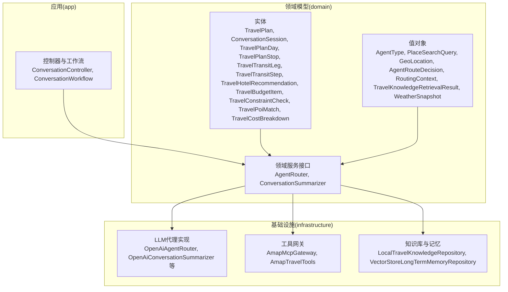
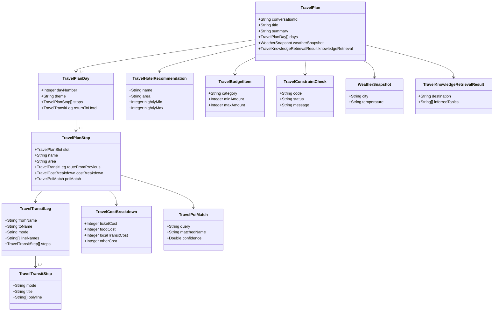

# 领域模型详解

<cite>
**本文引用的文件**
- [TravelPlan.java](file://travel-agent-domain/src/main/java/com/travalagent/domain/model/entity/TravelPlan.java)
- [ConversationSession.java](file://travel-agent-domain/src/main/java/com/travalagent/domain/model/entity/ConversationSession.java)
- [TravelPlanDay.java](file://travel-agent-domain/src/main/java/com/travalagent/domain/model/entity/TravelPlanDay.java)
- [TravelPlanStop.java](file://travel-agent-domain/src/main/java/com/travalagent/domain/model/entity/TravelPlanStop.java)
- [TravelPlanSlot.java](file://travel-agent-domain/src/main/java/com/travalagent/domain/model/entity/TravelPlanSlot.java)
- [TravelTransitLeg.java](file://travel-agent-domain/src/main/java/com/travalagent/domain/model/entity/TravelTransitLeg.java)
- [TravelTransitStep.java](file://travel-agent-domain/src/main/java/com/travalagent/domain/model/entity/TravelTransitStep.java)
- [TravelHotelRecommendation.java](file://travel-agent-domain/src/main/java/com/travalagent/domain/model/entity/TravelHotelRecommendation.java)
- [TravelBudgetItem.java](file://travel-agent-domain/src/main/java/com/travalagent/domain/model/entity/TravelBudgetItem.java)
- [TravelConstraintCheck.java](file://travel-agent-domain/src/main/java/com/travalagent/domain/model/entity/TravelConstraintCheck.java)
- [TravelPoiMatch.java](file://travel-agent-domain/src/main/java/com/travalagent/domain/model/entity/TravelPoiMatch.java)
- [TravelCostBreakdown.java](file://travel-agent-domain/src/main/java/com/travalagent/domain/model/entity/TravelCostBreakdown.java)
- [AgentType.java](file://travel-agent-domain/src/main/java/com/travalagent/domain/model/valobj/AgentType.java)
- [PlaceSearchQuery.java](file://travel-agent-domain/src/main/java/com/travalagent/domain/model/valobj/PlaceSearchQuery.java)
- [GeoLocation.java](file://travel-agent-domain/src/main/java/com/travalagent/domain/model/valobj/GeoLocation.java)
- [AgentRouteDecision.java](file://travel-agent-domain/src/main/java/com/travalagent/domain/model/valobj/AgentRouteDecision.java)
- [RoutingContext.java](file://travel-agent-domain/src/main/java/com/travalagent/domain/model/valobj/RoutingContext.java)
- [TravelKnowledgeRetrievalResult.java](file://travel-agent-domain/src/main/java/com/travalagent/domain/model/valobj/TravelKnowledgeRetrievalResult.java)
- [WeatherSnapshot.java](file://travel-agent-domain/src/main/java/com/travalagent/domain/model/valobj/WeatherSnapshot.java)
- [AgentRouter.java](file://travel-agent-domain/src/main/java/com/travalagent/domain/service/AgentRouter.java)
- [ConversationSummarizer.java](file://travel-agent-domain/src/main/java/com/travalagent/domain/service/ConversationSummarizer.java)
</cite>

## 目录
1. 引言
2. 项目结构
3. 核心组件
4. 架构总览
5. 详细组件分析
6. 依赖分析
7. 性能考量
8. 故障排查指南
9. 结论
10. 附录

## 引言
本文件系统性梳理 TravelAgent 的领域模型，聚焦核心实体与值对象的设计、关系与业务规则，以及领域服务的职责与交互。重点覆盖旅行计划（TravelPlan）、对话会话（ConversationSession）、行程日（TravelPlanDay）、行程停点（TravelPlanStop）等实体；值对象如 AgentType、PlaceSearchQuery、GeoLocation 等；以及领域服务如 AgentRouter、ConversationSummarizer 的设计与边界。同时给出实体关系图、数据模型说明（主键、外键、索引与约束），并总结业务规则、数据校验与领域事件处理思路。

## 项目结构
TravelAgent 采用多模块分层组织：domain 定义领域模型与服务接口，infrastructure 提供具体实现，app 提供应用入口与控制器，types 提供通用类型与异常定义。本文关注 domain 模块中的实体、值对象与服务接口，这些是构建旅行规划与对话路由的基石。

## 核心组件
本节从“实体-值对象-服务”的维度，概述关键领域构件及其职责与约束。

- 实体（Entity）
  - 旅行计划（TravelPlan）：承载一次旅行的完整计划，包含标题、摘要、预算、亮点、约束检查、天气快照、知识检索结果、调整建议等，并提供只读副本与带洞察信息的不可变构造。
  - 对话会话（ConversationSession）：记录一次对话的元信息，包括最后代理类型、摘要、创建与更新时间。
  - 行程日（TravelPlanDay）：按天组织行程，包含主题、起止时间、交通与活动时长、成本估算、停点列表与返回酒店的交通段。
  - 行程停点（TravelPlanStop）：具体地点的停靠，包含时间段、位置坐标、路线、费用与成本拆解、POI 匹配等。
  - 交通段（TravelTransitLeg/Step）：描述从 A 到 B 的交通详情，包含方式、时长、距离、步行时长、费用、线路名序列、轨迹折线与步骤明细。
  - 酒店推荐（TravelHotelRecommendation）：住宿建议，含名称、区域、地址、价格区间、理由与经纬度。
  - 预算项（TravelBudgetItem）：预算分类与上下限、理由。
  - 约束检查（TravelConstraintCheck）：对约束条件的检查结果（编码、状态、消息）。
  - POI 匹配（TravelPoiMatch）：查询与匹配结果，含候选名列表。
  - 成本拆解（TravelCostBreakdown）：票务、餐饮、本地交通与其他费用的拆分。

- 值对象（Value Object）
  - 代理类型（AgentType）：枚举型值对象，标识天气、地理、旅行规划、通用代理。
  - 地点搜索查询（PlaceSearchQuery）：封装关键词、城市、类型、位置、是否限制城市、数据类型等查询参数。
  - 地理位置（GeoLocation）：封装名称、地址、经纬度与行政区划代码。
  - 路由决策（AgentRouteDecision）：包含目标代理类型、路由原因、是否需要澄清及澄清问题。
  - 路由上下文（RoutingContext）：包含会话ID、用户消息、最近消息、任务记忆、会话摘要与长期记忆。
  - 知识检索结果（TravelKnowledgeRetrievalResult）：包含目的地、推断主题/风格、来源与选择集合，并提供片段视图。
  - 天气快照（WeatherSnapshot）：城市、省、发布时间、描述、温度、风向与风力。

- 领域服务接口
  - 代理路由器（AgentRouter）：根据路由上下文决定下一步应由哪个代理处理。
  - 会话摘要器（ConversationSummarizer）：基于现有摘要与消息列表生成新的摘要。

**章节来源**
- [TravelPlan.java:1-106](file://travel-agent-domain/src/main/java/com/travalagent/domain/model/entity/TravelPlan.java#L1-L106)
- [ConversationSession.java:1-16](file://travel-agent-domain/src/main/java/com/travalagent/domain/model/entity/ConversationSession.java#L1-L16)
- [TravelPlanDay.java:1-22](file://travel-agent-domain/src/main/java/com/travalagent/domain/model/entity/TravelPlanDay.java#L1-L22)
- [TravelPlanStop.java:1-24](file://travel-agent-domain/src/main/java/com/travalagent/domain/model/entity/TravelPlanStop.java#L1-L24)
- [TravelTransitLeg.java:1-26](file://travel-agent-domain/src/main/java/com/travalagent/domain/model/entity/TravelTransitLeg.java#L1-L26)
- [TravelTransitStep.java:1-22](file://travel-agent-domain/src/main/java/com/travalagent/domain/model/entity/TravelTransitStep.java#L1-L22)
- [TravelHotelRecommendation.java:1-15](file://travel-agent-domain/src/main/java/com/travalagent/domain/model/entity/TravelHotelRecommendation.java#L1-L15)
- [TravelBudgetItem.java:1-11](file://travel-agent-domain/src/main/java/com/travalagent/domain/model/entity/TravelBudgetItem.java#L1-L11)
- [TravelConstraintCheck.java:1-10](file://travel-agent-domain/src/main/java/com/travalagent/domain/model/entity/TravelConstraintCheck.java#L1-L10)
- [TravelPoiMatch.java:1-22](file://travel-agent-domain/src/main/java/com/travalagent/domain/model/entity/TravelPoiMatch.java#L1-L22)
- [TravelCostBreakdown.java:1-11](file://travel-agent-domain/src/main/java/com/travalagent/domain/model/entity/TravelCostBreakdown.java#L1-L11)
- [AgentType.java:1-9](file://travel-agent-domain/src/main/java/com/travalagent/domain/model/valobj/AgentType.java#L1-L9)
- [PlaceSearchQuery.java:1-12](file://travel-agent-domain/src/main/java/com/travalagent/domain/model/valobj/PlaceSearchQuery.java#L1-L12)
- [GeoLocation.java:1-11](file://travel-agent-domain/src/main/java/com/travalagent/domain/model/valobj/GeoLocation.java#L1-L11)
- [AgentRouteDecision.java:1-10](file://travel-agent-domain/src/main/java/com/travalagent/domain/model/valobj/AgentRouteDecision.java#L1-L10)
- [RoutingContext.java:1-17](file://travel-agent-domain/src/main/java/com/travalagent/domain/model/valobj/RoutingContext.java#L1-L17)
- [TravelKnowledgeRetrievalResult.java:1-42](file://travel-agent-domain/src/main/java/com/travalagent/domain/model/valobj/TravelKnowledgeRetrievalResult.java#L1-L42)
- [WeatherSnapshot.java:1-13](file://travel-agent-domain/src/main/java/com/travalagent/domain/model/valobj/WeatherSnapshot.java#L1-L13)
- [AgentRouter.java:1-10](file://travel-agent-domain/src/main/java/com/travalagent/domain/service/AgentRouter.java#L1-L10)
- [ConversationSummarizer.java:1-11](file://travel-agent-domain/src/main/java/com/travalagent/domain/service/ConversationSummarizer.java#L1-L11)

## 架构总览
下图展示领域模型中实体与值对象之间的聚合关系与典型交互路径。实体之间通过组合与引用形成清晰的层次：TravelPlan 聚合多个 TravelPlanDay，每个 Day 再包含多个 TravelPlanStop；Stop 可能包含 TransitLeg/Step、CostBreakdown、PoiMatch 等；值对象贯穿于实体字段与服务接口中，作为不可变的数据载体。

**图表来源**
- [TravelPlan.java:1-106](file://travel-agent-domain/src/main/java/com/travalagent/domain/model/entity/TravelPlan.java#L1-L106)
- [TravelPlanDay.java:1-22](file://travel-agent-domain/src/main/java/com/travalagent/domain/model/entity/TravelPlanDay.java#L1-L22)
- [TravelPlanStop.java:1-24](file://travel-agent-domain/src/main/java/com/travalagent/domain/model/entity/TravelPlanStop.java#L1-L24)
- [TravelTransitLeg.java:1-26](file://travel-agent-domain/src/main/java/com/travalagent/domain/model/entity/TravelTransitLeg.java#L1-L26)
- [TravelTransitStep.java:1-22](file://travel-agent-domain/src/main/java/com/travalagent/domain/model/entity/TravelTransitStep.java#L1-L22)
- [TravelCostBreakdown.java:1-11](file://travel-agent-domain/src/main/java/com/travalagent/domain/model/entity/TravelCostBreakdown.java#L1-L11)
- [TravelPoiMatch.java:1-22](file://travel-agent-domain/src/main/java/com/travalagent/domain/model/entity/TravelPoiMatch.java#L1-L22)
- [TravelHotelRecommendation.java:1-15](file://travel-agent-domain/src/main/java/com/travalagent/domain/model/entity/TravelHotelRecommendation.java#L1-L15)
- [TravelBudgetItem.java:1-11](file://travel-agent-domain/src/main/java/com/travalagent/domain/model/entity/TravelBudgetItem.java#L1-L11)
- [TravelConstraintCheck.java:1-10](file://travel-agent-domain/src/main/java/com/travalagent/domain/model/entity/TravelConstraintCheck.java#L1-L10)
- [WeatherSnapshot.java:1-13](file://travel-agent-domain/src/main/java/com/travalagent/domain/model/valobj/WeatherSnapshot.java#L1-L13)
- [TravelKnowledgeRetrievalResult.java:1-42](file://travel-agent-domain/src/main/java/com/travalagent/domain/model/valobj/TravelKnowledgeRetrievalResult.java#L1-L42)

## 详细组件分析

### 实体：TravelPlan（旅行计划）
- 设计要点
  - 不可变记录类，内部通过复制集合保证不可变性。
  - 提供带洞察信息的构造方法，用于在规划阶段注入天气与知识检索结果。
  - 关键字段涵盖对话ID、标题、摘要、酒店区域与理由、预算、时长估计、亮点、预算项、约束检查、行程日列表、天气快照、知识检索结果、约束是否放宽、调整建议、更新时间。
- 业务规则
  - 旅行计划以对话为单位进行管理，更新时间用于排序与审计。
  - 约束放宽与调整建议用于指导后续规划迭代。
- 数据验证
  - 通过构造器与复制集合确保空值安全与一致性。
- 关系与约束
  - 聚合 TravelPlanDay 列表，形成“计划-日-停点”层级。
  - 与 WeatherSnapshot、TravelKnowledgeRetrievalResult 形成关联，用于外部洞察注入。

**章节来源**
- [TravelPlan.java:1-106](file://travel-agent-domain/src/main/java/com/travalagent/domain/model/entity/TravelPlan.java#L1-L106)

### 实体：ConversationSession（对话会话）
- 设计要点
  - 记录会话标识、标题、最后代理类型、摘要、创建与更新时间。
- 业务规则
  - 最后代理类型用于路由决策与历史追踪。
- 数据验证
  - 字段均为基础类型，保持简单与稳定。
- 关系与约束
  - 与 TravelPlan 通过 conversationId 关联。

**章节来源**
- [ConversationSession.java:1-16](file://travel-agent-domain/src/main/java/com/travalagent/domain/model/entity/ConversationSession.java#L1-L16)

### 实体：TravelPlanDay（行程日）
- 设计要点
  - 包含日期序号、主题、起止时间、交通与活动时长、成本估算、停点列表与返回酒店的交通段。
- 业务规则
  - 日内停点顺序与时间窗需满足可行性。
- 数据验证
  - 停点列表复制，避免外部修改。
- 关系与约束
  - 聚合 TravelPlanStop，引用 TravelTransitLeg。

**章节来源**
- [TravelPlanDay.java:1-22](file://travel-agent-domain/src/main/java/com/travalagent/domain/model/entity/TravelPlanDay.java#L1-L22)

### 实体：TravelPlanStop（行程停点）
- 设计要点
  - 包含时间段、位置信息、路线、费用与成本拆解、POI 匹配等。
- 业务规则
  - 停点间的时间衔接与交通时长需合理。
- 数据验证
  - 通过不可变记录类保证字段一致性。
- 关系与约束
  - 关联 TravelTransitLeg、TravelCostBreakdown、TravelPoiMatch。

**章节来源**
- [TravelPlanStop.java:1-24](file://travel-agent-domain/src/main/java/com/travalagent/domain/model/entity/TravelPlanStop.java#L1-L24)

### 实体：TravelTransitLeg/Step（交通段与步骤）
- 设计要点
  - 交通段包含起止地、方式、摘要、时长、距离、步行时长、费用、线路名序列、步骤列表与折线；步骤包含方式、标题、指令、线路名、起止地、时长、距离、站点数与折线。
- 业务规则
  - 步骤折线与站点数用于可视化与导航。
- 数据验证
  - 空集合复制，避免空指针。
- 关系与约束
  - 交通段聚合多个步骤。

**章节来源**
- [TravelTransitLeg.java:1-26](file://travel-agent-domain/src/main/java/com/travalagent/domain/model/entity/TravelTransitLeg.java#L1-L26)
- [TravelTransitStep.java:1-22](file://travel-agent-domain/src/main/java/com/travalagent/domain/model/entity/TravelTransitStep.java#L1-L22)

### 实体：TravelHotelRecommendation（酒店推荐）
- 设计要点
  - 名称、区域、地址、夜间价格区间、理由与经纬度。
- 业务规则
  - 价格区间用于预算匹配与约束检查。
- 数据验证
  - 不可变记录类，字段简洁明确。

**章节来源**
- [TravelHotelRecommendation.java:1-15](file://travel-agent-domain/src/main/java/com/travalagent/domain/model/entity/TravelHotelRecommendation.java#L1-L15)

### 实体：TravelBudgetItem（预算项）
- 设计要点
  - 分类、最小/最大金额与理由。
- 业务规则
  - 与 TravelPlan 的总预算进行一致性校验。
- 数据验证
  - 不可变记录类，字段语义清晰。

**章节来源**
- [TravelBudgetItem.java:1-11](file://travel-agent-domain/src/main/java/com/travalagent/domain/model/entity/TravelBudgetItem.java#L1-L11)

### 实体：TravelConstraintCheck（约束检查）
- 设计要点
  - 编码、状态与消息。
- 业务规则
  - 用于跟踪约束满足情况与提示放宽策略。
- 数据验证
  - 不可变记录类。

**章节来源**
- [TravelConstraintCheck.java:1-10](file://travel-agent-domain/src/main/java/com/travalagent/domain/model/entity/TravelConstraintCheck.java#L1-L10)

### 实体：TravelPoiMatch（POI 匹配）
- 设计要点
  - 查询词、匹配名称、区县、地址、行政区划代码、经纬度、置信度、候选名列表与来源。
- 业务规则
  - 置信度用于质量评估与二次确认。
- 数据验证
  - 候选名列表复制，避免外部修改。

**章节来源**
- [TravelPoiMatch.java:1-22](file://travel-agent-domain/src/main/java/com/travalagent/domain/model/entity/TravelPoiMatch.java#L1-L22)

### 实体：TravelCostBreakdown（成本拆解）
- 设计要点
  - 票务、餐饮、本地交通与其他费用与备注。
- 业务规则
  - 与预算项与总预算进行一致性校验。
- 数据验证
  - 不可变记录类。

**章节来源**
- [TravelCostBreakdown.java:1-11](file://travel-agent-domain/src/main/java/com/travalagent/domain/model/entity/TravelCostBreakdown.java#L1-L11)

### 值对象：AgentType（代理类型）
- 设计要点
  - 枚举型值对象，区分天气、地理、旅行规划、通用代理。
- 使用场景
  - 用于 AgentRouter 的路由决策与会话历史记录。

**章节来源**
- [AgentType.java:1-9](file://travel-agent-domain/src/main/java/com/travalagent/domain/model/valobj/AgentType.java#L1-L9)

### 值对象：PlaceSearchQuery（地点搜索查询）
- 设计要点
  - 封装关键词、城市、类型、位置、是否限制城市、数据类型。
- 使用场景
  - 作为搜索输入参数，驱动地点检索与推荐。

**章节来源**
- [PlaceSearchQuery.java:1-12](file://travel-agent-domain/src/main/java/com/travalagent/domain/model/valobj/PlaceSearchQuery.java#L1-L12)

### 值对象：GeoLocation（地理位置）
- 设计要点
  - 名称、地址、经纬度与行政区划代码。
- 使用场景
  - 作为地点标识与导航基础。

**章节来源**
- [GeoLocation.java:1-11](file://travel-agent-domain/src/main/java/com/travalagent/domain/model/valobj/GeoLocation.java#L1-L11)

### 值对象：AgentRouteDecision（路由决策）
- 设计要点
  - 目标代理类型、路由原因、是否需要澄清及澄清问题。
- 使用场景
  - 由 AgentRouter 输出，指导后续处理流程。

**章节来源**
- [AgentRouteDecision.java:1-10](file://travel-agent-domain/src/main/java/com/travalagent/domain/model/valobj/AgentRouteDecision.java#L1-L10)

### 值对象：RoutingContext（路由上下文）
- 设计要点
  - 会话ID、用户消息、最近消息、任务记忆、会话摘要与长期记忆。
- 使用场景
  - 作为 AgentRouter 的输入，承载上下文信息。

**章节来源**
- [RoutingContext.java:1-17](file://travel-agent-domain/src/main/java/com/travalagent/domain/model/valobj/RoutingContext.java#L1-L17)

### 值对象：TravelKnowledgeRetrievalResult（知识检索结果）
- 设计要点
  - 目的地、推断主题/风格、来源与选择集合；提供空实例工厂与片段视图。
- 使用场景
  - 为旅行计划提供背景知识与风格建议。

**章节来源**
- [TravelKnowledgeRetrievalResult.java:1-42](file://travel-agent-domain/src/main/java/com/travalagent/domain/model/valobj/TravelKnowledgeRetrievalResult.java#L1-L42)

### 值对象：WeatherSnapshot（天气快照）
- 设计要点
  - 城市、省、发布时间、描述、温度、风向与风力。
- 使用场景
  - 为旅行计划提供实时天气信息。

**章节来源**
- [WeatherSnapshot.java:1-13](file://travel-agent-domain/src/main/java/com/travalagent/domain/model/valobj/WeatherSnapshot.java#L1-L13)

### 领域服务：AgentRouter（代理路由器）
- 职责
  - 根据 RoutingContext 决定下一步应由哪个 AgentType 处理，并输出 AgentRouteDecision。
- 输入输出
  - 输入：RoutingContext
  - 输出：AgentRouteDecision
- 实现边界
  - 接口定义，具体实现位于基础设施层（例如 OpenAiAgentRouter）。

**章节来源**
- [AgentRouter.java:1-10](file://travel-agent-domain/src/main/java/com/travalagent/domain/service/AgentRouter.java#L1-L10)

### 领域服务：ConversationSummarizer（会话摘要器）
- 职责
  - 基于现有摘要与消息列表生成新的摘要。
- 输入输出
  - 输入：existingSummary, List<ConversationMessage>
  - 输出：新摘要字符串
- 实现边界
  - 接口定义，具体实现位于基础设施层（例如 OpenAiConversationSummarizer）。

**章节来源**
- [ConversationSummarizer.java:1-11](file://travel-agent-domain/src/main/java/com/travalagent/domain/service/ConversationSummarizer.java#L1-L11)

## 依赖分析
- 组件耦合
  - 实体与值对象之间为弱耦合的组合关系，实体通过不可变记录类引用值对象，降低变更影响面。
  - 领域服务接口与实现分离，遵循依赖倒置原则，便于替换与测试。
- 外部依赖
  - 基础设施层提供 LLM 代理、工具网关与知识库实现，领域层仅依赖接口。
- 循环依赖
  - 当前模型未见循环依赖迹象，实体与值对象均为单向引用。

## 性能考量
- 不可变性与复制
  - 通过复制集合与不可变记录类减少并发修改风险，但需注意内存占用与拷贝开销。
- 集合大小控制
  - 行程日与停点数量应受控，避免过深嵌套导致序列化与传输成本上升。
- 路由决策缓存
  - 对于稳定的 RoutingContext，可考虑缓存 AgentRouteDecision 以减少重复计算。
- 知识检索结果
  - 选择集合与片段视图应限制大小，避免大文本传输与处理。

## 故障排查指南
- 约束检查失败
  - 检查 TravelConstraintCheck 的状态与消息，结合 TravelPlan 的预算与时间窗进行定位。
- POI 匹配低置信度
  - 查看 TravelPoiMatch 的候选名列表与置信度，必要时调整 PlaceSearchQuery 参数。
- 交通规划异常
  - 校验 TravelTransitLeg/Step 的时长、距离与折线是否一致，确保前后停点衔接合理。
- 会话摘要不连贯
  - 检查 ConversationSummarizer 的输入消息序列与现有摘要，确保上下文完整。
- 路由决策不准确
  - 校验 RoutingContext 的内容完整性，确认 AgentRouter 的实现逻辑与外部 LLM 的响应。

**章节来源**
- [TravelConstraintCheck.java:1-10](file://travel-agent-domain/src/main/java/com/travalagent/domain/model/entity/TravelConstraintCheck.java#L1-L10)
- [TravelPoiMatch.java:1-22](file://travel-agent-domain/src/main/java/com/travalagent/domain/model/entity/TravelPoiMatch.java#L1-L22)
- [TravelTransitLeg.java:1-26](file://travel-agent-domain/src/main/java/com/travalagent/domain/model/entity/TravelTransitLeg.java#L1-L26)
- [TravelTransitStep.java:1-22](file://travel-agent-domain/src/main/java/com/travalagent/domain/model/entity/TravelTransitStep.java#L1-L22)
- [RoutingContext.java:1-17](file://travel-agent-domain/src/main/java/com/travalagent/domain/model/valobj/RoutingContext.java#L1-L17)
- [ConversationSummarizer.java:1-11](file://travel-agent-domain/src/main/java/com/travalagent/domain/service/ConversationSummarizer.java#L1-L11)
- [AgentRouter.java:1-10](file://travel-agent-domain/src/main/java/com/travalagent/domain/service/AgentRouter.java#L1-L10)

## 结论
本领域模型围绕旅行规划与对话路由两大主线，通过实体与值对象的清晰划分、不可变设计与服务接口抽象，实现了高内聚、低耦合的架构。TravelPlan 作为核心聚合根，承载旅行计划的全生命周期信息；RoutingContext 与 AgentRouteDecision 为智能路由提供上下文与决策依据；WeatherSnapshot 与 TravelKnowledgeRetrievalResult 为规划注入外部洞察。建议在实现层进一步完善数据校验、错误处理与性能优化策略，确保系统在高并发与大数据量下的稳定性与可维护性。

## 附录

### 数据模型与约束设计
- 主键与唯一性
  - 实体未显式声明数据库主键，建议在持久化层为每个实体定义主键（如 UUID 或自增 ID），并为 conversationId 等关键字段建立唯一索引。
- 外键与引用
  - TravelPlanDay 与 TravelPlanStop 通过聚合关系引用 TravelPlan；TransportLeg/Step 通过组合关系引用 Stop；POI 匹配与成本拆解作为 Stop 的附属信息存在。
- 索引与约束
  - 对话会话与旅行计划的关键字段（如 conversationId、updatedAt）建议建立索引以支持查询与排序。
  - 预算项与酒店推荐的价格区间字段可用于范围查询与约束检查。
- 领域事件
  - 建议引入领域事件（如旅行计划更新、会话摘要完成、路由决策生成）以解耦下游处理与通知机制。