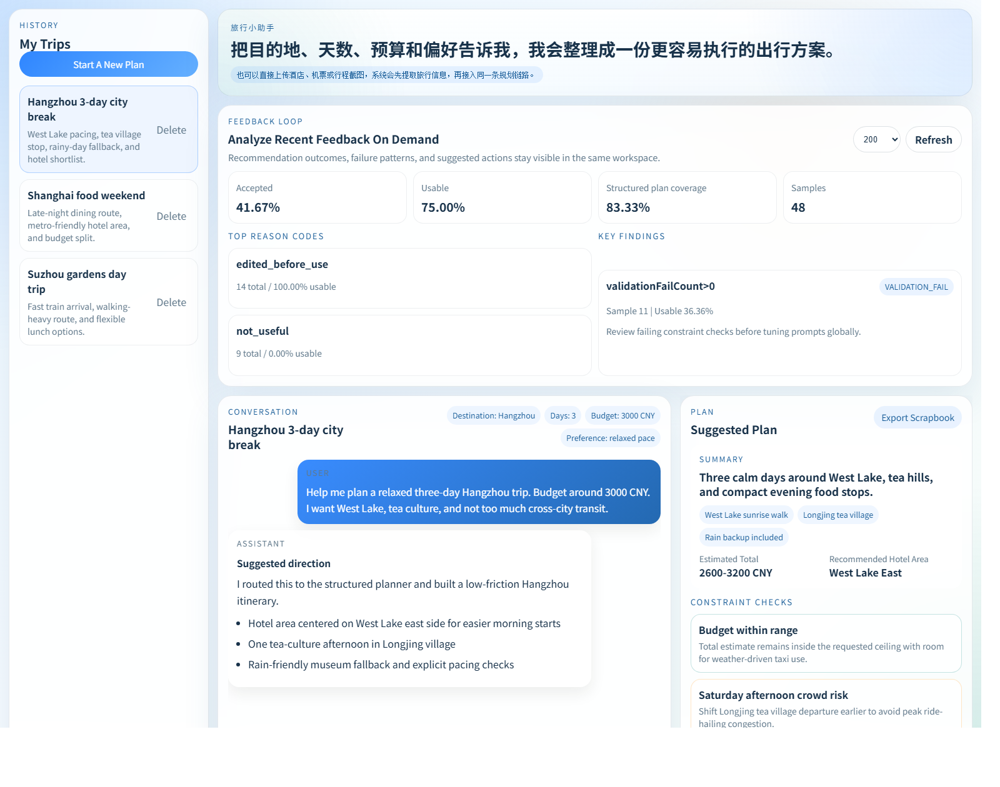

# Travel Agent

<p align="center">
  <a href="./README.md">English</a> |
  <a href="./README.zh-CN.md">简体中文</a>
</p>

<p align="center">
  
  
  
  
  
  
  
  
  
  
  
  
  
</p>

[](https://github.com/Sinlair/TravelAgent/actions/workflows/ci.yml)


Travel Agent is a full-stack multi-agent travel planning application built with Spring Boot, Spring AI, Vue 3, SQLite, optional Amap MCP integration, and an opinionated travel knowledge RAG pipeline.

It is designed to produce more than chat answers. The system routes requests to specialist agents, builds structured itineraries, validates feasibility, enriches plans with map and weather context, keeps a visible execution timeline, and closes the loop with explicit recommendation feedback.

## Homepage

<p align="center">
  
</p>

## What It Does

- Routes requests across `WEATHER`, `GEO`, `TRAVEL_PLANNER`, and `GENERAL` specialists.
- Produces structured plans with hotel area suggestions, budget ranges, day-by-day routes, and constraint checks.
- Uses Amap / Gaode data for weather, geocoding, POI grounding, and transit enrichment.
- Supports text input plus image attachments, then feeds extracted image context into the same planning workflow.
- Retrieves destination hints from curated local knowledge or Milvus-backed vector search.
- Stores conversations, task memory, travel plans, feedback, and timeline events in SQLite.
- Exposes a Vue workspace for chat, execution trace, plan review, and feedback analysis.

## Core Features

| Area | What you get |
| --- | --- |
| Multi-agent workflow | LLM-first routing with fallback logic and specialist execution contexts |
| Structured planning | Budget-aware itineraries, daily stops, travel checks, validation, and repair |
| Grounded enrichment | Amap-backed weather snapshots, POI matches, hotel area resolution, and transit routes |
| Multimodal intake | Image uploads for bookings, tickets, maps, or screenshots with extracted travel facts |
| Retrieval | Travel knowledge RAG with topic inference, trip-style hints, provenance, and local fallback |
| Feedback loop | `ACCEPTED` / `PARTIAL` / `REJECTED` labels, exportable datasets, and on-demand summary analysis |
| Operations | Preflight checks, smoke tests, start/stop scripts, Docker assets, and CI |

## How It Works

1. A user message enters `ConversationWorkflow`.
2. Recent history, task memory, conversation summary, and long-term memory are assembled.
3. `AgentRouter` chooses the best specialist.
4. Planner requests go through generation, enrichment, validation, repair, and persistence.
5. The UI receives the final answer together with task memory, timeline events, and structured plan data.

For image-assisted turns, uploaded images are first summarized into travel-relevant facts, then the confirmed facts are merged back into the same workflow instead of branching into a separate path.

## Architecture

| Module | Responsibility |
| --- | --- |
| `travel-agent-types` | Shared API response and exception types |
| `travel-agent-domain` | Domain entities, value objects, repository interfaces, and service contracts |
| `travel-agent-amap` | Amap HTTP gateway and configuration |
| `travel-agent-infrastructure` | Spring AI agents, retrieval, persistence adapters, and vector integrations |
| `travel-agent-app` | WebFlux API, health endpoints, timeline streaming, and bootstrapping |
| `travel-agent-amap-mcp-server` | Standalone MCP server for Amap-backed tools |
| `web` | Vue 3 frontend workspace |

## Stack

| Layer | Technology |
| --- | --- |
| Backend | Java 21, Spring Boot 4, Spring WebFlux, Spring Validation, Spring Boot Actuator |
| AI | Spring AI, OpenAI-compatible chat integration, MCP |
| Storage | SQLite, optional Milvus |
| Frontend | Vue 3, TypeScript, Vite, Pinia, Vitest |
| Ops | PowerShell scripts, Docker, Docker Compose, Nginx, GitHub Actions |

## Quick Start

### 1. Prepare your environment

- Java 21
- Node.js with npm
- Docker Desktop if you want Milvus or containerized deployment
- Python 3 only if you want to rerun collection / cleaning scripts

Copy the example environment file:

```powershell
Copy-Item .env.travel-agent.example .env.travel-agent
```

### 2. Run preflight

```powershell
powershell -ExecutionPolicy Bypass -File .\scripts\preflight-travel-agent.ps1
```

### 3. Start the app

```powershell
powershell -ExecutionPolicy Bypass -File .\scripts\start-travel-agent.ps1 -Build -StartFrontend -RunPreflight -ToolProvider LOCAL
```

Default local endpoints:

- Backend: `http://localhost:18080`
- Frontend: `http://localhost:4173`

### 4. Stop the app

```powershell
powershell -ExecutionPolicy Bypass -File .\scripts\stop-travel-agent.ps1
```

## Manual Development

### Backend

```powershell
$env:SPRING_AI_OPENAI_API_KEY = "<your-openai-key>"
.\mvnw.cmd -pl travel-agent-app -am spring-boot:run
```

### Frontend

```powershell
Set-Location .\web
npm.cmd ci
npm.cmd run dev
```

### Standalone Amap MCP server

```powershell
$env:TRAVEL_AGENT_AMAP_API_KEY = "<your-amap-web-service-key>"
.\mvnw.cmd -pl travel-agent-amap-mcp-server -am spring-boot:run
```

## Configuration

The repo is Windows-first operationally because the automation is PowerShell-based, but the application itself is not tied to Windows.

Important environment variables:

| Category | Variables |
| --- | --- |
| OpenAI / compatible provider | `SPRING_AI_OPENAI_API_KEY`, `SPRING_AI_OPENAI_BASE_URL`, `SPRING_AI_OPENAI_CHAT_MODEL`, `SPRING_AI_OPENAI_EMBEDDING_MODEL` |
| Tool provider | `TRAVEL_AGENT_TOOL_PROVIDER`, `TRAVEL_AGENT_AMAP_MCP_ENABLED`, `TRAVEL_AGENT_AMAP_API_KEY`, `TRAVEL_AGENT_AMAP_REQUESTS_PER_SECOND` |
| Retrieval | `TRAVEL_AGENT_KNOWLEDGE_VECTOR_ENABLED`, `TRAVEL_AGENT_KNOWLEDGE_VECTOR_URI`, `TRAVEL_AGENT_KNOWLEDGE_VECTOR_COLLECTION_NAME`, `TRAVEL_AGENT_MILVUS_ENABLED`, `TRAVEL_AGENT_MILVUS_URI` |
| Frontend map rendering | `VITE_AMAP_WEB_KEY`, `VITE_AMAP_SECURITY_JS_CODE` |
| Deployment profile | `SPRING_PROFILES_ACTIVE=prod` |

Notes:

- `SPRING_AI_OPENAI_BASE_URL` lets the backend work with OpenAI-compatible gateways.
- `TRAVEL_AGENT_TOOL_PROVIDER` supports `LOCAL` and `MCP`.
- `.env.travel-agent` is ignored by Git and should never be committed.

## Docker

Included assets:

- [`Dockerfile.app`](./Dockerfile.app)
- [`Dockerfile.mcp`](./Dockerfile.mcp)
- [`docker-compose.app.yml`](./docker-compose.app.yml)
- [`docker-compose.milvus.yml`](./docker-compose.milvus.yml)
- [`web/Dockerfile`](./web/Dockerfile)
- [`web/nginx.conf`](./web/nginx.conf)

Start the main stack:

```powershell
docker compose -f docker-compose.app.yml up --build -d
```

Start the stack with MCP enabled:

```powershell
docker compose -f docker-compose.app.yml --profile mcp up --build -d
```

Start Milvus separately when vector retrieval is enabled:

```powershell
docker compose -f docker-compose.milvus.yml up -d
```

## Testing

### Backend

```powershell
.\mvnw.cmd test
```

### Frontend

```powershell
Set-Location .\web
npm.cmd run test
npm.cmd run build
```

### Release smoke

```powershell
powershell -ExecutionPolicy Bypass -File .\scripts\release-smoke-travel-agent.ps1
```

## Feedback, RAG, and Multimodal

The project already contains the first practical data flywheel for itinerary quality improvement:

- recommendation feedback can be stored per conversation
- recent feedback can be exported as raw records or aggregated summaries
- planner failures can be analyzed by destination, reason code, agent type, and validation signals

It also supports image-assisted travel intake:

- users can upload travel images in chat
- extracted travel facts are staged for confirmation
- confirmed facts are merged into the existing planning context

Related docs:

- [`docs/knowledge-rag.md`](./docs/knowledge-rag.md)
- [`docs/multimodal-roadmap.md`](./docs/multimodal-roadmap.md)
- [`docs/multimodal-roadmap.zh-CN.md`](./docs/multimodal-roadmap.zh-CN.md)
- [`docs/operations.md`](./docs/operations.md)
- [`docs/release-checklist.md`](./docs/release-checklist.md)

## Operational Scripts

| Script | Purpose |
| --- | --- |
| [`scripts/preflight-travel-agent.ps1`](./scripts/preflight-travel-agent.ps1) | Validate local prerequisites and configuration |
| [`scripts/start-travel-agent.ps1`](./scripts/start-travel-agent.ps1) | Start backend and optional frontend / MCP services |
| [`scripts/stop-travel-agent.ps1`](./scripts/stop-travel-agent.ps1) | Stop processes started by the launch script |
| [`scripts/release-smoke-travel-agent.ps1`](./scripts/release-smoke-travel-agent.ps1) | Run a release-style backend and frontend smoke check |
| [`scripts/export-feedback-dataset.ps1`](./scripts/export-feedback-dataset.ps1) | Export raw feedback records |
| [`scripts/analyze-feedback-loop.ps1`](./scripts/analyze-feedback-loop.ps1) | Build aggregated feedback summaries and markdown reports |

## Known Limits

- Amap-backed grounding is the strongest path today, so the planner currently fits China-focused travel scenarios best.
- Some retrieval chunks are still more listing-shaped than ideal planner guidance.
- Production packaging is usable, but secrets, TLS, and reverse-proxy templates are not deeply opinionated yet.
- Full value from the planner requires valid model-provider and map-provider configuration.

## Repository Layout

```text
.
|- travel-agent-app
|- travel-agent-domain
|- travel-agent-infrastructure
|- travel-agent-amap
|- travel-agent-amap-mcp-server
|- travel-agent-types
|- web
|- scripts
`- docs
```

## Contributing

Issues and pull requests are welcome.

Useful contribution areas right now:

- planner robustness and validation logic
- retrieval quality and ranking
- frontend workflow polish
- production deployment hardening
- travel knowledge dataset quality

See [`CONTRIBUTING.md`](./CONTRIBUTING.md) and [`SECURITY.md`](./SECURITY.md) before sending changes.

## License

This project is licensed under the MIT License. See [`LICENSE`](./LICENSE).
