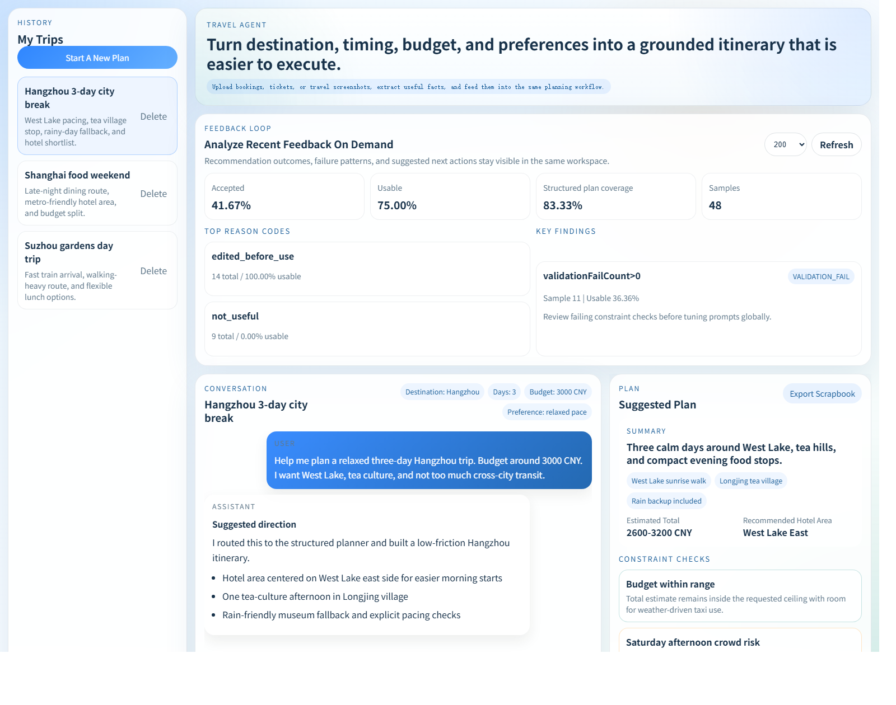
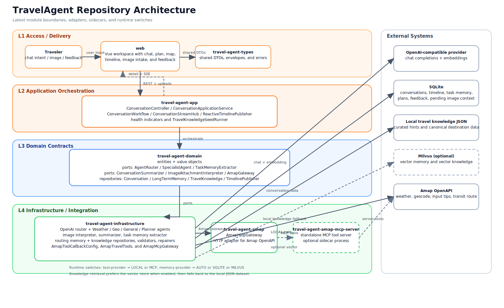
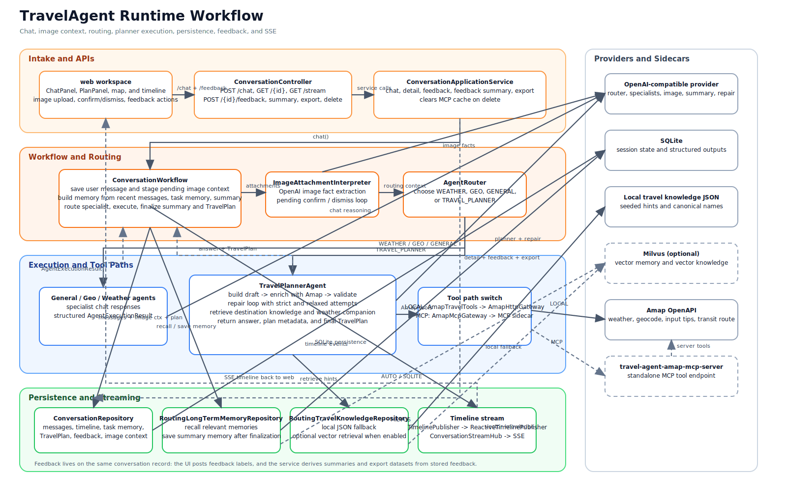

# Travel Agent

<p align="center">
  <a href="./README.md">English</a> |
  <a href="./README.zh-CN.md">Simplified Chinese</a>
</p>

<p align="center">
  
  
  
  
  
  
  
  
  
  
  
</p>

<p align="center">
  Travel Agent is a full-stack travel planning workspace that turns free-form chat and travel screenshots into grounded itineraries with structured plans, Amap-backed enrichment, inline recommendation feedback, and scrapbook export.
</p>

<p align="center">
  <a href="#why-this-project">Why This Project</a> |
  <a href="#ui-snapshot">UI Snapshot</a> |
  <a href="#core-capabilities">Core Capabilities</a> |
  <a href="#architecture">Architecture</a> |
  <a href="#quick-start">Quick Start</a> |
  <a href="#project-structure">Project Structure</a> |
  <a href="#docs">Docs</a>
</p>

## Why This Project

Most travel assistants stop at a single answer. This repository is built as a product workflow instead:

- Route each turn to a specialist agent instead of forcing every request through one generic completion.
- Produce a structured travel plan with daily stops, hotel guidance, budget ranges, and visible feasibility checks.
- Ground the itinerary with Amap weather, POI matching, geocoding, hotel-area hints, and transit enrichment.
- Accept travel screenshots as input and merge confirmed image facts back into planning.
- Keep the UI product-focused: one screen, clear primary actions, and direct recommendation feedback closure.
- Export the final itinerary as a scrapbook-style long image that is easier to save and share.

## UI Snapshot

Current frontend workspace highlights:

- Manual `ZH / EN` language toggle in the hero bar.
- Left rail for conversation history and quick session switching.
- Center chat workspace with paste / drag / upload image intake.
- Inline feedback closure directly below the latest generated answer with `Accept`, `Partially Accept`, and `Reject`, including scope-aware feedback targets for answer / plan / overall evaluation.
- Right side for scrapbook export, structured itinerary, map context, and build details.
- Shared result-state handling across chat, itinerary, map, timeline, and feedback panels with explicit `loading`, `partial`, `success`, `empty`, and `error` states.
- Timeline cards now expose normalized execution status so users can distinguish completed, failed, and repaired planner steps.
- Overall layout compressed into a one-screen workspace instead of a long scrolling dashboard.

<p align="center">
  
</p>

## Core Capabilities

| Area | What it does |
| --- | --- |
| Specialist routing | Routes requests across `WEATHER`, `GEO`, `TRAVEL_PLANNER`, and `GENERAL` specialists with shared context and timeline events |
| Structured planning | Builds itinerary summaries, daily routes, hotel recommendations, budget breakdowns, and constraint checks |
| Stable result contract | Returns consistent chat and conversation-detail payloads with `feedbackTarget`, `issues`, `missingInformation`, and `constraintSummary` |
| Amap grounding | Resolves weather, POIs, district centers, hotel area hints, and transit legs |
| Knowledge retrieval | Retrieves destination guidance from local curated knowledge or optional Milvus-backed retrieval |
| Image-assisted intake | Extracts travel facts from uploaded screenshots and merges confirmed facts back into planning |
| Inline feedback capture | Records whether a generated plan was accepted, partially accepted, or rejected directly from the latest result card, with versioned feedback targets and structured reason labels |
| Scrapbook export | Exports the generated itinerary into a shareable long-form travel scrapbook image |
| Execution visibility | Streams normalized timeline events with stage status and timestamps so planning steps stay inspectable |
| Product tuning tooling | Includes feedback summary views and export-ready APIs for offline analysis |

## Architecture

This codebase follows a DDD-inspired layered design with ports-and-adapters characteristics:

- `travel-agent-domain`: entities, value objects, repository interfaces, gateways, and service contracts
- `travel-agent-app`: application orchestration, HTTP APIs, SSE streaming, and conversation workflow
- `travel-agent-infrastructure`: LLM agents, retrieval, persistence adapters, validators, repairers, and plan enrichers
- `travel-agent-amap`: Amap HTTP integration behind the domain gateway
- `travel-agent-amap-mcp-server`: standalone MCP server for Amap-backed tools
- `web`: Vue 3 frontend workspace

System architecture:

Repository architecture:



Runtime workflow:



- Editable diagrams: [`docs/assets/travelagent-repository-architecture.drawio`](./docs/assets/travelagent-repository-architecture.drawio), [`docs/assets/travelagent-runtime-workflow.drawio`](./docs/assets/travelagent-runtime-workflow.drawio)
- Detailed notes: [`docs/system-architecture.md`](./docs/system-architecture.md)
- Response-contract guide: [`docs/herness-contract.md`](./docs/herness-contract.md)

## Multi-Agent Flow

The workflow is orchestrated, not peer-to-peer:

1. `ConversationWorkflow` assembles routing context from messages, task memory, and summary.
2. `AgentRouter` selects the most suitable specialist.
3. The specialist returns a normalized `AgentExecutionResult`.
4. The planner path can enrich, validate, repair, and revalidate before finalizing the answer.
5. Timeline events are persisted and streamed to the frontend through SSE.

Main specialist roles:

- `WEATHER`: city weather and weather-aware advice
- `GEO`: place resolution, geocoding, reverse geocoding, and coordinates
- `TRAVEL_PLANNER`: itinerary generation, Amap enrichment, validation, repair, and retrieval-backed planning
- `GENERAL`: travel-adjacent questions outside the structured planner path

## Planning Pipeline

The planner is intentionally explicit:

1. Build a draft itinerary from extracted travel facts.
2. Enrich POIs, districts, hotels, weather, and routes with Amap.
3. Validate cost, opening hours, pacing, and duplicates.
4. Repair the plan if constraints fail.
5. Retrieve destination knowledge for planner support.
6. Render a structured answer plus the persisted `TravelPlan`.

This makes the backend easier to inspect and evolve than a single hidden prompt chain.

## Tech Stack

| Layer | Technology |
| --- | --- |
| Backend | Java 21, Spring Boot 4, Spring WebFlux, Actuator |
| AI orchestration | Spring AI, OpenAI-compatible chat integration, MCP |
| Storage | SQLite, optional Milvus |
| Frontend | Vue 3, TypeScript, Vite, Pinia, Vitest |
| Mapping | Amap / Gaode |
| Ops | Docker, Docker Compose, Nginx, GitHub Actions |

## Quick Start

### Prerequisites

- Java 21
- Node.js with npm
- Docker Desktop if you want Milvus or containerized deployment
- Python 3 only if you need to rerun collection and cleaning scripts

### 1. Choose a startup mode

- Online mode: uses the real OpenAI-backed chat stack and the optional MCP sidecar.
- Local demo mode: boots without OpenAI, MCP, or Milvus by using local heuristics, mock Amap data, and stub chat/vector dependencies. This is useful for local boot verification, UI work, and self-contained script replay.

### 2. Prepare environment variables for online mode

Create `.env.travel-agent` from `.env.travel-agent.example`.

Important settings:

- `SPRING_AI_OPENAI_API_KEY`
- `SPRING_AI_OPENAI_BASE_URL`
- `SPRING_AI_OPENAI_CHAT_MODEL`
- `TRAVEL_AGENT_TOOL_PROVIDER`
- `TRAVEL_AGENT_AMAP_API_KEY`
- `VITE_AMAP_WEB_KEY`
- `VITE_AMAP_SECURITY_JS_CODE`

### 3. Start the backend

From the repository root, run Spring Boot against the module `pom.xml`.
`spring-boot:run` with `-pl travel-agent-app -am` targets the aggregator `pom.xml` and fails with `Unable to find a suitable main class`.

Online mode:

```bash
./mvnw -f travel-agent-app/pom.xml spring-boot:run
```

```powershell
.\mvnw.cmd -f travel-agent-app\pom.xml spring-boot:run
```

Local demo mode:

```bash
./mvnw -f travel-agent-app/pom.xml "-Dspring-boot.run.profiles=local-demo" spring-boot:run
```

```powershell
.\mvnw.cmd "-Dspring-boot.run.profiles=local-demo" -f travel-agent-app\pom.xml spring-boot:run
```

In PowerShell, keep the `-D...` property quoted exactly as shown. Without quotes, PowerShell splits the argument and Maven treats it as an invalid lifecycle phase.

### 4. Start the frontend

```bash
cd web
npm ci
npm run dev
```

### 5. Optional: start the MCP sidecar

Only needed for online mode when you want `travel.agent.tool-provider=MCP`.

```bash
./mvnw -f travel-agent-amap-mcp-server/pom.xml spring-boot:run
```

```powershell
.\mvnw.cmd -f travel-agent-amap-mcp-server\pom.xml spring-boot:run
```

Default endpoints:

- Backend: `http://localhost:8080`
- Frontend: `http://localhost:5173`

### 6. Stop the stack

Stop the running backend, frontend, and optional MCP terminals with `Ctrl + C`.

## Development

### Backend

```bash
SPRING_AI_OPENAI_API_KEY="<your-openai-key>" ./mvnw -f travel-agent-app/pom.xml spring-boot:run
```

```bash
./mvnw -f travel-agent-app/pom.xml "-Dspring-boot.run.profiles=local-demo" spring-boot:run
```

### Frontend

```bash
cd web
npm ci
npm run dev
```

### Frontend build

```bash
cd web
npm run build
```

## Common Commands

| Task | Command |
| --- | --- |
| Backend tests | `./mvnw -B test` |
| Backend smoke integration | `./mvnw -pl travel-agent-app -am -Dtest=TravelAgentSmokeIntegrationTest test` |
| Backend start (online) | `./mvnw -f travel-agent-app/pom.xml spring-boot:run` |
| Backend start (local demo) | `./mvnw -f travel-agent-app/pom.xml "-Dspring-boot.run.profiles=local-demo" spring-boot:run` |
| Offline feedback evaluation | `python scripts/analyze_feedback_loop.py` |
| Quality scenario replay | `python scripts/run_quality_scenarios.py --base-url http://localhost:8080` |
| Backend package | `./mvnw -pl travel-agent-app -am -DskipTests package` |
| Frontend tests | `cd web && npm run test` |
| Frontend build | `cd web && npm run build` |
| Optional MCP server | `./mvnw -f travel-agent-amap-mcp-server/pom.xml spring-boot:run` |

## Quality and Evaluation

- CI covers backend tests plus frontend tests and production build.
- The backend test suite includes an in-process smoke integration:
  `TravelAgentSmokeIntegrationTest` boots the app, checks `/actuator/health`, and verifies that `/api/conversations/chat` can return `agentType=TRAVEL_PLANNER` with a structured `travelPlan`.
- The repository also includes a verified `local-demo` startup profile. It can boot the backend without OpenAI or MCP and is suitable for smoke checks and local script replay, but it does not represent production planner quality.
- The normalized result contract is covered on both sides:
  backend tests assert the chat response shape, and frontend tests cover shared result-state rendering for chat, plan, and timeline panels.
- Offline feedback analysis is available through `python scripts/analyze_feedback_loop.py`.
  It reads `data/travel-agent.db` by default and writes JSON plus Markdown reports under `data/exports/`.
- Quality scenario replay is available through `python scripts/run_quality_scenarios.py --base-url http://localhost:8080`.
  The `local-demo` profile is sufficient to validate the replay pipeline itself; use an online profile with real model credentials when you need representative scenario outcomes.

## Project Structure

| Directory | Purpose |
| --- | --- |
| `travel-agent-app/` | REST API, SSE stream, health endpoints, DTOs, and conversation workflow |
| `travel-agent-domain/` | Core domain contracts and model types |
| `travel-agent-infrastructure/` | Agents, retrieval, persistence, validators, repairers, enrichers |
| `travel-agent-amap/` | Amap HTTP gateway module |
| `travel-agent-amap-mcp-server/` | Standalone MCP server for Amap-backed tools |
| `travel-agent-types/` | Shared response envelope and exception types |
| `web/` | Vue frontend workspace |
| `scripts/` | Python helpers for knowledge preparation and offline feedback analysis |
| `docs/` | Architecture notes, operations notes, and screenshot assets |

```text
.
|- travel-agent-app
|- travel-agent-domain
|- travel-agent-infrastructure
|- travel-agent-amap
|- travel-agent-amap-mcp-server
|- travel-agent-types
|- web
|- scripts
`- docs
```

## Docs

- [`docs/system-architecture.md`](./docs/system-architecture.md)
- [`docs/herness-contract.md`](./docs/herness-contract.md)
- [`docs/knowledge-rag.md`](./docs/knowledge-rag.md)
- [`docs/multimodal-roadmap.md`](./docs/multimodal-roadmap.md)
- [`docs/multimodal-roadmap.zh-CN.md`](./docs/multimodal-roadmap.zh-CN.md)
- [`docs/operations.md`](./docs/operations.md)
- [`docs/release-checklist.md`](./docs/release-checklist.md)
- [`CONTRIBUTING.md`](./CONTRIBUTING.md)
- [`SECURITY.md`](./SECURITY.md)

## Known Limits

- The strongest grounding path today is still China-focused because it depends on Amap.
- Some retrieval snippets still need more planner-friendly structure.
- Hotel and route fallback behavior is pragmatic, but still not a replacement for live booking-grade inventory.
- End-to-end quality depends on valid model-provider and map-provider configuration.

## Future Improvements

- Stronger planner-facing RAG schemas for hotels, transit, and trip styles
- Better offline evaluation for usefulness and hard constraints
- More explicit handoff policies between planner, weather, and geo specialists
- Better multimodal extraction quality for booking screenshots
- Stronger production deployment templates for secrets, TLS, and observability

## License

This project is licensed under the MIT License. See [`LICENSE`](./LICENSE).
