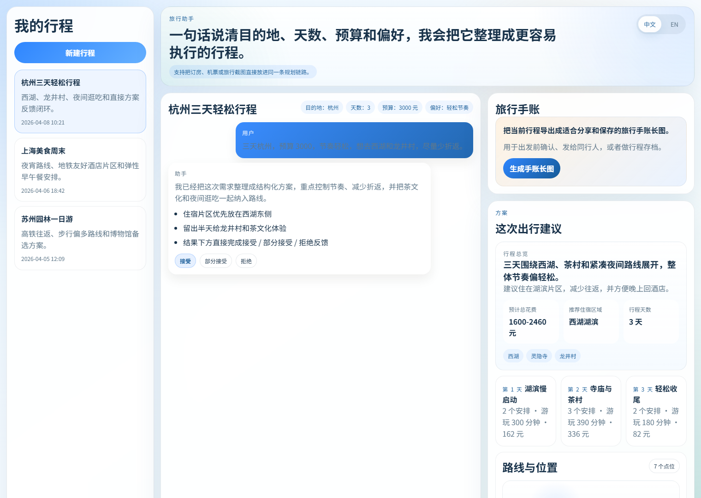
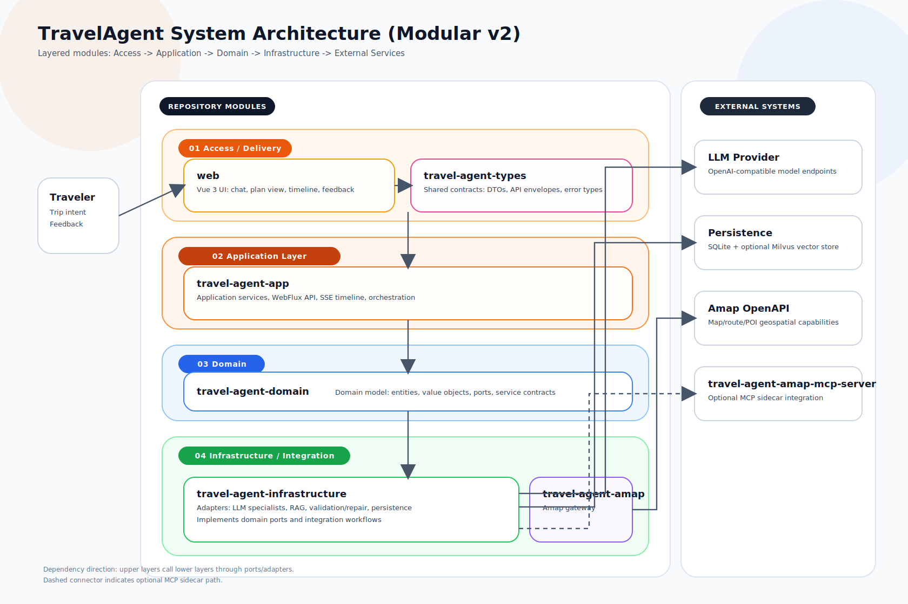

# Travel Agent

<p align="center">
  <a href="./README.md">English</a> |
  <a href="./README.zh-CN.md">简体中文</a>
</p>

<p align="center">
  
  
  
  
  
  
  
  
  
  
  
</p>

<p align="center">
  Travel Agent 是一个全栈旅行规划工作台，能够把自然语言需求和旅行截图转成带有结构化行程、高德增强、即时方案反馈和旅行手账导出的可执行方案。
</p>

<p align="center">
  <a href="#项目定位">项目定位</a> |
  <a href="#界面展示">界面展示</a> |
  <a href="#核心能力">核心能力</a> |
  <a href="#系统架构">系统架构</a> |
  <a href="#快速开始">快速开始</a> |
  <a href="#项目结构">项目结构</a> |
  <a href="#文档">文档</a>
</p>

## 项目定位

很多旅行助手只会返回一段聊天文本，这个仓库更关注完整的产品流程：

- 按请求类型路由到不同 specialist agent，而不是所有问题都走一个通用补全。
- 产出结构化行程，包含每日安排、酒店建议、预算区间和可行性检查。
- 通过高德 / Amap 做天气、POI、地理位置和路线增强。
- 支持旅行截图输入，并在用户确认后把提取出的事实回流到规划链路。
- 前端采用产品化的一屏工作台，而不是长滚动的调试面板。
- 在最新结果下面直接完成 `接受 / 部分接受 / 拒绝` 的反馈闭环。
- 支持将结果导出为便于分享和保存的旅行手账长图。

## 界面展示

当前前端工作台的重点是：

- 顶部提供明确的 `中文 / EN` 语言切换。
- 左侧是历史会话和快速切换入口。
- 中间是聊天输入区，支持粘贴截图、拖拽图片和点击上传。
- 最新一条生成结果下方直接提供 `接受 / 部分接受 / 拒绝` 三个反馈按钮。
- 右侧展示旅行手账导出、结构化行程、地图信息和生成过程。
- 页面整体压缩成首屏工作台，避免长页面滚动。

<p align="center">
  
</p>

## 核心能力

| 模块 | 说明 |
| --- | --- |
| 多智能体路由 | 在 `WEATHER`、`GEO`、`TRAVEL_PLANNER`、`GENERAL` 之间做路由，并共享上下文与时间线 |
| 结构化规划 | 生成行程摘要、每日路线、酒店建议、预算拆分和约束检查 |
| 高德增强 | 解析天气、POI、酒店片区、地理编码和市内交通 |
| 旅行知识检索 | 从本地整理知识或可选的 Milvus 检索中补充目的地规划知识 |
| 图片辅助输入 | 从上传截图中提取旅行事实，用户确认后回流到正常规划流程 |
| 即时方案反馈 | 在最新方案下直接记录接受、部分接受或拒绝结果 |
| 旅行手账导出 | 把生成后的行程导出成长图，方便分享和保存 |
| 执行过程可视化 | 通过 SSE 把规划时间线实时推到前端 |
| 调优与运营脚本 | 提供反馈导出和离线反馈分析脚本，便于后续产品调优 |

## 系统架构

仓库整体是 DDD 启发下的分层设计，并带有 ports-and-adapters 特征：

- `travel-agent-domain`：实体、值对象、仓储接口、网关接口、服务契约
- `travel-agent-app`：应用编排、HTTP API、SSE 流和会话工作流
- `travel-agent-infrastructure`：LLM agent、检索、持久化适配器、校验器、修复器、规划增强器
- `travel-agent-amap`：高德 HTTP 集成
- `travel-agent-amap-mcp-server`：面向高德工具的独立 MCP Server
- `web`：Vue 3 前端工作台

系统架构图：



- 可编辑源文件：[`docs/assets/travelagent-system-architecture-v2.drawio`](./docs/assets/travelagent-system-architecture-v2.drawio)
- 详细说明：[`docs/system-architecture.md`](./docs/system-architecture.md)

## 多智能体工作流

这个项目采用的是编排式工作流，而不是多个 agent 彼此自由对话：

1. `ConversationWorkflow` 从消息、任务记忆和摘要中组装路由上下文。
2. `AgentRouter` 选择当前最合适的 specialist。
3. specialist 返回统一的 `AgentExecutionResult`。
4. 行程规划路径会先做增强、校验、修复，再输出最终结果。
5. 执行时间线会被持久化，并通过 SSE 推到前端。

主要 specialist：

- `WEATHER`：天气与天气相关建议
- `GEO`：地点消歧、地理编码、逆地理编码、坐标查询
- `TRAVEL_PLANNER`：行程规划、高德增强、约束校验、修复和知识检索
- `GENERAL`：泛旅行问题

## 规划流水线

当前 planner 的链路是显式的：

1. 从提取出的旅行事实构建草稿行程。
2. 用高德补全景点、片区、酒店、天气和路线。
3. 校验预算、开放时间、节奏强度和重复点位。
4. 如有失败则自动修复。
5. 检索目的地知识作为规划补充。
6. 输出最终回答和持久化的 `TravelPlan`。

这比把所有逻辑都塞进一个大 prompt 更可控，也更容易继续演进。

## 技术栈

| 层 | 技术 |
| --- | --- |
| 后端 | Java 21、Spring Boot 4、Spring WebFlux、Actuator |
| AI 编排 | Spring AI、OpenAI 兼容接口、MCP |
| 存储 | SQLite、可选 Milvus |
| 前端 | Vue 3、TypeScript、Vite、Pinia、Vitest |
| 地图能力 | 高德 / Amap |
| 运维 | PowerShell、Docker、Docker Compose、Nginx、GitHub Actions |

## 快速开始

### 前置要求

- Java 21
- Node.js 和 npm
- 如果要跑 Milvus 或容器化部署，需要 Docker Desktop
- 如果要重跑知识采集和清洗脚本，需要 Python 3

### 1. 准备环境变量

```powershell
Copy-Item .env.travel-agent.example .env.travel-agent
```

重点变量：

- `SPRING_AI_OPENAI_API_KEY`
- `SPRING_AI_OPENAI_BASE_URL`
- `SPRING_AI_OPENAI_CHAT_MODEL`
- `TRAVEL_AGENT_TOOL_PROVIDER`
- `TRAVEL_AGENT_AMAP_API_KEY`
- `VITE_AMAP_WEB_KEY`
- `VITE_AMAP_SECURITY_JS_CODE`

### 2. 运行预检

```powershell
powershell -ExecutionPolicy Bypass -File .\scripts\preflight-travel-agent.ps1
```

### 3. 启动整套应用

```powershell
powershell -ExecutionPolicy Bypass -File .\scripts\start-travel-agent.ps1 -Build -StartFrontend -RunPreflight -ToolProvider LOCAL
```

默认地址：

- 后端：`http://localhost:18080`
- 前端：`http://localhost:4173`

### 4. 停止

```powershell
powershell -ExecutionPolicy Bypass -File .\scripts\stop-travel-agent.ps1
```

## 开发方式

### 后端

```powershell
$env:SPRING_AI_OPENAI_API_KEY = "<your-openai-key>"
.\mvnw.cmd -pl travel-agent-app -am spring-boot:run
```

### 前端

```powershell
Set-Location .\web
npm.cmd ci
npm.cmd run dev
```

### 前端构建

```powershell
Set-Location .\web
npm.cmd run build
```

## 常用命令

| 任务 | 命令 |
| --- | --- |
| 后端测试 | `.\mvnw.cmd test` |
| 前端测试 | `Set-Location .\web; npm.cmd run test` |
| 前端构建 | `Set-Location .\web; npm.cmd run build` |
| Release smoke | `powershell -ExecutionPolicy Bypass -File .\scripts\release-smoke-travel-agent.ps1` |
| 导出反馈数据集 | `powershell -ExecutionPolicy Bypass -File .\scripts\export-feedback-dataset.ps1` |
| 分析反馈闭环 | `powershell -ExecutionPolicy Bypass -File .\scripts\analyze-feedback-loop.ps1` |

## 项目结构

| 目录 | 作用 |
| --- | --- |
| `travel-agent-app/` | REST API、SSE 流、健康检查、DTO 和会话工作流 |
| `travel-agent-domain/` | 核心领域模型与契约 |
| `travel-agent-infrastructure/` | Agents、检索、持久化、校验、修复、增强 |
| `travel-agent-amap/` | 高德 HTTP 集成模块 |
| `travel-agent-amap-mcp-server/` | 面向高德工具的独立 MCP Server |
| `travel-agent-types/` | 通用响应包装与异常类型 |
| `web/` | Vue 前端工作台 |
| `scripts/` | 预检、启停、导出、Smoke 和数据准备脚本 |
| `docs/` | 架构说明、运维说明和截图资源 |

```text
.
|- travel-agent-app
|- travel-agent-domain
|- travel-agent-infrastructure
|- travel-agent-amap
|- travel-agent-amap-mcp-server
|- travel-agent-types
|- web
|- scripts
`- docs
```

## 文档

- [`docs/system-architecture.md`](./docs/system-architecture.md)
- [`docs/knowledge-rag.md`](./docs/knowledge-rag.md)
- [`docs/multimodal-roadmap.md`](./docs/multimodal-roadmap.md)
- [`docs/multimodal-roadmap.zh-CN.md`](./docs/multimodal-roadmap.zh-CN.md)
- [`docs/operations.md`](./docs/operations.md)
- [`docs/release-checklist.md`](./docs/release-checklist.md)
- [`CONTRIBUTING.md`](./CONTRIBUTING.md)
- [`SECURITY.md`](./SECURITY.md)

## 当前限制

- 目前最强的 grounding 路径仍然依赖高德，因此更适合中国旅行场景。
- 一部分检索片段还不够 planner 友好，仍需继续结构化。
- 酒店和路线 fallback 现在偏实用导向，但还不是实时库存级别的数据能力。
- 整体效果依赖模型提供方和地图提供方配置是否完整。

## 后续增强方向

- 更强的 planner 向 RAG schema，尤其是酒店、交通和 trip style
- 更稳定的离线评测体系，同时覆盖“有用性”和“硬约束”
- 更明确的 planner / weather / geo handoff 策略
- 更强的截图事实提取能力
- 更完整的生产部署模板，包括密钥管理、TLS 和可观测性

## License

本项目采用 MIT License，详见 [`LICENSE`](./LICENSE)。
